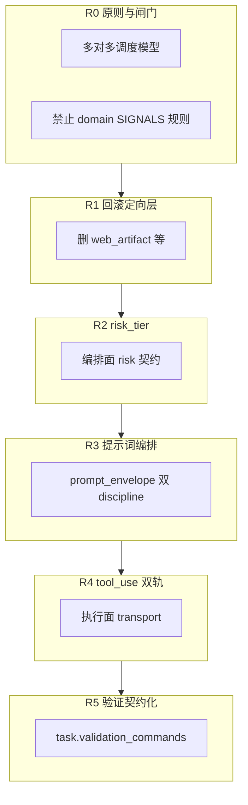

# Runtime 编排对齐计划（R0–R5 · 多对多调度 · 非定向优化）

更新时间：2026-06-07  
状态：**active · S61**  
**ACTIVE_SLICE**：S61（Runtime 编排对齐 R0→R5）  
哲学：[RUNTIME_MULTI_DISPATCH_MODEL.md](./RUNTIME_MULTI_DISPATCH_MODEL.md)  
Brief：[S61-runtime-orchestration-alignment.md](../../benchmarks/reference_briefs/S61-runtime-orchestration-alignment.md)

---

## 0. 产品基石（冻结）

```text
迭代：Runtime/Harness + Coordinator 多对多 + prompt/policy/contract 长期积累
禁止：为单一 beta 任务在 core 增加 domain 分支（web/doc/bugfix 关键词表）
稳定：execute/run 主链不动；蜂群 CLI 默认 off；每阶段独立验收
```

术语真源：**Runtime · Harness · Orchestrator · Coordinator · Worker invocation**（见 RUNTIME_MULTI_DISPATCH_MODEL.md）。Netty 三池仅作调度拓扑类比，非产品名词。

---

## 1. 总览：五阶段 + 三层调度落点



| 阶段 | 编排面 | 协调面 / 执行面 | 蜂群 | 估时 |
| --- | --- | --- | --- | --- |
| **R0** | 术语 RFC、审查规则 | — | 对齐 SWARM | 1 会话 |
| **R1** | — | 回滚 S60 定向层 | 不动 spawn | 1 会话 |
| **R2** | risk_tier 进 plan | Coordinator + profile | 不变 | 2 会话 |
| **R3** | orchestration_discipline | execution_discipline | 继承 envelope | 2–3 会话 |
| **R4** | Plan structured output | tool_use transport | 每 worker 独立 | 大 slice |
| **R5** | validation 进 plan | preparer 契约 | merge evidence | 中 slice |

---

## 2. R0 — 哲学、闸门与文档（✅ 文档交付）

### 目标

冻结 **Runtime/Harness + Coordinator 多对多** 哲学；S60 superseded。

### 交付

| # | 交付 | 状态 |
| --- | --- | --- |
| R0-1 | [RUNTIME_MULTI_DISPATCH_MODEL.md](./RUNTIME_MULTI_DISPATCH_MODEL.md) | ✅ |
| R0-2 | 本文（R0–R5 完整版） | ✅ |
| R0-3 | S61 brief | ✅ |
| R0-4 | 文档导航 + 当前状态 §4 更新 | ✅ |
| R0-5 | 审查规则：禁止新增 domain `*_SIGNALS`（`HIGH_RISK` 除外） | 📝 写入 AGENTS 维护约定 |

### 验收

- [x] 术语与 SWARM RFC Layer 0/1 无矛盾  
- [x] 维护者确认 R1 可开工（R1 已签字）

### 非目标

- 不改 runtime 代码  

---

## 3. R1 — 回滚定向层（核心稳定 · ✅）

### 目标

移除 S60 及同类 **domain 优化**；Worker loop 行为回到「契约 + 通用 retry」。

### 编排面 / 执行面

- **执行面**：删除 `web_artifact_resilience`、fast_path `web_artifact`、planner html 关键词  
- **编排面 / 协调面**：无改动  

### 交付

| # | 文件/动作 |
| --- | --- |
| R1-1 | 删除 `web_artifact_resilience.py` |
| R1-2 | 还原 `fast_path_policy.py` web 分支 |
| R1-3 | 还原 `coder_agent.py` / `runtime_profile_builder.py` 定向 override |
| R1-4 | 还原 `planner.py` 静态站 keywords |
| R1-5 | 删除/合并 `harness_web_artifact_pulse.py`；triple_track 移除 H_web_artifact |
| R1-6 | **保留**：`expected_artifacts` path 推断；通用 JSON retry（2 次、schema 通用 hint） |
| R1-7 | R1 回滚（见 git history） | ✅ |

### 验收

```powershell
pytest tests/unit/test_fast_path_policy.py tests/unit/test_coder_agent.py tests/unit/test_execution_action_normalizer.py -q
python scripts/triple_track_pulse.py --root . --skip-b6
python scripts/swarm_holistic_check.py --root . --skip-studio
```

- [ ] `small_code_change` B6 维护者回归（可选 `--with-b6`）  
- [x] 无 `web_artifact` 字符串于 src（除 deprecated 注释）

---

## 4. R2 — risk_tier 收敛（编排面）

### 目标

`fast_path` 从 **task_kind 动物园** 收敛为 **risk/cost tier**；语义由 **编排面（Plan/GoalSpec）写入契约**，非 goal 关键词 grep。

### 三层落点

| 层 | 改动 |
| --- | --- |
| **编排面** | `goal_spec` / `task_plan` 可选 `risk_tier`: `high` \| `default` \| `readonly` |
| **编排面** | Planner 从显式字段 + permission 推导，**删除** DOC/WEB/BUGFIX 关键词表 |
| **执行面** | `execution_profile`：`high` → harness；`readonly` → fanout；默认 session_agent |
| **协调面** | `ExecutionCoordinator` 读 plan 级 `parallel_safety` |

### 交付

| # | 交付 |
| --- | --- |
| R2-1 | `fast_path_policy.py` → `classify_risk_tier()` 三档 |
| R2-2 | schema：`task_plan` / `goal_spec` risk_tier 可选字段 |
| R2-3 | telemetry：`fast_path_task_kind` 投影 deprecated alias（只读兼容 gate） |
| R2-4 | 更新 phase2/3 gate 文档说明 |
| R2-5 | brief 增补 + 单元测试 |

### 验收

```powershell
pytest tests/unit/test_fast_path_policy.py tests/unit/test_execution_profile.py tests/unit/test_planner.py -q
python scripts/steady_iteration_check.py --root . --skip-b6
```

- [ ] doc_update / single_file_bugfix rolling 仍绿  
- [ ] 蜂群 holistic check 仍绿  

### 非目标

- 不改 swarm spawn 默认  
- 不删 HIGH_RISK_SIGNALS（安全层）

---

## 5. R3 — 提示词编排层（CC 积累 · 编排/执行双 discipline）

**驾驭智能体提示词** 进入 `prompt_envelope`；编排面与执行面各一段 discipline，**零 domain 分支**。

### envelope sections

| Section | 挂载层 | 内容要点 |
| --- | --- | --- |
| `orchestration_discipline` | 编排面（GoalSpec/Plan） | spawn、risk_tier、预算、合并前 evidence |
| `execution_discipline` | 执行面（Coder/Debug） | JSON/tool 纪律、task_contract 对齐 |
| `project_guidance` | 共享 | AGENTS.md（已有） |
| `capability_manifest` | 共享 | tools/skills（已有） |

### 交付

| # | 交付 |
| --- | --- |
| R3-1 | `agent_harness.py` 新增两 section + `discipline_version` |
| R3-2 | CoderAgent `_user_prompt` 强化 task_contract 字段（artifacts/validation/scope） |
| R3-3 | PlannerAgent 输出契约模板（validation_commands 占位） |
| R3-4 | `docs/zh/智能体提示词驾驭规范.md`（维护者编辑 envelope 的指南） |
| R3-5 | Skills：`benchmarks/beta_user_tasks.json` → manifest.skills 只读引用 |
| R3-6 | `test_coder_agent` / envelope snapshot 测试 |

### 验收

```powershell
pytest tests/unit/test_coder_agent.py tests/unit/test_documentation_contracts.py -q
python scripts/beta_task_pack_check.py --root .
```

- [ ] prompt_envelope JSON 含 orchestration + execution discipline  
- [ ] 维护者 dogfood：改 discipline 版本可追踪（content_hash）

### 非目标

- 不改 Studio UI  
- 不引入新 Agent 类

---

## 6. R4 — Provider tool_use 双轨（执行面 transport）

### 三层 transport

| 层 | transport |
| --- | --- |
| **编排面** | Plan/GoalSpec：structured JSON schema（API 层 retry） |
| **执行面** | 默认 `json`；policy `worker_transport=tool_use` 时走 native tool API |
| **蜂群** | 每个 Worker invocation 独立 transport |

### 交付

| # | 交付 |
| --- | --- |
| R4-1 | ADR-0010：`docs/zh/adr/0010-worker-transport-dual-track.md` |
| R4-2 | `CoderAgent` + model adapter：`transport` flag |
| R4-3 | policy：`agent_loop.worker_transport` default `json` |
| R4-4 | 通用 schema retry（非 domain hint） |
| R4-5 | fake provider + 1 real route 集成测试 |
| R4-6 | S61 R4 signoff 报告 |

### 验收

```powershell
pytest tests/unit/test_coder_agent.py tests/integration/test_run_command.py -q -k "transport or tool_use" 
```

- [ ] session_agent 默认路径不变（flag off）  
- [ ] tool_use on 时 write_file 不经 ExecutionAction content 字段  

### 非目标

- 不强制全路由 tool_use  
- 不以 static_landing 为唯一 gate

---

## 7. R5 — 验证契约化

| 层 | 职责 |
| --- | --- |
| **编排面** | Planner 必填 `validation_commands` |
| **执行面** | `execution_action_preparer` 仅注入 contract 内命令 |
| **协调/合并** | promotion 前检查 worker validation evidence |

### 交付

| # | 交付 |
| --- | --- |
| R5-1 | `task_plan` schema：`validation_commands` 推荐必填 |
| R5-2 | preparer 移除扩展名猜测分支（保留 security shell 替换） |
| R5-3 | review 投影：validation 覆盖摘要 |
| R5-4 | S61 全阶段 signoff：`S61-runtime-orchestration-signoff-*.md` |

### 验收

```powershell
pytest tests/unit/test_execution_action_preparer.py tests/unit/test_task_contract.py -q
python scripts/triple_track_pulse.py --root . --skip-b6
python scripts/phase8_maintainer_smoke.py --root .
```

- [ ] S7 small_code_change gate 仍过  
- [ ] 蜂群 S34 gray case 仍过（maintainer）

---

## 8. 重构期稳定性守则

1. **每阶段独立 commit + signoff**；R4 单独 merge  
2. **强模型默认在编排面**（GoalSpec/Plan）；执行面 Worker 默认 medium  
3. **parallel_writes** CLI 默认 false 直至 R5 签字后评估  
4. **Studio** F2 friction 规则不变  
5. **模型变强** → 调 envelope / route，**不加** domain 分支  

---

## 9. 与现有计划关系

| 文档 | 关系 |
| --- | --- |
| [RUNTIME_MULTI_DISPATCH_MODEL.md](./RUNTIME_MULTI_DISPATCH_MODEL.md) | 哲学真源 |
| [RUNTIME_SESSION_AGENT_RFC.md](./RUNTIME_SESSION_AGENT_RFC.md) | Worker 默认路径 |
| [SWARM_SANDBOX_RFC.md](../deferred/SWARM_SANDBOX_RFC.md) | Layer 1 蜂群 |
| [TRIPLE_TRACK_MAINT_PLAN.md](./TRIPLE_TRACK_MAINT_PLAN.md) | H 轨道 → S61 |
| S60 web artifact | superseded by R1 |

---

## 10. 进度追踪

| 阶段 | 状态 |
| --- | --- |
| R0 | ✅ |
| R1 | ✅ |
| R2 | ✅ risk_tier |
| R3 | ✅ envelope discipline |
| R4 | ✅ worker_transport（default json） |
| R5 | ✅ validation 契约化 |
