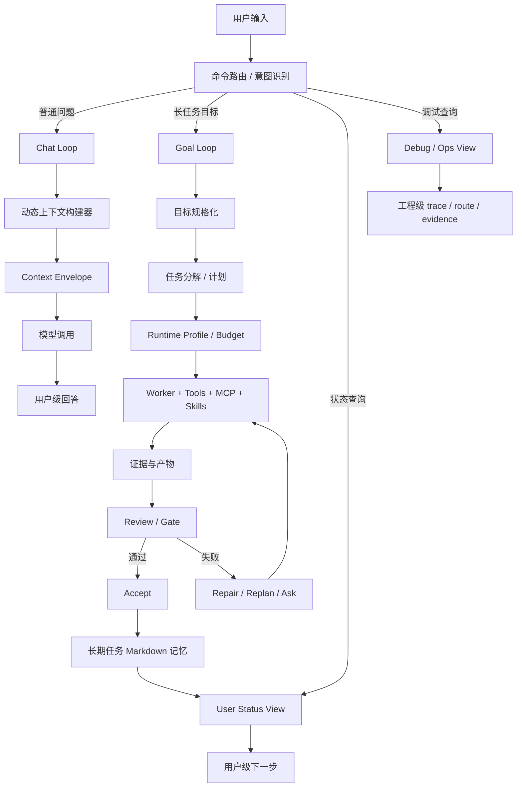
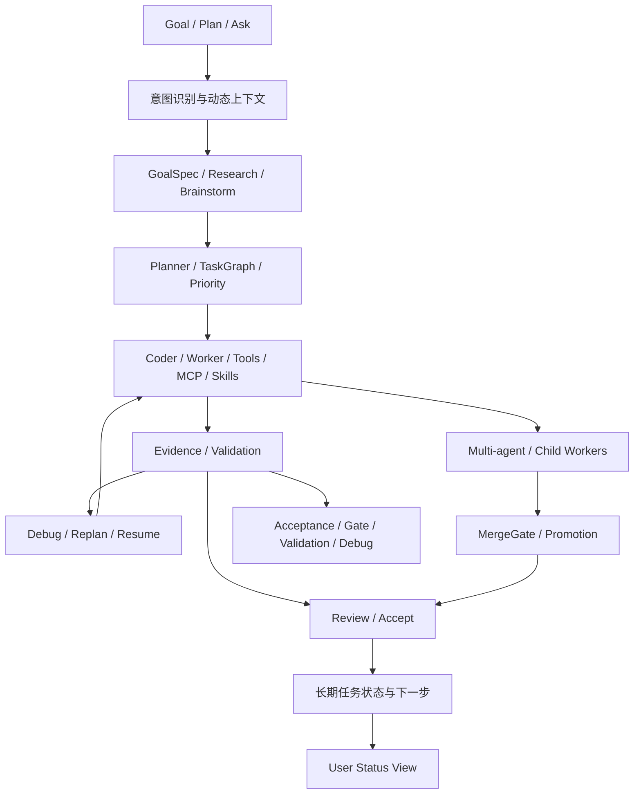
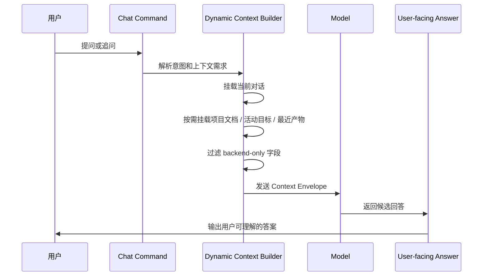
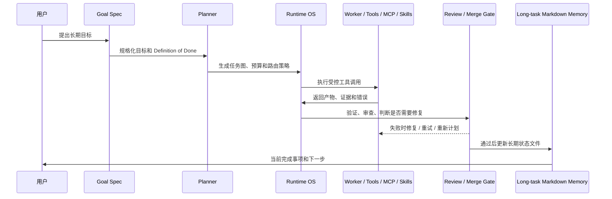

# 大模型循环与动态上下文设计

更新时间：2026-05-29

> 2026-05-29 ContextBudgetMeter 同步：Asteria 已把 context pressure 从通用预算压力中拆出来。模型调用前会估算 `ChatRequest.messages` 的上下文 token，占用写入 `cost_report.json` 并参与 `BudgetController.pressure()`。这只是第一阶段；后续要把 startup / durable / working / transient / tool-output context 分段归因，并把 compact boundary、subagent 隔离窗口和重复上下文读取降噪接入运行证据。

> 2026-05-28 同步记录：大模型循环的 profile 分发已从局部 runtime context 上移到 Plan/Run dispatch。Plan 负责为 task plan 标注 `agent_loop_profile`，Run 负责在执行前重新生成并记录 `agent_loop_dispatch.json`。Tool/MCP/Skill 能力边界继续由 `CapabilityInvocationPolicy` 统一描述；当前真实执行路径已覆盖 Tool 调用的 allow/ask/deny reason，MCP/Skill 调用接入时必须复用同一 evidence/user_progress 记录格式。Research / Brainstorm / Multi-agent 已进入真实任务验证清单，Studio 仅消费这些 runtime-native 过程线和产物。

> 2026-05-28 追加同步：`CapabilityDecisionRecorder` 将能力调用审计从 Tool 专用逻辑提升为 Tool/MCP/Skill 共用证据协议；执行层仍分离：Tool 是本地工具调用，MCP 是外部 server/session/protocol 调用，Skill 是按需加载的过程知识/产物能力。`AgentLoopProfile` 的 contract 字段现在定义每条链路的输出、验证、失败恢复和用户决策升级条件。`agent_loop_dispatch` 摘要已进入 PromptEnvelope/ContextEnvelope，模型侧可以看到 profile 选择原因和 contract 摘要。validation/gate 已开始统计 profile、permission reason 和 runtime-native progress 覆盖率。

> 2026-05-28 工具边界纠偏：模型侧 tool surface 与 runtime 内部 tool registry 是两层。Asteria 目前具备内部执行工具和审计网关，但还没有完整的 Claude Code 式模型工具面。CapabilityManifest 的 `tool_surface_contract` 会把当前内部工具、已覆盖的主流工具原语、缺失的 read/list/search/edit/shell/todo 等能力列出来，避免模型和研发计划误判。

本文记录 Asteria 在“大模型主导运行时”阶段的核心产品理解：用户并不关心运行时内部对象，而关心目标是否被理解、过程是否可控、结果是否可信、下一步是否清楚。工程侧需要把模型调用、工具调用、MCP 调用、Skills 调用、证据、修复和验收收敛成稳定的用户体验。

Studio 侧的 session/context 展示必须遵守 [Studio 会话与上下文设计准则.md](./Studio%20会话与上下文设计准则.md)：过程进入主会话，raw evidence 和 context attribution 进入 Inspector，compact/handoff/resume 必须成为可读的 session 事件。

## 1. 设计结论

1. Chat 不应默认依赖长期记忆。
   - Chat 的职责是基于当前对话、当前项目上下文、按需挂载的动态上下文，给出用户当下最需要的回答。
   - Chat 可以引用长任务状态，但必须由问题意图触发，例如用户询问“当前进展”“下一步”“项目状态”。

2. 长期 Markdown 记忆属于长任务循环。
   - 它是用户可读的产品状态文件，不是后台运行时 dump。
   - 它记录长期目标、完成方式、已完成事项、下一个任务、总体计划和需要用户决策的事项。
   - 它应该持续丰富，作为跨会话、跨压缩、跨任务恢复的稳定锚点。

3. Status 默认应面向用户，而不是运维工程师。
   - 普通用户关心“目标是什么、完成了什么、下一个任务是什么、是否需要我介入”。
   - `status --debug`、JSON、trace、route、evidence、run_id 等才是工程排障界面。

4. 动态上下文构建器是核心控制面。
   - 它决定当前请求需要哪些上下文：对话片段、项目文档、活动目标、最近证据、工具能力、模型路由、成本预算。
   - 它也决定哪些信息不应该暴露给用户。

5. 模型选择默认兜底是运行时稳定性的底座。
   - env/local route 缺失或 capability profile 过期时，系统不能卡死在 route guidance。
   - 应退到可审计 default route，并明确记录选择原因、是否 fallback、fallback 来源和 deadline。

## 2. 总体流程图

## 3. 智能体链路总览

Asteria 不是只有一条 `run` 链路。更准确的理解是：用户侧以 Goal / Plan 为主入口，Ask 为轻量入口；runtime 内部有多条智能体链路为它们服务。普通用户不需要理解所有链路名，但交互侧必须把实时模型判断、接口/工具调用过程、关键思考摘要、验证进展和最终整理展示出来；工程实现和文档也必须保留这些链路边界，否则后续会把调试命令、运维 gate 和用户产品路径混在一起。

| 链路 | 现有代码锚点 | 产品语义 | 用户是否默认可见 |
| --- | --- | --- | --- |
| 用户主线 | `chat_command.py`, `plan_command.py`, `run_command.py` | 把自然语言意图收敛为 Ask / Plan / Goal | 可见，但只展示用户级语言 |
| Goal 规格化与计划链路 | `GoalSpecAgent`, `RequirementPlanner`, `TaskPlanEvaluator` | 把紧凑目标变成 Definition of Done、任务图、验收标准和优先级 | Plan 模式可展示摘要；Goal 模式展示当前计划 |
| 核心执行链路 | `CoderAgent`, `WorkerInvocation`, `ToolExecutionGateway`, `TaskExecutionEvidence` | 控制工具调用、产物写入、观察结果和验证证据 | 默认只展示进展、结果和验证结论 |
| 修复与重规划链路 | `DebugAgent`, `debug_command.py`, `replan_command.py`, `resume_command.py` | 在失败、缺证据、阻塞或计划失效时修复、重试、重规划或询问用户 | 只在需要用户决策时打断 |
| Review / Accept 链路 | `ReviewAgent`, `review_command.py`, `accept_command.py` | 复盘目标、验收标准、证据、遗漏、风险，并完成收尾 | 用户看到验收回顾，不看到 backend dump |
| Research / Brainstorm 链路 | `ResearchAgent`, `BrainstormAgent`, `research_command.py`, `brainstorm_command.py` | 支撑方案探索、资料分析、候选计划生成 | 默认属于 Plan/Ask，不应自动进入写入执行 |
| 多智能体链路 | `MultiAgentStrategyAdvisor`, `AgentRunGraphBuilder`, `worker_tree.py` | 对复杂任务拆分子 worker，记录父子关系、候选产物和冲突 | 用户看到实时过程和整合结果；debug/ops 查看 worker graph |
| Context / Recovery 链路 | `compact_command.py`, `handoff_command.py`, `sessions_command.py`, `ContextSnapshot` | 跨上下文压缩、恢复、交接、长期任务连续性 | 长任务状态可见；恢复细节进入 debug/ops |
| Promotion / Merge 链路 | `MergeGate`, `promotions_command.py`, `candidate_promotion_queue.py` | 处理候选工作区、合并门禁、人工批准或拒绝 | 普通用户不默认可见 |
| Acceptance / Gate / Validation 链路 | `acceptance_command.py`, `gate_command.py`, `validation_command.py`, `validation_run_command.py` | 维护者/CI 用来验证 runtime 能力、真实模型验证和发布健康度 | 维护者视图，不是普通用户主线 |
| 能力选择链路 | model route、Skills、MCP、tool policy | 决定何时调用模型、工具、MCP、Skills，以及失败时如何 fallback | 用户只看到策略级解释 |

这些链路的统一原则是：内部越复杂，屏幕输出越应该收敛。用户看到的是“目标、当前进展、需要我决定什么、验证是否可信、下一步是什么”；开发者和维护者在显式 debug/ops 模式下才看到 route、trace、evidence、run_id、worker graph 和 gate 细节。

这些链路不是同一个 PDCA 模板的不同名字，而是根据场景语义设计的业务型智能体循环。核心 Goal Loop 负责调度、收敛和验收，但不应该吞掉所有原子能力。Research、Brainstorm、UI、架构、测试、代码编写等链路都可以拥有自己的角色方法论、上下文选择、工具策略、验证方式和最终报告格式。

### 3.1 动态调度哲学

Asteria 的核心抽象不是把所有流程写死在程序里，而是把能力和智能体链路做成可被模型理解、可被策略约束、可被证据验证的原子能力。用户目标是输入；ContextEnvelope、CapabilityManifest、AgentLoopProfile、ToolObservation、Evidence 和 Acceptance review 是模型理解系统能力的语言；强模型在这些标准化输入输出上动态组织能力，完成对用户最有价值的工作。

Claude Code 类产品给出的启示不是“复制某个固定流程”，而是用动态上下文把系统能力交给模型编排：程序负责边界、协议、权限、预算、验证和审计；模型负责在当前目标、上下文和能力清单中选择合适路径。这样系统不会随着模型迭代而过时，因为产品能力是可扩展的原子和分子，模型能力越强，越能把它们组织成更好的用户结果。

**长任务专项**：North Star 跨 run 目标、slice 完成判定（规则 + 可选 model judge）、监督续跑与 handoff 压缩的产品边界，见 [`plans/LONG_TASK_GOAL_FRAMEWORK.md`](./plans/LONG_TASK_GOAL_FRAMEWORK.md)；与单次 Run 内 Agent Loop 互补，不替代 verify/review/accept 主链。

需要避免的反模式：

- 用大量硬编码 `if/else` 决定每个场景调用哪个智能体。
- 把 Research、Brainstorm、Debug、Review、多智能体并发写成不可组合的固定流程。
- 让命令名成为能力边界，而不是让模型根据目标语义、上下文和能力契约选择能力。
- 只给模型自然语言说明，却不给它标准化输入、输出、证据和失败处理协议。

正确方向是：

- 能力原子化：工具、MCP、Skills、Research、Brainstorm、Review、Testing、UI、Architecture、Coder 都是可被调度的能力单元。
- 颗粒度适中：能力太粗会难以调度，太细会增加编排噪声；每个能力都应有明确职责、输入、输出、证据和成本。
- 上下文驱动：模型看到的是当前目标、动态上下文、可用能力、约束、预算、风险和验收标准，而不是一份固定执行脚本。
- 协议标准化：智能体输入输出必须结构化、规范化、证据化，便于模型理解、调用、复盘和修复。
- 调度可审计：模型可以动态选择能力，但每次选择都要记录 reason、context、route、evidence 和结果，方便 review、debug 和改进。
- 用户目标优先：原子能力和分子链路都是养分，最终服务于用户目标、用户可理解的进展和可信交付。

### 3.2 场景语义驱动的链路方法论

Research 链路的目标不是“快速给一个答案”，而是形成可信的深度研究结论。它的内部循环应该接近研究工作流：

1. 明确研究问题、边界、假设和可验证结论。
2. 收集论文、文档、数据集、代码仓库和实验线索。
3. 分析论文方法、实验设计、数据来源、限制和可复现性。
4. 必要时搭建代码环境、抓取或整理数据。
5. 做数据验证、代码验证或交叉来源验证。
6. 复盘矛盾证据、修正假设并迭代。
7. 输出深度研究结论、证据等级、未确认风险和可执行建议。

Brainstorm 链路更像 Plan 模式的“开放型超级大脑”。它不应过早收敛到执行任务，而应该扩大搜索空间，发掘项目特征、产品特点、技术机会、约束、风险和候选方向，然后再把高质量结果交给 Plan 或 Goal 使用。它的输出应该帮助目标达成，而不是替代验收型执行。

Debug、Review、Testing、Architecture、UI 等链路也应如此：每个智能体都有自己的角色模型、专业判断框架、上下文偏好和验收口径。它们可以被显式命令调用，也可以在用户界面中作为入口暴露；当它们被核心 Goal Loop 调度时，应作为可审计的原子能力参与目标完成。

### 3.3 多智能体链路的产品定位

多智能体不是固定流程图，而是为了在复杂目标中利用并发、角色分工和不同上下文视角。核心循环根据目标、任务图、风险、预算和环境能力动态调度多个链路，让它们用高层约定共同完成目标。

典型形态包括：

- UI 智能体：围绕用户路径、界面状态、交互反馈、视觉约束和端到端体验循环。
- 架构设计智能体：围绕边界、数据模型、模块责任、演进路径和技术风险循环。
- 测试智能体：围绕验收标准、覆盖缺口、回归风险、测试数据和验证命令循环。
- 代码编写智能体：围绕 scoped context、候选实现、局部验证和冲突最小化循环。

这些智能体可以并发使用 provider 和 sandbox。比如同一个目标可以派生三个代码编写智能体，分别给不同上下文、实现策略或候选方案；它们在隔离环境中产出候选，再由 Review/Merge/Acceptance 链路比较、验证和收敛。这样既能加速复杂目标，也能利用现有 sandbox 技术保证隔离、并行和可恢复。

多智能体链路必须遵守以下要求：

- 每个子智能体都有明确角色、输入上下文、允许工具、输出契约和验收方式。
- 链路之间通过 TaskGraph、WorkerInvocation、WorkerResult、Evidence、MergeGate 等结构化对象协作，而不是靠自然语言随意交接。
- 并发不是默认越多越好，必须受预算、风险、上下文隔离、冲突概率和 provider validation 控制。
- 主循环负责动态调度和最终收敛；子链路负责在自身方法论内高质量完成局部任务。
- 用户默认看到整合后的进展和结论；只有调试视图显示 worker graph、provider route、候选差异和合并细节。

## 4. Chat Loop

Chat 的目标不是“记住所有东西”，而是在每次回答前按需构造足够上下文。它更接近 Claude Code 类产品里的动态上下文窗口：当前对话是主线，项目文件、状态文件、工具能力和最近运行结果是可挂载材料。

Chat 默认不应暴露以下字段：

- `run_id`
- `evidence`
- `model_route`
- provider / capability profile
- tool call trace
- backend schema 字段

除非用户明确询问调试细节，或者当前命令本身就是 debug / review / ops 类型。

## 5. Goal Loop

长任务循环的目标是把一个紧凑用户目标变成经过验证的产物。它需要比 Chat 更强的状态持久化、证据记录、错误修复和验收机制。

长期 Markdown 记忆建议保持以下结构：

- 当前目标
- 当前结果
- 总体计划
- 已完成工作
- 如何完成
- 当前阻塞
- 需要用户回答的问题
- 已接受决策
- 观察项
- 下一个任务

这个文件不是给模型“无脑塞上下文”的，而是给用户和恢复流程一个稳定、可审计、可持续增长的产品状态锚点。

## 6. 产品化距离评估

当前工程已经站在正确路径上：核心 CLI/runtime loop 能运行，任务证据、验收、模型路由、fallback 和部分用户级输出已经开始成形。距离产品化的主要差距不在“能不能跑”，而在“能不能稳定地选对上下文、选对模型、选对工具，并把过程解释成用户关心的语言”。

### 5.1 已接近可用的部分

- 基础运行命令：`init`、`/run`、`/acceptance` 已具备可运行路径。
- Runtime OS 对象：TaskGraph、WorkerInvocation、WorkerResult、RuntimeProfile、ContextMount、TaskExecutionEvidence、MergeGate 已有基础形态。
- 模型路由：已经具备 strong / medium / cheap 默认兜底策略和可审计 fallback。
- 验收链路：已有 gate status、small real task validation、review fallback。
- 用户输出方向：已经开始从 backend dump 转向用户级 progress / next step。

### 5.2 仍然较大的差距

1. 动态上下文选择还不够精确。
   - 需要明确每类请求应该挂载哪些上下文。
   - 已完成第一阶段：普通 Chat 不再默认读取长期任务记忆；状态、计划、进展、下一步类问题才挂载 active goal memory。
   - Chat 侧已进入 ContextEnvelope / ChatContextBuilder，ChatIntentPolicy 已从 ChatCommand 中迁出；CoderAgent/DebugAgent 已记录 worker context envelope path/hash；下一步是扩大到 Review/Plan 等更多 Goal Loop 模型调用和更多报告视图。

2. 工具、MCP、Skills 的调用时机还需要策略化。
   - 什么时候应该读文件，什么时候应该调用 MCP，什么时候应该使用 Skill，需要有可测试规则。
   - 不应只依赖模型临场判断。

3. 模型输出仍需更强约束和修复。
   - 大模型不符合预期是常态，需要 schema、validator、repair loop 和降级答案。
   - 关键状态写入必须可校验，不能只相信自然语言。

4. 错误体验还没有产品化。
   - 工程报错需要被转译成“发生了什么、影响什么、下一步怎么处理”。
   - 用户默认不应该看到 Python traceback、provider raw error、trace dump。

5. 长任务记忆还需要从实现能力变成产品协议。
   - 已完成第一阶段：`.asteria/memory/active_goal.json` 成为结构化状态来源，`.asteria/memory/active_goal.md` 保留为用户可读永久记忆。
   - 仍需补齐 review/resume/repair 来源、冲突处理和恢复策略。

6. 真实任务验证覆盖还不足。
   - 目前 small real task validation 已可继续推进，但任务复杂度仍偏低。
   - 下一阶段应覆盖“解释当前项目状态并只返回用户级下一步”这类更贴近真实对话循环的任务。

## 7. 分阶段目标

本节只记录动态上下文设计的落地方向。当前全局优先级以 [当前状态与路线.md](./当前状态与路线.md) 为准。

### 方向 A：动态上下文和用户输出收敛

- 定义 Context Envelope：输入、可挂载上下文、禁止暴露字段、输出要求。
- 已完成第一阶段：Chat 默认只使用当前对话和轻量项目上下文。
- 已完成第一阶段：仅当用户询问进展、计划、状态、下一步时挂载长期任务记忆。
- 普通回答不暴露 run_id、evidence、model_route、provider。
- Chat 请求已下线 `safe_project_context`，改用统一 ContextEnvelope；worker context package 已嵌入并持久化 envelope；CoderAgent/DebugAgent 模型调用已记录 worker envelope path/hash；capability report 已汇总 ContextEnvelope 审计统计。剩余工作是把 Review/Plan、weekly/gate、user_progress 和 Inspector 接入同一审计链。

### 方向 B：长任务记忆产品化

- 已固定 `.asteria/memory/active_goal.json` 和 `.asteria/memory/active_goal.md`。
- `/run`、`/accept` 已更新该文件；修复、暂停、恢复还需补齐细分来源。
- `status` 默认读取结构化长期状态并渲染用户状态卡片。
- `status --debug` 才展示运行时细节。

### 方向 C：工具 / MCP / Skills 调用策略

- 建立调用策略表：不同意图对应允许的工具类别。
- 建立最小回归测试：确保普通 chat 不误触重工具，长任务可按需调用。
- 对外部工具失败建立用户级 fallback。

### 方向 D：真实任务验证

- 从文件探针升级到真实用户场景：
  - 解释当前项目状态，只返回用户级下一步。
  - 根据长期状态文件恢复任务。
  - 在 provider 异常时自动 fallback 并记录原因。
  - 工具失败后给出可执行修复建议。

### 方向 E：产品工作台

- 后端 runtime 稳定前，不让 Studio 反向决定核心架构优先级。
- Studio 作为独立产品交互面长期建设，展示用户任务状态、实时过程、产物、验收结果、配置管理和下一步；底层 trace 进入 Inspector / ops 视图。

## 8. 对 Claude Code 类产品的参考

可以参考的不是“复制界面”，而是控制方式：

- 精确控制上下文窗口，而不是把所有记忆都塞给模型。
- 工具能力以 manifest 暴露，模型只在必要时调用。
- 每次工具调用都有 observation，并回到模型循环。
- 长任务会持续维护目标、计划、完成情况和下一步。
- 普通用户回答高度收敛，调试信息留给显式 debug。

Asteria 的方向一致，但需要把这些控制点工程化、测试化、产品化。

## 9. 下一步建议

优先推进以下工作：

1. 增加 Context Envelope 测试，确保 backend-only 字段不会泄漏到普通用户回答。
2. 把 ContextEnvelope 审计覆盖扩大到 Review/Plan 等更多 Goal Loop 模型调用。
3. 把 ContextEnvelope 审计统计接入 weekly/gate/user_progress/Inspector。
4. 补齐长期任务记忆的 review/resume/repair 来源、冲突处理和损坏恢复。
5. 扩展工具 / MCP / Skills 调用策略表，把调用时机从“模型临场猜”变成“策略 + 模型判断 + 验证”。
## 2026-05-29 ContextBudgetMeter 与上下文窗口治理

Asteria 已把 context pressure 从通用预算压力中拆出来。第一阶段实现如下：

- 模型调用前按实际 `ChatRequest.messages` 估算上下文 token。
- `cost_report.json` 记录 `latest_context_estimated_tokens`、`max_context_estimated_tokens`、`context_window_tokens`、`context_window_ratio` 和 `context_pressure_status`。
- `BudgetController.pressure()` 将 `context_window` 作为独立压力维度；`/run` 在 near-limit 时触发 compact，在 hard-stop 时创建预算 DecisionPoint。
- `ContextEnvelope` / `PromptEnvelope` 继续提供结构化上下文和审计 hash；当前 meter 先按请求整体估算，后续再做 section 级归因。

Claude Code 类产品的启示是：上下文窗口是运行时资源，不是简单成本字段。系统提示、项目指导、memory、MCP tool names、skill descriptions、当前对话、已读文件、工具结果和模型回复都会占用窗口；接近上限时应 compact、隔离或裁剪，而不是用原始工具次数阻断探索。

后续技术路线：

1. 将 context 拆成 startup、durable、working、transient、tool-output 五类并分别计量。
2. compact boundary 记录压缩前后 token、保留/丢弃 section 和恢复用摘要。
3. Worker / subagent 默认隔离大上下文，只把摘要、artifact refs、diff 和验证结果回主线。
4. 对重复读取未变化文件，优先返回“已在上下文 / 可用 hash / diff”信号，而不是反复把整文件塞回模型。
5. Studio 主线只展示用户可理解的 context pressure 摘要；section 明细、raw envelope 和 provider usage 进入 Inspector。

## 2026-05-28 同步记录：动态上下文与能力 profile

本轮已将此前的设计方向落到更明确的 runtime 契约：

- `user_progress.jsonl` 成为 Studio/CLI 薄消费主线；只有历史 run 缺失该文件时，才回退到 `events.jsonl` 或执行证据。
- `active_goal.json` 的长期任务记忆协议补齐 review/resume/repair 来源、覆盖冲突提示和损坏 JSON 恢复。
- `CapabilityInvocationPolicy` 已不再只服务 Chat；Goal/Plan/Tool 都可以按 intent、task_kind、risk、permission_mode 得到工具/MCP/Skill 策略。
- `AgentLoopProfile` 已进入代码：Research、Brainstorm、Multi-agent 先以注册表和 worker context 形式存在，下一步再接入调度决策。

下一步设计重点：

1. 将 profile dispatch 结果继续传播到 ContextEnvelope / PromptEnvelope 的审计摘要中，让模型侧也能稳定看到“为什么进入这条链路”。
2. 为 Research、Brainstorm、Multi-agent 定义更具体的 output contract 和 validation contract。
3. 用 profile 注册层继续替代命令分支里的固定映射，减少新增能力时对核心调度分支的修改。
4. MCP/Skill 真实执行路径接入时，必须沿用 Tool 当前的 capability decision reason 证据协议。
