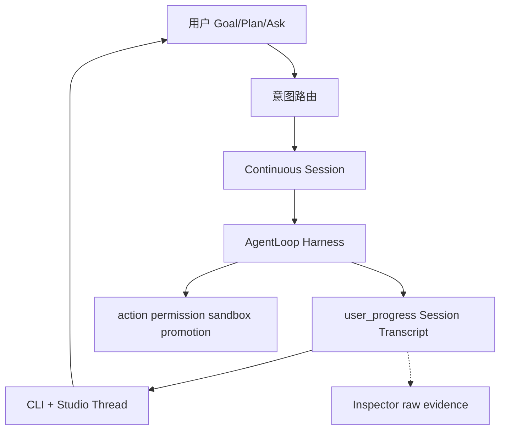

# Asteria 研发总计划

**版本**：1.2.9
**状态**：current — 长期执行入口（2026-06-10 校正）
**生效**：任何智能体（Cursor Auto、CLI agent、未来 Asteria 自研 agent）在改代码、写文档、排优先级前 **必须先读本文**。

---

## 0. 文档权威层级（冲突时按此裁决）

| 优先级 | 文档 | 作用 |
|--------|------|------|
| **1** | [`AGENTS.md`](AGENTS.md) | 仓库根约束、禁止项、ACTIVE_SLICE |
| **2** | **本文（研发总计划）** | 长期路线、Phase、Slice、闸门、Triage |
| **3** | 当前 Slice brief / 可复现 evidence | 当前完成事实与验收依据 |
| **4** | [`docs/zh/当前状态与路线.md`](docs/zh/当前状态与路线.md) | 短事实快照；只引用证据，不创造结论 |
| **4.5** | [`docs/zh/已删除与已替代登记.md`](docs/zh/已删除与已替代登记.md) | **恢复旧机制/引用旧文档前必读**：什么已删、被什么替代、什么是冻结 opt-in |
| **5** | 设计资产（§4 索引） | 怎么做：协议、交互、ADR |
| **6** | [`docs/zh/运行命令.md`](docs/zh/运行命令.md) | CLI 参考，不决定方向 |
| **7** | [`docs/zh/自动路线图.md`](docs/zh/自动路线图.md) | **generated**，机器摘要，不替代本文 |
| **8** | [`docs/zh/archive/`](docs/zh/archive/) | 历史参考，**非当前依据** |
| **9** | [`docs/zh/reports/`](docs/zh/reports/) | 验收证据，时间点快照 |

**规则**：若 archive/旧计划与本文冲突，以本文为准。若实现与本文 Implemented 表冲突，以代码、可复现测试和真实 evidence 为准并 **更新当前状态**。本机 `.asteria`、生成式摘要和状态投影不能单独关闭 Slice。

---

## 1. 产品 North Star（10 年方向）

```text
让用户把真实目标交给 Asteria，并在一条连续会话中获得可见、可验证、可继续的结果。
```

**用户价值**：给定目标 → 模型理解并按需计划 → 使用 Tool/MCP/Skill/Subagent → 展示真实过程与产物变化 → 验证 → 结果/风险/下一步 → 用户在同一 Session 续作。

**已证明或需要真实任务证明的差异化**：

- 本地优先、`.asteria/` 可审计证据链
- candidate workspace + promotion + merge gate
- 多 provider 路由与可恢复的长任务连续性
- scoped delegation 与安全 promotion 仅在真实收益成立时放量

**参考哲学（强制）**：

```text
学机制，不抄形态；学结论，不抄专有实现。
对标 OpenCode / Claude Code / Codex-rs，不闭门造轮子。
连续 Session + 模型工具循环是产品主路径；权限、sandbox、promotion 和不可逆操作
在动作边界由 Runtime 强制执行。
状态机、TaskGraph、固定 Agent 类和三层调度不是愿景，只能在真实任务证明收益后作为实现。
公开机制基线见 docs/zh/plans/S74_REFERENCE_PRODUCT_BASELINE.md。
```

**非目标（任何智能体不得突破）**：

- 无限制 agent 聊天室
- 无策略批准的破坏性 shell / 生产部署 / 远程 push
- 单一 model provider 依赖
- 跳过 schema 验证的持久化对象
- 在 harness 未稳前做复杂 dashboard / gate 主屏
- 复制外部产品专有实现

---

## 2. 已确认执行边界（2026-06-05）

| 维度 | 决策 |
|------|------|
| **MVP 证明** | **编程类 harness 优先**（Goal→Plan→Execute→Verify→续作）；文档/创意复用同 loop，**不作 MVP 硬门槛** |
| **自主程度** | **监督式自主** `reviewed_auto`：可无人值守数小时；budget hard-stop、promotion、发布、不可逆动作 **必须打断** |
| **后端 × 交互** | **后端优先 + 并行**；共享 `user_progress` / `runtime_progress` 契约；用户 **不应天天敲命令** |
| **North Star / 蜂群** | **S7 MVP 闸门通过后** 才启动 Phase 3/4 |
| **开发方法** | **Reference-First Vibe Slice**（§8）；无 brief 不 coding；无 demo 不合并 |

---

## 3. 当前诚实状态（Implemented / Gap）

### 3.1 Implemented（代码+测试真实存在）

- 模型驱动脊梁（立真身）：model→tool→observation 单循环 + evidence 链（旧 `AgentLoopDecision` 六动作 FSM 已于 RA7b 全删，见 ADR-0022）
- Run/Execute/Plan/Review/Accept 主链 + 1200+ tests（`debug_agent` 维持 KEEP_PLACEHOLDER 未接线）
- candidate/promotion/merge gate、protected paths
- Fast Path / Tiered Review / Context Slimming **第一层**
- Subagent readonly fanout；L3 dynamic orchestration、live worker/provider 与 disjoint write Beta opt-in 已实现；新 workspace 默认仍关闭 parallel writes
- `user_progress` schema + 部分生产；`runtime_progress` ADR-0007
- Studio：server/Thread/Composer/Inspector 骨架；intent-router
- 运维/CI：gate、acceptance、evidence-bundle、daily/weekly/roadmap（**应隐藏，不删**）

### 3.2 In Progress（当前快照见 §16，勿在此另存 ACTIVE）

> **单一真源**：当前 ACTIVE_PHASE / ACTIVE_SLICE 只在 §16（及镜像的 `AGENTS.md` §2、`当前状态与路线.md`、`benchmarks/vibe_slices.json`）维护。本节旧表曾自存 "ACTIVE=S74"，与 §16 冲突且违反 §13 单一真源规则——已于 2026-07-09 归一化删除，改为指针。

**当前主线（2026-07-09）**：大重塑「模型驱动专家集群」Part B（并发专家已落 flag-off，前端拉齐进行中）+ Post-S77 商业化就绪收敛（S77 审计 P0/P1 backlog）。逐项进度、验证结论、诚实边界一律见 **§16 / §16.1**——本节不复述。

**已闭合**：S61–S73 编排带；大重塑 Part A（RA1–RA7b，FSM 认知脚手架全删、立真身脊梁为唯一执行路径，见 [ADR-0022](adr/0022-model-driven-spine-landed.md)）；S77–S79 缺口收敛主体（自主环三环落地 flag-off、正确性 gate 锚定真退出码 [ADR-0018](adr/0018-release-gate-grounded-in-real-correctness.md)、假默认档 fail-loud、env 净化 [ADR-0020](adr/0020-scrub-provider-secrets-from-model-shell-env.md)）。

**仍冻结（defer）**：12 Agent 新类、真 cloud VM background、无证据的新编排 Wave、任务批 disjoint-write 调度（task_graph 冻结点）、北极星/swarm。⚠️ **本行原列的「新 workspace 默认 parallel_writes」与「翻任一 ring flag 默认开」已于 2026-07-13/14 经用户 DecisionPoint 解冻并落地**（并发专家默认开·ADR-0023·v1.2.33；自主环四环默认随权限档开·ADR-0017/0027·v1.2.31/1.2.38）——**别再当冻结项**。

长任务目标框架：[`plans/LONG_TASK_GOAL_FRAMEWORK.md`](docs/zh/plans/LONG_TASK_GOAL_FRAMEWORK.md)

已完成并移出本表：user_progress 主路径、Goal/Plan/Ask CLI、CapabilityManifest、S8 续作、Phase 2/3 rolling 稳态 gate、North Star v1（S12）、Run Health（S13）、Beta 路径工程交付（S14 B1–B5）、S15 硬化（Studio 全路径 / wheel smoke / 内测材料）。

**本地卫生**：维护者定期运行 `python scripts/prune_local_artifacts.py --root .`（见 [`文档导航.md`](docs/zh/文档导航.md) §1）。

### 3.3 Designed-not-built / 未放量

- ~~parallel writes 全局默认开启~~ **已放量（2026-07-14·ADR-0023·v1.2.33）**：并发专家 readonly-fanout + disjoint-write 隔离并发写**全局默认开**（随权限档·merge-gate 保护）。**仍未放量的只剩更大范围 sandbox**（OS 级执行沙箱=唯一剩余 P0）
- **OS 级执行沙箱**（进程隔离 / seccomp / 容器 / rlimit）——当前只有 ShellGuard denylist + 目录隔离，解释器一行仍可出网 / 触宿主 FS；schema 宣传的 `container`/`remote_worker` backend 从未产出（S77 P0①，多周项）
- ~~**`.asteria/` 审计完整性**（hash 链 / 签名 / append-only 防篡改）~~ **✅ 首刀已落地（2026-07-13·§16 v1.2.30·ADR-0026·tamper-evident 版）**：append-only hash 链（`storage/audit_chain.py`·JsonlStore 咽喉接入·policy `audit.tamper_evident` 默认关）+ `asteria audit-verify`；真 glm run 19 审计文件全链可验、篡改一条即检出。**剩（deferred）**：链头外部锚定/签名（tamper-**proof** 非重放·需外部 notary）
- 12 Agent 中 Architect/Product/UI/Memory/Release **独立类**（swarm 已删，改模型工具式委派 spawn_subagent）
- Design Intelligence 全类型 `/research` 产品化（MVP 用 **per-slice brief** 代替）
- session↔run 多对多完整映射与真实 cloud VM background（CloudSessionExecutor 仍 stub）

North Star v1 实现细则见 [plans/NORTH_STAR_RFC.md](docs/zh/plans/NORTH_STAR_RFC.md)（RFC 已开，观察窗后编码）。

### 3.4 主要 Gap 根因（为何焦虑）

1. **造轮子**：gate 栈、mission control、规则回复、44 命令暴露  
2. **参考未进执行**：竞品调研在 archive，未绑 Slice  
3. **doc/code 混写**：12 Agent、80% 可用、Studio P0 与非 P0 矛盾  

---

## 4. 设计资产索引（实施依据，非可选）

任何 Slice 实现前，除本文外 **至少读对应行文档**。

| 领域 | 文档 | 约束要点 |
|------|------|----------|
| Harness | [模型主导运行时设计](docs/zh/Asteria%20模型主导运行时设计.md) | 模型主导 loop；Runtime 护栏 |
| 动态上下文 | [大模型循环与动态上下文设计](docs/zh/大模型循环与动态上下文设计.md) | Goal/Plan/Ask；动态上下文；多链路 |
| 用户面 | [用户交互模型](docs/zh/用户交互模型.md) | Goal/Plan/Ask；权限三档；Workspace Envelope |
| 进度协议 | [用户进展与证据协议](docs/zh/用户进展与证据协议.md) | transcript_kind；ui_intent；display_level |
| Studio | [Studio 会话与上下文设计准则](docs/zh/Studio%20会话与上下文设计准则.md) | 会话式非 dashboard；Inspector 分工 |
| Studio 产品 | [Asteria Studio 产品设计](docs/zh/Asteria%20Studio%20产品设计.md) | client/server；禁止规则冒充完成 |
| Studio 工程 | [Studio 交互界面工程设计](docs/zh/Studio%20交互界面工程设计.md) | 前端技术栈/数据流/构建/测试；诚实不变量 |
| 数据 | [数据模型](docs/zh/数据模型.md) | `.asteria/` JSON/JSONL |
| 质量 | [质量与评估](docs/zh/质量与评估.md) | Goal/Artifact/Outcome/Trajectory eval |
| 参考 | [设计情报吸收循环](docs/zh/设计情报吸收循环.md) | research 类型；per-slice 使用 |
| 竞品 | [archive 竞品调研](docs/zh/archive/Asteria%20Studio%20竞品调研与展示设计.md) | OpenCode/CC/Codex 机制摘要 |
| ADR | 0001–0009（见 [文档导航](docs/zh/文档导航.md)） | JSON 先于 SQLite；candidate；Active Next Step；主路径；runtime_progress；Fast Path；失败归因 |

**ADR 强制遵守摘要**：

- **0005**：不为失败尾巴堆规则；Active Next Step  
- **0006**：主路径 Plan→Tool→Verify→Repair/Ask/Stop；gate 不进主屏  
- **0007**：已被 0012 替代；`runtime_progress` 保留给 CLI/诊断，Studio 主会话不再消费其投影
- **0008**：Fast Path 是策略，不是产品边界  
- **0009**：provider vs schema vs tool 分层归因  
- **0010**：开放 Agent Loop；调用/repair 次数是 SLO，不是统一硬停止条件
- **0011**：愿景与实现分离；Reference-First 四道裁决门；确认劣质实现后果断替换或删除
- **0012**：Studio 主会话只消费 Session Transcript；禁止从 runtime progress / summary 猜测会话过程和最终结果
- **0013**：风险护栏在动作边界执行；删除全局 RuntimeReadinessGate，发布 gate、validation、diagnostics 各归其位
- **0014**：默认恢复只由当前 Session Agent Loop 控制；Run 不自动 Review/Debug/Replan，Review 只查证和反馈
- **S74 全系统裁决**：[`plans/S74_SYSTEM_AUDIT_VERDICT.md`](./plans/S74_SYSTEM_AUDIT_VERDICT.md) 是复杂度清算后续批次的唯一执行矩阵

---

## 5. 行业对标映射（Reference-First）

| 产品 | 学什么 | Asteria 映射 | 不做什么 |
|------|--------|--------------|----------|
| **OpenCode** | client/server；plan/build mode；permissions；session | Studio=localhost client；`plan`/`goal` | 重写 runtime 进 server |
| **Claude Code** | 过程节奏；compact/handoff；context 可展开；subagent context | user_progress 事件；Inspector raw | 像素级 UI；无源码处不臆造 |
| **Codex / codex-rs** | AGENTS 层级；sandbox 审批；验证后才 done | tiered review；DecisionPoint | 绑定 OpenAI 单栈 |

**每个 Vibe Slice 前**：写 [`benchmarks/reference_briefs/Sn.md`](benchmarks/reference_briefs/)（半页）：observed_pattern → asteria_file → do_not_copy。

可用（仅服务当前 Slice）：

```bash
python -m asteria_runtime research --type competitive_research --query "..." --root .
python -m asteria_runtime research --type open_source_research --query "..." --root .
```

---

## 6. 代码 Triage 锁（任何智能体不得违反）

### KEEP_CORE — 保留能力契约，不保护劣质实现

必须保留的能力：连续 Session、Agent Loop、Tool Use、真实 evidence、验证、resume、review、
accept、动作权限、candidate/merge/promotion、Studio Thread/Composer/Inspector 和核心测试。
对应文件与实现允许在 S74 裁决后替换、合并或删除，禁止用文件名或历史代码量保护重复责任。

### KEEP_PLACEHOLDER — 未经当前 Slice / DecisionPoint 禁止扩展

parallel writes 全局默认、sandbox 全面放量、MemoryAgent 等 Deferred 角色、legacy `event_logger` fallback.

### HIDE_NOT_DELETE — 从用户 help 隐藏，禁止删除

daily/weekly/roadmap, ops-signal, gate/acceptance/validation/real-model-*, evidence-bundle, capability-report, execute/replan/compact（高级入口）.

### MERGE_OR_TRIM — 仅在明确清理 Slice 中允许

| 对象 | 动作 |
|------|------|
| `runs_command.py` | DELETE |
| `validation` 命令 | 合并进 `validation-run --dry-run` |
| `new` 命令 | 合并进 `plan` 或弃用 |
| CLI legacy 别名 | 减注册，保留主名 |
| Studio 冒充完成 | 删行为 |
| `plan-output-smoke.mjs` | 合并进 chat-fallback |

### DO_NOT_TOUCH — 当前收敛期禁止宽泛重构

`execute_command.py`, `run_command.py`, orchestration gray/DecisionPoint、acceptance/real_model 栈。
禁止无依据宽泛重构；允许按 S74 全系统裁决替换已确认重复、伪成功或错误责任链。

---

## 7. 架构主路径（产品主体）



**MVP 最小代码面**：

```text
goal/plan/chat → continuous session agent loop → user_progress transcript
→ verify/result/continue → Studio Thread/Composer + Inspector
```

其余命令、schema、report 和运维壳按真实消费者与产品收益裁决。隐藏不是永久保留理由；
无真实消费者、重复责任或阻塞默认主路径的实现应合并或删除。

---

## 8. Vibe Slice 序列（唯一短期执行轨道）

**纪律**：一次一会话；Red→最小 diff→Green→5min demo→更新 ACTIVE_SLICE。

| ID | 名称 | 用户/demo | 验收 | 参考 brief |
|----|------|-----------|------|------------|
| **S0** | 执行锁 | AGENTS+本文+triage+vibe_slices | doc contracts pytest | — |
| **S1** | Plan 可见 | status 中文 plan | transcript_kind=plan | S1-plan.md |
| **S2** | Tool 可见 | 工具过程块 | tool_use | S2-tool.md |
| **S3** | Verify 可见 | 验证结论 | verification | S3-verify.md |
| **S4** | Final 可见 | Result/Next step | final + required_kinds | S4-final.md |
| **S1b** | MERGE | — | 删 runs_command 等 | — |
| **S5** | Studio 对齐 | Thread=status | run-detail-smoke | S5-studio.md |
| **S6** | 权限卡 | permission_request UI | interactive-main-path | S6-perm.md |
| **S7** | **MVP 终点** | small_code_change E2E | studio-benchmark ≥0.8 + **real provider** | S7-benchmark.md |
| **S8** | 续作 | 同 session 第二条 goal | 人工 demo | S8-resume.md |

**S9–S16 完整轨道**（签字后仍读 [`benchmarks/vibe_slices.json`](../../benchmarks/vibe_slices.json)）：

| 段 | Slice | 状态 |
| --- | --- | --- |
| 能力 / 稳态 gate | S9–S11 | ✅ 已签字 |
| North Star + Run Health | S12–S13 | ✅ 已签字 |
| Beta 路径 + 内测硬化 | S14–S15 | ✅ 已签字 |
| 稳态 Vibe 迭代 | S16–S17 | ✅ 已签字 |
| 蜂群 + Design Intel + Long Horizon | S18–S40 | ✅ 已签字 |
| **Long Task Intelligence** | **S41–S44** | **✅ 已签字** |

完整 Slice 表：[`benchmarks/vibe_slices.json`](../../benchmarks/vibe_slices.json)

**MVP 终点线（比「80% 可用」诚实）**：

> [`benchmarks/studio_user_tasks.json`](benchmarks/studio_user_tasks.json) 的 `small_code_change` 在 Studio + real provider 下 score ≥ 0.8

**Provider 策略**：S1–S4 用 fake 迭代；S4/S7 各至少 1 次 real。

---

## 9. Phase 路线图（长期）

| Phase | 名称 | 内容 | 闸门 |
|-------|------|------|------|
| **0** | 执行锁 | 本文落地；AGENTS；triage；vibe_slices；reference_briefs 模板 | doc contracts 绿 |
| **1** | 进度协议 | S1–S4 + S1b MERGE | user_progress 覆盖；CLI/Studio 一致；零冒充完成 |
| **2** | Harness+交互 MVP | S5–S7 | **S7 benchmark + real provider** |
| **3** | 续作与稳态 | S8；rolling 编程 case；CLI 用户面定型 | 3 scoped real cases 连续通过 |
| **4** | North Star v1 + **稳态迭代** | S12 North Star；S13 Run Health；S16 节奏 | **✅ 已闭合**（当前 ACTIVE 见 §16，唯一为 S74） |
| **5** | 蜂群 sandbox | disjoint write 灰度；feature flag | sandbox+promotion+merge+rollback 全可见 |
| **6** | Design Intel + Long Horizon | S35–S40；completion · queue · supervised loop · background | **✅ 已闭合** |
| **7** | Beta 用户路径 | S14–S15；安装→Studio→Accept；内测材料 | **✅ 已关闭**（维护态） |
| **8** | Long Task Intelligence | S41–S44 model judge · handoff · remote bg | **✅ 已闭合** |

**版本标签（对外）**：

| 版本 | 对应 Phase | 交付 |
|------|------------|------|
| v0.2-alpha | Phase 2 完成 | 编程 harness + Studio 会话 MVP |
| v0.3-alpha | Phase 5 | sandbox 灰度 |
| v0.4-alpha | Phase 6 | Design Intelligence |
| v0.5-beta | Phase 7 | 用户侧验证 |
| v0.6-alpha | Phase 8 | Long Task Intelligence（model judge · handoff · remote bg） |

---

## 10. 可行性闸门（kill/continue）

### Phase 1 闸门

- Execute 路径 user_progress 主会话事件覆盖 ≥90% 关键步骤  
- CLI status 与 Studio Thread 同一 run phase 一致  
- 零规则冒充完成  

### Phase 2 闸门（MVP）

- S7 studio-benchmark `small_code_change` ≥0.8  
- real provider：doc_update + single_file_bugfix + 1 multi-step 编程 case  
- `reviewed_auto` scoped 任务必须在预算内完成并可恢复；模型调用、repair、耗时作为分任务类型 SLO 和回归证据，不作为统一 Runtime 硬停止条件

### 闸门与 SLO 边界

- 硬闸门只保护权限、sandbox、不可逆操作、预算 hard-stop、context hard-stop 和可证明的无进展循环。
- model/tool calls、repair/replan 次数、耗时和 strong route 使用率用于 Eval、趋势和产品 DecisionPoint。
- 达到资源保险丝时必须保留可恢复 Session/Run，并明确停止原因；不得伪装成任务语义失败。
- 改变自主边界、默认执行路径或停止条件前，必须遵守 ADR-0010 的“调研、分类、eval、退出条件”要求。
- 所有复杂度清算与新增复杂机制必须遵守 ADR-0011；成熟机制是实现参考下限，自研愿景不能保护劣质实现。

### Phase 3+ 闸门

- Phase 2 连续 2 周稳定 → 才开 North Star RFC  
- sandbox 全链路 fake+1 readonly 灰度 → 才开写 parallel  

---

## 11. 智能体强制操作规程

**任何智能体在开始工作前必须**：

1. 读 `AGENTS.md` + 本文 + `ACTIVE_SLICE`  
2. 确认当前 Phase；**禁止**做 Deferred 项（North Star、蜂群、12 Agent 新类）除非 todo 明确  
3. 若改代码：查 §6 Triage；**禁止** DO_NOT_TOUCH 重构  
4. 若新 Slice：先写 `reference_briefs/Sn.md`  
5. 会话结束：跑相关 pytest/smoke；更新 ACTIVE_SLICE；不过闸门不开下一 Slice  

**禁止的 prompt 模式**：

- 「帮我把 Asteria 做好」  
- 「顺便重构 execute/run」  
- 「加一个 maintainer 命令」  
- 无 brief 造新抽象  

**推荐 prompt 模板**：

```text
执行：Vibe Slice S3 | Phase 1 | todo: progress-contract
Triage: KEEP_CORE only | DO_NOT_TOUCH execute/run
Reference: benchmarks/reference_briefs/S3-verify.md 已读
Red: <命令>  Green: <命令>
禁止: North Star, 新命令, gate 主屏, 冒充完成
```

---

## 12. 验证命令（常规）

```powershell
pytest tests/unit/test_documentation_contracts.py -q
python scripts/steady_iteration_check.py --root . --skip-b6
python scripts/steady_iteration_check.py --root .
pytest -q
pytest tests/integration/test_phase3_rolling_gate.py tests/integration/test_phase2_stability_gate.py tests/unit/test_phase2_stability_window.py -q
node studio/scripts/run-detail-smoke.mjs
node studio/scripts/s8-resume-continuation-smoke.mjs
python -m asteria_runtime status --json --root .
```

**real provider（maintainer 复签）**：见 [`当前状态与路线.md`](docs/zh/当前状态与路线.md) §5。

---

## 13. 文档维护规则

- **本文变更**：需更新 version；重大变更写 ADR 或 §changelog  
- **当前状态与路线**：只保留 Implemented 快照 + 指向本文；不写第二套计划  
- **自动路线图**：generated，不 hand-edit  
- **archive**：不加新过程计划；已有加「非当前依据」  
- **新功能**：先判 §6 Triage + §8 是否已有 Slice；无则先改本文再实现  

当前 ACTIVE 信息只允许出现在本文 §16、`AGENTS.md`、`当前状态与路线.md` 与
`benchmarks/vibe_slices.json`；禁止在模板或历史说明中复制另一份 ACTIVE 值。

---

## 15. Changelog

| 版本 | 日期 | 说明 |
|------|------|------|
| 1.0.0 | 2026-06-05 | 综合对话：Harness、参考优先、Triage、Vibe Slice、可行性闸门、后端+Studio 并行、编程 MVP、监督式自主 |
| 1.0.2 | 2026-06-06 | 观察窗完成；Phase 4 / S12 North Star v1 实现启动 |
| 1.0.3 | 2026-06-06 | S16 稳态节奏；Phase 4/7 路线图与 Slice 表对齐；Studio 摩擦收敛启动 |
| 1.1.0 | 2026-06-08 | S61–S73 编排带闭合；ACTIVE 切换到 S74 Post-S73 Beta convergence；修正过期 triage 与未实现清单 |
| 1.1.1 | 2026-06-09 | 明确开放 Agent Loop 与 Eval/SLO 边界；禁止把统一低调用/repair 指标写成 Runtime 硬停止条件 |
| 1.1.2 | 2026-06-09 | 建立 Reference-First Complexity Liquidation；以四道裁决门审计全系统并果断替换或删除劣质实现 |
| 1.1.3 | 2026-06-09 | 用 Session Transcript 单真源替换 Studio 多源 progress/summary narrative 重建 |
| 1.2.0 | 2026-06-09 | 以连续 Session Agent Loop 重写产品架构；状态机、TaskGraph、固定角色降为可替换实现；建立官方竞品机制基线 |
| 1.2.1 | 2026-06-10 | 删除重复项目驾驶舱投影；完成事实只由可复现 evidence 支撑；Beta matrix 默认 evidence-only，live 执行必须显式开启 |
| 1.2.2 | 2026-06-28 | Studio 前端对标三轨闭合：诚实化 #1–#8、设计系统 DS-0…DS-3（raw hex 归零）、对话流 CV-A…CV-C；CV-C（runtime 模型撰写对话式复盘，`core/run_recap.py` + `run_command` append-only）经用户裁决落地内核 |
| 1.2.3 | 2026-06-28 | 立项 Studio IDE-shell 重设计（外壳/布局/视觉 IDE 化，design-review workflow + 用户决策锁定）：全幅 IDE 工作区 + 全局头部、会话栏保持、改动文件进评审面；纯 token/CSS，待实现。方案见 `plans/Studio-IDE-shell-重设计方案.md` |
| 1.2.4 | 2026-06-30 | Studio 收敛重构（用户 friction 驱动，已上 main）：①去冗余+去内部化（双 workspace 合一；机制词换人话/挪 Inspector）②统一 **Settings 面板**（权限默认档持久化 `.asteria/studio/settings.json` + GET/POST 写回；权限词表归一 `studio/src/permissionTiers.ts`；删死字符串 `ask-for-write`）③后端可见化（MCP/Skill 主线程实名化、权限档头部常驻、**风险扣留主线程卡**——运行时 additive 补 `risky_files/risk_level` 并加 `transcript_kind=decision_request` 对齐 ADR-0012，前端按 transcript_kind 识别、channel/event 仅作 legacy fallback）。诚实暂缓 B7 强降卡 / C8 转人工原因 / D9 内建工具徽章（无落盘证据，需运行时补发）。剩余前端切片 C4/D5/D6 |
| 1.2.7 | 2026-07-02 | **全系统「文档声称 vs 代码现实」审计 + P0 安全止血落地**。审计（12 维 34 代理 1235 工具调用，[report](docs/zh/reports/S74-full-system-claims-audit-20260702.md)）确认 22 条 critical/high（0 被推翻）：后端核心比预期真，裂缝聚集在①安全强制②权限语义③前端诚实化④闭环断点/证据可见性。用户拍板 P0→P4 重排（Beta 邀请+re-tag 延后到 P0+P1 后）。**P0 已落地**（[signoff](docs/zh/reports/S74-p0-security-hardening-20260702.md)）：ShellGuard 加保护路径/secret 预扫（`cat .env` 堵）+ allow_network gate（curl/wget/nc/ssh/git-clone 堵）+ 破坏性深扫（find -delete/解释器 rmtree/引号 Remove-Item 堵）；`.asteria/` 纳入 protected_paths 防自提权；runtime_request packaged schema 补 auto_applied + `JsonlStore.rewrite_all` 校验写（修毒化）。验证：unit 863 + integration 198 子集 + doc_contracts 22 绿；红队 31/31 拦截、23/23 合法放行 0 误报。均 additive，未碰 execute_command/run_command/gate 栈 |
| 1.2.8 | 2026-07-02 | **P0 红队复核 + 第二轮 ShellGuard 加固**（承接 1.2.7，[signoff §红队复核追加](docs/zh/reports/S74-p0-security-hardening-20260702.md)）。4 代理对抗红队提 34 条候选绕过（多在真实 shell/文件系统验证生效+旧守卫放行）。按「修 correctness bug + 补廉价覆盖 + 不打地鼠」处置 8 项：cmd.exe caret 折平、目录规则大小写/尾点归一（`.Asteria/`·`.asteria./`）、path-qualified/后缀命令名还原（`/bin/rm`·`rm.exe`·`./rm`）、wrapper payload 二次扫描（`cmd /c "del x"`）、网络 LOLBin（certutil/bitsadmin/plink…）+ 深层正则（`/dev/tcp`、Net.WebClient、fs.*Sync）、破坏动词补全（unlink/clear-content/set-content/os.truncate）、重定向无空格漏洞。复核：34 中 28 拦、23/23 合法 0 误报、unit 863（security 82）绿。**诚实定性**：shell 命令 denylist 是减速带非安全边界，解释器任意代码 payload（反射/拼接/urllib/fetch）+ 无处不在覆盖命令（cp/mv）不可静态收住——**唯一彻底解是 sandbox（KEEP_PLACEHOLDER）；external Beta 放量前 shell 应收窄/关闭或跑受限容器,列为放量 DecisionPoint 前置风险** |
| 1.2.9 | 2026-07-02 | **P1 信任修复落地**（承接审计裂缝②权限承诺是标签 + ③前端诚实化，[signoff](docs/zh/reports/S74-p1-trust-repair-20260702.md)）。先派 9 代理验证每条发现的当前 file:line + 最小修复（均 present/high/无碰 DO_NOT_TOUCH），再逐条实现。7 项：**A** 删死选项 `approve_similar_for_session` + 非-approve_once 不再记假 `execution_approval_applied`；**B** MCP/Skill 的 `ask`（no-op，`requires_decision` 零消费者）**诚实降级**为 `allow`（契约把关、风险仍记录），文档同步降级、真交互式门列后续；**C** 删 chat `looksLikeTask` 关键词短路（后端已定意图）、`appendModelNotice` 由 no-op 改为对本地模板答案追加「非模型生成」披露（含流式分支，措辞避兜底禁词）；**D1** Inspector「AI Debug Agent」→「Run Diagnostics」（纯客户端关键词模板，非 AI）；**D2** 删 `TurnFinal` 无内容 final 伪造的「Done.」；**D3** `conclusion→final` 收窄到 `phase==result`（修 plan 开场步被当结论）；**D4** 离线告警补全局默认路由判据（修 `AGENT_MODEL_PROVIDER` 真+`cheap=fake` 混配的假阴性）。验证：unit **894** + ruff clean；studio tsc/vite build + smoke **5/5**。已本地提交 `b921028`（未推） |
| 1.2.10 | 2026-07-02 | **P2 核心闭环断点落地**（承接审计裂缝④ 闭环断点+能力不可见，[signoff](docs/zh/reports/S74-p2-closure-breakpoints-20260702.md)）。先派 6 代理把每项钉到当前代码（pull 到 `498d31c` + P1 `b921028` 后）复核，纠正审计两处夸大。**4 个代码修复**（均非 DO_NOT_TOUCH/非冻结）：**P2-1** skill/MCP 观察回灌——`tool_execution_gateway._run_mcp_call/_run_skill_call` 补发本地工具同款 `_record_harness_observation`（丢失在**跨轮 reload 边界**非同轮），跨轮测试锁定；**P2-4** 4 工具被过期 `_TOOL_KINDS` 硬拒——补 `find_files/diff_workspace/todo_read/todo_write→read` + planner `_allowed_tools` 放行；**P2-5** route_fallback 只在内存——`model_call_logger._base_record` 读 `metadata['route_fallback']` 落 `model_calls.jsonl` + 两份真源 schema 补可选字段；**P2-6** chat 单轮失忆——`ChatCommand` 加可选有界 history（近6轮/截800/仅 user·assistant），studio 新增 `recentChatHistoryMessages` 从 `events.jsonl` 注入，复用现有持久层、不加 UI（属既有能力闭环非冻结新功能）。**2 个撞 DO_NOT_TOUCH → 诚实降级**：**P2-2** /run 不再内联 review（自查证实 `run_command`/`run_smoke` 均不调、只读 eval_report）——`运行命令.md` 改正 + `真实模型验收.md` 通过标准标注「仅 review 已跑时适用」，真接回 review 列 **DecisionPoint**；**P2-3** `max_repair_attempts_total` 未接线（`record_repair_attempt` 零生产调用者；纠正审计：`_per_task` 经 `run_command` 派生 cycle 上限非全死）——`质量与评估.md` 诚实标注，真 gate 须解锁 `execute_command.py` DO_NOT_TOUCH 例外列 **DecisionPoint**。验证：unit **900** + ruff clean + doc_contracts 22；studio tsc/vite build + smoke **7/7**。未触碰 execute/run/gate/acceptance·real_model 栈。已本地提交 `36ac4c1` |
| 1.2.11 | 2026-07-02 | **P3 桌面赌注（诚实化/bugfix 批）落地**（承接审计裂缝④，[signoff](docs/zh/reports/S74-p3-desktop-stakes-20260702.md)）。先派 6 代理钉当前代码 + **严格分类** honesty_fix/bugfix/new_feature + 冻结张力。**冻结内 4 项直接做**（纯 studio + 1 文档、零后端代码、零 DO_NOT_TOUCH）：**P3-3** 真流式去占位（`LiveStream` 删非-chat 相位占位句遮蔽，直渲真实模型增量，数据本在手）；**P3-6** 事件 id 去重（删两处 live-tail 把命名空间 id 覆写回裸 `upe-NNNN` → 修跨 run 碰撞丢事件 + `mergeSessionAndRuntimeEvents` 改按 id 去重含 legacy 后缀兜底 → 修 tool_start/final_answer 双份）；**P3-5 parts1-2** Inspector 渲染已组装却零显示的 `mcp/skill_invocations`（闭 `inspector_raw_evidence_source` 承诺）+ 去 `files.slice(0,6)` 静默截断（显全量+计数）；**P3-2 文档** `产品设计.md` 把声称的 Sidebar Search/Projects/Workspaces 标「规划中未实现」。验证：studio tsc/vite build + doc_contracts 22 + 事件/流式 smoke 6/6。**4 个 new_feature 项经用户绿灯（「合理的常见功能都要加上」）另批实现**：P3-1 Stop/中断、P3-2 会话搜索框、P3-4 token 用量面板（后端无 USD、仅 token 维度）、P3-5 part3 capability_decisions 面板 |
| 1.2.12 | 2026-07-02 | **P3 桌面赌注（new_feature 批）落地**（用户绿灯「合理的常见功能都要加上」，[signoff §第二批](docs/zh/reports/S74-p3-desktop-stakes-20260702.md)）。4 项均实现，纯 studio、零后端 Python、零 DO_NOT_TOUCH：**P3-1 Stop/中断**——`startRuntimeJob` 存 child/pid + 会话级 `POST /sessions/:id/stop`（`stopSessionJobs` 置 cancelled + 清 follow_up 防重启，Windows `taskkill /T /F` 树杀、POSIX SIGTERM，close 对 cancelled 报诚实「Stopped by user」）+ `api.stopSession`/`useSessionEvents.stopRun` + Composer `isRunning` 时 Send→红色 Stop；**P3-2 会话搜索框**——`searchSessions` 对 title+goal_preview 大小写不敏感包含匹配 + SessionList 受控 input（数据已全量前端、无后端）；**P3-4 token 用量面板**——`RunUsagePanel` 渲染 cost_report 的 model/tool_calls + est_input/output_tokens + strong/cheap/repairs（**仅 token 维度，后端无 USD/单价，标题 Run usage 不叫 cost，无 usage 降级 unknown**）；**P3-5 part3**——server 加读 capability_decisions.jsonl（有写无读）+ Inspector Capability decisions 块。验证：studio tsc/vite build + smoke 7/7 + Stop 路由 live 冒烟。边界：Stop 硬杀 e2e 树杀需真实长 run 端到端验证（已按 taskkill/T/F 实现+风险标注）；货币 USD 费用需引入单价数据、属另立能力未做 |
| 1.2.13 | 2026-07-02 | **P4 债务/诚实化（本批）落地**（用户选「只做可直接改的债务/诚实降级」，Beta/re-tag 里程碑另拍，[signoff](docs/zh/reports/S74-p4-debt-honesty-20260702.md)）。先派 6 代理钉当前代码分类，**纠正审计多处数字**（mypy 实 83 非 129、61% 锁 real_model 栈；schema 漂移 17 非 18 且测试守门；**JsonlStore fail-open 其实已 fail-closed**、审计过时）。4 项 code_fix/honesty_doc（均非 DO_NOT_TOUCH）：**P4-a init 幂等**——`_write_json` 加 preserved 守卫（已存在+非force→保留），`--force` 从 no-op 变真生效 + cli help 对齐（+2 测试）；**P4-b 文档超卖**——fork 标未实现、compaction「只测量+建议+写快照非自动缩减 live context」+ 两 compaction 旗标标未消费、`--model-strategy local` help 降级为占位、`max_total_minutes` 标声明性未强制（5 文档+cli）；**P4-c session_id 恒 null**——logger `session_id or run_id`（session==run，消 null 不撒谎，+1 测试）；**P4-f 死 MCP 炸 run**——`from_configs` 包 try/except OSError 跳过 spawn 失败 server → 降级无工具令 架构设计.md:201 声称成真（+1 测试）。验证：unit **902** + init 集成 14 + ruff + doc_contracts 22 + cli 绿。**DecisionPoint/defer**：schema 双向漂移同步（风险大需逐 producer 核）、real_model 栈 mypy 51、真写 Studio 会话 id 全链路、P4-e memory 自断言/run_command auto-pass/review 计分（均撞 DO_NOT_TOUCH）；**纠错**：recon 报 validation_run_command:781/789 类型 bug 经复核为误报（集合子集、逻辑正确未改）。里程碑 Track A Beta 邀请 + re-tag v0.2.0a2 门槛已满足、等用户拍板 |
| v0.2.0a2 | 2026-07-02 | **re-tag 发布 capstone**（`c8d3a61`，tag `v0.2.0a2` 已推）：版本 0.2.0a1→0.2.0a2 + CHANGELOG 蒸馏 P0-P4；外部 Beta 邀请仍待用户操作（前置：shell 收窄/sandbox）。 |
| 1.2.14 | 2026-07-02 | **P5 用户友好度（post-release usability）落地**（用户「根据主流经验按建议执行」+「看下一步更好用」→ 派 6 代理接地气侦察首跑/provider/错误恢复/Studio 可发现性/CLI/验证信任，全非 DO_NOT_TOUCH，4 提交已推）。洞见：系统本就算好引导，只是没在首跑/报错/完成的时刻端到用户面前。**CLI**（`6255aa1`）：main() 顶层异常护栏(traceback→人话+下一步，ASTERIA_DEBUG=1 留栈) + init 下一步引导 + 裸/错命令走 curated help + model-check 进分组。**Studio**（`3e480da`）：修报错卡字面「???????」标题 + friendlyErrorText 扩 5 类(401/403·429·model-not-found·ECONNREFUSED) + **完成≠验证诚实提示**(runVerificationHint 主线程投影 review_status=unknown，P2-2 的 UX 层解法、不碰 run_command) + 会话搜索/权限提示放出到默认视图。**provider 可用化**（`2266aed`）：overview() 增取 doctor + Settings 显每 tier 路由就绪(缺哪个 env)消除首配鸡生蛋。**文档**（`9cd4b57`）：README 最小 provider 配方 + 零 key 试跑 + glm-5→glm-4.7 + doctor reachability 超卖修正 + studio 特性表诚实化。验证：unit **904** + ruff + doc_contracts 22 + studio tsc/build/smoke + CLI live 冒烟。诚实边界：`.env.example` 撞 `.gitignore` 的 `.env.*`(保护路径)未提交；status 空态友好化与既有空态路径纠缠已回退。未做(低优先后续)：token 面板可发现性、doctor 文本 next_actions、diff/回退主线程入口、cheap=fake 混配告警可见化 |
| 1.2.15 | 2026-07-02 | **Beta 安全前置（access profile）+ review/repair 门控诚实化**（用户「2 条都可以做，但依据调研，非主流做法可弃、文档不合理可改」→ 3 路侦察：2 内部 recon + 1 外部主流调研 Codex/Claude Code/OpenCode/Aider，[signoff](docs/zh/reports/S75-beta-safety-gate-and-verify-honesty-20260702.md)）。**① 命名受限访问档（做，主流+North Star 前置，全锁外）**：新建 `core/access_profile.py` 定义 `beta_safe`（硬关 shell+network+破坏性/安装/push/deploy/secret 读，档定义在代码为单一真源，避开已占用的 `execution_profile`/`permission_mode` 名）；`load_policy_config` 唯一装载入口解析 `active_access_profile` 覆盖 permissions → 全命令生效、**零触 run/execute/gate**；两份 schema 加可选 `active_access_profile`/`access_profiles`；`policies.default.json` 加开关（默认 null=行为不变）；`doctor` 顶部 `Access profile:` 行 + 结构化 `access_profile` 字段供 operator 核实关停态（doc_contracts 示例双份同步含 gate 内嵌 doctor stage）。红队测试证明 beta_safe 下 ShellGuard 真拒 `ls`/`python`/`curl`；CLI live 冒烟 `none(shell on)`→pin→`beta_safe(shell off,network off)`。**② repair 预算 ledger（弃，调研判定过度设计）**：主流（Codex `max turns`、Claude 连续/累计 block 计数）只用简单计数兜底，Codex 连 `on-failure` 智能策略都弃用——`record_repair_attempt`/`max_repair_attempts_total` **有意不接线**（现有派生 cycle 上限+no-progress 已是主流形态），budget.py 注释+`质量与评估.md` 措辞由「待 DecisionPoint 补」改「有意不采用过度设计」。**② run-then-review 包装命令（弃，非主流第二 run 路径）**。**② /run 内联 review（DecisionPoint，建议缓）**：`运行命令.md` 流程图删误导的内联 `-> review`、改为显式 `review`/`accept` 步 + 接 Studio `runVerificationHint`；诚实指出 Claude Code 也用 hook 而非硬编核心循环触发验证，故当前显式验证+提示已是主流形态，真内联须解锁 `run_command.py`（DO_NOT_TOUCH）列 DecisionPoint、建议缓做。验证：unit **907** + ruff clean + doc_contracts 22 + CLI live 冒烟。未触碰 execute/run/gate/acceptance·real_model 栈 |
| 1.2.6 | 2026-06-30 | **Track D 诚实化裁决落地**（用户逐项拍板，承接 S74-doc-impl-mismatch-audit §3/§4）+ Studio 收敛③ **D6** 热续作标注（修 resume 误判为 hold 卡）。D-2：ask/chat 默认权限改只读 `ask`（对齐文档 Ask=只读 + plan 默认，`cli.py`）。D-3：保留 cheap=fake 离线默认，但 `factory` 在「离线 tier 与真 provider 混用」时发运行时 `warnings.warn`，消除静默 canned 输出（+3 测试，2 个既有混配测试如实告警）。C-6：确认 `max_replans` base 默认 2 / `autonomous_long_task` profile 覆盖 3 为有意分层，真源 `policies.default.json`，zh 文档加层级标注。P0-3：real_model smoke 把瞬时失败救活的 run 记为 `recovered`（artifact 仍真实校验，非 plain pass；schema 双副本同步加 `recovered`）。P0-4：real_model gate 把仅靠 smoke model_calls reconcile 过的 model-check 标 `degraded`。均 additive，未削弱守卫/未碰 `execute_command`。验证：831 unit + ruff clean；前端 D6 narrative 真源 18/18 + tsc/vite 绿 |
| 1.2.16 | 2026-07-08 | **ADR-0017 goal-replan 环终态漏洞修复**（真栈跑 `run-20260708-0002` 观察到已完成的 run 停在 `status="running"`/`ended_at=None`，会话列表/CLI `status`/gate 误报"运行中"）。根因：replan 用 `discarded` 状态废弃被取代的失败任务（`replan_command._supersede_task`→task_board `discarded`），而 `RunStateFinalizer.finalize` 的完成判据是 `all(task.status=="done")`——`discarded` 任务永远不等于 `done`，于是落 `else` 分支盖 `running` 且不写 `ended_at`。修复（仅 `core/run_state_finalizer.py`，**非 DO_NOT_TOUCH**，未碰 execute/run/gate 栈）：`discarded` 视为已解决不阻塞完成——当所有非-discarded 任务皆 `done` **且至少一个真 `done`**（全 discarded 不误判完成）→ `completed`+`ended_at`。真源即观察到的 `[task-0001 discarded, task-0002 done]` 现落终态；`[…discarded, task-0004 blocked]` 仍正确判 `blocked`。验证：finalizer +2 回归、run/replan/finalizer/supervised/health-gate 相关套件全绿、full unit+integration **1205 passed**（仅 3 个既有 `test_runtime_profiles` 失败与本改无关、clean HEAD 即红）+ ruff + mypy clean |
| 1.2.17 | 2026-07-09 | **Studio 交互缺陷批修（M4/M7/L8/L9·真栈会话观察，纯前端+BFF·未碰运行时/DO_NOT_TOUCH）**。**M4 权限卡刷新变死按钮**：`handlePermission` allow/deny 只追加"Approved/Canceled"旁白、从不改原 `permission_request`(仍 `waiting_user`)，而 job 已从 `pendingJobs` 删除→刷新后前端(ConversationTurn/LiveStream)据 `status==="waiting_user"` 重渲**可点但点了必失败**的 allow/deny 卡("job not found")。修：resolve 事件带 `resolved_job_id` 持久标记，`readSessionEvents`(线程 feed 唯一读点·非 Inspector 原始证据)按此过滤掉已解决的 job 权限卡——旁白已叙述结果、原事件留 events.jsonl 存档；未解决的卡原样保留可操作。**M7 决策早于任何工具→死角**：`useRunEvidence` 的 runDetail 自动打开只认 `tool_end/final_answer/error`→plan 期决策(无前置工具)时 runDetail 恒 null，RuntimeSnapshot 的可操作 DecisionCard(读 `runDetail.decision_requests`)永不渲染。**L9 陈旧 run 决策错配**：runDetail 跟到最新 tool_end 的 run，但 pending 决策可能在**另一个** run→DecisionCard 用错 `runDetail.run_id` resolve→服务端 `decision.status!=="pending"` 拒("decision is not pending")。M7+L9 同因同修：抽出纯函数 `pickRunTriggerEvent`——在 pending 决策(job-less `waiting_user` 的 `decision_request/ask`·带 run_id)与最新进度事件间**取流中更靠后者**驱动 runDetail，故 runDetail 恒指向"正等你决定"的 run；决策解决后新工具事件更靠后→自动恢复常规跟踪(不被 append-only 的旧决策事件钉死)。**L8 事件排序混轴**：`mergeEventLists` 的 `eventTimeValue(a)-eventTimeValue(b)` 对无 `created_at` 的事件回退到 `sequence` 小整数(~5)、与 ms-epoch(~1.7e12)**同轴相减**→无时间戳事件瞬移到线程最前；且时间比对与 index 兜底混用**非传递**(无戳事件 index 夹在两个时序相反的有戳事件间→排序环·连有戳事件都错序)。修：预先给每事件算数值 time-key(有戳用戳·无戳**carry-forward** 继承上一个戳·永不落 epoch 原点)，按 `(key, 插入序)` 排序=一致全序。验证(全部打真源)：`mergeEventLists` L8 有序/传递/幂等 tsx 测；`pickRunTriggerEvent` M7/L9 6 例(决策独驱/最新工具胜/决策胜陈旧 run/解决后恢复/job 权限非决策/无触发)；M4 真起 server 直写 events.jsonl 后 GET /events 证已解决卡被滤、pending 卡留存；chat-lifecycle smoke 回归绿；tsc `--noEmit` 净。**诚实边界**：`session-main-path-contract` 有 1 条既有红(断言 `RuntimeSnapshot` 含英文 `"Review changes"`·实际早本地化为"查看改动"·该文件本改未触·clean HEAD 即红)与本批无关 |
| 1.2.18 | 2026-07-09 | **ADR-0024 #1 快照按 task 刷新（B）+ 自主环 A 真栈验证（发现 goal-replan 收敛 bug）**。**B（已提交 `a00185c`）**：`ContextLoader.workspace_files()` 抽公开独立重扫，`ExecuteCommand._execute_task` 每 task 起手用 `context.root` 重扫覆盖 `runtime_context["workspace_files"]`（该 dict 已 per-task 不污染共享 context·best-effort `except OSError`）→ 多 task run 后续 task 看得见前一 task 刚写的文件，不再盲重建（用户观察"重复写"根因最后一块）。+1 单测·context/execute/run/replan 64 绿·mypy/ruff 净。**A（真栈验证·throwaway workspace·三 flag `auto_repair`/`auto_replan`/`auto_replan_goal` 全 armed·glm-5+minimax）**：① `ring_val_a` happy-path——模型首过写对，独立 pytest **4 passed**，armed 三环不破坏真栈 happy-path（比首次点火多的数据点：点火时三环 OFF）；② `ring_val_b` 强制首验失败——预置确定性 buggy 基线（空串返 0 而非 raise），**goal-level replan 环（ADR-0017）真触发**：task-0001 blocked→自动取代 0002→0003→0004，前三 discarded（正是 1.2.16 finalizer 修的 discarded 终态路径）。**⚠️ A 抓到真收敛 bug（fixture 测漏）。⚠️ 初判已更正**：lineage **是**正确追踪的（`task["replan"].source_task_id` 链 0002←0001←…·count=3；初判查错字段 `metadata`），"lineage 不累积"作废。真根因=**完成契约把已正确的活误判 blocked**→无谓 replan：(a) repair 任务 `_expected_changed_files` 继承原任务 contract_check 的 `expected_changed_files`（含 `test_duration.py` 测试规格文件）→契约要求改测试文件，而模型正确地不改→pytest **已 passed** 仍 blocked（task-0002：`Command passed(0)` 却 violation `expected changed files were not modified: test_duration.py,duration.py`）；(b) task-0003 `contract_ok=True`·violations `[]`·verifs 全 passed 却仍 blocked（应 done）→再触发 replan（spine blocked-vs-done 判定待代码级追）。lineage cap 会兜底，真问题在上游：代码已对时根本不该 replan；且可能过早 kill run。**结论=完成契约在真栈把绿测的活误判 blocked→无谓 goal-replan（偏离主流"tests pass→done"）→翻默认前必修**。修复方向（未做·**先做主流对齐调研再动手**·用户显式 gate）：真实验证通过=最强完成证据，不应被 expected_changed_files 文件级代理否决；repair 任务 expected_changed_files 绝不含测试/规格文件；追 contract_ok=True 却 blocked 的 spine bug。触 run_command/ReplanCommand/execute_command 完成判定（解冻内·RA7b-4 正确性 gate 外科手术不整删）。详见记忆 `ring-realstack-validation-A` |
| 1.2.19 | 2026-07-09 | **自主环收敛 bug 修复（承 1.2.18 的 A 发现·先主流对齐调研再动手·用户 gate）**。**主流调研（36 源·Claude Code/Codex-rs/Aider/OpenCode/Cursor+ReAct/LangGraph/Vercel/OpenAI-Agents·读源码/文档·高可信）**：主流 **done=模型停止发 tool_call（自然 end_turn）**，harness 从不用 test 结果算 done（tests-pass 是模型读的证据，非 harness 停机条件）；循环兜底=**单个扁平计数**，撞顶=**交还人类**，不自动升级；**无一家用 replan-lineage 树/per-chain cap**——我们的血脉树比所有主流都更精细（是"长时无人值守可审计"差异化，保留，但别让它盖过"验证过=done"）。**真根因（经 task-0003 evidence 定位·更正 1.2.18 初判）**：`_run_model_driven_task` 完成判定里 **`budget_exhausted` 分支排在 `contract.ok` 之前**——任务在撞迭代保险丝的同一轮已满足契约（`contract_ok=True`·verif 2/2·changed=[duration.py]），却被 `max_rounds` 盖成 `blocked`→喂 goal-replan 空转。**修（execute_command·解冻内·不整删 RA7b-4 gate）**：① **`contract.ok→done` 判定移到 `budget_exhausted` 之前**——已验证完成的活撞保险丝也判 `done`（主流：模型干完就是 done，扁平计数只兜底不丢活）；② repair 任务（带 `replan` 血脉链）接 `allow_verified_noop=True`（该机制早有且有单测·只是从没接线到 spine）——真实验证通过时不被 `changed_files` 假阴性（检测漏抓真实编辑）否决，fresh 任务仍严格 gate 防空跑假完成。**真栈复验（ring_val_c·同一 buggy 基线·三 flag armed·glm-5+minimax）**：**task-0001 一轮 `done`·0 discarded·run `completed`·独立 pytest 4/4**（修前 0001→0002→0003→0004 空转）。+1 回归测（never-done fake 撞保险丝仍 `done`）·全量 **1206 passed**（仅 3 既有 `runtime_profiles` 无关红）·mypy/ruff 净。详见记忆 `ring-realstack-validation-A` |
| 1.2.20 | 2026-07-09 | **反测试篡改（窄 planner 修·用户选定）+ 撤 allow_verified_noop 假完成洞（连带真栈发现）**。**背景**：真栈跑不可满足测试（ring_val_e），模型**删测试断言作弊**使验证过、"done"骗人——根因 planner 把被验证的 `test_X.py` 放进实现任务的 `write_scope`/`expected_changed_files`（从 goal 文本天真带入）。**主流调研**：Claude Code/Cursor 等**不硬 guard 测试篡改**，靠 write-scope+人审+模型对齐——故取窄修不过度工程。**修①反篡改（`PlanCommand._protect_verification_specs`）**：实现任务从 `write_scope`+`expected_changed_files` 剥掉 **plan 时已存在**的测试文件（`_looks_like_test_path`：`test_*.py`/`*_test.py`/`conftest.py`/`tests|test/` 目录）——已存在=规格→只读；尚不存在=待写→保留（合法新建测试不受影响·ADR-0016 §2 确定性边界）。repair 任务经继承已归一 `expected_changed_files` 自动受益。**修②撤 allow_verified_noop**：窄修上线后 ring_val_f 仍 false-complete——1.2.19 给 repair 任务接的 `allow_verified_noop=True` 让它跑"别的能过的命令"（verif 3/3 非真验收）+`changed=[]`→判 done 而真 pytest 仍 fail。撤掉（保留 `budget_exhausted` 重排即够收敛）；阻断 no-op 完成安全且主流对齐（主流从不在 no-op 验证上判完成）。**真栈复验**：ring_val_f/h `write_scope=['mystery.py']`·测试断言恒 3 改不动·`_ContradictoryInt` 花招被 `type(r) is int` 挡→pytest 真 fail·**不再 false-complete**；ring_val_g（合法 buggy 基线）仍收敛 `done`+独立 pytest 4/4。+3 单测（`_looks_like_test_path`/`_protect_verification_specs`/never-done fake）·全量 **1209 passed**·mypy/ruff 净。**教训入记忆**：每个"放宽完成判定"的便利改必须用不可满足任务真栈验假完成口子。详见记忆 `model-games-tests-write-scope-gap` |
| 1.2.21 | 2026-07-09 | **收口 changed_files 检测假阴性（1.2.20 撤 allow_verified_noop 的底层根因）+ 补齐删除能力**。**背景**：撤掉 `allow_verified_noop` 后，若"真实改动没被可靠检测"这条底层假阴性还在，合法编辑仍会被误判 blocked——这正是当初 verified_noop 诱人的原因。真栈复验（ring_val_i·delete-only 任务·三 flag armed·glm-5+minimax）**双发现**：①`_artifact_refs`（`agent_harness.py`）只读 `write_file→path` 与 `data.changed_files`，**漏掉 `apply_patch` 的 `deleted_files`**——删文件类任务 `changed=[]`→契约「required changed artifact was not produced」→**假 blocked**（一个删除也是改动）；②模型**根本没删**：model-facing 工具面（`agent_tool_surface.py`）**无 delete 原语**，删除只能靠 `apply_patch` 的 `+++ /dev/null` diff，而 `edit_file` 契约从没告诉模型这点→模型只探查不动手（主流 Cursor 有 `delete_file`·Claude Code/Codex 用 shell `rm`）。**修①检测源头**（`_artifact_refs` 把 `deleted_files` 也计入 artifact_refs；契约纯逻辑无 fs 存在性校验，删除路径合法满足 changed/expected）；**修②不造新轮子**（enrich `edit_file` 契约+safety_notes：告知可用 `+++ /dev/null` patch 删除·有备份可逆·无需 shell rm）。**真栈复验（ring_val_j·同 fixture）**：模型据 enriched 契约成功删除·`task-0001 status=done·contract_ok=True·changed=['legacy_helper.py']·expected=['legacy_helper.py']·violations=[]`·独立 pytest 1 passed（修前 ring_val_i 模型只探查·文件仍在·假 blocked）。**无新假完成口子**：删除仍须是 expected 的正确改动+验证过（表型任务 0002 因真 no-op 仍如实 blocked）。+2 单测（apply_patch 删除/改+删混合 →artifact_refs）·全量 **1211 passed**（仅 3 既有 `runtime_profiles` 无关红）·mypy/ruff 净。**连带真栈发现（记为后续 slice·非本收口）**：planner 把「删一个文件」**过度分解成 5 任务**（0001 做真活·0002-0005 空 write_scope 幻影任务）→幻影任务如实 blocked→goal-replan→如实升级人审 DecisionPoint（收敛环 1.2.19 行为正确·未空转）；属 planner 粒度质量问题非检测问题。详见记忆 `ring-realstack-validation-A` |
| 1.2.22 | 2026-07-09 | **S77 P0③「假默认档 fail-loud」定向诚实化落地（升告警可见度·无争议第一批的收尾项）**。**背景（承 S77 审计 §16.1 P0③ + 审计报告 line 125）**：LICENSE/wheel/S69-docs 已于无争议第一批完成；「假默认档」经核实真实零配置默认是 minimax（真）+ 既有 `_warn_if_tier_silently_offline`（D-3 决策：留 fake 默认但告警），硬 fail 会砸 3 个离线测试并反转 D-3，故降为定向项「升告警可见度 + 校正 default_routes 显示表」。**核实现状**：`default_routes` 显示表**已诚实**（`cheap` 默认 `model_name=fake-offline`·`base_url="offline canned placeholder (fabricated output — not a real model)"`）·`route_diagnostics.RouteDiagnostic.returns_canned_output` 已有·`doctor` 已如实渲染「returns CANNED placeholder output」。**唯一真缺口**：交互式 `run`/`resume` 路径**无醒目用户面告警**——零配置 operator 跑 `asteria run` 混配（真 provider + 某 tier fake）时只有 `factory.py` 的 `warnings.warn`（Python 警告易被过滤/去重/淹没在 run 输出里），静默拿伪造输出。**修（不碰 DO_NOT_TOUCH `run_command.py`，落在 `cli.py` 用户面入口）**：① `route_diagnostics.silently_canned_tiers()` 单一诚实源（镜像 gate-status `silently_offline`/factory 语义：`0<canned<全部` 才是混配 footgun·全离线=有意气隙→静默·全真→静默）；② `cli.py._warn_if_model_tiers_canned()` 在 run/goal/resume 分发前打**ASCII-only 醒目 stderr 横幅**（`!! MODEL CONFIG WARNING`·列出 canned tier·给修法·走 stderr 不脏 `--json` stdout）。**Windows 硬坑现修**：横幅原用 `⚠`(U+26A0)+box-drawing→GBK 控制台重定向时 `sys.stderr` errors='strict' 会 `UnicodeEncodeError` **崩掉它本要警告的那次 run**→改纯 ASCII + `try/except (UnicodeEncodeError,OSError)` 兜底。**真栈 e2e 证**：混配 `AGENT_MODEL_PROVIDER=minimax`+`AGENT_MODEL_CHEAP_PROVIDER=fake` 跑真 `asteria run`→横幅在**最顶端**先于旧低可见 `warnings.warn` 打出；全真配置静默。既有 `warnings.warn` + 3 耦合测试**零改动**（纯加可见性·向后兼容）。+4 单测（`silently_canned_tiers` 混配/全局默认混配/全离线/全真）·全量绿·mypy/ruff 净 |
| 1.2.5 | 2026-06-30 | Studio 收敛③ C4：合并时刻去内部化（`Candidate promoted`/`Promotion started`/`Merge gate evaluated` 等机制词标题经新建共享 `studio/src/titleProjection.ts` 投影成人话，并接到主线程 NarrativeStep 标题路径——纯前端，无运行时/测试改动）+ Inspector `isolate→verify→merge` 三段 lineage（buildPromotionPreview 按 `task_id` 串 export/promotion，dry-run 为 batch 级 verify 如实标注「(batch)」，无法可靠串联则回落 flat items）。剩余 D5 上下文压缩标记 / D6 热续作标注 |
| 1.2.23 | 2026-07-09 | **文档台账归一化（全系统实现度复核后收口）**：§3.2 删除自存的过时 "ACTIVE=S74"（2026-06-08 快照）改为指针到 §16 单一真源；§3.1 更正 `AgentLoopDecision` 六动作→模型驱动脊梁（RA7b 已全删）；§3.3 补 designed-not-built 两大真缺口（OS 级执行沙箱 / `.asteria` 审计完整性）。ACTIVE_SLICE 四源归一到**强制真源 S77**（`benchmarks/vibe_slices.json` + `当前状态与路线.md` + `AGENTS.md` 本已 S77）：改 §16 outlier "S79" 与 §3.2 stale "S74" 对齐 S77，S78/S79 保留为已落地子切片（消除 S74/S77/S79 三值分歧·满足 §13 单一真源·`test_active_slice_sources_agree` 绿）。[ADR-0016](adr/0016-model-driven-cognition-conformance.md) 漂移表加合规状态更新（三处漂移经 ADR-0022 全消解·表转历史记录）；[ADR-0017](adr/0017-goal-level-replan-ring-within-goal.md) 状态注明 Proposed-但代码已落地 flag-off。触发=全系统实现度全量复核（8 子系统对抗式核实 + Studio 前端工程质量专审）。纯文档，无代码/测试改动。 |
| 1.2.24 | 2026-07-13 | **大重塑 Part B — B2 护栏诚实化 + 上下文压缩（诚实重定范围 + 立真身默认路径真栈复验）**。**测绘先行结论**：计划 Part B 的 B2 字面目标写于 RA7b 收官前、**已大部过时**——① `execution_action_preparer._ensure_planned_verification`（伪 DoD 自动注入）随整个模块在 RA7b task6a（`30259d6`）**已删**，无残留；② `context_slimming` 的硬编码 `classify_fast_path` 有两处，**死的一处**（`slim_execution_context`/`execution_context_policy`/`_execution_target_files`+私有 helper·RA7b slice3f 删 FSM `for round_index` 循环后成遗孤·全仓零调用者）与**活的一处**（`slim_review_context`·review 证据裁剪·`classify_fast_path` 是跨 plan/execute/review 单一真源风险策略·§16 slice3a）。**本切片（按代码真实状态诚实执行）**：**①诚实边界已就位·无需改码**——模型自验证由三处共同保证：脊梁 JSON 契约（`model_driven_turn.py` L49「complete AND verified 才 done」）+ `_methodology_turn_start_decision`（对弱模型 iter1 注入「verify your work (run_tests/run_command) before finishing」·density by tier）+ `_methodology_stop_guardrail_decision`(pre_final) 与 RA7b-4 正确性 gate（`check_completion_contract`·缺产物/缺验证→blocked）。**②删死代码**——移除 `slim_execution_context` 及其独占 helper（`_slim_top_level_lists`/`_slim_context_package`/`_slim_context_item`/`_slim_prompt_envelope`/`_capability_names`/`execution_context_policy`/`_execution_target_files`/`SLIM_EXECUTION_KEYS`）+ 2 条死测；**保留 `slim_review_context`**（活·诚实·单一真源）。**context_pressure 驱动的动态压缩=暂缓（honest defer）**：脊梁于 load 时已由 ContextLoader 有界投影（ADR-0024），无上下文溢出 friction 证据，新增动态 compaction 属「加功能」违反收敛纪律，待真实 friction 证据再做。**③真栈复验（真 glm+minimax 双腿）**：`model_driven_turn_smoke.py` strong(glm) 3 轮 / medium(minimax) 2 轮均 **SMOKE PASS**——模型**自发** write_file→run_command 验证→done（无 harness 注入，坐实删伪注入后模型自验证仍 work）；`@spine_default` **63 测全绿**锁定 RA7b-4 正确性 gate（验证失败/缺验证/越权写无工件/verification_calls 上报→blocked）。全量除 6 条既有失败（3 `runtime_profiles`+`test_documentation_contracts`/`test_friction_contract`/`test_harness_repeatability_pulse`·经 stash 在 clean HEAD 22d2017 复现确认预存·与本切片无关）外 **1210 passed**·ruff/mypy 净。brief=`benchmarks/reference_briefs/B2-guardrail-honesty-context-slimming.md`。ADR-0016/0022 对齐（未删任何真实诚实边界·删的是 FSM 遗孤死代码）。 |
| 1.2.25 | 2026-07-13 | **大重塑 Part B — B1 并发专家真栈复验（readonly-fanout + disjoint-write · 真 glm+minimax）**。**背景**：ADR-0023 的 B1-a 并发只读扇出 / B1-b 并发隔离写此前**只由 `Barrier(2)` 确定性 fake 证过**（证 ThreadPool 真并发），从未在真弱模型栈跑通；计划验证矩阵（§115-116）明确要求真 glm+minimax spawn_subagent(fanout+disjoint)。**本刀=纯验证（零 src 改动）**：新增 `scripts/concurrent_experts_smoke.py` 忠实驱动**完整 `ExecuteCommand` 生产路径**（经 `_SubagentAwareToolRunner`+并发批 `_spawn_batch`+`CandidateExecutionGateway.preview_and_promote_batch`+`MergeGateDryRunner`，不绕网关）；planning 用确定性桩、**execution 用真 `create_model_client`**，覆盖 task_plan 播种明确指示并行委派的 lead 任务；真栈无 Barrier→并发信号=两 dispatch 卡都先于两 result 卡（`card_order=[dispatch,dispatch,result,...]`=ThreadPool 并发批）。**结果全绿**：readonly 扇出 **glm(strong) PASS + minimax(medium) PASS**（2 dispatch+2 result·concurrent_batch=True·role=reviewer·2 distinct child·event_id 无撞·合并摘要已写）；disjoint 写 **glm PASS**（concurrent_batch=True·role=coder·**merge_gate_runs=1**·**alpha.py+beta.py 均并入共享工作区**=disjoint 全晋升·event_id 无撞）。**真弱模型（含 minimax）会自发在一批发 ≥2 个 spawn_subagent 并发扇出**——重塑头号新能力在真栈成立。**诚实发现（记为张力观察·未改代码）**：FSM 时代 `worker_recorder.delegation_gate`（`execute_command:568`）仍在进脊梁前跑，对"写类任务 brief 缺 `allowed_writes`"整任务 blocked——disjoint 首跑因 lead 天真 `write_scope=[]`（写委派给 coder 子专家）被误挡在进脊梁前；lead 声明委派写并集即通过。判定=合法 brief-quality 边界非脊梁 bug，但对模型驱动委派模式偏严，暂不改（收敛·合法证据边界），待真实 friction 再定。B1 集成测 4 绿·ruff 净。brief=`benchmarks/reference_briefs/B1-realstack-concurrent-experts-validation.md`；ADR-0023 三档从"Barrier fake 证"升级为"真栈复验通过"。 |
| 1.2.26 | 2026-07-13 | **修 delegation-brief 质量 gate 对模型驱动委派模式的误挡（承 1.2.25 真栈发现）+ 揭 worktree editable-install 陷阱**。**修**：`worker_recorder.delegation_brief` 新增诚实标记 `delegates_writes`（`spawn_subagent`∈allowed_tools 且自身无 write_scope/expected_changed_files）→ `brief_quality` 对委派型 lead 不再要求 `allowed_writes`（其写委派给子专家、各自 spawn 时声明 write_scope）。**边界不减配**：这是 brief-**质量/文档完整度**门非安全门——真写边界仍是 `ToolExecutionGateway` 逐路径 scope + 隔离写 merge_gate；直接写(无 spawn_subagent)且无 scope 的任务 `delegates_writes=False` **仍被挡**（新增 guardrail 测锁死）。**未碰 DO_NOT_TOUCH**（只改 core/`worker_recorder.py`·`execute_command:568` 调用点不动）。schema 无需改（delegation_brief `additionalProperties` 未设=默认允许额外字段·双份均是）。+2 单测（委派型空 write_scope→pass·直接写无 scope→仍 blocked）·全量 1212 passed（仅 6 条既有失败·clean HEAD 同红·无关）·ruff/mypy 净。**真栈端到端证修复**：disjoint smoke 恢复自然委派形态（lead `write_scope=[]`）——修前 blocked 在进脊梁前(1.2.25)、修后 glm 过 gate→进脊梁→并发扇出 2 coder→merge_gate 晋升 alpha+beta 进共享工作区（PASS）。**⚠️ 运维陷阱（记入 [[handoff-continue-iteration]]）**：editable 安装（`pip -e`）指向**主工作副本** `H:\mult_agent_code\src`，故 worktree 里裸 `python scripts/*smoke.py` 的 `import asteria_runtime` 解析到**主副本代码非当前 worktree**——真栈 smoke 会静默测错代码（pytest 经 rootdir pythonpath 用 worktree src 故单测正确，smoke 不然）。**在 worktree 跑真栈 smoke 必须 `PYTHONPATH=<worktree>/src`**，否则改动没被 smoke 验到（1.2.25 的 disjoint「PASS」实为主副本已有的 B1 代码·1.2.26 修复须 PYTHONPATH 才验到）。 |
| 1.2.27 | 2026-07-13 | **自主环默认绑定权限档(set-and-forget 第一刀·用户授权翻默认)**。**背景**:低负担缺口地图(`docs/zh/notes/低负担-set-and-forget-缺口地图.md`·两只只读代理实测后端打断+Studio 负担·以 CC/Codex/OpenCode 为基准)定位**头号产能杠杆=自主三环默认关**:`auto_repair`/`auto_replan`/`auto_replan_goal`(S78/S79/ADR-0017)后端全闭合但默认全关 → 任一任务 blocked 就停在"可 resume 边界"等人敲 `resume`(`run_command.py:1336`);即"权限设置已达 CC 水准,但选了档它却不真自动"。用户拍板 DecisionPoint「绑定预设」。**修**:新增 `permission_policy.autonomy_rings_default_on(mode)`——`auto`/`reviewed_auto`→三环默认 ON、`ask_everything`→OFF、缺失/未知→视作 reviewed_auto→ON;三处判定(`execute_command._auto_repair_enabled`/`_auto_replan_enabled` 读 `policy["permission_mode"]`·由 `apply_run_config` 从 run_config 盖入;`run_command._auto_goal_replan_enabled` 读 `self.permission_level`)默认改随档解析,**显式 `agent_loop.<ring>` flag 仍覆盖**(逐字节可回退);删两份 `policies.default.json` 的 `auto_repair:false`。**边界不减配(ADR-0016)**:环只管**失败恢复**不碰权限——高危 shell/deploy/push 仍由常开硬门暂停、预算保险丝/recovery-cycle 上限/lineage cap/DecisionPoint 升级原样兜底;`ask_everything` 完整保留逐步监督;`asteria plan`(默认 ask)仍 plan-first、`asteria run`(默认 balanced)现自动开发。**改 DO_NOT_TOUCH execute/run**——经 [[freeze-lifted-autonomous-loop]] 解冻授权(自主环工作)。**爆炸半径小**(execute 套件经 PlanCommand 默认 ask→不变):仅 3 条 run opt-out 测(pin `ask_everything` 保原意)+ 改写 flag 测为随档语义 + 1 条 acceptance 断言接受 `discarded`(环自取代 blocked 是合法新终态)。**新测**:`autonomy_rings_default_on` 单测(3)+ `test_run_command_auto_replans_blocked_task_by_default_under_reviewed_auto`(默认 reviewed_auto 下 blocked 任务自动 replan 不停·final_report 含 `replan: completed`)。全量 **1216 passed**(仅 6 条既有失败·clean HEAD 同红·无关)·ruff 净·mypy 零新增。真栈:环在真栈可用已由 [[ring-realstack-validation-A]] 证(武装态),本刀=把武装态设为默认,默认下 fire 由确定性集成测坐实。brief=`benchmarks/reference_briefs/B-autonomy-rings-bind-permission-mode.md`。**这是"释放产能"最大一刀——消掉每次失败的强制 resume,权限档终于真代表自主度。剩 #2 auto-accept 收尾 / #3 命令审批 allowlist 为后续。** |
| 1.2.28 | 2026-07-13 | **正确性门自动收尾(set-and-forget #2·知情推翻 2026-07-02 DecisionPoint)**。**背景**:缺口地图 #2=accept 收尾仪式(改动已直接落盘·CC/Codex 根本没 accept 步)。**测绘踩坑两版(诚实过程)**:第一版走完整 `AcceptCommand`(含 model review)→ 砸 4 条 run 测 + 违反 `test_run_command_does_not_invoke_review_when_model_client_is_shared` 不变量 → 回退;深查发现"`run` 停 `ready_for_review`·不 auto-accept·即使 auto 档"是 **2026-07-02(§16 v1.2.15)基于 Codex/CC/OpenCode/Aider 调研刻意延后、`test_user_workflow_loop.py` 命名测锁定的 DecisionPoint**(当年真顾虑=别把**模型 review** 硬编进 run 循环·CC 用 hook)→ **回退并把证据+理由摆给用户知情决定** → 用户拍板「推翻·上正确性门版」。**修(改 DO_NOT_TOUCH `run_command.py`·解冻授权)**:新增 `_maybe_auto_finalize`(主完成路径写 final report 前调)+ `_auto_accept_enabled`(随权限档:auto/reviewed_auto→on·ask_everything→off·显式 `agent_loop.auto_accept` 覆盖)+ `_pending_candidate_promotions`。逻辑:run 干净 `completed` + `CorrectnessEvalCommand.score_signal.status=="pass"`(**已跑的真测试退出码·ADR-0018·非模型 review**)+ 无 pending 风险 promotion → 翻 `current_phase=ACCEPTED`。**当年顾虑守住**:**不调 ReviewCommand**(run/review 分离 + "run 零 review 模型调用"不变量保留),只自动化 accept-finalize bookkeeping。**边界(留给人的真抉择点)**:blocked/paused、**未验证**(正确性未证)、验证失败、pending 风险 promotion 均不 finalize;ask_everything 完整保留显式 run→review→accept。**爆炸半径**:`test_user_workflow_loop.py` 9 条(用 verified 完成 run 测 surfacing/routing/status/chat/session)——7 条 collateral pin `ask_everything`(保 pre-accept fixture·主题 mode 无关)+ 2 条 mode-命名不变量按新行为重写(auto→auto-finalize 且**证无 review 模型调用**·显式路径改测 ask_everything)+ 1 条 run 集成 pin。**新测**:`test_run_command_auto_finalizes_verified_run_under_reviewed_auto`(→ACCEPTED·无 eval_report/review_report·model_calls 无 review)+ `test_run_command_does_not_auto_finalize_unverified_run`(无验证→不 finalize)+ workflow 层 auto/ask_everything 双测。全量 **1218 passed**(仅 6 条既有失败·无关)·ruff 净·mypy 零新增。brief=`benchmarks/reference_briefs/B-correctness-gated-auto-finalize.md`。**教训**:碰到命名测锁定的刻意 DecisionPoint,先回退+把理由摆给用户知情决定,别因抽象授权就碾过。剩 #3 命令审批 allowlist(需核实 `lib/permission-level.mjs`)/ #5 前端注意力税(前端会话地盘)。 |
| 1.2.29 | 2026-07-13 | **B1-b conflict-write 真栈补验(合并门挡下冲突 · 真 glm)+ #3 命令审批核实=非负担**。**conflict-write(零 src 改动·纯验证)**:`scripts/concurrent_experts_smoke.py` 加 `--mode conflict`——真 glm lead 扇出两个 coder **都写同一路径 src/shared.py**·concurrent_batch=True·**`merge_gate` 挡下(ok=False·batch_violations)**·**共享工作区无 src/shared.py(零污染)**·冲突隔离写留 candidate 未晋升·event_id 无撞 → **PASS**。此前 conflict 分支只 Barrier fake 证过,现真栈坐实"永不半并入冲突写";至此 B1-b 真栈矩阵补齐(disjoint 全晋升 + conflict 全挡下)。ADR-0023 真栈复验注 + B1 brief 更新。**#3 命令审批核实(§16 缺口地图 #3·仅记录)**:逐命令暂停是 **denylist 驱动、与权限档无关**(`runtime_policy.create_policy_decision_if_needed:105` 只在 `shell_denial` 命中时暂停·普通命令任何档都直接跑·真栈 smoke 实证);后端**已是 CC 模型**(denylist deny 危险·allow 其余·ADR-0025 已修管道误挡);BFF 只 `ask_everything` 前置弹(`legacyPermission`:reviewed_auto/auto→"allow"→`server.mjs:487` 不弹)。**结论=非负担缺口**,唯 `permissionTiers.ts` reviewed_auto 文案 overclaim"命令…仍会暂停"(实只危险命令暂停)是一行前端诚实化(前端会话地盘·勿撞·已列入 `docs/zh/notes/前端会话-低负担收敛清单.md`);不加后端命令 allowlist(无 friction·危险命令本就该暂停·加=违收敛)。**至此低负担 set-and-forget 后端侧收官:#1 环默认✅ / #2 auto-accept✅ / #3 非负担·已核实 / #5 交前端会话。** |
| 1.2.30 | 2026-07-13 | **`.asteria` 审计完整性首刀(tamper-evident hash 链·S77 P1 硬缺口·ADR-0026)**。**背景**:运行时审计 JSONL 纯追加无完整性保护、可事后重写而无人能辨(S77 护城河洞·战略分叉 C 用户拍板做)。**修**:新增 `storage/audit_chain.py`——append-only hash 链(`chain_i=sha256(chain_{i-1}+sha256(record_i))`)接在**单一 append 咽喉 `JsonlStore`**(`append` 逐记录链·`rewrite_all` 合法改写整体重链·各 3 行);gating=policy `audit.tamper_evident`(双份模板·**默认关**·`configure_from_policy` 在 run/execute 起手设进程级开关·关时逐字节不变零成本);maintainer 命令 `asteria audit-verify`(SUPPRESS)走 `verify_run` 报完整/篡改。**边界诚实(ADR-0026)**:做到 tamper-**evident**(事后改动可检出);**没做到 tamper-proof**(链 sidecar 同盘·攻击者编辑+重放链可绕过·彻底非重放需外部锚定链头·deferred)。**验证**:7 单测(默认关无 sidecar/开时验证/篡改-编辑 break_seq/篡改-删除 length mismatch/rewrite 重链/verify_run 聚合/config-resolver)+ **真 glm 端到端**(reviewed_auto·flag on 真 run 产 **19 个链式审计文件全部 verify OK**·events 37/user_progress 342/tool_calls/capability_decisions/runtime_hooks…·篡改 user_progress 一条即检出 record-hash-diverged@seq2)。全量 **1225 passed**(仅 6 条既有失败·无关)·ruff/mypy 净。用 worktree PYTHONPATH 避 editable 陷阱。brief=`benchmarks/reference_briefs/B-audit-log-tamper-evidence.md`。§3.3 缺口划掉标"首刀已落地"。**S77 三硬缺口进度:自主环默认✅(v1.2.27)/ 审计完整性 tamper-evident✅ / OS 沙箱仍缺(P0·多周)。** |
| 1.2.31 | 2026-07-14 | **软保险丝续跑环(自主环第四环·set-and-forget·用户授权「全自动越过 max-iterations 自动续跑」·[ADR-0027](adr/0027-soft-fuse-auto-continue-ring.md))**。**背景**:真栈观察到 `--permission-level auto` 下 agent loop 撞单任务软轮次预算 `max_rounds`(`model_driven_turn` 有界 `for` 循环)即停——`budget_exhausted`→`exit_reason="max_rounds"`+`status="blocked"`→`run_command` 在 resumable boundary 弹 `continue` 门,**每迭代都要人确认**,与低负担产能观冲突。**关键判据**:研发总计划 §16(line70/325)「必须打断」硬门只含权限/sandbox/不可逆/**预算 hard-stop(model_calls×0.9)**/context hard-stop/可证明无进展循环——`max_rounds` 是**软成本保险丝不在此列**;撞它的任务通常有进展、只需再给一批轮次,非失败(replan 它是错的恢复)。**修(改 DO_NOT_TOUCH `run_command.py`·解冻授权·镜像 ADR-0017 replan 环)**:新增 `_auto_continue_soft_fuse_enabled`(随权限档:auto/reviewed_auto→on·ask_everything→off·显式 `agent_loop.auto_continue` 覆盖·复用 `autonomy_rings_default_on`)+ `_auto_continue_soft_fuse`——在 block 边界(provider 检查后、**replan 环前**)读 `agent_loop_run_summary.json` 的 `exit_reason`,仅当 `=="max_rounds"` 且预算未撞 hard-stop 且未达每任务续跑上限(`max_soft_fuse_continues_per_task`·默认 6)→ `TaskBoard.update_status(blocked→ready)` 重置任务 + `continue` 重入 inner 循环重驱动;否则 `"stop"` 落 replan 环/今日 boundary。**三重硬顶**:预算 hard-stop(显式检查·撞顶 fall-through 交人)/ 每任务续跑上限(内存 dict·**不落 task_plan** 避 schema 双份陷阱)/ `max_inner_cycles` 恢复计数(既有)。**爆炸半径最小**:`supervised_goal_loop` break-on-blocked 不改(max_rounds 在 run 层就拦下·只有触顶/真失败才冒泡成 slice-blocked·那时该 break);Studio 侧 `continue` 的 `requiresPermission:true` 不改(真 boundary 该确认)。**正交于 replan**:显式只认 `max_rounds`·tool_failed/policy/permission/provider 一律 fall-through。**新测 4 条**(开关随档绑定 / max_rounds→重置续跑 / tool_failed→不碰保持正交 / 每任务上限→升边界)·`test_run_command.py` **34 全绿** + 广回归(run/autonomy/goal-loop/execute/budget)**78 passed**·ruff 净·mypy 新代码零错(仅 2 条既有 line229/842 无关)。brief 待补(ADR-0027 即设计真源)。**低负担 set-and-forget 收官补第四环:#1 环默认✅/#2 auto-accept✅/#3 非负担✅/#4 软保险丝续跑✅·剩 #5 前端会话地盘。** |
| 1.2.32 | 2026-07-14 | **S69/DebugAgent 空气诚实化收敛(S77 审计 P1⑥·顶层计划本已诚实·修三处 out-of-sync 文物说谎点)**。**背景**:全系统复核证 S69 对抗验证器的 manifest step-kind(`verifier_fanout`/`adversarial_review`/`merge_checkpoint`/`verifier_gate_ok`)**src 零源码**(仅剩过时 `.pyc`)、`debug_agent.py` 已于 `86e16fe`(RA7b task7·2026-07-08)删除;研发总计划 §479-480 + S77 审计顶层**本已诚实标注**,但三处下游文物未同步、仍声称这些能力存在。**修(纯收敛·非加功能·未碰冻结编排 runtime 行为)**:①**ADR-0019** §2b 称 `agents/debug_agent.py` "KEEP_PLACEHOLDER 保留不删除",实被删除 3 天后作废——加更新注(决定实质"不新建独立 DebugAgent"仍成立·只是占位文件也删了·残留仅字符串角色标签映射 deadline profile 不 import 类)+ 关联行删除线标注;②**S69 brief** 加 designed-not-built 横幅(step-kind 零源码·green_checks 指向的 `test_orchestration_verifier_steps.py` 源码已删仅剩 .pyc·保留为原始设计意图记录非已有行为);③**`runtime_orchestration_catalog.py`** L3 `run_dynamic_orchestration` 能力 description/title/unavailable_reason 由"maintainer-only until product signoff"(暗示已造只是门控)改为诚实"designed-not-built·runner+verifier/merge-checkpoint steps 无源码·frozen band",且明确不误伤真实已发货的 B1 并发只读扇出/disjoint 写(那是 AgentLoop subagent 决策·非此 L3 manifest 带)。**边界**:能力本就 `available=_run_dynamic_orchestration_available`=maintainer gray 门控(默认不可路由)·无测试断言这些描述串·未碰 router system prompt(门控休眠·改系统提示风险高)。过时孤儿 .pyc 经查全 gitignore 未跟踪(repo 层已诚实·Python3 不 import 无源 __pycache__ .pyc·无害)故不动。验证:capability_catalog/orchestration_router/route_recorder/spawn_policy/doc_contracts **35 全绿** + ruff 净 + 新改零 mypy 错(既有 line439-441 union-attr 无关)。纯文档+目录描述诚实化·零运行时行为变更。 |
| 1.2.33 | 2026-07-14 | **B1-a/B1-b 并发专家全局默认翻开(用户 DecisionPoint 解冻·ADR-0023 文末更新)**。**背景**:用户拍板解冻"parallel_writes 全局默认开"(原列 AGENTS.md §2 冻结)。**关键澄清(先摸清再动·避免翻错东西)**:混用的"parallel_writes"其实三样——①`RunCommand.parallel_writes`/CLI `--parallel-disjoint-writes` 的**任务批**并行,被 `task_graph.py:52-55` 冻结成 readonly-only(写任务永不并行·既无裸并发也无真并行写·**解冻它才危险**·需重建 disjoint 冲突检测);②本次目标 **B1-b 子专家隔离写**(`isolated_parallel_write_production_path`·merge-gate 保护);③`parallel_writes_beta_opt_in`(死字段·无 reader)。用户原话"B1-b 隔离写+合并门·merge_gate 兜底"精确对应②,故翻 B1-a/B1-b 默认·**不碰**危险的任务批冻结①·删死字段③。**改(改 DO_NOT_TOUCH execute·解冻授权)**:`_concurrent_subagents_enabled`/`_isolated_parallel_writes_enabled` 由 `.get(...) or False` 改 `agent_loop.get(<flag>, autonomy_rings_default_on(policy.get("permission_mode")))`(与 auto_repair/auto_replan 自主环同模式·auto/reviewed_auto→开·ask_everything→串行保留逐步监督·显式 flag 覆盖);两份 `policies.default.json` 移除 `isolated_parallel_write_production_path:false`(让绑定驱动)+删死字段。**安全不依赖默认(ADR-0016 §2 边界始终在)**:每写 child 独立 candidate 工作区·整批一次跨任务 merge gate 汇合(disjoint 全晋升/任一冲突全不晋升·永不半并入·`candidate_execution_gateway.py:109-110`)·candidate 创建 git worktree 不可用自动回退纯拷贝(`candidate_workspace.py:207-220`·非 git 健壮)。**爆炸半径小**:只在模型一批发 ≥2 spawn_subagent 含写专家触发·单写任务恒串行。**验证**:+1 绑定测试(随档+显式覆盖);全量 **1241 passed**(6 既有失败经 stash 在 clean HEAD 复现确证零新增回归·非我引入);真 policy 加载路径确认 fresh 模板 reviewed_auto/auto→both on·ask_everything→both off;**真栈 smoke**(minimax·disjoint)复跑 PASS(并发扇出 2 coder·merge_gate ok·alpha+beta 均晋升·证默认改动未破坏 B1-b 机器)·ruff 净·execute 零新 mypy 错。AGENTS.md 冻结清单更新(移出 parallel_writes 全局默认·标注任务批 disjoint 调度解冻仍冻结)。**低负担 set-and-forget 再进一步:并发专家集群成默认能力(merge-gate 兜底),模型可在判断有益时并发委派写专家。** |
| 1.2.34 | 2026-07-14 | **release gate 独立重跑=信任但核验(S77 审计 P1⑤·用户选定 Option A + flaky 重试一次·[ADR-0028](adr/0028-release-gate-independent-rerun.md))**。**背景**:ADR-0018 已让 gate 用 acceptance 真校验证据打分,但调的是 `CorrectnessEvalCommand.score_signal`(**只读**·信记录的退出码);更强的 `rerun=True` 独立信号(把记录过的校验命令在当前 workspace 重跑一遍·检测 **DIVERGENCE=记录 PASS 重跑却 FAIL**)早已存在,却只在手敲 `correctness-eval --rerun` CLI·**release 路径永不自动触发**=gate 信任但从不核验。**范围诚实**:重跑抓过时/坏/flaky/伪造退出码,**抓不到**"模型删断言把测试改弱"的作弊(弱化测试重跑照样过·属另一把刀·记忆 `model-games-tests-write-scope-gap`),标注为反过时/反伪造·不吹反作弊。**修(Option A:acceptance 生产·gate 只读消费)**:①`correctness_eval` 加 `_run_verification_once`(抽出单次执行)+ `_rerun_signal` 失败**重试一次**仍 fail 才判 DIVERGENCE(flaky 护栏·飞轮可信度优先)+ `independent_signal(run_dir)`(gate 侧读持久化 rerun_eval·**re-executes nothing**)+ `persist_independent(run_dir)`(acceptance 侧重跑并合并进 scenario 的 `correctness_eval.json`);②`AcceptanceCommand._persist_independent_correctness` 建报告后对每 scenario best-effort 生产独立信号落盘(异常吞掉不让 acceptance 失败);③`GateStatusCommand._acceptance_correctness` 改 `independent_signal(run_dir) or score_signal(run_dir)`——**优先独立信号·没有才退回只读**,DIVERGENCE→status 非 pass→复用既有 `acceptance_correctness_failed` stage→gate blocked。**为何 A 非 B(gate 自执行)**:B 把 gate 变副作用执行器(更慢·flaky 掀翻·打 gate 时可能已漂移的 workspace);A 让重跑落在 acceptance 产出 run_dir 的紧邻窗口·gate 纯读·DO_NOT_TOUCH 语义最小扰动(承 ADR-0018 在 gate 加 `_acceptance_correctness` 先例·加法非重构)。**改 DO_NOT_TOUCH gate_status/acceptance stack**——经用户 P1⑤ DecisionPoint 选定 A 授权(加法式)。**新测**:correctness 侧 4 条(重试一次仍 fail 才 divergence / 重试后通过不算 divergence / persist+independent 往返 / 只读 eval 时 independent 返 None 退回) + gate 侧 1 条(读只读=pass 但持久化独立 DIVERGENCE→gate blocked·证优先独立信号)。correctness/gate/acceptance 三套件 **93 passed**·ruff 净·三改文件零新 mypy 错。**S77 P1⑤(质量 gate 真正确性)深化一层:release gate 从"信 acceptance 记录的绿"升为"信任但核验"。剩 P1 自主环真 benchmark 证明 / OS 沙箱(P0 多周·冻结待 DecisionPoint)。** |
| 1.2.35 | 2026-07-14 | **自主环真栈 ring-recovery benchmark + 抓修一个真收敛 bug(S77 P1「真 benchmark 证明」·用户「接自主环真 benchmark 证明」·brief=`benchmarks/reference_briefs/B-ring-recovery-realstack-benchmark.md`)**。**背景**:自主环已在真 glm/minimax 多次验证会 fire-and-recover,但全是**一次性 throwaway 手动 smoke**([[ring-realstack-validation-A]]),**无可复跑签入的 ring-recovery benchmark**=审计 P1「真 provider 真 benchmark 证明」空白。现有 `failing_tests_project` 三差:fake 栈/显式 DebugCommand 非环自 fire/不证真 provider。**架构校正**:model-driven(ADR-0016)下 `budget.record_repair_attempt` **intentionally unwired**(`budget.repair_attempts` 恒 0·别拿它断言)——"环 fire"=运行时无人门下允许模型在有界 loop 内自主「跑失败校验→见红→改→重跑→见绿→done」。**建 `scripts/ring_recovery_smoke.py`**(自包含·复用 `concurrent_experts_smoke` 真栈骨架 + 已签入 `failing_tests_project/fixtures` 损坏基线):seed 损坏基线→显式开 auto_repair/auto_replan 环→真 glm 执行层自主修复→证据契约裁决(基线独立 pytest 红→run 后独立 pytest 绿→transcript 红转绿→真 provider 非罐头→loop status/exit completed)·诚实三态 PASS/NO-RECOVER/NO-REAL-PROVIDER·`--tier`/`--allow-fake`/`--summary-json`。**首跑即抓真收敛 bug**:glm tool 时序 pytest(fail)→修 `add` 为 a+b→pytest(**pass**)·代码修对·独立 pytest 绿,**却** `status=blocked/exit_reason=tool_failed/viol=['verification did not pass']`。根因(`task_contract.py:293` `verification_passed!=verification_total`)=**修复场景必然的初始失败测试**(total=2/passed=1)被计成永久失败→真修好的活误判 blocked→**击穿 repair 环**(与 [[ring-realstack-validation-A]] 的"绿测活误判 blocked"同族·不同根因)。**修(改 DO_NOT_TOUCH execute·解冻授权·加法非重构)**:`execute_command._latest_verification_per_command`——完成契约按**校验命令去重取最新结果**判定(同命令 red→green 算过·`verification_results` 构建处套一层去重·不动 `check_completion_contract` 签名),换命令蒙混则该命令最新仍红(保 ring_val_f 反作弊)。**修后真栈复验 PASS**:`baseline_red/final_green/loop completed/exit completed/red_then_green True/real_provider=zai/rounds=6`——损坏基线→glm 无人门自主修复→独立 pytest 绿→契约判 done。**新测 11**(去重 5:同命令红转绿/绿转红/换命令不蒙混/无命令穿透/端到端契约满足 + 断言逻辑 6:PASS/NO-RECOVER×2/NO-REAL-PROVIDER/allow-fake 豁免)·execute+benchmark+harness+correctness 4 套件 **57 passed**·ruff 净·execute 零新 mypy 错·`--allow-fake` 管道自测通过。**benchmark 兑现价值:建证明工具→抓真 bug→修→闭环复验。自主环价值主张(损坏基线无人门自主修绿)在真国产栈端到端坐实。剩 P1:全 RunCommand 端到端串联(goal-replan+auto-accept+soft-fuse 各已有覆盖)/真 benchmark 进 CI 常态化。** |
| 1.2.36 | 2026-07-14 | **全 RunCommand 端到端 ring-recovery 串联 + score_signal 同族修(承 1.2.35·用户「全 RunCommand 端到端串联」)**。**背景**:1.2.35 的 ring_recovery 用 ExecuteCommand-direct 只证执行层 repair 环;用户要全链。**做**:`ring_recovery_smoke.py` 加 `--driver run`——驱动**整条自主环**(research 关→plan 真模型→execute repair 环→goal-replan 环→**auto-accept**),`permission_level="reviewed_auto"` 经 RunCommand **真实 arm 全部环的默认绑定**(execution 层 auto_repair/replan + goal 层 auto_replan_goal/auto_continue/auto_accept·**不设显式 flag**·证默认绑定本身),PASS 额外要求 `final_phase=="ACCEPTED"`(auto-accept 正确性门下自动收尾)。`evaluate_ring_recovery` 加 `final_phase`/`require_accepted`。**又抓一个同族隐患**:`_maybe_auto_finalize`(auto-accept)用 `score_signal`,而 `correctness_eval._signals` **也**按全部校验调用算 pass_rate——repair 若**先测(红)后修**则 rate=0.5→"partial"→**auto-accept 不 finalize→无监督修复永远不自动收尾**(与执行层 `verification did not pass` 同族·不同函数·且让全链 benchmark 因模型路径 flaky)。**修**:`_signals` 同样**按 (tool_name,input_summary) 去重取最新**(与 `_latest_verification_per_command`/`_rerun_signal` 一致·换命令蒙混则该命令最新仍红·保反作弊);`_make_run` 测试夹具 input_summary 改 `cmd-{index}`(distinct·保 test_score_is_graded 的 2/3 语义不被去重折叠)。**真栈复验**:`--driver run` 两跑 **PASS**·`final_phase=ACCEPTED`·loop completed·final_green·`real_providers=[minimax, zai]`(全端到端两 tier 真用上)——损坏基线→glm+minimax 全自主 plan→修复→环→auto-accept→ACCEPTED·零人干预。**新测 2**(score_signal 同命令红转绿→pass / 换命令不蒙混→partial)+ 更新 1 夹具。correctness+gate **78 passed** + auto-accept 3 + 全量回归·ruff/mypy 净。**自主环价值主张升级:不只"执行层修绿",而是"损坏基线→全自主 research/plan/修复/环/正确性门 auto-accept→ACCEPTED"整条链在真国产栈坐实,且 auto-accept 对 repair 场景稳(不再靠模型碰巧先修后测)。剩 P1:真 benchmark 进 CI 常态化。** |
| 1.2.37 | 2026-07-14 | **ring-recovery benchmark 进 CI 常态化(S77 P1 收官·用户「benchmark 进 CI 常态化」)**。**两档·别混**:①**plumbing 档**(`scripts/verify.sh` → 每 push/PR·既有 CI 门):跑 `ring_recovery_smoke.py --allow-fake`——确定性、无需 provider key。**只证 harness 未随运行时 API 漂移腐坏**(罐头 provider 修不好 bug·恢复无从证起·单测覆盖不到脚本的端到端接线)。为此改退出码语义:`--allow-fake` 按新增的 `harness_ran`(端到端跑通且产出 loop summary + tool_calls)判 exit 0/1——**产不出证据即 exit 1,不静默放行坏掉的 benchmark**;verdict 仍如实印 NO-RECOVER(不假装恢复)。②**真栈档**(新 `.github/workflows/ring-recovery-nightly.yml` → 每日 02:00 CST + `workflow_dispatch`):跑 `--driver run --tier strong` 全端到端**真恢复证明**(损坏基线→全自主 plan/修复/环/auto-accept→ACCEPTED + 独立 pytest 红转绿),产 `ring_recovery_run.json` 上传 artifact。**secrets 门控**:需 `AGENT_MODEL_STRONG_API_KEY`(glm)+ `AGENT_MODEL_API_KEY`(minimax),**缺任一整 job 优雅 SKIP**(::notice·不误报红·避免未配 key 的 fork 天天红);真模型非确定性→**失败即如实报红,不重试掩盖**。**为何真栈不进 PR 门**:要花钱、要几分钟、非确定——不该卡每个 PR。**新测 2**(harness_ran:有证据→True 判 exit 0 / 空 run_dir→False 判 exit 1=腐坏检测)·ring_recovery 单测 **7 passed**·两 workflow YAML 解析通过·`verify.sh` bash -n 通过·`--allow-fake` 实跑 **PLUMBING OK exit 0**·ruff 净。本切片零 `src/` 改动(只 scripts/tests/CI)。**S77 P1「自主环真 benchmark 证明」收官:证据工具建成(1.2.35)→抓修三处同族收敛 bug(1.2.35/1.2.36)→全链真栈坐实(1.2.36)→CI 常态化防腐(本条)。剩 S77:P0 OS 沙箱(多周·冻结待 DecisionPoint)。** |
| 1.2.38 | 2026-07-14 | **自主环默认的最后一个洞:`resume` 把用户选的权限档丢了(承 1.2.27/1.2.31 默认绑定·真 bug·live)**。**背景**:用户「从自主环默认开始」→ 复核发现默认绑定(auto/reviewed_auto→环开·ask_everything→环关)**早已落地**(1.2.27),我按 S77 审计的旧结论把它当待办是**没核代码**(已纠正)。但顺链查出**一个真在咬人的洞**:run 层三个环(`_auto_continue_soft_fuse_enabled`/`_auto_goal_replan_enabled`/`_auto_accept_enabled`)读的是**构造参数** `self.permission_level`,而 execute 层四个环读的是 **per-run 持久化的 `run_config.json`**(经 `effective_policy_for_run` 注入 `permission_mode`)——**同一个 run 的两半各读一份真源**。`ResumeCommand` 建 `RunCommand(...)` 时**根本不传 permission_level**(`resume` 也没有 `--permission-level`)→ 吃签名默认 `"balanced"` → **一个 `ask_everything` 的 run 只要被 resume,run 层三个环(含 auto-accept)就全开**:违背用户明确选择的**自主性升级**,且 run 的两半对"我能有多自主"看法不一致。**修(最小·不新增参数)**:`RunCommand._permission_mode(run_id)` 回读该 run 自己的 `run_config.json`(**与 execute 层同一份真源**),取不到才回退构造参数(全新 run 尚未写 config——构造参数本就是**写** config 的那个值);三个环改按 run_id 取档。`ResumeCommand` 零改动即被治好,分裂脑消失。**顺手改正一处反向判据(诚实:不咬人·非 bug 修复)**:`execute_command._shell_allowed` 的集合漏了 `auto`,使最宽松的档成为唯一被标 `deny` 的档(另三个值 allow/allow_all/trusted 是 `normalize_permission_mode` 永不产出的死值)。**但真机差分证明它今天是死的**:auto 与 ask_everything 两个真 run 的 `available_tools` **完全相同**(都含 shell/run_tests)——该 `permission` 字段不进模型 payload(payload 只发工具名)、执行把关在 `ToolExecutionGateway`。改它只为反向不会在该字段某天被启用时开始咬人,**不吹成 bug 修复**。**验证**:新测 2(resume 式构造 RunCommand 面对持久化 `ask_everything` run→三环全关+持久档压过构造档 / auto 不比 balanced 更严) + 既有 2 条绑定测改为按 run 取档;**真机差分**(真 CLI 各建一个 `auto` / `ask_everything` run:auto→三环全开且 `Auto-accepted`·ask_everything→三环全关且停在 `completed` 不自动收尾)。全量 **1273 passed**·ruff 净·mypy 棘轮零新增。**自主环默认至此真的到位:选一个档,run 和 resume 都按它跑,不会因为你按了 resume 就偷偷变得更自主。** |
| 1.2.39 | 2026-07-14 | **大重塑 Part B 前端拉齐第一刀 = 专家集群可见性(B4·brief `benchmarks/reference_briefs/B4-expert-cluster-visibility.md`)**。**开工前测绘推翻两个想当然(诚实更正)**:①主线程**不是**看不见子专家——dispatch/result/merge-gate 三卡后端本来就带人话 title 且 `display_level="main"`,`runtimeNarrative.ts:264` 的"后台执行中"只是 **title 为空的兜底**、实际不命中;②B2 上下文压缩**没有"压缩前后 token"字段**(1.2.24 honest defer),任何此类 UI 都是编造 → 不碰。**真缺口是后端不是前端**:`concurrent_batch` 全仓不存在,是 `scripts/concurrent_experts_smoke.py:200-203` **靠卡片顺序猜的**(前两张是否连着两个 dispatch)——运行时从未记录"这 N 个专家是一个并发批",而并发正是重塑头号能力且已翻全局默认。**改**(Triage Lock 合规:`execute_command.py` 锁的原文是 "append user_progress only",本刀只往 `_record_progress` 的 `data` 追加字段,不重构、不改控制流):新增确定性批号(照抄既有 `subagent_counter`+lock 约定 → `{task_id}-batch-01`,**不用 uuid**),dispatch/result 卡盖 `batch_id/batch_size/batch_index/batch_mode/concurrent`,result 卡再补**专家真正做了什么**(`changed_files`/`backend`/`model_tier`/`read_only`——executor 早就返回、此前只给主脑模型),merge-gate 卡绑回 `batch_id`。**串行不带 batch(卡片逐字节不变)**。**smoke 判据从启发式升级为读字段**(并发不再靠卡序猜)。**前端**:一位专家仍是一张卡(**不合卡**——合卡会压掉每位的产出明细,且 Claude Code 并行 Task 也是各自一张;缺的从来是"并行"这个信号本身),同批打"并行 · N 位专家"chip(复用既有 `capabilityChip` 族);SubagentPanel 每行补 changed_files/tier/并行标记。**顺带删死字段** `promotedFiles`(解析了从不渲染,数量在 summary 文本里已有)。**核实推翻测绘的第三条**:merge banner "只显示计数"是错的——它本来就渲染 `summary` 全文,阻止时那句话已带冲突文件名 → 取消原计划的 risky_files 改动(避免为冗余信息再加一笔 prop-drilling)。**验证**:pytest 全量 **1275 passed**;新增 3 个后端契约测试(只读扇出/隔离写/**串行不得声称并行**)+ **5 个 vitest 前端单测**(vitest 本就存在,记忆"零前端测试"需更正);studio lint 0 error·build 绿·33 smoke 28 绿 5 红(全部预存失败,逐一在 HEAD 复验)。**诚实推迟(各要新 reader + 新面,另刀)**:模型自组织 todo(`model_todos.json` 前端零引用)、护栏 hook 干预(`runtime_hooks.jsonl` server 不读)、上下文预算快照(`context_budget_snapshots.jsonl`)、专家成本进汇总(child 不过 `worker_recorder`)。 |
| 1.2.40 | 2026-07-14 | **大重塑 Part B 前端拉齐② = 护栏 hook 干预可见(B5·承 B4 推迟清单第①条·brief `benchmarks/reference_briefs/B5-guardrail-visibility.md`)**。**症状**:用户看到"模型莫名又多跑了几轮"。**根因**:`pre_final` 续跑守门(`_methodology_stop_guardrail_decision`)在模型想收尾时做确定性证据检查——期望交付物没落盘就 `continue_turn=True` **把要关的循环拉回去**;它只写 `runtime_hooks.jsonl`+`events.jsonl`,**不写 user_progress** → 主线程零解释。**范围判断(两 hook 只推一个)**:`pre_final` 守门**真改变了运行**→上主线程;`turn_start` 方法论提醒只是给弱模型注提示词=**脚手架**→留 Inspector(主线程不叙述循环如何自我提示,守 [[mainthread-scaffolding-cut]] 原则)。**后端**:`RuntimeHookDecision` 加结构化 `facts`(守门交出**事实**=缺哪些文件,人话由展示层拼——`additional_context` 是**写给模型的英文提示词**,直接甩主线程就是把提示词当人话);`_hook` 咽喉处**仅当 continue_turn** 落 `display_level="main"` 卡(`data.held_open/hook_name/missing_artifacts/iteration`)。Triage Lock 合规("append user_progress only")。**前端必须新开一等 kind `guardrail`(两个"自然"编码实测都不成立)**:`verification` 不在 `ConversationTurn.DETAIL_KINDS` 里→**被折叠**进更多细节、用户仍看不见;`repair`+非 failed→`narrative.ts` 明确当"循环自言自语的记账"**过滤掉**,而标 `failed` 是**撒谎**(运行没失败)。故按**稳定结构标记** `data.held_open` 识别(不靠标题文本),进 DETAIL_KINDS+LiveStream 常驻卡且 **defaultOpen**(要点一下才看到的解释等于没解释)。**Inspector**:`run-detail-reader` 补读 `runtime_hooks.jsonl`(此前 have-write-no-read)+EvidenceExplorer 新增「运行时 Hook」块(完整轨迹含 turn_start 留证据面)。**实测发现**:守门对 **prose 占位符不生效是正确行为**——fixture 规划器给的 `expected_artifacts` 是 `"implementation artifact"` 非路径,`_looks_like_path` 拒绝它(否则永远等一个不可能存在的文件);集成测试须让规划器给真实路径才触发。**同时暴露真实局限:规划器不给具体路径时守门是哑的**(记入 backlog)。**验证**:pytest **1277 passed**;新增 2 后端测(facts 结构 + **真跑"模型不产出就宣称完成"→主线程真出现 held_open 卡并点名缺失文件、且 copy 不是模型提示词**)+ **3 vitest**(不被脚手架过滤器吞/成 guardrail 步骤且默认展开/**普通 verification 行不得被误判成 guardrail**);studio lint 0 error·build 绿·smoke 27 绿 6 红(全预存失败)。 |
| 1.2.41 | 2026-07-14 | **大重塑 Part B 前端拉齐③ = 模型自组织的计划可见(B6·承 B4 推迟清单第②条·brief `benchmarks/reference_briefs/B6-model-todo-visibility.md`)**。**开工先证伪"是不是空气"**:`model_todos.json` 在磁盘 4 个真实 run 里一个都没有 → 先真跑 `todo_write`(fake 模型走真 ExecuteCommand)。**首次实验落盘失败,查出是我自己的 fake 键名写错**(契约是 `tool_name` 非 `tool`,`model_driven_turn.py:44`)——**别拿自己的实验错误当产品缺陷**;修正后 `model_todos.json` 真落盘、`allowed_tools` 确有 `todo_write`。**能力是真的,缺口在可见性。****真缺口**:模型更新计划在主线程显示成一条 **"使用 todo write"** 泛化工具行(计划以工具黑话出现);`transcript_kind="todo_update"` 枚举**存在但全仓无人 emit**;server **不读** `model_todos.json`(have-write-no-read);`PlanChecklist` 只画 `task_plan.tasks`(规划器一开始定的**静态**清单),`runtime_progress.todo`/`todo_view` 在 `studio/src/` **零引用** → **模型按自己的清单干活,用户看的却是另一张清单**。**改**:①`TodoWriteTool` 返回 data 补 `update_reason`(此前只有 path/item_count/items,"为什么改计划"传不出来);②`_record_model_driven_event` 工具观察分支:`todo_write` 成功 → 除 Inspector 证据行外**另发主线程 `todo_update` 卡**(items+模型自己的 reason);**子专家 todo 是它自己的便签非主脑计划** → 仍留 Inspector;③server 补读 `model_todos.json`;④`derivePlan` 双源、**模型清单优先**(`model_todos`→回退 `task_plan`)——**非 UI 自创的第二意见**:后端 `todo_read` 本来就是这个优先级,前端照抄同一真源;⑤`PlanChecklist` 显 `updateReason`(静态计划永远没有:它不会改主意);⑥**raw "使用 todo write" 工具行挡出主线程**(按结构标记 `data.tool_name`,不靠标题文本;同一件事不显示两次、其中一次还是黑话),调用仍留 Inspector。**⚠️顺手修一处假绿**:**B5 里一条 vitest 断言是空过的**——它调 `toNarrativeEvents` 验"不被脚手架过滤器吞掉",而过滤器 `isInternalLoopScaffolding` 挂在 **`buildRunNarrative`** 上 → 断言恒真、什么都没验;已改。**空过的测试比没有测试更坏。****验证**:pytest **1278 passed** + mypy 棘轮零新增债(78 冻结基线,CI 跑 `mypy_ratchet.py` 非裸 mypy);新增 1 后端集成测(真跑 todo_write → model_todos 落盘 + 主线程卡带 items/reason)+ **6 vitest**(模型清单优先/无 todo 回退/空清单也回退/无计划不画假壳/raw 工具行被挡/todo_update 卡不被误挡);studio lint 0 error·build 绿·smoke 27 绿 6 红(全预存失败)。 |
| 1.2.42 | 2026-07-14 | **大重塑 Part B 前端拉齐④ = 成本归属:谁花的钱(B7·承 B4 推迟清单第③条·brief `benchmarks/reference_briefs/B7-cost-attribution.md`)**。**开工先证伪,我自己的说法错了**:原报"并发专家开销不计入任何成本统计、数字会骗人"——真跑一遍**不成立**,`cost_report.model_calls=5` **专家那两次是算进去的**、token 也算了,**全局总数没骗人**。**真缺口是归属不是总数,且比以为的严重**:**worker 树 `total_model_calls` = 0**(跑了 5 次却报 0)——**连主脑都漏,不只是专家**;`model_calls.jsonl` **根本没有 `task_id` 字段**(5 条调用长得一模一样);`workers.jsonl` 里只有主脑。**根因(实测非推测)**:`worker_runner._model_calls_for_runtime_profile` 按 **`runtime_profile_id` 匹配**数调用,而 `model_call_logger` 字段**全取自 `request.metadata`**——脊梁 `model_driven_turn.py:197` 的 metadata 只有 `task_id/iteration/loop`、**没有 `runtime_profile_id`** → 匹配不到 → 计 0。FSM 时代填了,脊梁接管时没接上;**归属在源头就丢了,不是汇总层 bug**。`runtime_context` 里本来就有该字段(`runtime_profile_builder.py:153`),脊梁手上有值只是没传。**改**:①`model_call` schema 加 `task_id`/`subagent_role`/`worker_invocation_id`(**两份 schema 都改**·顺带发现**两份本来就不同步 30 vs 28 属性**→backlog);②`model_call_logger` 持久化这三个字段;③`run_model_driven_turn` 加 `call_attribution` 参数并入 metadata;④execute 两个调用点传归属——**子专家计到派它的那个任务的同一 worker profile**(委派出去的调用**仍是该任务的开销**,worker 树才不被拆碎;靠 `subagent_role`+child task_id 做逐专家归属·**不重复计数**);⑤`SubagentRequest` 带 `call_attribution`(放 request 上而非另传参·**云后端 stub 也照同样方式计费**);⑥专家结果卡带 `cost`,SubagentPanel 行显 token(**不做冗余**:`iterations` 已等于调用次数,真正新增的是 **token**——专家可能只跑两轮却烧掉大上下文)。**验证(数字必须对得上)**:worker 树 `total_model_calls` **0→4**;`cost_report`=5(多的 1 次是 plan 的 goal_spec·不属任何 worker)→**一致无重复计数**;每条 execute 调用可归属、专家的带 `subagent_role=coder` 主脑的不带;专家卡 `cost={model_calls:2,input:200,output:400}`。pytest **1279 passed** + mypy 棘轮零新增债;studio lint 0 error·build 绿·31 vitest·smoke 27 绿 6 红(全预存失败)。**后续**:上下文预算快照;守门哑区;**两份 schema 已漂需对齐+防漂测试**;专家仍不进 `workers.jsonl`(树里无专家**节点**——本刀让专家**开销**并入派它的任务,树形下钻另说,非数字正确性问题)。 |
| 1.2.43 | 2026-07-14 | **两份 schema 对齐 + 防漂闸(B8·承 B7 backlog·brief `benchmarks/reference_briefs/B8-schema-drift.md`)**。**为什么是"只坑真用户"的 bug**:`SchemaValidator` 优先用传入目录(开发/测试=仓库根 `schemas/`),**目录不存在才回落包内副本(即装成 wheel 后)** → 两份漂移=**同一运行时对象开发合法、装完 wheel 被拒**,**只在真实用户那里炸**。**实测漂移**:87 个同名 schema **17 个字节不同**,且**双向漂**(根多 15 属性/包多 18,**谁都不是超集**→拷一份覆盖会**删活字段**)。**7 个差异会真改变校验结果**:`agent_run_graph` **包内 required 多要** `worker_kind`/`parallel_safety`/`child_plan_refs`(开发写得下的记录**装 wheel 后被拒**);`validation_run` **根 required 多要** `control_surface`(反向);`model_call`/`model_route_check` enum 只有根有、`goal_spec`/`task` enum 只有包有;`task` 包内有 `allowed_mcp`/`allowed_skills`(**MCP/Skills 是已接线真功能** → 根 schema 对真功能是瞎的)。**做法**:①**union 合并**(属性/enum/required 取并集——双向漂时并集是唯一不丢东西的方向);②**证明零丢失**——断言合并结果是**两边旧版严格超集**(逐属性/required/enum 比对 `lost=0`;**看 diff 行数是猜,这个断言才是证明**);③union required 会让校验**更严**→真跑证明没拒掉合法记录(**全量 1279 passed**);④新增 `scripts/sync_schemas.py`(+`--check`)——**红了要有一条命令能修**。**防漂闸其实早就存在**:`tests/unit/test_schema_packaging.py` 本来就有 `KNOWN_SCHEMA_CONTENT_DRIFT` 白名单(17 项)+ **"白名单不许过期"守卫**——我修完漂移**那个守卫立刻红了**(尽职地发现"该清白名单了")。漂移归零后白名单与看管它的测试成**死机制**→删,内容一致性检查改**无条件硬闸**;另补反向断言(**只在包内、根里没有的 schema** 同样非法)。**守卫必须证明真会咬**:注入假漂移→测试红+`--check` 报出→恢复转绿(不验这下,防漂测试很可能又是空过断言,见 B6)。**⚠️教训(第二次踩同一坑)**:**改 JSON 别用 `json.dumps` 往返**——首版合并脚本重排**全部 87×2 文件**(174 文件/15038 行**假 diff**),含本就一致的 70 个;改成**只重写真需合并的 17 个、其余按字节对齐**(根文件一字不动)。B7 已踩过一次(298 行假 diff),这次是放大版。**JSON 的"最小改动"要靠文本插入或条件重写,不能靠序列化器。** |
| 1.2.74 | 2026-07-15 | **ADR-0029 两 flag 真栈 E2E 验证通过(用户"先做真栈 E2E 验证两个 flag")——闭合"真栈 E2E 待验"诚实边界**。doctor 证真栈在线(glm/glm-5 strong + minimax/MiniMax-M2.7 medium·real_model_gate 有通过记录);隔离 scratch workspace(**绝不在仓库根跑真 run**)init + 真模型可达复验。**① warm worker E2E**:驱动真 `studio_worker` 跑真 glm+minimax run——ready **297ms**(预热一次)→ `run-20260715-0001` **completed** exit 0(41.8s)·`add.py` 正确生成·**event sink 292 事件全部路由到对的 `sess-e2e-warm`**(证 per-请求 `os.environ` 覆盖在真模型下正确路由=serial 安全性核心风险已消)。**② mid-run steer E2E**:scratch policy 设 `mid_run_steer=true` → 起真多轮 run(create+test+run)→ 运行中 `asteria steer "另外加 multiply(a,b)"` 打进**活 run**(`run-20260715-0002`)→ **steer.request 被消费(回合边界拾取)**·`calc.py` 最终**同时含 add(原目标)+multiply(中途 steer)**·且模型**连带给 multiply 写了测试**(`test_calc.py` 有 `test_multiply_*`)·base 任务无损=**中途 steer 真被真模型接收并执行的完整行为证据**。**踩坑**:①CLI `run` 不能同时传 goal 与 `--session-id`(会拒)·首次 E2E 因此空跑;②`current_session_id()` 未即时指向新起的 live run→steer 首次误中旧完成 run→改显式 `--session-id` 打活 run。**至此 ADR-0029 ①② 两机制:代码落地 + 单测 + 真栈 E2E 全绿**(仍 flag 后默认 OFF)。**是否翻默认开=独立 DecisionPoint**(warm worker 纯延迟收益·安全;steer 改 UX·均建议观察后再翻)。 |
| 1.2.75 | 2026-07-16 | ⚠️ **本条的核心声称已于 1.2.103 被活体探针证伪——warm worker 当时（以及此后两天）从未处理过任何一个 run，「320ms/run 省」一次都没兑现过。守卫 `!commandOverride` 恒为假（chat-routes 早一天起就总是传 command），暖路生下来就是死的；本条的「真栈 E2E 全绿」验的是 **worker 的 wire 协议**，不是**集成**——组件绿被我声称成了系统绿。修复与探针证据见 1.2.103。**以下为原文，保留作历史记录，勿据其判断现状**：** | **ADR-0029 机制② warm worker 翻默认 ON(用户 DecisionPoint 决定)**。承 1.2.74 真栈 E2E 全绿——warm worker 是**纯延迟收益·冷路透明回落·零结局改变**(E2E 证 292 事件在真模型下全部正确路由=serial 安全核心风险已消),据此把 `server.mjs` 的 `WARM_WORKER_ENABLED` 从「默认 OFF·需 `ASTERIA_STUDIO_WARM_WORKER=1` 开」翻成**默认 ON·需 `ASTERIA_STUDIO_WARM_WORKER=0`(或 `false`)才退冷路**(调试/回滚逃生口保留)。**只改默认值一行判定,机制一字不动**:忙/未就绪/自定义命令/worker 崩仍透明回落冷 spawn(开着只减延迟永不改结局)。**机制① mid-run steer 仍默认 OFF**(改 UX·按 1.2.74 建议先观察)。`node --check` 净·flag 解析真跑验(unset/1/true→ON·0/false→OFF)。 |
| 1.2.76 | 2026-07-16 | **ADR-0029 机制① mid-run steer 翻默认 ON(用户 DecisionPoint 决定·承 1.2.75 warm worker)**。用户在我披露「这条改 UX、不同于纯延迟的 warm worker」后拍板翻默认。**两处默认门一并翻,各留显式 opt-out**:①`server.mjs` `MID_RUN_STEER_ENABLED` 默认 OFF→ON(`ASTERIA_STUDIO_MID_RUN_STEER=0`/`false` 退回排队);②runtime 侧 `execute_command._mid_run_steer_enabled` 的 policy 默认 `agent_loop.mid_run_steer` False→True(policy 显式设 `mid_run_steer=false` 退回排队)。**诚实边界仍成立**:无 `steer.request` 文件时逐字节同今日(信号只在回合边界、且文件存在才读——没人 steer 的 run 不变);只在 turn 边界生效(非 mid-tool-batch·Composer:117 诚实标注);注入=用户原话 role=user,harness 不解析不合成 next_action(守 ADR-0016)。**验证**:`node --check` 净·`take_steer=None` byte-identical 测独立于默认值仍绿·steer/pause/spine/execute-wiring/doc 全绿(32+17 passed)。至此 ADR-0029 ①② 两机制均默认 ON(各带 opt-out 逃生口)。 |
| 1.2.77 | 2026-07-16 | **长期记忆对标主流调研 + 挖出的三个真 bug 修复(用户"看下长期记忆是否符合主流设计")**。**调研结论(~40 primary sources)**:大方向**对标且正确**——业界第一方记忆设计**无一家用向量库**(Anthropic memory tool=6 个文件动词零 embedding·OpenAI cookbook 明说 state-based 优于 retrieval-based·LangGraph 语义检索 opt-in),且专业记忆层被朴素基线反复追平(**厂商自己论文**:mem0 论文 full-context 72.90% > mem0 66.88%;Letta 用 gpt-4o-mini+纯文件 grep 74.0% > mem0 最佳 graph 68.5%)。我们的 md+json 双写/零检索/JSON 权威源恰好同构(Anthropic 工程博客明说 `feature_list.json` 用 JSON 是**故意的**:"模型不太会不当地改写 JSON")。provenance/跨 run 冲突检测/损坏降级**强于主流平均**(Claude Code 对 CLAUDE.md 陈旧只有建议·文档自认冲突时"may pick one arbitrarily")。**修的三个真 bug**:①**`_clean()` 腐蚀真实文件路径**——脱敏函数(`.asteria/`→"internal report"·`run_id`→"session"·`evidence`→"work record")本为人读散文而设,却被用在 `artifact_refs`(:182)和 `_completed_lines`(:251)这两个**机读路径**上→`src/evidence_utils.py`→`src/work record_utils.py`、`tests/test_run_id_parser.py`→`tests/test_session_parser.py`(**与路径分隔符无关·Windows 一样中招**),即喂给 doer 的 `artifacts_already_produced` 是**不存在的文件**,直接打击 ADR-0024「让 doer 知道自己产出过什么、别重做」的全部意义;修=拆出 `_clean_path()` 只规范空白不改内容,散文仍走 `_clean`。②**生产写路径零 schema 校验**——`active_goal.json` 是持久化运行时对象且有 schema,但 `active_goal_memory.py` 从不校验(同函数上一行的 `store.write` 却校验),违 AGENTS.md §4「Do not skip schema validation for persisted runtime objects」;这正是 `updated_by="session_continuation"`(`session_continuation.py:150`)**长期违反自己 enum 却无人发现**的原因。修=写前 `_validator().validate()`(repo-root schemas·SchemaValidator 自带 packaged 回落)+ enum 补 `session_continuation`(**双份 schema 同步**·避开双份陷阱);校验失败 raise 且**两文件都不写**(.json/.md 不会因坏写发散)。③**artifact 存在性从不对账**——记忆声称产出的文件被 revert/移动/从未落地时仍照喂 doer;修=`context_loader._artifact_status()` 按盘上真实存在拆成 `artifacts_already_produced` / **新增 `artifacts_recorded_but_missing`**(标记而非丢弃·stat 不了算存在=只在确定 miss 时才推翻记录)。**验证**:+5 单测,**三条反证逐个跑**(撤回各修复→对应测试真红→恢复全绿=测试真能抓 bug 非摆设);全量 **1308 passed·1 skipped**·ruff/mypy 净。**顺带诚实纠偏**:既有测试 `test_context_loader_feeds_back_active_goal_memory` 的 fixture 记录了 `artifacts=["snake.py"]` 却**从没真建该文件**——旧代码不检查现实所以绿;现改 fixture 真建文件(断言意图不变),这本身即①③两 bug 长期没被发现的佐证。**未做(留用户判断·真分叉非缺陷)**:模型无 memory tool(记忆 100% 由 harness 确定性抽取)——主流仅 Codex 一家如此**且默认关+`max_unused_days=30` 衰减**,Gemini CLI/Claude Code 反向让模型自写;**与 ADR-0016「认知归模型」存在张力**(「什么值得记住」是认知判断却归了 harness),但 mem0 v3(2026-04)恰好**反向拆掉**写入期 LLM 判断换 ADD-only,两向皆有外部证据=真分叉;另 per-workspace 单例(新 goal 覆盖旧 goal 不归档)与无淘汰衰减弱于主流,按需再排。**调研另一结论**:陈旧处理是**全行业空白**(唯 Zep 双戳源码级可证 + Codex 时间衰减),对标救不了这块——正对应 `lying-audit-overridden-decision-bugclass`,须自己设计。 |
| 1.2.78 | 2026-07-16 | **1.2.77 记忆审计剩下的两个真缺陷收口(用户"继续开发未完成的功能")**。承 1.2.77——同一次审计报的 5 处里用户当时点了 3 处,余 2 处本轮**逐个真跑核实后**修掉(非信子代理转述)。**缺陷A·chat 的 `runtime_summary` 是死数据 + 白跑一次全工作区扫描**:`chat_context_builder.py:145-146` 从 `runtime_context`(=`ContextLoader.load()`)读 `important_paths`/`guidance`,但 `ContextLoader.load()` **从来不返回这两个键**(它返回 memory/latest_snapshot/latest_handoff/acceptance_failures/task_failures/capability_feedback/active_goal/root_guidance/workspace_files),真身在 `project.json`(`init_command.py:198,210` 写 `important_paths` + `root_guidance_path:"AGENTS.md"`)→ **每一轮 chat 都告诉模型"本项目没有重要路径、没有指引",恒 `{[], False}`**;更糟的是 `runtime_context` **只服务这两行孤儿读**→第 71 行整个 `ContextLoader.load()`(全工作区 rglob + 读记忆/快照/handoff/验收失败/任务失败/能力反馈)**全部白跑然后丢弃**。修=改读第 66 行**已加载**的 `project`(零额外成本)+ 删掉那次 load 调用与孤儿 import;`guidance` 不直接信 `root_guidance_path` 的**声明**而是**对账盘上是否真存在**(声明≠文件还在·正是 1.2.77 ③同一个陈旧引用病)。**根因诚实**:`runtime_summary` **零测试覆盖**——这就是它长期死着没人发现的原因,故本刀补测。**缺陷B·良性事件被误报成记忆损坏**:`recovery_pressure._invalid_memory_jsonl_evidence` glob `.asteria/memory/*.jsonl` 把**任何**行不符 `_looks_like_memory_entry`(要 `memory_id/type/content/source/tags/confidence/created_at`)的文件判为损坏证据;但 `recovery_events.jsonl`(`active_goal_memory.py:465` 写)是**另一子系统的恢复日志**,合法住同目录、合法是另一形状(`{schema_version,created_at,chain,summary,data}`)→**永不匹配**→只要写过**任何**一条 recovery event(**包括良性 `multi_run_conflict`——它的全部含义恰恰是记忆完好**),`damaged_memory` 链就恒报"有损坏证据"。**真跑证伪**:健康记忆 + 单条良性 multi_run_conflict → `damaged_memory evidence: ['.asteria/memory/recovery_events.jsonl']`(误报坐实)。修=`_NON_MEMORY_ENTRY_FILES` 把恢复日志排除出 memory-entry 校验(**但其 `chain=="damaged_memory"` 事件仍照读**·补测锁死这条不被误伤)。**验证**:+4 单测,**两条反证逐个跑**(撤回各修复→对应测试真红→恢复全绿);全量 **1312 passed·1 skipped**·ruff/mypy 净。**至此 1.2.77 记忆审计 5 处全部收口。** |
| 1.2.79 | 2026-07-16 | **前端对标主流全面审计 → 新路线真源 + 22 份已完成文档删除(用户"全面排查前端跟主流产品的差距·把对标实现思路完善到文档里·已完成的文档可以删掉")**。**三路并行**:①Studio 全量能力测绘(studio/src+server.mjs 逐文件·文件:行号证据)②主流产品调研(4 条产品线×官方文档优先·2026-07 时效:Claude Code 桌面/web/VS Code·Codex 五 surface·Copilot cloud agent/mission control/Agent HQ·Cursor 2.x-3.x·Devin/Devin Desktop·Jules·Manus·OpenCode/Crush/Cline/Goose)③前端文档完成度盘点(测试/CI/索引引用逐项核查)。**产出=《前端对标主流差距与实施路线.md》**(接替《前端产品化路线.md》为前端单一真源):15 项主流收敛范式(T1-T15 table stakes·≥3 家官方背书)×现状底座(已对齐 20+项含文件指针)×**19 项差距分档 G1-G19**——P0 四刀(G1 通知体系/G2 常驻 usage ring/G3 会话状态徽章+归档+过滤=mission control 地基/G4 diff 行评回喂="评论即指令")·P1 七刀(G5 AI 自审接线/G6 计划评论/G7 rewind 文件回滚/G8 模型选择器/G9 队列编辑/G10 预览控制台/G11 证据分组)·P2 八项(自动化/best-of-N/记忆 UI/回放/LAN/图片/成本/worktree·多数需 runtime 配套先 ADR)·不做三类(PR 云集成/英文 i18n/语音=定位裁决),每刀 observed_pattern→落点→思路→验收→不抄什么,Wave N1-N3 排序。**诚实对账(原路线遗留 ☐ 多数其实已落地)**:I8 seq 游标=`api.ts:217-254` ✅/INS-2b 证据搜索 ✅/INS-3b 子代理监控=1.2.57 ✅/PREVIEW-3 dev server 代理 ✅——又一批"文档说没做、代码早做完"(lying-audit 子型);真未做的 PREVIEW-4/INS-4/INS-5 收编为 G10/G11/G7。**删 22 份已完成执行文档**(删前逐份核实:状态自标已完成+changelog 背书+零测试/CI 引用;git history 保留):《前端产品化路线》+21 份已闭合 brief(S45-S53 parity 波段 9 份·S5/S20/S27/S68/S71/S76 早期波段 6 份·B4-B9 Part B 批 6 份);**保留 S54**(F2 招募未做)。历史指针按先例不改写(§16 老行/vibe_slices.json=历史叙事),重定向统一走 `已删除与已替代登记.md` **新增 §2c**;活文档指针全修(工程设计 ×3/§16 头/§16.1/当前状态与路线)。**盘点纠偏**:代理报的 `docs/zh/notes/{server-mjs-split-plan,前端会话-低负担收敛清单}.md` 经查**从未进过 git**(会话记忆误当仓库路径·1.2.29 行内该引用系历史遗留),不在删除范围。 |
| 1.2.80 | 2026-07-16 | **主体内容渲染三处硬伤修复(用户目视"主体内容的展示跟其他家还是有差距啊。还有排版"——1.2.79 能力矩阵审计的盲区,有没有≠好不好)**。真跑 dev 栈(vite 5174+BFF 8787 指 test_project)用真会话逐项量计算样式坐实三刀:**①答案截肢**——`TurnFinal.splitLeadAndDetails` 的"≥2 标题→首节之外全部折叠"启发式把**任何结构化模型答案的正文本体**(快排详解的步骤/复杂度/实现共 6 节)塞进折叠的「运行详情」(标签还撒谎:那是答案不是运行详情);且 `run_recap.py` 明写提示模型 recap **无标题无 markdown 章节**+主动剥杂散标题→该启发式防的东西已不存在,只剩误伤。修=harness 尾巴**标题白名单**折叠(计划/验证/执行过程/证据/plan/verification…·兼容遗留报告式 final),模型正文永不截肢,不再剥首标题。**②自研 Markdown 行解析器结构性缺口**——列表是假的(`<p class=finalOrdered>` 冒充·无嵌套无续行)、`---`/`> 引用`/`*斜体*` 全渲染成**字面文本**、标题全拍平 h3/h4;讽刺的是 `.turnFinalText ul/ol/li` 正确列表 CSS **早就写好**但渲染器从不产出真列表、`> p + p` 节奏规则因隔着 `.markdownBody` div **永远匹配不上**(排版规则与 DOM 脱节=append 漂移又一例)。修=换 `react-markdown@10 + remark-gfm@4`(reference-first 不重造轮子;安全姿态不变:无 rehype-raw 不渲染原始 HTML+默认 urlTransform 消毒 javascript:/data:+外链 `_blank noopener`;保留 markdownCodeWrap 复制按钮/markdownTableWrap 横滚/组件 API 不变)。**③量表倒挂**——h3 计算值 **11px 比正文 14px 还小**(命中 `.turnFinalDetails h3`)、段落 margin 0/0 糊成墙、行内 code 11px。修=重建 em 基准量表(答案面 `.turnFinalText` 14→**15px/1.7** 主阅读面;h1 1.25em>h2 1.15em>h3 1.05em>h4 1em·weight 650;块节奏 0.7em;真 ul/ol/blockquote/hr/行内 code 0.88em/代码块 0.86em mono 12×14 内衬),并清死 CSS(finalBullet/finalOrdered/finalDetail/primaryFinalSection/turnFinalText section+p+ul 全零消费者)。**验证**:真会话浏览器复测——快排答案 **h1+7×h2 全部可见**(此前 2-7 节被截)/8 hr+2 blockquote+真 ol 结构落地/字面 `---`与`> ` 归零/15px·25.5 行高/console 零报错(截图工具坏与 1.2.69 同,计算样式+DOM 结构为证);**+11 测试**(MarkdownBody 8:层级/嵌套列表/hr/blockquote/表格包裹/复制按钮/链接消毒/拒原始 HTML;TurnFinal 3:多节答案零截肢/遗留尾巴仍折叠/纯对话直渲),vitest **116 全绿**+smokes **33 全绿**+Playwright 4 全绿+tsc/build 净;s45 白盒 grep 锚随行为测试更新(`parseMarkdownBlocks`→`react-markdown`)。**顺带记 G20**(代码块语法高亮=下一小刀)进对标路线。新依赖 react-markdown/remark-gfm 进 package.json。 |
| 1.2.81 | 2026-07-16 | **第二轮目视四刀:居中列/跳到最新/标题乱码第三漏/预览跨会话泄漏(用户截图"跳到最新设计很差劲。顶部标题还是乱码。右侧跟自己不相干的项目查阅还在那")**。**①宽屏贴左→居中阅读列**:`.thread > *` 只有 `width:100%` 无居中约束(空状态有 `--thread-max` 而活跃线程没有)→超宽窗口 turns 贴死左缘右侧大片空白;修=`.thread > *:not(.threadProcessControls):not(.jumpToLatest)` 统一 `max-width:var(--thread-max) + margin-inline:auto`(主流 ChatGPT/Claude/Cursor 全居中),Composer 子元素同约束对齐(1920 视口实测:768px 列居中 307/317·输入区 312/312)。**②跳到最新**:醒目 accent 文字胶囊(它是导航 chrome 不是 CTA)→主流圆形图标浮钮(36×36·surface-2+border·ArrowDown 图标·sticky 悬浮居中);**顺修真 bug**:按钮用 `behavior:"smooth"`——正是 [[thread-autofollow-scroll-fix]] 定案过的 bug class(平滑滚动在 hidden/后台文档静默 no-op·按钮点了没反应),改瞬时同步滚+**直接回写 pinned 状态**(不等异步 scroll 事件·后台文档同样不可靠);首刀实测还抓到居中规则 (0,2,0) 特异度压过 `.jumpToLatest` 把圆钮拉成 768px 椭圆→排除列表。**③标题乱码第三泄漏点**:1.2.68 只堵了侧栏两处(`cleanSessionTitle`/`sessionPreview`),**header 的 `<h1>` 直用 `bootstrap.activeSession.title` raw 值**→乱码顶在全屏最显眼处;修=header 过同一守卫;**过程中自产一个崩溃并当场修**:守卫对无 title 会话的 `undefined.replace` 直接白屏(ErrorBoundary 兜住),修在源头=守卫函数收 `null|undefined` 返回兜底(display guard must be total·补测锁死)。**④Preview 跨会话泄漏**:PreviewPane 吃**全工作区** HTML 列表(工作区跨会话共享)→算法对话旁边挂着别的会话的贪吃蛇;修=Inspector 从会话事件提取**本会话真实触碰的文件**(`extractFileChangesFromEvents`·从 steps 版重构复用)传入作用域过滤(容忍绝对/相对路径前缀差),无产物→诚实空态"本会话暂无可预览的网页产出";dev-server 代理模式保持工作区级(显式后端 flag 非会话产物);顺修首帧 selected 空串(lazy-init 默认文件)。**验证**:1920 真视口逐刀实测(居中几何/圆钮出现-点击-滚底-消失/乱码会话 header 显"未命名会话"零杂码/快排会话预览空态不再贪吃蛇)+**120 vitest 全绿**(+7:PreviewPane 作用域 3/守卫 total 2/既有)+33 smokes(beta-workflow 一次 flake 复跑绿·与本刀无关)+4 Playwright+tsc/build 净。 |
| 1.2.82 | 2026-07-16 | **轮内叙事顺序回正:过程在前·答案收尾(用户"我不知道模型在回答我什么。心流不顺·可能是排版顺序")+ 测试撞港加固 + 会话软删事故恢复**。**①顺序回正(本刀主体)**:1.2.64 的"answer-first"把终答提到过程卡**前面**,注释还声称这是"Cursor / Claude Code"风格——**对标声称是错的**,主流三家全是时间序:用户消息→过程(安静折叠)→**答案作为回合终块**(紧贴下一条用户消息·扫一眼即知"回答了什么")。answer-first 的实际后果=答案下面垫着工具卡(下一轮上方是 pytest 卡不是答案)+流式时间序完成后**布局翻转**(终答跳顶·过程坠底)=心流断裂;它当年治"仪表盘感"用错药方——主流的解法是**把过程压安静**(splitToolCluster 折叠早就在)而非反转时序。修=`ConversationTurn` 交换 TurnMiddle/TurnFinal 渲染序+改正错误注释+`answerLed`→`hasFinalAnswer`(叙述去重语义原样保留=1.2.64 真正有效的那半);完成即无翻转(LiveStream 本就时间序·终答原位落底)。真机验证 is_odd 会话 DOM 序=`user→files→ANSWER→verified`,阅读流"问题→2 个文件→展开更早的 14 步→最近步→ASTERIA 答案→已验证"。**顺序已翻转过两次,新增测试钉死**(过程 idx<答案 idx)。**②测试撞港加固**:`beta-workflow/north-star-inspector` 两 smoke 端口=`8787+random(200)`——**会随机撞开发者活 BFF(8787)**→EADDRINUSE 假红(坐实=当天 beta-workflow 一次 flake 即撞港)或更糟 fetch 打进活服务器真工作区;修=OS 临时端口探测(fb74d95 preview-proxy 同方子)。**③会话软删事故(诚实记录)**:验证途中发现 test_project **14 个会话被批量软删**(deleted_at 14:36:11-14:37:21Z·按创建序老→新·1-2s 间隔=自动化节奏);逐一排除本仓全部嫌疑(所有 smoke/Playwright=temp 工作区+专用端口·唯一 DELETE 调用者 session-lifecycle 只删自建 id·前端删除仅侧栏按钮无自动清扫·BFF 无 retention 清扫)→**调用方无法归因**(老 BFF 进程日志随进程消失;同机有并行智能体会话);**软删设计救了数据**:14 个全部经产品 restore API 复活(16 alive·7/08 旧删 2 个属事前状态不动)。教训:**dev BFF 挂真数据时占 8787 常口=公共攻击面**,测试端口必须动态;写 UI 自动化先 read_page 再拿新鲜 ref。**验证**:**121 vitest**(+1 顺序锁)+33 smokes+4 Playwright+tsc/build/prettier 净;老会话另见"14/15 未过却显已验证徽章"怪象一枚(老数据 verdict 记录·另案)。 |
| 1.2.83 | 2026-07-17 | **Wave N1「安静可信赖」全落地 + G20(用户"按你建议进行·深度优化·参考文档"→按对标路线点火)**。五刀一夜收齐,一刀一验一提交:**G20 语法高亮**(d23cfab·rehype-highlight@7+主题 token 双色板 `--code-*` GitHub 校准色·detect 关闭只染显式标注不猜测·真机验 python 块三色与正文区分+双主题 token 级验证·+1 测试锁"有标注染/无标注不染")。**G2 常驻上下文环**(8c9e37d·header SVG 环复用 readContextUsage·**ratio 才渲染=环即比例诚实闸**·est. 照标永不显金额·75%/90% 压力变色·点击经 tabSignal[expandSignal 同模式]开面板聚焦上下文标签·真机验 10%·19k/200k+空会话零渲染)。**G1 通知体系**(c69ef9d·`useNotifications`:settled/waiting **变迁**×document.hidden×浏览器权限三重闸才发 OS 通知[主流规则逐字照抄:CC"未在看该会话才通知"/Crush 失焦才提醒]·首次观察=基线非变迁+切会话重置基线防误报·favicon 画布三态点[运行绿/待确认橙/中断红·Devin 同款]常开·设置-外观加开关[开启即用户手势请求权限·拒绝/不支持诚实降级文案]·判定抽纯函数+4 测·**诚实边界:OS 弹窗本体需真隐藏页+授权无法无头端到端**)。**G9 队列编辑+重排**(4e2dbf3·点击文本拉回输入框编辑[离队=编辑后是新待发输入·不伪造原地改]+上移/下移[单条隐藏]·**诚实对账:逐条删除本就存在,路线里"只有整队清除"系审计误判**·+2 组件测[假 localStorage 种队列]·对照 CC #71726 用户抱怨排队不可编辑=已超越参照物)。**G3 状态徽章+归档+过滤**(d73aee4·**BFF**:sessions 列表投影每会话最新 live job 状态[running/completed/failed·terminal 随 prune ~10min 消失·纯内存零事件扫描]+updateSession 支持 archived[镜像软删可逆模式]·**前端**:侧栏点泛化[运行绿不再限活动会话/后台刚完成橙/刚失败红·打开即清]+已归档 tab+逐行归档往返按钮+7s 轻轮询[仅变化 setState·空闲零重渲染]·真机验归档全流程往返·smoke 加归档往返断言+1 过滤单测·**诚实边界:并行双绿点需真双 run 未端到端[投影+轮询分层已验]·置顶未做**)。**过程杂记**:homepage-copy smoke 抓到新标识符 `setInspectorTabSignal` 含内部词→改名 panelTabSignal(白盒锚的正当拦截);server.mjs 改动后忘重启 BFF 导致归档首验假阴性→重启即真阳性(dev 拓扑"改 BFF 须重启"再次坐实)。**验证**:vitest **129**(+7)+smokes **33**(含新归档断言)+Playwright 4+tsc/build/prettier 全绿。**对标路线 G1/G2/G3/G9/G20 全部标记完成·Wave N1 收官**;下一波=N2「评论即指令」(G4 diff 行评回喂+G5 AI 自审按钮)待点火。 |
| 1.2.84 | 2026-07-17 | **Wave N2「评论即指令」两刀落地:G4 diff 行级评论回喂 + G5 AI 自审(用户"push it,然后继续 N2"→Wave N1 十提交先推送)**。两刀共用"结构化引用→既有消息通道"·**零新后端协议**·一刀一真栈验一提交。**G4 行评回喂**(3ec1895·对标 CC desktop 行评/Copilot Files-changed steer):diff 任意行 hover "+"→行内编辑器→评论卡挂行下;`diffComments.ts` 按会话 localStorage 持久化(镜像 composerQueue)+`useSyncExternalStore` 共享 store(线程内联 diff 与改动面板同一份·免 6 层 prop 钻孔);锚定规则=add/context 锚新行号·del 锚旧行号(`rowAnchor` 导出单测);composer 上方托盘=GitHub pending-review 语义(逐条删/清空/一键提交·**投递失败不清空评论**·sendGoal/steerRun 改返成败);提交路由纯函数 `pickCommentChannel`:空闲=新 turn·运行中=mid-run steer(按钮如实标"提交·下一轮生效")·steer 被 opt-out=诚实禁用非背着用户排队。**真栈 E2E**:临时 git 工作区(H:/tmp/n2_g4_ws·生产单口 8790)两条行评提交→glm 真跑**逐条精确执行**(calc.py:9"补 docstring"→带 Args 的 docstring;:10"先存 result 再返回"→照做)→新 diff 可见。**G5 AI 自审**(e272f4a·对标 CC "Review code"/@codex review):改动面板工具栏一键让模型评审当前工作区 diff·只报高信号问题;前端按文件抓 diff(12 文件/24k 字符封顶·**截断如实写进 prompt**="结论只覆盖看到的内容")组装 chat 模式只读请求;sentinel 前缀定位最新自审轮次(pending/answered/failed)·结论按 `文件:行` 解析(**未知文件锚直接丢弃=反幻觉**)挂回 diff 视图=状态行四态+文件行发现数徽章+选中文件行级发现卡·无锚可解时诚实说"结论在主对话里"。**纠偏(反 lying-audit)**:路线原文"runtime review 已有=纯接线"**部分过时**——现有 `asteria review` 是运行完成度评审(verdict/score/blockers·无文件锚),本刀按主流语义走消息通道,路线文档已改。**真栈 E2E**:埋除零 bug→点按钮→glm 真评→"calc.py:19 div 未防护 b==0"精确挂行·文件徽章 1·tone-warn 状态行。**过程杂记**:首次 E2E 失败=临时工作区没 `asteria init`(缺 policies.json)→init 后通;PS here-string 提交再踩(改走 Bash+commit -F);新 CSS 全走 `--warn/--ok` token 无硬编码 fallback(1.2.70 隐藏债教训)。**验证**:vitest **152**(+23:diffComments 6/组件 14 内含 rowAnchor+路由/aiReview 9)+smokes **33**+Playwright **4**+tsc/build/prettier/eslint(0 error)全绿。**诚实边界**:①G5 "未发现高信号问题"clean 路径单测锁死未真跑(再烧一轮 chat 不值);②steer 路径提交单测+路由锁死·真栈 E2E 走的空闲路径;③自审轮次定位=最新 sentinel 后首个 final_answer,side-ask 极端交错场景未覆盖(V1 已注明)。**对标路线 G4/G5 标记完成·Wave N2 收官**;下一波=N3「计划与回滚」(G6刀一+G7+G10+G11)待点火。 |
| 1.2.85 | 2026-07-17 | **Wave N3 第一刀:G6 刀一计划步骤评论回喂(用户"启动定时任务持续完善系统·不跟另一 session 冲突"→自驱循环点火,按对标路线 Wave N3 顺序推进)**。对标 Jules 计划评论/VS Code 计划行内评论:PlanChecklist 每步 hover 评论入口→行内编辑器→意见卡挂步下;`planComments.ts` 镜像 diffComments(按会话 localStorage+module store);**共享托盘升级为"待提交意见"承载两类**(diff 行评+计划意见·`buildFeedbackMessage` 分节合成一条消息·路由/失败不清空语义原样)。计划修订仍是模型行为(ADR-0016),harness 只投递用户原话——G6 刀二(真编辑式改计划=plan-revision 接口)仍待 DecisionPoint。**真栈 E2E**:scratch 工作区 plan 模式产出计划→对第 1 步写"禁止 **/内置 pow·必须循环乘法·负指数抛 ValueError"→托盘提交→执行阶段模型**三条约束全部遵守**(calc.py power 循环实现+ValueError)。**避让纪律(另一 session 并行)**:不碰 openai_compatible.py/其测试、不跑全量 pytest、真栈验证走 H:/tmp 一次性 git 工作区+8790 临时口。**验证**:vitest **159**(+7:planComments 4/PlanChecklist+托盘 3)+smokes 33+Playwright 4+tsc/build/prettier/eslint(0 error) 全绿。 |
| 1.2.86 | 2026-07-17 | **Wave N3 第二刀:G11 证据分组/批量展开(自驱循环第 2 轮·原 INS-4)**。三处诚实化+可见性收敛:①**截断披露**——EvidenceBlock 提为模块级带状态组件(嵌套在父组件里定义会随父重渲**重挂载丢状态**·React 陷阱),组头计数+可折叠,"显示全部 N 条/只看最近 M 条"取代静默 `slice(-8)`(真 run 实测:**394 条用户进度此前无声切到 8**);**过滤改搜组内全量**——旧代码只在预切尾巴里过滤,更早的匹配静默不可见(过滤视图漏真数据=诚实性 bug);②全部展开/收起批量控制(expandSignal 同模式)+runs picker >6 个时"显示全部 N 个"取代静默 `slice(0,6)`;③**小 artifact 内联预览**——选中 run 文件在证据详情面板直接渲染真实内容(≤4000 字符全量·更大截头如实标注·"大文件保持链接"=既有 Changes 面预览路径不动);顺手抓修 BFF 英文拒绝串泄漏("file too large for preview"→中文·gitUnavailableText 同款守卫·>120KB 阈值如实写进文案)。**真机验证**(scratch 8790·今晚三个真 run 的证据):组折叠/显示全部 19 条→只看最近 8 条/批量收起=0 列表/cost_report.json 真内容内联(931 字符)/user_progress.jsonl 大文件中文降级,逐项过。**验证**:vitest **163**(+4:披露/无噪声/全量过滤/无匹配隐组)+smokes 33+Playwright 4+tsc/build/prettier 全绿。 |
| 1.2.87 | 2026-07-17 | **修 session.json 并发写竞态:会话从列表静默消失(自驱循环 G10 E2E 途中真栈抓到的真 bug·f1e030d)**。现场:scratch 工作区一会话 session.json 尾部多一个 `}`(合法对象+尾垃圾)→`JSON.parse` 抛错→`listSessions` **静默丢弃**→会话从侧栏消失=用户视角数据丢失(与 1.2.82 的 14 会话软删事故不同源——这次是文件撕裂非删除标记)。**根因**:session.json 是多写者文件(事件总线**每条事件**都 read-modify-write 更新 title/updated_at × 用户动作改名/归档/软删),全用裸 `fs.writeFile`——并发交错时短内容从 0 偏移盖长内容、旧尾巴残留。**两层防御**(`lib/session-store.mjs`):①`parseSessionText` 解析失败按 `}` 边界回退**救援**最长合法前缀——既有损坏文件免手工修复直接回归列表(真机验证:损坏会话重启即现·标题完整);②`writeSessionJson` 每文件串行队列+tmp+rename 原子写(Windows rename 拒绝时回退直写)。事件总线+server.mjs 全部读写点换用;lifecycle smoke 新增撕裂文件断言(尾垃圾仍在列表+PATCH 写通治愈磁盘文件)。 |
| 1.2.88 | 2026-07-17 | **Wave N3 第三刀:G10 预览控制台(原 PREVIEW-4·6f37123)**。对标 CC Browser 窗格/Cursor 内嵌浏览器:①**页面错误条**——preview-server 注入客户端捕获 `window.onerror`/`unhandledrejection`/`console.error`→postMessage 给宿主,PreviewPane 底部错误条(计数+展开+清空·同宿主 origin+envelope 双校验·换文件/重载清空·最新 20 条有界去重);**注入点在 `<head>` 开头**——解析期 console.error 早于任何尾部脚本,真机坐实"少一条"后从 `</body>` 前改过来;proxy 模式不注入(Vite/Next 有自己的错误浮层·不双报=诚实边界);②设备宽度预设 自适应/375/768/1280(max-width 约束居中)③"在浏览器打开"直开预览 URL。**顺手修 E2E 抓到的两个真 bug**:①`file_changed` 事件 data 空、路径只在 `artifact_refs` 的形状被 `extractFileChangesFromEvents` 漏掉→预览谎称"本会话暂无产物"(补 refs 回落·.asteria 过滤仍生效);②预览重选 effect 只依赖 `[files]`,会话切换(sessionPaths 变)不重选→iframe 卡在服务器根路径(1.2.81 会话作用域化引入的盲区)。**真栈 E2E**:glm 真写带双错误的 demo.html→错误条**恰 2 条**(解析期 console.error+带 文件:行 的未捕获异常)→375 切换生效。**验证**:vitest **170**(+7:envelope 校验/有界去重/预设+fileChanges 3)+smokes 33+Playwright 4+tsc/build/prettier 全绿。**遗留观察(另案)**:重启后首次选中会话偶现事件态空(切走切回即愈·与本刀无关·待复现定位)。 |
| 1.2.89 | 2026-07-17 | **Wave N3 第四刀收官:G7 rewind 文件回滚(106baba·对标 CC checkpoint/Cline 影子 git/OpenCode undo)**。**影子快照**:`git.mjs` 用临时索引(`GIT_INDEX_FILE`)造真 commit——用户暂存区/HEAD 零扰动、`.asteria` 双向排除(运行时状态绝不随用户代码回滚)、`refs/asteria/` 挂隐藏保活 ref(非分支·无清理策略=有意为之);job finalize 统一拍快照挂 settle 事件(**停止的 run 也拍**·半途状态正是回滚高频场景)。**三重防护恢复**:预览与恢复同一计算(changed 行数+将删文件列表)→确认框带 shell 副作用免责+可反悔说明→恢复前自动安全快照(rewind 本身可 undo)。**前端**:rewind 菜单主流双选(对话接续+"回滚文件…")；快照锚按轮**时间窗**从原始主线程事件解析——narrative 会合法剔除 pointer-only final(无 recap 的 run 锚随之丢·真机坐实),故不能扫渲染 steps；非 git/旧会话诚实禁用带原因。**过程抓修两个既有真 bug**:①合并排序 `localeCompare` 字符串比时间——session 事件 Z 时戳 vs runtime `+08:00` 本地时戳被按日期字符串错序整"天"(真机:turn final 排到下一轮用户消息之后),改数值时间+carry-forward 全序(客户端 L8 同款·null-equals-everything 比较器不传递);②warm-route smoke"取首条 tool_start"白盒假设建立在旧错序上,按行为对齐取非空 command。**验证**:snapshot-rollback 封闭 smoke(快照→预览→恢复→反悔·暂存区不扰·.asteria 不碰·非 git 降级)一次通过;**真栈 UI E2E**:两真 run+手动破坏→UI 回滚到 rename 轮→int_power 复活/mod+junk.txt 消失/安全快照 ref 落盘/诚实 toast;vitest **175**(+5)+smokes **34**(+1)+Playwright 4+tsc/build/prettier 全绿。**Wave N3「计划与回滚」至此收官**(G6刀一 1.2.85/G11 1.2.86/G10 1.2.88/G7 1.2.89·外加竞态修复 1.2.87);遗留:G6 刀二(真编辑式改计划)待 DecisionPoint、首选会话事件态空怪癖另案。 |
| 1.2.90 | 2026-07-17 | **P2 第一刀:G15 会话回放导出(8ef642b·对标 OpenCode share/Manus replay 减掉云=内网可转发复盘文件非托管链接)**。`lib/session-replay.mjs` 纯函数渲染自包含 HTML 回放页:①**零查看时依赖**——内联 CSS/JS、无任何外部请求(smoke 锁死 script src/link href/img/iframe/@import/url() 全禁·转发的文件不得渲染时打电话);②**转录即数据**——全量 HTML 转义+内嵌 JSON 把 `<` 转 `<`,消息里的 `</script>` 永远破不出脚本块(smoke 用真攻击串验证);③**诚实范围**——只含主线程转录(用户所见),页脚明说完整原始证据在 JSON 备份导出里,流式 delta/inspector 级行不进页。`GET /export.html` 路由+侧栏"导出回放页"链接(与 JSON 备份并排·FileClock 图标)。**真机验证**:真会话导出经静态服务器打开,转录逐轮渲染(plan 答复含代码全文);vitest 175+smokes **35**(+1 replay-export)+Playwright 4 全绿。 |
| 1.2.91 | 2026-07-17 | **P2 第二刀:G14 记忆管理 UI 只读起步(98f9644) + G17 图片粘贴通道未就绪诚实记录跳过**。**G14**:侧面板新增"记忆"标签,只读渲染 `.asteria/memory/active_goal`——当前目标+结果状态徽章/总体计划(带步骤状态)/已完成/阻塞/下一步/观察项结构化卡+md 原文折叠+溯源元信息(记录时间·来源 run·更新方);零新后端(走既有 previewFile);**只读是设计**——"记什么"当前是 harness 确定性抽取(ADR-0024·与主流"模型自写记忆"的分叉是 1.2.77 已记录的 DecisionPoint),编辑面会许诺运行时没有的写语义;空态诚实说明记忆何时产生;`parseActiveGoalMemory` 容错投影(损坏→null 不抛)·fixture 用真实 run 记录形状;真机验证 scratch 真记忆四段渲染+已接受徽章+原文折叠。**G17 调研结论=通道未就绪,跳过**:①`ChatMessage.content: str` 纯字符串(base.py)——不支持 OpenAI 视觉 parts 数组,扩类型须动 `openai_compatible.py` 序列化(**另一会话正在改该文件**·纪律避让);②全 models/ 无任何视觉路由(grep 4v/vision/image 零命中);③前端 onPaste+BFF 存图是易事,但无通道即假功能——三缺口记入路线 G17 行,待通道就绪再拉起。**验证**:vitest **178**(+3 记忆投影)+smokes 35+tsc/build/prettier/eslint(0 error) 全绿。 |
| 1.2.92 | 2026-07-17 | **修「首次点击会话线程空态」真 friction(b768d09·自驱循环真机踩到三次后定位)**。症状:重启/刷新后点击会话行,header 标题已切换但线程渲染空态(0 turns),切走切回即愈(1.2.88 曾登记为另案观察)。**根因**:`selectSession` 对"已经是活动会话"的点击也执行 `clearEvents()`——但会话 id 未变,`useSessionEvents` 的切换 effect 不重跑,没人重新读转录;而活着的订阅早已把全部 event_id 记入 dedup 集合、seq 游标停在高位,后续 SSE replay 与 since 轮询全被当重复丢弃→状态永远空。刷新后 bootstrap 自动选中最新会话,用户第一下点的恰好就是它→必踩。**修复**:重选当前活动会话=无操作(不清转录/不清选中/不重置 UI 态),真正的切换路径原样。**真机双向验证**:点当前会话行 4 轮保持不空(修复前必空);切走(2 轮)切回(4 轮)正常。vitest 178+smokes 35+Playwright 4 全绿。**下一 friction 候选已记录**:Playwright 与 smokes 同 shell 连跑时偶发假红、单独复跑即绿(本夜出现三次·测试隔离性另刀)。 |
| 1.2.93 | 2026-07-17 | **修测试端口撞车:五组共用端口消重 + run-smokes 端口唯一性守卫(680c38c·上一行登记的 friction 候选当刀落地)**。盘点全量端口表坐实**五组撞车**:18795 三方共用(chat-stream-final+s8-resume+live-workspace.spec)、18794(plan-output+interactive.spec)、18796(friendly-ssl+warm-continuation)、18811(workspace-files+**昨夜新增 replay smoke——选端口没查表,自省**)、18788(s20+intent-routing)。机理=连跑时前一脚本服务器端口 TIME_WAIT/进程树未死透→下一个 EADDRINUSE→"全套红单跑绿";**真 CI verify.yml 同 job 顺序跑 smokes→UI tests,撞车能打红真 CI**(fb74d95 写死端口 flake 的续篇:那次修的是撞活 BFF,这次是测试互撞)。修:全部消重(smokes 迁 18812–18816·specs 迁独享段 18860/18861·config baseURL 同步)+**run-smokes 端口唯一性守卫**(扫描 scripts/*.mjs 端口字面量,多文件声明同端口即 exit 2·与"未分类 smoke 即失败"同款 fail-loudly 防再犯;守卫首跑抓到 runner 自己注释里的字面量,已排除自身)。**验收**:smokes(35)+Playwright(4) 同 shell 连跑三轮全绿(修复前连跑必偶发红)。 |
| 1.2.94 | 2026-07-17 | **本夜 20 提交回归自审(code-review high·8 查找角度并行)+ 首批处置(9da5eaa)**。**诚实边界:自审只完成 3/8 角度**——Reuse/Simplification/Conventions 返回 15 条候选后,A 逐行/B 删行为/C 跨文件/Efficiency/Altitude 五个代理**撞会话额度上限被杀**(resets 10:30),三个正确性扫描角度未跑成,额度恢复后应补跑。**当场修 2 条**:①快照锚收敛单一真源——删 ConversationTurn 基于渲染 steps 的回退扫描(与 Thread 时间窗权威映射可分歧:权威路径有意判空时回退仍可能捞出哈希,把"回滚文件"指向错误轮次)+删死掉的 turnSnapshotHash 及单测;②preview-serve-smoke 补"注入客户端必须先于页面脚本"断言(G10 head 注入回归时全套测试此前仍绿)。**记录 8 条待处置**(经 ReportFindings 上报):F3 守卫无自动化测试/session 救援写通无形状校验/git 快照写 .git/ 面未显式 sanction(三条约定与健壮性)+planComments≈diffComments≈composerQueue 三份 store 无工厂/CommentEditor 双份/服务端客户端排序比较器双份/fakeStorage 五份两形状/App 权限档解析双份+startAiReview 内联(五条复用与简化——**重构类不在额度受限时动刀**,留批量清理)。vitest 176(-2 死测)+preview smoke+tsc/build 全绿。 |
| 1.2.95 | 2026-07-17 | **撤回 G17「通道未就绪」搁置记录——1.2.91 的架构判断经活体探针证伪（用户问「开口的有解决办法吗？先把后端完善了是不是就能继续了」触发的调查）**。**结论：问题的前提是错的**——堵住 G17 的从来不是后端通道。①**证伪**：1.2.91 写的「`ChatMessage.content: str` 纯字符串不支持视觉 parts 数组（改它须动 openai_compatible 序列化）」是错的。`base.py:8-17` 是 frozen dataclass 裸标注：无 `__post_init__`、无 validator、出站路径（`to_payload:13-17`→`_payload`→`http_transport.py:45 json.dumps`）零 isinstance/assert。**活体探针实测**（scratchpad 脚本·零仓库改动·os.environ 覆盖 BASE_URL/NAME）：`ChatMessage(role="user", content=[{"type":"text",...},{"type":"image_url",...}])` 直送 glm-4v-flash @ `https://open.bigmodel.cn/api/paas/v4`，对一张画着 `8264`（模型猜不到的四位数）的 PNG 正确返回 `8264`，finish_reason=stop。**即 openai_compatible.py 一行不用改，与另一会话零调度冲突**——当初「避让另一会话在改的序列化」这条搁置理由建立在未核实的前提上。②**真缺口是视觉路由档**：同一探针打项目实配的 strong 档（glm-5 @ `/api/coding/paas/v4`）→ `HTTP 400 code 1210: messages.content.type 不在合法取值范围 ['text']`。coding 端点拒图 ⇒ 不能往默认档发图，必须有视觉档（`default_routes.py:6-14`/`routing.py:11-15` 无能力维度，全 src/ `image_url\|glm-4v` 零命中）。**这也修正了合成层「能力维度可推迟」的判断**：可行性上可推迟（env 覆盖即可选视觉模型），发货上不可——真实默认档会 400。③**真剩余量**：后端 ≈30 行（`chat_command.py:115` attachments 形参 + `:203-222` 图片消息插在 json.dumps 信封之前避开 `fake.py:149/237/293/339` 的 `messages[-1]` 假设 / `context_budget.py:130` `str(getattr(...))` 之前加多模态分流——否则 1MB 图按字符估 ≈350k tokens→ratio 1.75→假 budget_hard_stop（前瞻性隐患非活 bug，今天无人写 list） / `base.py:10` 标注放宽 1 行仅为过 mypy）；前端主体（onPaste+上传端点+存储+引用渲染）约为其 10 倍。**「先补后端就能继续」= 否，后端一共 30 行，补完它不会让你能继续**。④**存图/回显零改动**：`preview-server.mjs` 随 server.mjs:160 boot 起在 port+1，`isSafeWorkspacePath:119` 无扩展名白名单、`:136` 二进制读无编码、`:24-32` 完整图片 MIME 表、`:169-174` 正确 content-type，前端发现接线已在（server.mjs:377-388→PreviewPane.tsx:173-176）；落点 `.asteria/attachments/` 亦被证成立（`workspace-paths.mjs:11-20` 不拦 `.asteria/`、`MemoryPanel.tsx:87-88` 直读先例、`fileChanges.ts:63-66` 有意排除出 Keep/Revert）。⑤**schema 双份陷阱不咬**：`user_progress_event.schema.json` 无 `additionalProperties:false`（配 `schema_validator.py:62`）+ `:131 data:{type:"object"}` 自由对象。**教训（「说谎审计」bug class 子型 d 再犯·我自产）**：1.2.91 那条「诚实搁置」自称诚实，实为**未经实证的架构断言被写成既成事实**，且据此推出「等 runtime 多模态通道」的整条排期链——**纯读代码得出的「不可能」必须标未验证，30 分钟探针能证的事不要用推断代替**。路线文档 G17 行 + §4 已改写。**未验证**：minimax 视觉能力、连续同角色消息 vs 单条 parts 数组的兼容性、glm-4.5v 等更强视觉档。调查副产物（另案·未修）：`server.mjs:2063` readRequestJson 的 `request.destroy()` 不带 error 参数→只发 aborted/close 不发 end/error→Promise 永不 settle→>64KB POST 挂死成 ECONNRESET，且 `:2077-2079` 自称「replies 413」的注释是假的（readRequestBodyRaw 同款）；`dispatchWarmRun` request（`server.mjs:1000-1011`）不含 permission_level/model_strategy→worker `studio_worker.py:112-113` 静默吃 balanced 默认（今天未爆因 warm 路径可达性存疑，与 1.2.75 记账冲突·待实机核实）。 |
| 1.2.96 | 2026-07-17 | **G17 第一刀落地：`asteria chat --image` 端到端图片问答（用户令"那就把 G17 做了吧，先 CLI 一刀"）+ 顺修 chat 必炸的既有 bug**。Brief=`benchmarks/reference_briefs/S81-vision-attachments-cli.md`（"No brief → no coding"）。**真跑验收（非 mock 非单测）**：`asteria chat --root . --image probe_number.png "这张图里写的是什么数字？"` → **`5173`**（图里画的正是 5173）。**落点四处**：①`factory.py: create_vision_client` + `vision_route_configured`——视觉档**刻意不进 `MODEL_TIERS`**：tier 是成本轴（`routing.py:8` strong/medium/cheap），驱动 `model_strategy` 与 `_should_fallback_to_medium` 的 strong→medium 超时回落，把能力维度塞进去会同时污染两者；照 `factory.py:60 create_recap_client` 的形状做**目的专用 client**（现成先例）。未配置返回 `None` **而非回落**——1.2.95 探针已证实配 coding 端点直接拒图（400/1210），没有可回落的对象。②`chat_command.py`：`attachments` 形参；图片作为**独立多模态 user 消息插在 json.dumps 信封之前**（`fake.py:149/237/293/339` 与 `acceptance/runtime_os_scenarios.py:28,315` 读 `messages[-1].content` 当信封，挂最后会静默打断它们全部）；**附件解析前移到上下文构建之前**（路径打错/没配视觉档应立刻失败，而非先建完并持久化上下文信封——顺带让它可单测）。③`context_budget.py`：多模态分流 `_split_multimodal_content` + `IMAGE_TOKENS_APPROX`——原 `str(content)` 把 base64 当正文按字符估，1MB 图 ≈350k tokens，单靠它就能把 ratio 顶过 0.9 硬门并用编造的 "budget exhausted" 中止 run（本刀引入 list ⇒ 同刀修）。④`base.py`：`content: str | list[dict]`（仅为让类型检查看见 wire 上本来就在发生的事）。**诚实降级**：没配视觉档 → 明说没配 + 怎么配 + 可去掉 `--image`，绝不把图丢掉照答（那等于对着没看过的图回话）。测试 13 条（附件解析/信封顺序/诚实拒答/多模态估算），**全量 pytest 1325 passed 零回归**。**真跑捞到的既有 bug（独立提交 c7c16a9）**：`chat_command` 写 `context_mode="chat"` 但 `model_call.schema.json` 枚举只有 `['slim','focused',null]`（那两个值来自 `context_slimming`，chat 走 `ChatContextBuilder` 是第三种模式）→ **只要 workspace 里有 current run，`asteria chat` 就 100% 炸在 schema 校验**；无 run 时 `run_dir=None` → `ModelCallLogger(None)` 不落盘不校验，所以一直没人发现。枚举补 `chat` + description 说明三值来源，两份 schema 经 `scripts/sync_schemas.py` 同步。**真跑发现的能力约束（未修·记入 brief）**：glm-4v-flash 上下文窗仅 16384，chat 信封 ≈20k tokens 装不下（`inputs 21971`），须用 glm-4.5v 且其为推理型视觉模型需加长超时（90s 默认必超）——**视觉档的窗口与延迟特性与文本档不同，是前端刀要面对的真约束**。**未验证**：minimax 视觉能力、`redactText` 是否损坏 base64（前端刀经 BFF 时再验）。**下一刀**：G17 前端（onPaste + 上传端点 + 引用渲染，约为后端 10 倍量）。 |
| 1.2.97 | 2026-07-17 | **F5b 补跑 F5 欠的三个正确性角度（A 逐行/B 被删行为/C 跨文件）——修 6 条，其中一条 high 把 G17 的诚实降级整个绕过（e139d1d）**。1.2.94 记的"五角度撞额度未跑成"已补上（额度早恢复，旧循环 prompt 前提过期）。优先级重排：夜间 22 提交已过 3 角度 + 真栈 E2E 且在线上跑，**真正零审查的是 1 小时前刚写的 G17 那刀（371 行·runtime 核心·我自写自验）**，故三角度主打它，B 顺带补审夜间提交的被删行为。**[high] `factory.py` 视觉档探测复用了 tier 用的 `_provider_from_env`**——它经 `local_route_value` 会回落到全局 `AGENT_MODEL_PROVIDER`（`local_route_config.py:47-48`）。这对 tier **是对的**（没配 provider 的档就该骑全局路由），对**能力探测是错的**：从没配过视觉档的用户被判成"配了" → `chat_command.py:208` 诚实拒答闸**永不触发** → 图片被发去全局文本路由 = 正好是那个回 400/1210 的端点 → 用户吃裸错误，而写好的、点名四个 vision 变量的提示**永远打不出来**。改用精确名查找（`any_local_route_value`），探测与建 client 共用同一个 `_vision_provider` 不可能再分歧。**已复现证明**：旧实现 `'zai'`/configured=True，新实现 `''`/False。**我的测试为什么没抓到（记下来）**：`test_chat_command_attachments.py` 把 `vision_route_configured` 整个 monkeypatch 成 `lambda: False/True`——**恰好把出问题的那个函数 stub 掉了**，真实解析逻辑零覆盖；且"真跑验收"是在视觉档已正确配置的前提下做的，走不到未配置分支。新增 `test_vision_route_resolution.py` 打**真实通道**（关键：回落走的是**配置文件**经 `local_route_value`，不是 os.environ——我第一版用 env 写的测试**在修复前也会过**，是假绿，已改）。**[med]×3**：①`MAX_ATTACHMENT_BYTES` 的注释称防止大文件读进内存，但 `read_bytes()` 在尺寸检查**之前**——代理插桩 `Path.read_bytes` 实证限额开火时文件已驻留，**注释在说谎**（既有测试用 8MB 文件正好测不出：功能对·防护空）→ 改 `stat().st_size` 先判 + 往 `read_bytes` 埋雷的测试证明不依赖它；②拒答提示漏 `_TIMEOUT_SECONDS`——用户照提示原样配四项**必然超时**（90s 默认，而 1.2.96 自己白纸黑字记着 glm-4.5v"必超"），唯一会读到该提示的人拿不到这个已知信息；③`fake.py:508 _estimate_tokens` 的 `len(list)` 数的是**分片数**不是字符数，1.4MB 图记成 1 token——是 `context_budget` 那个修复的**镜像反向**（那边把 base64 高估到顶穿 0.9 硬门，这边低估到 0），**同刀引入 list 却只修了一侧**，改为复用 `estimate_request_context`。**[low]×2**：未知 provider 时探测放行、建 client 才抛 → 异常被 `cli.py:1652` 泛化成"设 `AGENT_MODEL_PROVIDER`"**指向错的变量** → 转成诚实拒答；相对 `--image` 路径按 root 解析但报错回显未解析原路径（"not found: shot.png" 而 shot.png 就在用户眼前的 cwd 里）。顺带删死代码 `estimate_request_context_tokens`（零调用方，且 list 进去会在 `ord(char)` 崩 = 上了膛的枪）。**角度 B 抓到我自己造的两条前端回归**：①`App.tsx` **F3 修复（b768d09）的同 id 提前返回顺手吞掉了 `applySessionUiState` 和 `runEvidence.clearSelection()`**——我当时只论证了"clearEvents 是错的"，没注意同一函数里另外两个副作用；而 bootstrap 自动选中会话**不走这个函数**，所以这次点击是 `ui_state` 唯一的读回路径 → 用户存的 diff 布局/阶段/scope 刷新后只能靠"切走再切回"才拿得回 → 改成只让 `clearEvents`/`clearSelection` 对同 id 短路；②`TurnRewindButton` 三个动作共用一个 `busy` flag → 跑对话回退时邻居按钮显示"读取差异…"（**说谎**）且主按钮的"执行中…"被删 → 改成记录**哪个**动作在忙。**教训（本条与 1.2.95 同源）**：`str` 标注不是运行时约束、`len` 对 list 不是字符数、**tier 语义的 helper 不能直接拿来做能力探测**——三条都是"复用了语义不匹配的旧东西"；而**把被测函数 monkeypatch 掉的测试等于没测**，写 stub 前先问"我 stub 的是不是正是要验的那个"。验证：pytest **1333 passed**（+8 新测试）/ vitest 176 / smokes 35 / tsc 净 / ruff 净。**角度 B 明确核过没找到的**（免重复排查）：`estimate_request_context` 纯字符串路径逐字节等价（`content=0/False/None/""/[]/{}` 全部两边同结果）；`context_mode` 加 `chat` 无穷举分支（消费方全是计数式）；`turnSnapshotHash` 删除在 range 内自产自销、构造不出时间窗映射漏而 steps 能捞的事件形状。 |
| 1.2.98 | 2026-07-17 | **G17 刀二落地：Studio 图片粘贴（d4d5e17）——G17 全案收官**。Brief=`S81-vision-attachments-cli.md` 刀二段。**真栈验收（非 smoke）**：真 BFF + glm-4.5v，建会话 → 上传 → 带图发消息 → 模型答 **`6482`**（正是图里画的数字）；回显 GET 返回 200/`image/png`/7311 字节与原图逐字节一致；`.env` 被拒 400；`user_message` 事件带着附件锚。**链路**：`Composer onPaste` → 独立上传端点 → `.asteria/attachments/<session>/<hash>.png` → 消息只带路径 → chat payload（base64 env）→ `ChatCommand(attachments=)`。**四个设计决策及其理由**：①**图片不走消息体**——真正撑住这条的是 `readRequestJson` 的 **64KB 上限**（比多数截图还小）+ **事件是 JSONL**（1MB base64 进 `user_message` 会让每次 tail/轮询重读它·直接撞 1.2.66 刚压下去的 tail 节奏）。⚠️ 原文还写了「`redactText` 会把结构化载荷变 `[object Object]`」——**那是稻草人**（1.2.100 纠正）：`redactText` 只作用于 `body.message`，没人会提议把图塞那个字段，顺手的替代是加个兄弟字段 `body.images`，根本不经它 ⇒ 字节走自己的端点，消息只带路径（也就绕开了 Studio chat 经 `chat-answer.mjs:270-294` base64 env 传 payload 的体积约束——路径极短）。②**存 `.asteria/attachments/`**——`isSafeWorkspacePath` 放行 `.asteria/`（`MemoryPanel` 已有先例），而 `fileChanges.ts:63-66` 有意把它排除出 Keep/Revert：粘的截图不是代码改动，不该出现在改动面板里。③**带图消息强制走 chat**（新路由 `source:"attachment"`）——runtime 的 run/plan **没有图片通道**（ChatCommand 是唯一消费方），让路由把带图消息送去 run = 把图丢掉让模型**对着没看过的图干活**，正是 1.2.96 在 CLI 拒绝的失败模式；看得见图的回答 > 看不见图的执行，并如实写进 route reason。④**回显走主服务器 GET 而非 preview-server**——后者是另一个端口，其在单口生产构建下的可达性**未经验证**（1.2.97 角度 C 记的风险 #8）；只在 dev 能看的图还不如不做。**安全**：内容嗅探而非信任文件名（扩展名决定落盘位置与回显 MIME，`name` 说了不算）；路径经客户端往返后**重新校验**只认本会话自己的目录（否则构造路径能让 runtime 读任意文件喂给模型）；GET 路由锁死 hash 文件名形状，不能被诱导成 read-any-file 洞。**新写的 binary body 读取器先 resolve 再 destroy**——不重蹈 1.2.95 记的 `readRequestJson` 那个「destroy 不带 error → 只发 aborted/close → Promise 永不 settle」的坑。**顺带修**：`chat-stream-final-smoke` 的假 `ChatCommand` 签名没跟真的对齐——BFF 全用关键字传参，替身少一个 kwarg 就 TypeError → 进程非零退出 → 答案静默回落 → **smoke 红了我才发现**（测试替身必须镜像真签名；顺带踩了个自己的坑：注释里的反引号写进 `String.raw` 模板把它截断了）。测试：20 条单测（剪贴板提取/附件锚/嗅探/内容寻址/路径消毒/回显解析）+ `attachment-upload-smoke`（二进制往返/内容寻址/路径安全·进 HERMETIC 36）。验证：vitest **196** / smokes **36** / tsc 净 / build 净 / doc_contracts 23。**已知边界（记入 brief）**：纯图无文字不能发——允许空问题就得替用户编一个"描述这张图"，那是替他说话，不做；拖拽/文件选择未做（粘贴是主流主路径）；非图片附件不支持；附件无清理策略（同 G7 快照，本地磁盘，有意留白）。**未验证**：minimax 视觉能力。 |
| 1.2.99 | 2026-07-17 | **清理批：1.2.94 自审记录的 8 条处置完毕（acf8e98 重构 + 5108cfb 真修复·分两提交因重构必须零行为变更）**。**（一）抽掉四处克隆（零行为变更·既有测试当回归网·196 基线全程绿）**：①两个评论 store 的模块 store 样板（listeners/subscribe/getSnapshot/setSession/bounded 持久化 ≈80 行逐字重复）→ `createSessionScopedStore` 工厂（只有 item 形状不同·机制全同·第三个评论面会变第三份克隆·修一份的 bug 会静默漏掉另两份·导出 API 一字未变）；**纠正记录**：composerQueue **不是同族**（string[] 无模块 store），只共享 `storage()`，不强行并入。②两份 `CommentEditor`（DiffPreview/PlanChecklist）→ 共享组件——除 className 前缀与占位文案外完全同形，**连键盘契约（Ctrl+Enter 保存/Esc 取消/空文本不可提交）都一样**，那正是用户学一次就到处期待的契约，两份=修一份另一份行为不同；draft 归组件自持，父层手工清 draft 的簿记随之消失。③**五份** fakeStorage 测试替身（原写「六份·记录说五份实为六份」是错的·我数的是 rg 匹配数不是定义数·1.2.100 已 git grep 自证 5 并改正） → `src/testing/fakeStorage`（每份略不同：有的收 seed/有的暴露 Map/有的转 Storage——测试基建逐文件漂移正是"一个 store 被六个略不同的假货断言"的由来）。④App.tsx **两处**（原写「三处」是错的·第三处是形状不同的裸布尔判断·1.2.100 已改正含源码 docstring）`isPermissionTierId(x) ? x : DEFAULT` → `resolvePermissionTier`（**无法识别的值降级到哪一档是安全决策**，该在一处定）。**（二）三条真缺口**：⑤`parseSessionText` 只保证 JSON 合法不保证是 session——救援取"最长能解析的前缀"≠"最长是 session 的前缀"，撕裂文件可能吐出数组/数字/没写到 id 的对象；调用方全把 null 当"读不出"并用手里的 id 重建，**给非 session 严格劣于给 nothing** → 加 `isSessionShape` 且校验失败继续往前走而非停在该前缀（+5 测试）。⑥F3 那条修复无测试——`selectSession` 的两半是**互相拉扯的两个线上回归**（同 id 清事件→转录永久空态 / 同 id 提前返回→`applySessionUiState` 被吞→保存的 diff 布局拿不回来），规则抽成 `planSessionSelection` 纯函数**一处言明**而非让人从组件控制流推断；不为一个测试引入 @testing-library（+4 测试）。⑦**AGENTS §10 把 `.git/` 列为保护路径，而 G7 影子快照确实经 `GIT_INDEX_FILE`+`update-ref` 在写它——规则与实现分歧**，在 §10 显式 sanction 并划边界：禁令防的是改写用户版本历史/偷读凭证，而快照**只增不改**（暂存区/HEAD/分支/既有 ref 零扰动·`.asteria/` 双向排除·全程经 git 自己的命令不手写 `.git/` 文件），例外**仅限那三个快照函数**。**⑧故意未做（给理由不是漏做）**：server.mjs 与客户端的排序比较器**不抽共享**——两者不是同一份代码，是**同一个算法跨运行时**（Node `.mjs` vs 前端 bundle）；共享它要让**前端 bundle 依赖 server lib**，为一个 10 行纯函数立这个结构性先例不划算；现有交叉引用注释（`server.mjs:1782`）已点名共享不变量；真要防漂移应加契约测试，但需先把 server 侧函数导出，是另一刀。验证：vitest **205** / smokes 36 / pytest **1333** / tsc 净 / build 净 / eslint 零 error。 |
| 1.2.100 | 2026-07-17 | **F5 自审全案收官（补跑 Efficiency + Altitude 两角度）：修 6 条，含两条打脸我自己（bb580af）**。至此 F5 的 8 个角度全部跑完（3 首批 + 3 正确性 1.2.97 + 2 本条）。**Efficiency 角度是量出来的不是猜的**，把我大部分怀疑当场证伪（`Composer.onPaste` **串行上传是对的**——剪贴板绝大多数只 1 张图，并行会打破注释声称的 paste order 且串错误归因，3 张图串行也才多 ~40ms / `sessionScopedStore` 无 N 次写场景且 `getSnapshot` 引用稳定 / 去重三层生效 smoke 已钉死 / `_split_multimodal_content` 是修复不是浪费 / `local_route_config._load_values` 有 mtime 缓存 / BFF 整文件进内存不值得流式（8MB 封顶+immutable）/ attachment smoke 实测 **0.851s** 无更便宜等价覆盖）。**[med] Altitude 抓到 1.2.97 那条 high 是半吊子修复**：`_vision_provider` 只强制 PROVIDER 显式，NAME/BASE_URL/API_KEY **照旧经 `_env` 全局回落** → 只配 `VISION_PROVIDER=zhipu` 时 NAME 继承全局 glm-5、BASE_URL 继承 coding 端点（`_env` 的 default 排在全局之后）→ 探测=True → 诚实拒答不开火 → **图还是被送去那个 400/1210 的端点**。同一个 bug 从 provider 字段挪到 NAME 字段而已。真正的不变量不是「provider 显式」而是「**视觉档确实是个视觉档**」，provider 一个字段证明不了。改：探测要求 provider+NAME 都显式；BASE_URL 仍可继承是更窄的洞且**失败响亮**（400 + 拒答提示列四变量）·记进 brief。**两条旧测试因此变红——它们断言的正是被推翻的旧规则，如实更新不是回归**。**[med] 带图强制走 chat 跳过 audit**：它是全文件**唯一一处静默推翻用户显式 mode** 的分支（排在 `routeUserIntent` 之前·`requestedMode` 根本没被读），偏偏又是**唯一一处 `audit` 传 null** 的——而同一函数 `:147-150` 的注释白纸黑字写着「audit 是发生了什么的诚实记录，必须反映 dispatcher 真用的那条 route」，**那段注释正是为了修一个 lying audit 才写的**（`:125-126`）。用户选了 run、贴了图、拿到 chat 回答，而项目专门为「路由与用户所想不一致」造的披露通道被跳过。改：该分支也造 audit + 显式 mode 被覆盖时发主线程事件说明原因与绕法。**[med] 我写错了两个计数，其中一个固化进了源码注释**：①fakeStorage **是 5 份不是 6**——1.2.99 特意"纠正"5→6，**纠反了方向**（rg 匹到 6 个文件但其中一个只 import 无本地定义；**我数的是匹配数不是定义数**·已 `git grep origin/main` 自证）；②`resolvePermissionTier` **是 2 处不是 3**——而且「three call sites」被我**写进了 `permissionTiers.ts` 的 docstring**，下个读者会照它去找那个不存在的第三处（第三处是形状不同的裸布尔判断，没被改也改不了）。**这正是本项目反复犯的「说谎审计」bug class，发生在一条专门以诚实自省为卖点的 changelog 里**。1.2.99 两处已就地改正（**改不是追加**——追加=同一行自相矛盾=子型 d）。**元教训：这批 changelog 的说服力建立在计数精度上（"六份""三处""196 基线"），随手写的数字撑不住这个文体——数字要么现场核，要么别写。** **[low] `planSessionSelection` 的 `applyUiState` 是常量** → `if (plan.applyUiState)` 是**永真死分支**；函数只算一个布尔却返回两遍加一个常量，三字段结构体的存在理由只是"让测试能对着具名字段断言"=**把测试形状强加给生产代码** → 收敛成 `shouldResetForSession(): boolean`，"永远恢复视图"的理由留在调用点注释。（Altitude 同时核过另四处抽象**都不是为调用点数量而抽**·且拒绝把 composerQueue 硬并入的判断是对的。）**[med] 探针自己抓到的 Windows 真 bug**：附件写盘改 tmp+rename 后 6 并发上传同图 → **EPERM**（Windows 并发 rename 同一目标会撞·**POSIX 不会·读代码读不出来**）；内容寻址保证赢家写的是同样字节故竞态良性，但须显式处理（落地后按 size 确认完整才算赢·否则重抛）。原本 bare writeFile：同图并发时后者 truncate 前者已完成的文件，此窗口内发消息=喂模型半截 PNG（同 1.2.87 撕裂 class）。**[med] 历史图全分辨率解码**：`` 无 `loading`/`decoding`，60 轮窗口内每张图挂载即 fetch+decode，一张 4K 截图解码 ~33MB 位图而显示框只有 200×160 → 加 `loading="lazy" decoding="async"`。**[low] 1.2.98 的第一条理由是稻草人**（已就地纠正）。**Altitude 替我回答了那个我自己存疑的双标问题**：G17 有用户明令（1.2.95/1.2.96 引用户原话）、G18 零证据被扣住（8ae2b52）——**同一批里一个放行一个扣住，闸门是真在用的，不是自驱循环给自己派活**。**范围外记录（未修·另案）**：`model_call_logger._base_record` 为生成 `modelcall-NNNN` 序号，**每次模型调用都把整个 `model_calls.jsonl` 读出来 JSON 解析一遍数行数** → 100 次调用的 run 累计 ~5000 条冗余解析（O(N²)）·commit 73a03a8 引入·本批未触碰。验证：pytest **1336** / vitest 204 / smokes 36 / tsc 净 / build 净 / eslint 零 error。 |
| 1.2.101 | 2026-07-17 | **AGENTS §2「仍开着」的 G6/G8 两条理由是我压缩时虚构的——经代码核实后重写（本刀零代码改动）**。**发现路径（值得记，因为它是"量一下"救回来的）**：本轮本要拿 1.2.100 记的范围外发现（`model_call_logger` O(N²)）开刀 → **先量**：造真形状 jsonl（真 run 采样·1564 B/条）压 `read_all` → 100 次调用的 run 累计 **59ms**、200 次（`max_model_calls_per_goal` 预算上限）**212ms**、500 次 1264ms。跑满预算的 run 在这上面花 212ms，而 200 次真实模型调用本身 20 分钟起跳 ⇒ **0.02%，不做**。1.2.100 记的"~5000 条冗余解析"数字没错，但那个记法暗示它要紧——**它不要紧**（又一次：量了就别猜）。转去读 §16 找真活 → 读到 AGENTS §2 的 G8 条目 → 顺手核实 → 假的。**G8 假在哪**：我写「"诚实可持久"**缺 run_config 字段**（`run_config.py:116` `_model_routing_overrides()` 硬编码 `return {}`）」。真相=`model_routing_overrides` 是 run_config schema 的 **required** 字段，`build_run_config:41` 真写、`apply_run_config:99-100` 真 merge 进 `policy["model_routing"]`——**通道早就通的**；那个 `return {}`（`:116-122`）是**有注释的刻意默认**（"别在 run 创建时把路由一把钉死，让 RuntimeProfileBuilder 综合任务形状/风险/能力反馈/预算决定"），不是待填的坑。**真缺口在再下一层**：`policy["model_routing"]` **零生产消费者**——全 `src/` 对 `model_routing` 只有写它的那两行，没有任何人读；活通道是另一条 `model_strategy`→`model_strategy_profile`→`RuntimeProfileBuilder`（`:162`/`:401`/`:434` 真消费）。**危害不是抽象的**：照我那条 note 去做的人，会实现 `_model_routing_overrides()` 返回路由表、看着它被持久化、被 merge 进 policy……**然后什么都不发生**。他会以为"G8 后端做完了"，其实做了个空动作。**G6 假在哪**：我写「model_todos 是模型独占面，**编辑=空动作**」。真相=`todo_read` **每次都从磁盘重读**（`todo_tools.py:82-102`·无缓存·连文件损坏都诚实报 `damaged_model_todos`），且是注册给模型、权限 `allow` 的工具（`defaults.py:22`·`agent_tool_surface.py:144-151`）⇒ 编辑它就是**真写进 agent 的工作记忆**。诚实的余量是另一回事：`context_loader.py` 不读它 ⇒ 无每轮自动注入 ⇒ 只在模型主动 `todo_read` 时可见 = **建议性、可能不被读回**——那叫"弱通道"，不叫"空动作"。连"不知该编哪份"也不成立：优先级语义**三处独立实现且互相对齐**（`todo_tools.py:82-102` / `todo_view.py:28-34` / `planModel.ts:51-75`，后者注释明写"与 runtime 同一优先级·one source of truth"）。**真凶（`git log -S` 自证）**：三条假话**全部来自同一个提交 `46599cd`**——就是那个 commit message 自夸「AGENTS §2 从流水账压回索引（4611→1244 字符）」的压缩提交。压缩**前**原文对这两项只有一句：「后续=G6刀二/G8 待 DecisionPoint」，**没给任何理由**。**新子型：压缩式虚构**（补进「说谎审计」bug class）。我给自己的压缩指令是「**每条都注明卡在哪**，别当'没做完'」——源里没有"卡在哪"这个信息，**我就把它编出来了**。且**编得比源更具体**（带 `run_config.py:116` 这种行号）：具体性读起来像权威，行号让断言看起来像核实过的 ⇒ **压缩发明了"已核实"的外观**。与既有子型都不同：不是陈旧快照（真相从没变过）、不是静默覆盖、不是追加式漂移（什么都没追加）——是**摘要往源里没有的槽位里填发明**。**最刺的一点**：真源一直是对的，是索引把它写坏了——路线 §G6 早就答对了（"与 ADR-0016 相容的形态=用户意见喂给模型重出计划，而非 harness 直改 task_plan"，而那**正是刀一，已落地**），路线 §G8 也早写着"写入 run_config **已有**配置通道"。我的索引把一个**已答的问题**倒退成没答的，把一条**通着的通道**说成缺的。**修**：①AGENTS §2 两条按核实事实重写；②把「每条都注明卡在哪」这句**逼我虚构的指令**原地换成护栏——「理由**只写核实过的**；核实不了就写'源里没说'，**别把空槽填满**」；③核实过的机制事实落进路线 §G6/§G8（G 项的真源），索引只留状态+指路——既不重复真源又不丢已验证知识；④路线 §G8 给出两条可选路径（(a) 接进活通道扩 `model_strategy_profile`，(b) 给 `model_routing` 补消费者），让下一个人不再走死胡同。**把整次压缩扫了一遍（范围有界：一个提交、一个文件、1244 字符）——结论反过来印证了诊断**：压缩在**源里有内容的地方全部忠实**（B4–B10 的八项名录、三个 Wave 的编号、"OS 沙箱=唯一剩余 P0"〔前身在 1.2.61 段"至此投运 P0 只剩真沙箱"〕、"主观手感需用户目视"〔前身在 1.2.70 段〕、ADR-0029 两机制 1.2.75/1.2.76 —— 逐条都在压缩前的原文里找得到前身）；**只在源沉默的那一个槽位里发明**。⇒ 不是"压缩整体不可信"，是**"要求填的字段源里没有"这个特定条件**触发虚构。另查出**一条非虚构但低分辨率**的：「G12/G13/G16/G19 待真实证据或 ADR」把四种不同卡点拍平成一句（G12=runtime 无 scheduler 的**能力缺口**、G13=candidate/merge 底座在但无 N 路语义、G16=仅 localhost、G19=runtime 有隔离但 Studio 无表达）——不是假话，是低分辨率，已改成逐条点名+指路线表。**教训（写给下一个做压缩的我）**：**摘要指令要求一个源里没有的字段时，正确动作是留空并标注，不是填满。** 索引比真源更容易说谎——它没有旁证，而它恰恰是每个会话**最先读、最常信**的那份。**验证（写这行时自己踩了一脚同样的坑）**：本刀**零代码改动**（3 个文档文件），故只跑对文档有意义的门——pytest **1336 passed, 1 skipped** / doc_contracts **23**。vitest/smokes/tsc/build **没跑，因为它们对纯文档改动证明不了任何东西**；本条初稿的验证行照抄了「vitest 204 / smokes 36 / tsc 净 / build 净」——**那正是本条在骂的事**（惯性照抄一行"全绿"当仪式），发现后改成这段。 |
| 1.2.102 | 2026-07-17 | **§16.1「近期第一批」结清：`package-check` 真构建判定不做 + ACTIVE_SLICE 对齐已核实无缺口 —— 至此自驱清单跑空**。**`package-check`：事实对，修法错（本轮第二条这形状的审计条目，第一条是 G8）**。审计"package-check **不构建**"**属实**：`package_check_command.py` **零 subprocess**；`_build_backend_check:175-183` 只比对 pyproject 里的**字符串** `build-backend == "setuptools.build_meta"`（证明不了任何东西关于"能不能构建"）；`_dist_artifacts:284-293` 只**列 `dist/` 里已经存在的文件**；`_next_actions:90` 自己都明写着建议人类去 `python -m build`。**但它指向的关切（P2 发布卫生）早被别处的真闸覆盖**：`release.yml:20 needs: verify` + `:44 python scripts/build_beta_release.py --root .` ⇒ 发布链**真构建、且卡在测试门后**——正是 **1.2.62「发布绿灯门」**那刀建的，**晚于审计的 2026-07-04 快照**；且 **CI 根本不跑 package-check**（`.github/workflows/` 零命中，连 `gate` 都不跑），它是**纯本地 maintainer preflight**。⇒ 给它塞慢构建 + `build` 依赖 = **重复造一个已有的真闸**，不做。**成因与 G8 同构**：审计是快照，快照之后的工作（1.2.62）已经从另一条路解决了它的关切，但**没人回去改那句话**——所以它继续把活指向一个错方向。**顺带查出一个真但化妆级的洞（记录不修·量过爆炸半径）**：`_dist_artifacts` 列 `dist/` 里任何 `.whl/.gz/.zip` **无版本/新鲜度校验**，而 `_next_actions:89` 的 `if not self.artifacts` 会因此**吞掉"去构建 wheel"那条建议** ⇒ **一个三周前的旧版 wheel 会让 package-check 显得比干净的树更完整**（陈旧证据 class·`_version_sync_check:196-204` 比的是 pyproject vs `__version__`，**不看产物版本**，堵不住）。**但 `artifacts` 无人消费**：`gate_command:115-119` 只读 `ok`/`status`/`summary` 来拦闸，全仓无人读 `artifacts` ⇒ 该洞只影响**一条本地建议文案**，不翻 `ok`、不拦闸。⇒ 够不上一刀，**且无任何人被它误导的证据**（同 G18 的证据门·**不为了续命自己派活**）。**ACTIVE_SLICE 逐字对齐 = 已核实无缺口**：`vibe_slices.json.active_slice="G17"` 与 AGENTS §2 一致；`pyproject=0.2.0a2` == `asteria_runtime.__version__=0.2.0a2`。（`active_slice` 停在已收官的 G17 是**诚实的**——下一刀确实还没定，**不给它编一个**，那正是子型 f 的引信。）**自驱循环到此跑空**：剩余全部**卡在用户**——①拍板（G6刀二要不要一个与 ADR-0016 张力的直编辑面·相容形态=刀一已落地 / G8 产品形态·两条可选路径已写进路线 §G8）②目视（主观视觉手感）③真 friction 证据（G12/G13/G16/G19 卡点各异·见路线表；G18 已判等证据）④OS 沙箱 P0（按内部发动机定位已降为加固项·~6-12 周）。**本轮三个判断全是"不做"，且三次都靠先核实/先量推翻了自己的开工冲动**（O(N²) 量出 0.02% → 不做；G8 的"缺字段"核出是假 → 真缺口在别层；package-check 核出真闸已在别处 → 不做）。**记账时自己栽了一跤，值得写下来（假绿灯的机制）**：本条初版把 AGENTS 的 ACTIVE_SLICE 改成「无·清单已跑空」→ 撞红 `test_active_slice_sources_agree`（该契约要求 AGENTS 字面含 `ACTIVE_SLICE：{vibe_slices.active_slice}`，四份真源锁死一致）——**但提交照样成功**：我写的是 `pytest ... | tail -2 && git add && git commit`，**管道把退出码换成了 `tail` 的**，那个 `&&` 守卫纯属摆设，等于给自己做了个假绿灯（commit message 里"doc_contracts 23"是**假的**，当时 22 过 1 红）。**内容上的错更讽刺**：本条自己刚写完"`active_slice` 停在已收官的 G17 是诚实的·不给它编一个"，转头就把 AGENTS 改成"无"、断了一致性锁——**契约是对的，是我那行改错了**。修=按契约的字面形状写回 `ACTIVE_SLICE：G17` 并在同一行讲清"已收官·其后跑空·标记停在最后一刀而不新编一项"；坏提交**未推**故 amend（其 message 的验证声称是假的，改掉假声称优于留一个"先破后修"的历史）。**教训（进纪律）**：`cmd | tail && next` 里的 `&&` 守不住任何东西——要么 `cmd > f; rc=$?`，要么别把验证和提交串在一条命令里。**这正是本条在骂的东西的现场复发**：照抄仪式化的验证声称，而没让验证真的把门。验证（**这次显式查了退出码**）：本刀零代码改动（2 个文档文件）→ doc_contracts **23 passed, exit=0**。其余套件没跑：对纯文档改动证明不了任何东西（1.2.101 立的规矩）。 |
| 1.2.118 | 2026-07-18 | **闭合 1.2.117/1.2.114/1.2.111 三次如实挂账的 9 个既有 mypy NEW error——真收窄类型非 `type:ignore` 蒙混**。这 9 个是 origin/main 上的既有漂移（1.2.117 用 stash 对比自证 HEAD 同报·非某刀故意引入·`mypy_ratchet.py` exit=1 ⇒ `verify.sh` 会红），被前几刀如实标注后挂了独立任务片，本刀清掉。**根因**：G17 图片附件（1.2.96）把 `ChatMessage.content` 从 `str` 扩宽成 `str | list[dict]`（multimodal OpenAI parts），但 8 个解析点仍按 `str` 直接喂 `json.loads` / `_extract_goal`。**修法（真修不是压 ignore）**：①`models/base.py` 给 `ChatMessage` 加 `text()` 归一——`str` 原样过；multimodal 列表只取 `{"type":"text"}` parts 换行拼接、丢弃图片等 opaque part（复用 `context_budget._split_multimodal_content` 已确立的同一套 part 语义·不另造轮子）。②`models/fake.py` 7 处（`_goal_spec`/`_execution_action`/`_model_driven_turn`/`_eval_report`/`_slice_completion_judge`/`_research_report`/`_brainstorm_report`）改走 `.text()`，`_extract_goal(prompt: str)` 入参自然收窄——正是 1.2.100 记过的「`len(list)` 数分片非字符 / list 分支镜像 bug 高发区」的同一文件，收窄而非放行。③`core/design_intel_research_bridge.py` 同上。④`studio_worker.py:188` 把错配的 `# type:ignore[attr-defined]`（mypy 实报 `union-attr`）换成真正的 `isinstance(sys.stdout, io.TextIOWrapper)` 收窄——`reconfigure` 确在 `TextIOWrapper` 上，narrow 后无需 ignore，顺带去掉多余的 `try/except AttributeError`。**验证**：`mypy_ratchet.py` **exit=0**、baseline 稳在 **78**（只缩不涨·未动 baseline 文件）；相关单测 **50/50** 绿（fake/goal_spec/model_driven_turn/studio_worker + chat_command_attachments/context_budget_multimodal）；**活体探针**（scratchpad·真 `FakeModelClient`·多模态 list content 直送 `_goal_spec`）实证图片 part 正确丢弃、文本 part 抽出、goal 解析为 `create calc.py`。零 `.asteria` 运行时行为变更（纯类型收窄·`.text()` 对 `str` 路径逐字等价）。 |
| 1.2.115 | 2026-07-18 | **MCP 子进程环境擦洗：把 shell 路径已有的凭证剥离补到 MCP spawn——闭合 20260718 完成度重审计撞出的同信任边界不一致**。缺陷=`StdioMcpSession`（`core/mcp_adapter.py`）以 `{**os.environ, **config.env}` 起第三方 MCP server（`config.env` 为空时更是 `env=None` 全继承）：ADR-0020 在 shell 路径（`command_tools.py` → `sanitize_subprocess_env`）剥掉的全部模型凭证（api_key/secret/token/password 等标记 + agent_model_/anthropic_/openai_/azure_openai_ 前缀），MCP server 进程照单全收——同一信任边界（模型侧子进程）两条路径姿态不一致。修=MCP spawn 改走 `sanitize_subprocess_env()`，`config.env` 用户显式给的键在擦洗**后**覆盖（含 secret 命名的——那是用户对该 server 的显式授权），`env=None` 全继承路径一并消灭。验证=新增 2 条单测（monkeypatch Popen 捕获 env：凭证剥离 + 显式键保留）+ 既有 MCP/env_sanitizer 单测全绿 + `ASTERIA_MCP_OFFICIAL_SMOKE=1` 真起 server-everything 实证擦洗后 env 仍可用。ruff/format 过；mypy 仅剩 baseline 挂账的既有 dict 不变性错误（`mypy_baseline.json` 在案，非本刀引入）。 |
| 1.2.112 | 2026-07-18 | **S88 调研撞出的两个 background run 路径 bug，双修（两 bug 互相掩护，值得记）**。**Bug①：`asteria background start` 的子进程从未真正执行过 goal**——`build_background_goal_argv` spawn `python -m asteria_runtime.cli goal …`，但 `cli.py` 没有 `if __name__ == "__main__"` 保护块 ⇒ 该调用是静默空操作（亲验：`--help` 都零输出、exit 0；真入口是 `-m asteria_runtime`，`__main__.py` 有保护块）。**修法选了补保护块而非改 spawn**：grep 全仓确认 `-m asteria_runtime.cli` 有两个调用点（`local_background_run.py` + `scripts/orchestration_s72_signoff_pulse.py`），一处改动两处全救，且与 pyproject 打包入口 `asteria = "asteria_runtime.cli:main"` 对齐。**Bug②：`_pid_is_alive` 用 `os.kill(pid, 0)` 探活**——Windows 上 CPython 对非 CTRL 信号一律走 `TerminateProcess`，`sig=0` **直接杀死**目标进程（`workspace_writer_lock.py` 的 docstring 在 S88 已点名这个坑并刻意绕开，本处是同坑的存量实例）⇒ `background status` 每次刷新会把活着的 run 杀掉：首次探测杀死进程但返回 True（记 running），下次刷新发现已死 ⇒ 记成 `completed`（**误杀 + 假完成**）。**两 bug 互相掩护**：①让子进程瞬间空跑完，所以从来没有活着的子进程给②杀——修①必须同时修②，否则第一个真跑起来的 background run 就会被 status 杀掉。修=win32 走 ctypes `OpenProcess(PROCESS_QUERY_LIMITED_INFORMATION)` + `GetExitCodeProcess == STILL_ACTIVE`（只查询不触碰）；POSIX 保留 `os.kill(pid, 0)` 但细分 `PermissionError`=活着（EPERM 此前被当成死）。**验证**：新增 2 条单测（subprocess 真跑 argv 里的 `-m` 模块断言有输出且 exit 0——把测试钉在真实 spawn 路径上；活体探针断言被探进程探后仍活）·`test_local_background_run.py` 7/7 绿·另跑活体探针走 `background_run_projection`（即 `background status` 真路径）：探测前后 sleeper 存活、running_count=1，杀掉后 running_count=0、status=completed。**如实记**：`local_background_run.py:280` 有一处既有 mypy union-attr 红（HEAD 同报，非本刀引入），未顺手动。 |
| 1.2.122 | 2026-07-18 | **S-B 工具链容器内兼容性 spike：证据门给出明确「档位默认开不可行」+ 逐工具根因**。`scripts/spikes/sandbox_toolchain_probe.py`（+ `_result.json` 留档）在 AppContainer 里对一个真实小 python 项目（pyproject+模块+2 测试+git repo）跑完整工具链，`allow_network=False`。**矩阵**：✅ 能跑=`python --version`/stdlib import/`ruff check`（ruff 是独立 Rust 二进制·不需重解析解释器）；❌ 挂=**git**（`fatal: could not open '/dev/null' … Permission denied`·msys2 git 开 `/dev/null` 设备被 AppContainer 拒）、**pytest**（`Failed to find real location of …python.exe`+traceback·AppContainer 拦住对用户 profile 里解释器的真路径解析 GetFinalPathNameByHandle·ruff 扛得住是因它不重解析、pytest 要 re-exec/import 故挂）、**node/npm**（exit 1·需各自单查）。**判定**：**sandbox_shell 默认开不可行**——两大核心开发工具 git/pytest 在容器内 as-is 就挂；沙箱当前只对**简单命令**（脚本/ruff）是网络+写限的可信约束，常见开发工具链要逐工具兼容性工作才谈默认开。**这正是证据驱动放量的意义**：机制证过了（1.2.121），但真实工作能否活过它是另一道门，spike 给了「不能默认开 + 确切为什么」而非乐观猜测 ⇒ **opt-in 默认关是对的**，不是保守是有据。**明确不做（诚实边界）**：本刀只取证据不修工具——git（/dev/null 设备访问）、pytest（解释器真路径解析）、node/npm 三者根因各异、各是独立的多日活，属 S-B-impl 后续 backlog，不在一个 spike 里硬啃。验证：本刀零生产码（1 探针脚本+1 结果 json+changelog）·spike 在真机真跑·ruff 过。 |
| 1.2.122 | 2026-07-18 | **S89 长期记忆补活水：模型主动写通道 + 索引召回 + goal 归档（ADR-0031·用户「参考主流实现把这块给改好吧。按你建议进行」授权）**。出发点=先调查后动刀：读回链路健康（ADR-0024 三刀闭合·compaction 落盘可回读·artifact 磁盘对账），**真差距在写入与召回**——①模型没有"记住"的写通道（所有 memory_entry 写入=harness 三个固定事件点·7 类型 5 个饿死·"什么值得记住"是认知判断按 ADR-0016 应归模型）②召回=时间序最后 8 条全文（久远但正好相关的教训结构上永远轮不到）③active_goal 单槽换 goal 即覆写（历史死在原地）④append-only 无去重。**四刀**：①`tools/memory_tools.py` 新 `remember`（模型写 `.asteria/memory/model_notes.jsonl`·schema 校验·2000 字符/条·20 条/run·写时按内容去重幂等·source={model,run_id} 溯源·独立文件=一删即净的毒化解毒剂）+ `recall_memory`（按 id 取全文·id 跨文件可撞→返回全部匹配+文件溯源）。**接线五处缺一不可**（调研先行避免假接通）：defaults 注册 / `_TOOL_KINDS`（**unknown kind→deny**·漏加=能力闸静默拒·这正是开工前逐层追权限链查出来的）/ planner `_allowed_tools`（**含 readonly 集**——research/diagnostic 撞出的教训最值得记）/ agent_tool_surface 模型面（含 when-to-use 引导）/ budget STATE_TOOLS。②`ContextLoader._memory` 从「最后 8 条全文」改「最新 **40** 条一行式索引」（summary 200 字符+truncated 标记+source_file·跨文件内容去重新者胜·≈8KB 封顶）——相关性判断交模型（看索引挑·截断的 recall 取全文）·**不上向量 RAG**（量级不配·文件系统优先·下一站是 SQLite FTS 且等证据）。③`write_from_run` 见 goal_id 变更先押旧记录进 `memory/goals/`（上限 20·**按 mtime 修剪**——文件名秒级时间戳同秒会撞，测试首版就踩了）；蒸馏模型半边=remember 工具描述+methodology guidance 引导（不做 harness 强制）。④读时卫生并入②。**主流对标记入 brief**（Claude Code 索引+按需读取+写前查重 / MemGPT 分层检索 / Reflexion 结项蒸馏——机制学习不抄实现）。**兼容性**：`runtime_context["memory"]` 保持 list（planner `len()` 消费者不破）；content→summary+truncated 有意变更测试同步；execute_command 仅 methodology guidance 追加 4 行（DO_NOT_TOUCH 授权范围内·无逻辑改动）。**验证**：新 13 测（memory_tools 8 / 索引 3 / 归档 2）+ **真栈闭环集成测**（run1 模型经真实 execute spine 调 remember：planner 契约→能力闸→gateway→落盘 schema-valid → run2 prompt **实证**含该记忆 saw_memory_index → recall_memory ok=True 取回全文——这条一次抓到两个测试自身 bug：复用的 PlanClient 带隐含 mount 断言、run2 写 scope 外文件被 ToolPermissionProfile 正确拒了，后者顺带实证了写 scope 守卫对新工具链路无感知成本）；全量 pytest **1381 passed**（基线 1362+19）/ ruff 净 / mypy_ratchet exit 0（78 不涨）。**明确不做（等证据·见 brief）**：跨 workspace 全局层 / Studio 记忆管理 UI（G14 只读边界不变）/ 向量检索 / 周期性 consolidation pass。 |
| 1.2.121 | 2026-07-18 | **S-B-impl 修一个把 1.2.120 网络证明变假绿的真 bug + 纠正两处不准确断言（诚实审计 class 现行）**。继续推 allow_network 逃生口时，「先核实不假设」的纪律当场逮到 1.2.120 的网络拦截证明是**假绿**。**真 bug①（命令引号）**：`sandbox_launch` 用 `subprocess.list2cmdline([comspec,"/c",command])` 拼命令行，但 `command` 是**已带引号的 shell 串**，list2cmdline 把内层引号反斜杠转义 ⇒ cmd 看到 `\"C:\…\curl.exe\"` = 「不是可识别的命令」⇒ **带引号路径的命令根本没跑起来**（verbose 探针实证：`'\"…curl.exe\"' 不是可识别的命令`）。1.2.120 的「curl 被拦」测试因此**为错误的原因通过**——curl 从没启动，0 字节被当成「网络被拦」。修=照 CPython `subprocess(shell=True)` 原样拼 `{comspec} /c "{command}"`，不对已是 shell 串的 command 做 list2cmdline。**修后 verbose 探针证 curl 真跑了**（`* Trying 127.0.0.1:7897…` 然后超时）——网络确实被拦，但此前是「命令没跑」冒充「网络被拦」。**纠正断言②（internetClient 结论被混淆）**：1.2.120 说「internetClient SID 没进 token（whoami /groups 实证）」——`whoami /groups` 本就不显示 capability SID，方法弱；更要命的是**结论被环境混淆**：本机出网走**loopback 代理**（127.0.0.1:7897·verbose curl 实证），而 AppContainer 默认拦 loopback，**与 internetClient 无关** ⇒ 到 loopback 代理需 loopback 豁免（CheckNetIsolation），直连互联网的机器才需 internetClient+防火墙规则——**加防火墙规则实测仍不通已证不是防火墙单因素**。故「哪个修法有效」依机器网络而定，单一 fix 无法宣称通用，as-is 记为 S-B 后续。docstring 已按实测改写（删掉 whoami/防火墙那套不准的话）。**重验（都用修好的 launch·真机）**：带引号的 `"python" --version` **exit 0 输出 Python 3.13.13**（引号修生效 + 证 python 在容器内真能起=provision 真通）；`python -c "urllib.urlopen(...)"`（绕过 ShellGuard 静态扫描的解释器 payload）**REACHED 标记不出现**=python 跑了但出网失败=真拦。**测试加了引号路径回归护栏**：真集成测试先断言带引号 exe 能跑（exit 0 + 输出含 curl），网络拦截断言才有意义——否则「命令被 mangle」和「网络被拦」都表现为 0 字节，正是这次骗过我的机制。真集成测试耗时从 0.3s（curl 从没跑）升到 **8.4s**（curl 真跑真超时）=假绿的量化尸检。**教训（写进纪律）**：安全证明的「失败」必须区分「机制拦住了」与「命令根本没执行」——0 字节/非零退出两者都给，必须另证「命令确实跑起来了」才能把非零归因于安全机制。验证：sandbox 6 测试全绿（含强化的真集成）+ ruff/format 净 + mypy_ratchet exit 0。 |
| 1.2.120 | 2026-07-18 | **ADR-0030 S-B-impl 首刀落地：模型 shell 命令可进 AppContainer（OS 层断网 + 写限工作区）·用户「按你建议继续」授权·opt-in 默认关**。四件套：①`core/sandbox_launch.py`（产品化 spike 的 ctypes·`STARTUPINFOEX`+`SECURITY_CAPABILITIES` 起 AppContainer·**叠加 S-A 的 Job Object** ⇒ 沙箱内 detached 子进程也被 KILL_ON_JOB_CLOSE 收掉·双文件 stdout/stderr 捕获·bounded wait）；②`core/sandbox_provision.py`（profile 建/derive·工具目录授 `ALL_APPLICATION_PACKAGES` 读执行·workspace+io 授容器 SID·全缓存 per-process/per-workspace）；③接线 `command_tools.py:35` 咽喉——`permissions.sandbox_shell` 为真则走 `run_sandboxed`、否则 `run_fenced`（S-A）；④`asteria sandbox status/provision` maintainer 命令。**schema+双模板加 `sandbox_shell`**（optional·默认 false·两份 schema+两份 policies.default 同步）。**证到的（安全关键方向·真机实证非假设）**：默认无 capability ⇒ **网络出站在 OS 层断**——对**联网的本机**实测 curl 被拦（裸 curl 基线 http 200 证明机器有网 ⇒ 拦截是真拦不是没网假阳）+ 早期探针证 `python -c urllib`（绕过 ShellGuard 静态扫描的解释器 payload）同样够不着 socket ⇒ **1.2.63 红队记的解释器绕过残洞在 sandbox 开启时 OS 层关死**；写工作区内成功、写 `C:\Windows` 被拒**且文件确认未落盘**。**fail-closed 贯穿**（与 S-A 静默降级相反）：要求沙箱但建不起来/平台不支持/工具未 provision ⇒ **命令失败**（`ToolResult error=sandbox_unavailable`），绝不静默回落无沙箱运行（否则「网络关了」就成谎）。**诚实边界（写进代码 docstring + 本条·全部实测非猜）**：①**`allow_network=true` 逃生口当前无效**——`whoami /groups` 实证 internetClient SID（S-1-15-3-1）**没进容器 token**，裸 `CreateAppContainerProfile`（非 APPX 包）的启动期 capability 不生效，要让它工作需给容器注册 Windows 防火墙规则（operator/admin·S-B 后续）；**fails closed 故安全**——今天 sandbox=网络恒关，需联网的档暂不该开 sandbox；②**工具 provision 是显式一次性慢操作**——`icacls /T` 授 python313（含 site-packages 数千文件）耗分钟级，**故意移出每命令热路径**做成 `asteria sandbox provision`（check-before-grant·幂等）；**开工时踩了这个坑**：初版把工具授权懒放进 `ensure_sandbox` 热路径 → 第一条沙箱命令挂几分钟（PowerShell 查进程发现是 icacls 在跑）→ 重构成显式 provision + `ensure_sandbox` 只做便宜的就绪检查（不 ready 就 fail-closed 报「run `asteria sandbox provision`」）；③**默认 OFF**——真实大仓库跑 pytest/npm 的容器内兼容性尚未广验，`sandbox_shell` 默认关、opt-in，**默认开留给兼容性证据**（证据驱动放量·不赌默认开崩所有 run）。**验证**：6 条 sandbox 测试（5 hermetic·mock 掉 AppContainer 测 fail-closed 三路径+allow_network 透传+icacls 解析；1 条 **Windows 真集成**·真起 AppContainer 证断网+限写·`skipif` 非 win32/未 provision）+ 4 条 process_fence 回归 + 全量 pytest。ruff/format 净·mypy_ratchet **exit 0**（78 baseline 不涨·新文件零新增）。**S-B-impl 剩余**（诚实 backlog）：allow_network 防火墙注册、真实大仓库 pytest/npm 兼容性拓宽、然后才谈档位默认开。ADR-0030 的 S-B-impl 决策项从「待 go」推进到「首刀落地·核心机制证实」。 |
| 1.2.119 | 2026-07-18 | **ADR-0030 S-B-spike 跑了：AppContainer 隔离原理证实·路线收敛为「工具放置」**。`scripts/spikes/appcontainer_probe.py`（+ `_result.json` 证据留档）真起 AppContainer（`STARTUPINFOEX` + `PROC_THREAD_ATTRIBUTE_SECURITY_CAPABILITIES`·无 capability·ctypes 手写）对五用例实测：**5/5 期望达成 + 逃逸写入确认未落盘**。关键数据点：①`whoami` exit 0=容器能起进程；②**`curl http://` exit 28 超时**=无 internetClient ⇒ 出站在 OS/WFP 层死（`python -c urllib` 那类外泄够不着 socket·**这正是 S-B 对威胁① 的承诺，实测坐实**）；③写工作区内 exit 0（授 full ACL）/④写 `C:\Windows` exit 1 **且文件确认未落盘**（威胁②③）；⑤用户目录 `python.exe` 无 ACL 授权时 **exit 0xC0000022=ACCESS_DENIED**（起不来）。**两版 spike 的教训都记进脚本 docstring**：第一版试 `icacls /T` 递归授整个 `python313`（含 site-packages 数千文件）**卡几分钟**（我一度以为 hang·PowerShell 查进程发现是 icacls 在跑不是子进程 wait）+ 无超时 wait + print 块缓冲看不到进度——三个 bug 一起让"stdout 空"像死机；v2 换成 System32 工具（AppContainer 默认可读）+ 30s bounded wait + line-buffered + 两 must_fail 用例自证隔离真生效（**只跑 happy-path 会假绿**）。**路线由此收敛**（不再是「照做/allowlist/WSL2」三选一悬念）：隔离**能用且默认就严**，唯一真工程问题是**工具放置**——per-container ACL 授用户 profile 解释器目录**判死**（成本不可接受），正解=(a) 工具装/软链到一次性授 `ALL_APPLICATION_PACKAGES` 的固定位置 +(b) 只对 workspace+TEMP 授容器 ACL（小树·秒级）。**不需要 WSL2 备胎**。⇒ **S-B-impl 从「6-12 周·可行性未知」降到「2-4 周·已知路线接线活」**（spike 砍掉可行性未知+WSL2 备选两个最大不确定性）。ADR-0030 状态 Proposed→**Accepted**（S-A+S-B-spike 已做·S-B-impl 待用户 go·S-C 连备胎都用不上）。本刀零生产码（1 探针脚本 + 1 结果 json + ADR/changelog），只跑 doc_contracts 23。 |
| 1.2.117 | 2026-07-18 | **ADR-0030 S-A 落地：模型 shell 命令进 OS 进程围栏（Job Object kill-on-close + 资源上限）·用户「1+2 都做」授权**。新 `core/process_fence.py`·`run_fenced()` 是 `command_tools.py:35` 那个受 ShellGuard 双验后的 `subprocess.run(shell=True)` 的 drop-in 替换。**买到一条静态 ShellGuard 永远给不了的 OS 保证**：Windows Job Object 的 `KILL_ON_JOB_CLOSE` 让「run 结束」= 关 job handle 那一刻整棵进程树必死——今天 `start /b`/尾随 `&`/任何 detached 孙进程都能活过 run 生命周期（威胁④持久驻留）。**+ 资源上限**：`ActiveProcessLimit=512`（fork 炸弹）+ `ProcessMemoryLimit=4GiB/进程`（内存炸弹）从「机器卡死」降为「命令失败」——**炸弹级阈值非精细配额**（正常 pytest/npm/git 远在其下·精细配额是 S-B 的活·需 spike 数据·误伤重负载比没围栏更糟）。**实现**：纯 ctypes 零新依赖（CreateJobObject/SetInformationJobObject/AssignProcessToJobObject/CloseHandle）·与 S88 锁同工艺水位；POSIX 走 `start_new_session` + 结束/超时 `killpg`（**如实标注更弱**——双 fork daemon 逃得出进程组·Windows 才是主场）。**诚实边界写进 docstring**：①这是**围栏不是沙箱**·**不碰网络与文件系统**（那是 S-B）；②assign 竞态——Popen 后立即 assign（cmd.exe 加载+解析+CreateProcess 目标之间，微秒级 syscall 早落定·默认 job 禁 breakaway 故整树被捕），**残留窗口在默认无-breakaway 下要求攻击者显式带 breakaway flag·模型普通命令不会**；③**降级刻意且静默**——建/assign job 失败（不支持的平台/嵌套 job 拒绝）则命令照跑只是不设围栏，围栏是加固不是正确性依赖，不能让合法命令因平台不支持而失败。**验证**：4 条新单测（`test_process_fence.py`·含**真 detached 孙进程被 KILL_ON_JOB_CLOSE 收掉**的确定性证明——起一个 `DETACHED_PROCESS` 每 50ms 写心跳文件的孙进程、命令自身立即返回、run 结束后 0.5s+0.6s 两采样心跳文件大小不再增长）+ 真栈探针（git --version + 8 并发子进程在围栏内不被资源上限误伤·均 exit 0）+ command_tools/shell_guard 既有 318 测零回归 + 全量 pytest **1362 passed**（+4=新测）。ruff/format 净·mypy 4 处平台条件误报（win32 下查 POSIX-only `os.killpg`/`signal.SIGKILL` + CPython 内部 `_handle`）已加精确 `type: ignore` 附因由注释·process_fence 单文件零 mypy 错。**如实记（诚实核实非甩锅）**：`mypy_ratchet.py` 报 9 个 NEW error 但**全在我没碰的文件**（`fake.py`×7/`design_intel_research_bridge.py`/`studio_worker.py`）——**stash 我的改动后 HEAD 同报 9 个**（自证是 origin/main 既有漂移·多与 G17 multimodal content 变 list 有关·非本刀），已挂独立任务片，不顺手改（`fake.py` 是 1.2.100 记过的镜像 bug 高发区·非本 scope）。**边界（写进 ADR/本条）**：不管网络不管文件写——那是 S-B（AppContainer·spike 进行中）。 |
| 1.2.116 | 2026-07-18 | **ADR-0030 出炉：OS 沙箱分阶段方案（Proposed·零代码·唯一剩余 P0 的落地路线）**。`docs/zh/adr/0030-os-sandbox-phased.md`。**威胁模型写死**（防模型命令四件事：出网外传/工作区外写删/读外部敏感文件/持久驻留；不防用户与 harness 自身），**执行咽喉核实为单点**（`command_tools.py:35`·双 ShellGuard+env 擦洗后 `shell=True`——与 S87/S88「守卫放唯一的门上」同形状）。三阶段：**S-A 进程围栏**（Job Object kill-on-close+进程/内存上限·天级·stdlib 零依赖·关掉持久驻留——今天 detached 进程逃生 run 生命周期）→ **S-B 断网限写**（AppContainer·`python -c urllib` 在 socket 层死而非靠扫描·**先 2-3 天兼容性 spike 出矩阵再拍投入**，git/pytest/npm 在 AppContainer 内的兼容性没证据前不硬想；否决替代路线各带理由：Windows Sandbox 冷启不容/WSL2 跨 FS IO 慢一个量级作 fallback/纯降权防不住出网）→ **S-C 云执行**（CubeSandbox/E2B·维持冻结·仅登记为 S-B 失败备胎）。档位绑定不新造开关：`allow_network` 政策位从「建议」（静态扫描可绕）变「执法」（OS capability）。验收=**1.2.63 的 13 条外泄向量活体探针整套复跑且须死在 socket 层**。决策请求三项独立拍：S-A 放行（建议直接 go）/S-B-spike 放行/S-C 维持冻结。**同名警告已写进 ADR**：`sandbox_backend.py` 是候选区写隔离不是进程沙箱（`TaskGraphScheduler` 教训第二例）。AGENTS §2 P0 行已挂 ADR 指针。本刀零代码（1 新 ADR + 2 文档行），只跑 doc_contracts。 |
| 1.2.114 | 2026-07-18 | **完成度重审计：≈71% → ≈80%（同框架对照 S77·15 子系统逐断言回代码核实）**。报告=`docs/zh/reports/completion-reaudit-20260718.md`。方法：S77 的逐条扣分断言交 4 个独立核查代理回**当前代码**验证（只信代码不信文档·1.2.108 规矩），逐条判 已修/仍成立/部分修/失效 并附行号。**最大真实收益正是 S77 点名的价值主张本身**：Agent 循环内核 67→88（FSM 退役·三环+软保险丝进程内闭合默认开·auto-finalize 只在真实可执行验证过了才放行）、评估/gate 55→78（ADR-0018 真正确性闸+ring_recovery nightly）。**一个子系统被下调**：上下文/成本 78→76——「压缩」仍只写快照从不缩活提示，按证据下调不粉饰。**仍然成立的债按咬人程度排序**（报告 §3·全部有现码证据）：OS 沙箱（唯一 P0）> release 闸不含真 provider（真栈只在 nightly）> 压缩真缩 > 验证环两洞（repair 台账零调用方·skip-review 后门被 supervised loop 主动用）> 持久化三件（校验器忽略 minimum/pattern/$ref 而 schema 真声明了 minimum·零 fsync·audit_chain 默认关）> MCP 三件 > Skills 两件 > 规划关键词启发式。**顺带撞出并另案处置（不混进分数）**：①background run 双 bug（发现见 1.2.111·已由另一会话修掉=1.2.112）；②**MCP 子进程不擦洗 env**（`mcp_adapter.py:75` 全环境含各家 API key 传第三方 server，与 shell 路径 `sanitize_subprocess_env` 同边界不同姿态·已挂独立任务片）；③`server.mjs:662` 陈旧注释「every 1.2s」（实际 500ms）。AGENTS.md 审计签字行已指向新报告（S77 降为历史基线）。**报告自我声明**：数字是快照，引用前对照 changelog——正是 S77 这 14 天的教训。 |
| 1.2.113 | 2026-07-18 | **验证债清扫：路线 §5 挂账的三条「已落地未真跑」逐条闭合——其中一条挖出真 bug**。①**side-ask 交错（原记「未覆盖」）实为真 bug**：`latestAiReview`（`aiReview.ts`）找「sentinel 后首个 final_answer」**不分通道**——自审在飞时侧聊答完，侧聊的答案会被**永久误认成自审结论**（喂给 `parseReviewFindings`/`isCleanVerdict` 产生错误徽章或假 clean），侧聊的 `error` 还会把自审标成 failed。修=入口按 `isSideChatEvent` 过滤（复用 `sideChatUtils` 的判定，不造第二份语义），+3 单测（侧答不顶名/侧错不判死/主答仍被认）。**教训：登记成「缺覆盖」的债，补覆盖的第一步就可能证明它是「有 bug」——写测试比写「未覆盖(V1 注明)」诚实**。②**G5 clean 路径首次真跑**：真 glm-5 对无害 diff（加注释）走 `buildAiReviewPrompt` 逐字同形消息，**逐字只回「未发现高信号问题」** ⇒ `isCleanVerdict` 命中 tone-ok 分支——当初「再烧一轮 chat 不值」躲的那个不确定性（模型未必吐纯 marker）**实测不成立**（探针在 scratchpad·跑完即弃）。③**并行双绿点端到端**：新 `dual-live-dot-smoke.mjs`（进 HERMETIC 39·端口 18830·连跑 3 遍绿）——真 BFF、两会话各发一条 chat、**同一个 `/api/studio/sessions` 响应里两者同时 `run_status:"running"`**，并等两 job 双双 completed 证明不是陈旧读。**前提被 S87 改写须如实记**：同工作区两个**写者**如今被守卫刻意挡掉 ⇒ 原债想验的「写者+写者双绿点」**按设计不存在了**，chat（只读·不拦不被拦）是唯一合法双运行组合——smoke 钉的正是现在还合法的那个。验证：vitest **233**（+1）· smokes 全量（39 hermetic）· tsc 净 · eslint 净。 |
| 1.2.111 | 2026-07-18 | **S88 CLI 写者锁：把 S87 的「同工作区单写者」落到跨进程——关掉 1.2.110 如实记下的残留洞**。Brief=`S88-cli-writer-lock.md`。用户「开始，顺便把 CLI 双 run 守卫也授权给你做」=显式授权动 DO_NOT_TOUCH 的 `run_command.py`/`execute_command.py`。**形状**：新 `core/workspace_writer_lock.py`——**OS 持有的非阻塞文件锁**（`root/.asteria/locks/writer.lock`·Windows `msvcrt.locking(LK_NBLCK)`/POSIX `flock(LOCK_EX\|LOCK_NB)`），**锁随进程死亡自动释放 ⇒ 整刀零「陈旧锁破除」逻辑**——刻意绕开 PID 活性检查，因为 Windows 上 `os.kill(pid,0)` 走 TerminateProcess **会直接杀死目标进程**（这不是假设：见本条末尾撞出的真 bug ②，仓库里已有人踩着）。占用者元数据写**旁文件** `writer.holder.json`（Windows 区域锁是强制锁，写锁文件本体对手读不到）；旁文件只在抢锁失败时被读 ⇒ 崩溃残留无害。**三个咽喉（进程内汇流逐条追过·调研见 brief）**：`RunCommand.continue_run`（run/goal/`--continue-session`/resume/supervised loop/**warm worker** 全汇流·`run()` 三个返回点全过它）+ `ExecuteCommand.run`（debug/裸 execute 绕过 RunCommand 直入）+ `PromotionsCommand.run` 非 `list` 动作（accept 汇流；锁必须在这层——`_promote` 的 `except Exception` 会把拒绝吞成 mark_promotion_failed）。**进程内重入计数**（run→execute 嵌套、`_execute_until_no_ready` 循环反复实例化 ExecuteCommand 都不自锁）。**白名单只读其余全写者**（S87 反向默认的 CLI 版）：chat/ask、plan、review、status、`promotions list` 不碰锁；`decide` 只写 `.asteria` 决策记录、按最小刀不纳入——**反向默认不覆盖它，这条边界写进了模块 docstring**。**无自锁论据**：执行期零同 root 子进程 spawn（LocalExecutor 纯进程内·自主环全进程内）；`background start` 的父进程不经三咽喉不持锁，子进程作为普通 run 自己抢锁=语义正好。**与 S87 双层不冗余**：BFF 拦 Studio-vs-Studio（消息级·线程内人话），本层拦 CLI-vs-CLI、**CLI-vs-Studio**（S87 也护不住的组合）。**不做排队、不做 env 关闭开关**（安全守卫可关=没修）。**验证**：①6 条新单测（`test_workspace_writer_lock.py`·含**真子进程**持锁互斥·拒绝消息逐字断言中文内容+真 child PID·重入·异常释放·holder 损坏降级不炸·goal 60 字截断）；②真探针（scratchpad·真 CLI·fake provider·**用 `writer.holder.json` 出现作 run#1 真持锁的确定性信号**·零时序 flake）：run#2 **exit=1**、stderr 点名占用者目标+PID 13024+started_at+「你的文件没有被动过」+下一步；run#1 **exit=0 不受影响**；结束后 holder 清理、锁释放可再抢（终端乱码=Git Bash CJK 显示假象·单测已进程内逐字验过）；③pytest 全量 **1354 passed, 1 skipped·零回归**、ruff 净、mypy **改动前后同为 87 错（stash 对比·0 新增·我碰的 4 文件零报错）**。**顺带撞出两个真 bug（另案·已建独立任务不夹带）**：①`local_background_run.py:158-168` spawn 的是 `python -m asteria_runtime.cli`，而 **`cli.py` 末尾没有 `__main__` 保护块 ⇒ 该入口是静默空操作**（亲验 `--help` 零输出 exit=0；真入口是 `python -m asteria_runtime`）⇒ **`asteria background start` 的子进程从未真正执行过 goal**——说谎审计 class 的活体现行；**发现路径值得记：我的探针初版也用了 `-m asteria_runtime.cli`，60 秒等不到锁才追进去**——同一个坑，探针替未来用户先踩了。②同文件 `_pid_is_alive:171-178` 用 `os.kill(pid,0)`——Windows 上**会终止目标进程**：`background status` 的活性检查会误杀正在跑的后台任务（与 ① 叠加=既起不来也查不得）。 |
| 1.2.110 | 2026-07-17 | **S87 跨 run 守卫：同一工作区同时只许一个写者——修掉 1.2.108/1.2.109 撞出并坐实的现存缺陷**。Brief=`S87-cross-run-guard.md`。用户看完卡点清单回「**按你建议进行吧**」= 连**修法**也交给我定。**开工调研推翻了我自己刚写的记录（往更严重的方向·这条最该记）**：1.2.108/1.2.109 把 **`promote()` 当成了写共享工作区的那条路**——**错的**。候选工作区隔离**只在**「一个 tool batch 里 ≥2 个 spawn_subagent 且含 writing expert 且 flag 打开」的并发分支才发生（`execute_command.py:1278-1288`）；**默认串行路径根本不建候选区**，模型的 `write_file` 经 `PathGuard(context.root)`（`tools/file_tools.py:55`）**直写 source_root**（`context.root` 就是 `--root` 传进来的那个）⇒ **常见路径上连那个进程内的 `RLock` 都没有，是完全无锁直写**。我记的没说错，但**画的图不完整**，而且不完整的方向是「显得比实际轻」。**这也直接决定了守卫放哪**：不能盯 `promote()`（会漏掉默认路径），必须放在**起 run 之前**——那里同时覆盖得住两条分支。**守卫范围逐个追控制流定的（不是 grep）**：**写者**=`run`（串行 `_spawn_subagent:1259` → `WriteFileTool` 直写；并发分支另经 promote）/ `continue`（就是 `run --continue-session`·`server.mjs:630-646`）/ `resume`（`resume_command.py:183`→`RunCommand`）/ `accept`（`accept_command.py:169`→`promotions_command.py:179` `candidate.promote()`；**Studio 不传 `--no-promote` ⇒ 默认自动批准全部 pending**）/ `debug`（`debug_command.py:119`→`ExecuteCommand`——**`agents/debug_agent.py` 已删但子命令还在**·亲验 `debug --help` exit=0）；**只读**=`chat`/`review`/`plan`/`decide`（前三者都只取 tool registry 的 `.names()` 喂 prompt envelope、无工具执行循环——`chat_command.py:234`/`review_command.py:178`/`plan_command.py:250`；`decide` 恒带 `--list-pending`·写前 early return`decide_command.py:101-107`）。**设计取向：反着列**——白名单只读，**其余一律当写者** ⇒ 将来新增 mode **默认被守卫**而非默默漏防；反向默认的失败是「烦人的拒绝」（看得见），正向默认的失败是「静默丢文件」（看不见）。**选看得见的那种失败**。**拦截点=`startRuntimeJob`（唯一咽喉·6 个调用点全过它）**，不下沉到 python 的 `PathGuard`：那是 per-process 的，跨进程要文件锁=更大的刀且要动 DO_NOT_TOUCH 的 `run_command.py`/`execute_command.py`。**接线时抓到自己一处会说谎的地方**：`startRuntimeJob` **原本不返回任何东西**，5 个调用点全硬写 `started: true` ⇒ 守卫只在里面拦、不改返回值的话，**前端照样收到 `started:true`** = 我正在修的那个 bug class 的现场复发。改：函数返回 `{started, blockedBy}`，5 处全部按真实结果回报——**包括两处 `decide`（只读·今天拦不到）**，让「started 是真的」由**结构**保证而不是依赖只读白名单永远不变。**探针当场抓到我造的第二个谎（比第一个更值钱）**：守卫生效后，被拦会话的主线程上先是「assistant_delta · Starting · **正在开始受控处理**」、紧接着「**本轮没有开始**」——**同一条线程自打脸**。根因=`progressEventForMode`（`chat-routes.mjs:220`）是**乐观宣布**，排在权限门和 run 之前（**这是既有形状**：今天走权限门也会先说「正在开始」再说「待批准」，只是权限有显式 UI 所以不刺眼）。修=`submitUserGoal` 在宣布**之前**先问同一个 `blockingJob`。**这不是第二份真源**：两处问的是同一个纯函数、同一份 `liveJobs`；`startRuntimeJob` 里的仍是**权威闸**（兜住所有调用点·含将来新增的），早查只为不说那句空话。**并发正确性靠一个不显眼但承重的性质**：早查与 `startRuntimeJob` 之间隔着好几个 `await` ⇒ 两个同时到达的请求**可能都过早查**；真正兜住的是 **`startRuntimeJob` 是同步函数**——`blockingJob()` 到 `liveJobs.set()` 之间**没有 await**，对单线程事件循环是**原子的 check-and-claim**。**已写进函数 docstring 当护栏**（将来谁把它改成 async 就会静默把竞态放回来·这种 invariant 不写下来就是定时炸弹）。**拒绝要说得出话（这条差点做成新 bug）**：`requestJson`（`src/api.ts:20-24`）**只在 HTTP 非 2xx 时 throw**，而 messages 路由恒发 200 ⇒ 若只返回 `{ok:false}`，**前端会当成功、用户的消息静默蒸发**。故走**既有的「任务没起来」通道**（`type:"error"`·主线程已渲染·经 `TurnFinal`→`MarkdownBody`·**核实过不是假设**）；措辞刻意**不说故障**（什么都没坏），点名占用者在干什么、明说「**你的文件没有被动过**」、给下一步（等它跑完 / 去停掉）。**验证（探针=用户真实路径·真 BFF·零凭证·修前修后同一个探针对比）**：修前 `SAW_BOTH_RUNNING|true` + `MAX_RUNTIME_PROCESSES|2`；**修后 `SAW_BOTH_RUNNING|false`**、A 真跑（`runA:1`·job running）、B 被拦（`runB:0`·job 列表空）、`SEND_B` 回 **`started:false` + `blocked_by_session`**、B 的主线程**只剩那条诚实拒绝**（首轮修「Starting」之前它还在，探针逐字抓到）。新 `run-conflict-unit.mjs` **28 checks·连跑 3 遍绿**（含**未知 mode 当写者**双向回归=反向默认的锁、只读不拦也不被拦、完成/失败的 job 不拦、通知不出现 `undefined`、长 goal 截断、**通知必须含「你的文件没有被动过」且标题不说故障**）。smokes **37→38**（已进 CI 列表·`run-smokes.mjs` 端口唯一性守卫对它无意义=它不绑端口）· `npm run test:ui` **12 passed**（含构建·1.2.107 学到的正确姿势）· vitest **232** · eslint **0 error·新文件零新增 warning** · doc_contracts **23·exit=0**。**pytest 未跑全量且这是对的**：本刀 `src/asteria_runtime` **零改动**（`git status` 核实 0 个 `.py`）。**明确不做（写进 brief 的边界）**：①**不修 runtime 层** ⇒ **CLI 直接起两个 run 仍无守卫**——更窄的场景（要用户刻意为之）且要动 DO_NOT_TOUCH，**如实记录残留洞、不假装修全了**；②**不做排队**——把第二条消息排进跨会话队列=新持久状态+新机制（既有 `composerQueue` 是 **per-session 前端**队列，排的是同一会话内的消息，不是这个语义）；本刀先闭合**安全性**，排队是体验优化、等真 friction 证据；③**不碰 G19**——守卫反而让 G19 的价值主张变清晰：**在 G19 之前并行写 run 就是不安全的**，守卫只是把它从「静默损坏」变成「明说」，G19 = 安全地**解除**这条限制。**范围外记录（未修·且核实后判定「不是 bug」——这条我自己先写歪了一版，留痕）**：调研顺带发现 `server.mjs:575-592` 构造的 `python -m asteria_runtime orchestration run …` **argparse 直接拒**（亲验 exit=2 `argument command: invalid choice: 'orchestration'`·`cli.py` 的 subparser 全集里根本没有 `orchestration`）。**我的初版记录写的是「死路径/坏路径」——不准确，会把下一个人误导成"有个死代码待清"**。**追到底后的真相更完整**：那是 **capability `run_dynamic_orchestration` 的 Studio 侧管线**，而该 capability 的 description **自己就写着**「DESIGNED-NOT-BUILT … the runner and its verifier/adversarial/merge-checkpoint step-kinds are not implemented (no source); this is a frozen orchestration-band design (S61–S73 wave, frozen). **Not routable**」（`runtime_orchestration_catalog.py:357-380`），且卡在 maintainer 闸 `orchestration_dynamic_workflows_gray` 后面——`bool(agent_loop.get(...))`（`:441`）**缺省 False** ⇒ **默认关、默认不可达**。⇒ **这不是遗留垃圾，是诚实标注的未建成设计的管线**，与 AGENTS「新编排 Wave 冻结」一致 ⇒ **不做**（唯一可议之处：谁若翻开那个 gray 闸会拿到 argparse 报错而非「未建成」的人话——maintainer-only 路径·冻结带·零证据有人撞过·同 G18 的证据门）。守卫的「未知 mode 当写者」会把它算成写者——**无害，它本来就跑不起来**。**教训（第三次同形状）**：`invalid choice` 这个事实是真的，但**把事实包装成结论**（"死路径"）走了一步没核实的推断——正是 1.2.108 刚记的「提高分辨率 ≠ 提高准确度」的近亲：具体的证据 + 一个没验的定性 = 读起来像核实过的判断。 |
| 1.2.109 | 2026-07-17 | **活体探针把 1.2.108 的诚实缺口补上：两个并发 run 确实起得来、且落在两个不同 OS 进程（本刀零代码改动·不修守卫）**。1.2.108 记的是「**守卫缺失已坐实，损坏未观测**」——但那句里**混着两个不同的缺口**：损坏要真凭证（补不上），而「**两个 run 到底起不起得来**」这半截**零凭证就能探**。本刀只补后者。**探针走用户真实路径（这点是核过的不是编的）**：两个会话各 POST `/api/studio/sessions/{id}/messages` `{mode:"run", permission:"allow", permissionMode:"reviewed_auto"}`——`permission:"allow"` **正是默认档的真实报文**：`App.tsx:532` 发 `sendGoal(message,"auto",legacyPermission(tier),tier)`，而 `permissionTiers.ts:67-69` 只在 `ask_everything` 档返回 `"ask"` ⇒ 默认的 `reviewed_auto` 走的就是 `allow` ⇒ 直达 `chat-routes.mjs:276` 的 `startRuntimeJob`，**不经权限门**。（`mode` 显式发 `"run"` 而非 `"auto"`，避免结论依赖意图路由的分类——模式选择器本就是真实用户 affordance。）**观测结果**：两边都回 `started:true`/`execution_route:"explicit"`；**12 个采样点全部两边同时 `status:"running"`**，两个不同 job_id；**零拦截**。**承重点是进程身份，所以问 OS 不问推断**（`Get-CimInstance Win32_Process` 按 `--root` 过到本探针的 workspace，避免野进程灌水）：**MAX_RUNTIME_PROCESSES=2**，PID **21296/6568**，两条命令行都是 `python -m asteria_runtime run … --root <同一个 workspace>` ⇒ `_PROMOTION_APPLY_LOCK = RLock()`（`candidate_execution_gateway.py:17`·**进程内**）**结构上不可能串行化它们**——它的 docstring 声称防「concurrent run 交错写」，**那句注释本身在说谎**。**首跑把我自己的坑又踩了一遍，值得记**：第一跑测到的是**冷+冷**，而 1.2.108 声称的机制是「**暖 worker `w.busy` 忙时 fall through 到冷 spawn**」⇒ **结果相同（都是 2 进程）但走的不是那条路**——正是我反复写进纪律的那句话，这次栽在自己身上。根因：`dispatchWarmRun` 在 `!w.ready` 时直接 bail（`server.mjs:1088`），而探针 `/health` 一通就开火，**暖 worker 根本来不及热**。改成先等暖 worker 进程真起来（`studio_worker` 是独立常驻进程）再开火 ⇒ 第二跑 **WARM_WORKER_UP=true**、**MAX_RUNTIME_PROCESSES=1**（只剩一个冷 spawn·PID 844）⇒ **run A 进暖 worker 进程、run B 撞 busy fall through 冷 spawn = 我声称的那条路，观测到了**。⇒ **两种配置（暖+冷 / 冷+冷）都是两个不同 OS 进程**，结论对默认配置和回落配置都成立。**探针刻意不留成 spec（这是个判断不是偷懒）**：本刀**不修**守卫（修法 block/queue/warn 是**产品决策·待用户定夺**），而一个断言「两个并发 run 起得来」的 spec **等于把 bug 钉成期望行为**——将来真修了它还会变成拦路的红。故探针写在 scratchpad、跑完即弃，**仓库零残留**（`git status` 核实：只有 3 个文档文件）。**顺手查了自己有没有把机器搞脏**：探针跑完后机器上仍有 1 个常驻 `studio_worker`（PID 6380）——**不是我漏的**：查父进程 = 活着的 `node.exe`（PID 22980·另有 3404 也在跑 `server.mjs`）⇒ 属于在跑的 Studio 实例，非孤儿、非探针泄漏；我的探针自己清干净了。**诚实边界（探针后仍成立·别越界声称）**：**文件互覆盖本身仍未观测**——零凭证的 run 死在模型调用，`promote()` 根本没跑到 ⇒ 准确说法是「**守卫缺失已坐实 + 两个并发 run 确实起得来（已观测）**」，**不是**「已观测到损坏」。`promote` 拷回共享 source_root 的附带效应（脏仓库 ⇒ run B 的 `can_use_git_worktree` 静默降级 / `_validate_git_worktree` 直接 raise）**仍是读代码所得，未探**。**记账**：路线 §4 G19 条 + AGENTS §2 的现存缺陷条同步升级措辞（**改不是追加**——追加会让同一条目自相矛盾·子型 d）。验证：本刀**零代码改动**（3 个文档文件）⇒ 只跑 doc_contracts **23 passed, exit=0**（显式查退出码·不用管道）；vitest/smokes/playwright/pytest **没跑**——对纯文档改动证明不了任何东西（1.2.101 立的规矩）。 |
| 1.2.108 | 2026-07-17 | **用户要 G12/G13/G16/G19 的卡点清单 ⇒ 四条逐个回代码核实：两条证伪、两条措辞会误导，并撞出一个现存缺陷（本刀零代码改动）**。用户令「继续跑循环，主观视觉手感我来看，你先把 G12/G13/G16/G19 的卡点列给我」——**没有直接转述索引里那四句**（那正是 1.2.101 立的规矩：理由只写核实过的），逐条回代码。**G16 属实但真卡点写错了位置**：`server.mjs:169` 确实硬绑 `listen(port,"127.0.0.1")`、无 manifest、无 `studio/public` ⇒ 技术面是四者里最小的一刀；**但真实工作量在鉴权不在 bind**——Studio 上有「批准高危 shell/deploy」的人审面（常开硬 guard），零鉴权绑 0.0.0.0 = 把那个面交给整个内网。原文「安全边界（无鉴权）先议」没错，但把它写成附注 ⇒ 读者会以为这是一行 bind 的活。**G12 属实但措辞会误导**：`TaskGraphScheduler`（`task_graph.py:15`）是**同名不同物**——run 内任务 DAG 的并行选批，不是时间触发器 ⇒ **裸 grep "scheduler" 会得出与结论相反的答案**；全仓零时间触发（无 APScheduler/cron/常驻 sleep 循环）；`daily-plan` 是 CLI 手动子命令，其 manifest 的 `trigger.type="manual_or_scheduler"` + `recommended_command`（`daily_command.py:490-498`）**恰恰是在承认内部没有**、让外部 cron 来调。⇒ 卡点干净：缺一层新能力，非修补。**G13 原句只对三分之一**（「candidate/merge 是现成底座，无 N 路语义」）：①**储存层确实已就位**——`_candidate_id()` 纯时间戳、与 task 解耦（`candidate_workspace.py:319-320`），`_candidate_root()` 首行 `del task_id`、路径不含 task_id（`:223-226`），分支名已 task+candidate 复合（`:331-333`）⇒ 同 task 多 candidate 物理上可并存；**并发执行机器也在**（线程池隔离并发写 `execute_command.py:1146-1155`），差的只是 fan-out 单元。②**对账层缺**：全链路 dict 按 task_id 键控（`execute_command.py:1116`·`merge_gate_dry_run.py:75-77`·`candidate_execution_gateway.py:111-116`）⇒ N 个候选**静默塌缩成最后一个**；promotion schema 无 score/rank/group。③**评审层全缺**：merge_gate 是布尔非分数（`merge_gate.py:64-70`），无 comparator/scorer/winner；`discard()` 机制在但**只有人工 CLI 触发者，没有自动裁判去调它**。④**最重、也是原句完全没提的**：**merge gate 的核心不变式与 best-of-N 方向相反**——N 个候选按定义 write_scope 相同 ⇒ 被 declared-scope 冲突判定**整批 block**（`merge_gate_dry_run.py:157-193`），绕过还有执行后同文件争用再拦（`:196-210`），注释把「同路径两 writer 永不可安全并行合并」当**不变式**明写 ⇒ **不是加开关，须开一条与冲突检测并列的显式「竞争模式」旁路，否则 N 个候选连门都进不去**。**G19 前提证伪（本条最重）**：原句「runtime 有 candidate 隔离，Studio 无『同仓并行多会话』表达」把 G19 定性成**UI 题**——能力已有、只差暴露。**不成立**：candidate 隔离是**为「专家并发写」建的、不是为「多 run 隔离」建的**（`execute_command.py:1108-1115` 注释自证「run a batch of WRITING experts CONCURRENTLY, each in its OWN candidate workspace」），粒度是 per-writing-expert（只读专家直接 `continue`·`:1118`），且它的生命周期**终结于 `promote()` 把文件 `shutil.copy2` 拷回共享 source_root**（`candidate_workspace.py:110-126`·我亲自核实）。多会话隔离要的不变式是「两个 run 的产物互不可见」——**恰恰是 promote 的目的所否定的**。⇒ **runtime 也没有这个能力**：无 per-run 工作区隔离、无跨进程锁、merge gate 只在单 run 的 batch 内仲裁。G19 = **runtime 能力建设 + UI**，不是纯 UI。**⚠️ 顺带撞出现存缺陷（不是未来功能，今天就在）**：三个机制**逐个亲自核实**——①`startRuntimeJob`（`studio/server.mjs:1121`）**通篇无「已有 running job」检查**，直接 `liveJobs.set` 开跑（warm worker 的 `w.busy` 只护自己那一个槽·忙时 fall through 到冷 `spawn` ⇒ 第二个 run 是**另一个进程**）；②`_PROMOTION_APPLY_LOCK = RLock()`（`candidate_execution_gateway.py:17`）是**进程内**锁，其 docstring 声称防「concurrent run 交错写」——**对跨进程完全无效，即注释本身在说谎**；③promote 拷回共享 source_root，merge gate 看不见另一个 run。⇒ 同 workspace 两会话各发一条指令，**跨 run 文件互覆盖无任何检测**。附带效应亦核实：run A 的 promote 只 copy 不 commit ⇒ source_root 变脏 ⇒ run B 的 `can_use_git_worktree`（`sandbox_backend.py:47-50`）转 False **静默降级**成全量复制，更硬的路径是 `_validate_git_worktree`（`candidate_workspace.py:167-172`）直接 raise。**诚实边界（写死）**：核实到的是「这三个机制都成立、守卫确实缺失」，**未**跑真并发探针把损坏真造出来（需真凭证）⇒ 记为「**守卫缺失已坐实**」，**不是**「已观测到损坏」。**待用户定夺是否修**（与 G19 可分：修守卫不需要 G19 的能力建设）。**出处 git 自证（没编）**：两条假话**都来自 `7042045`**（路线表原始审计提交「新路线真源 G1-G19」），**不是** 1.2.101 那次压缩虚构的 ⇒ 属「说谎审计」bug class 的**子型 e（未经实证的架构断言）**，非子型 f。**但因此揪出一件更该记的事**：1.2.101 处理过这同一批——它把 AGENTS 里拍平的一句改成逐条点名，**并白纸黑字判定「不是假话，是低分辨率」**。**那个判定是错的：四条里两条是假话。** 它把路线表的四句原样抄进索引就宣布问题解决，**从没回代码核实过任何一条**。**新教训：提高分辨率 ≠ 提高准确度**——把一句模糊的话拆成四句具体的话，只是让**未经核实的断言看起来更像核实过的**（与 1.2.101 自己诊断的「具体性读起来像权威」是同一个机制，只是这次的具体性是**抄来的**而非编的）。⇒ **索引条目引用真源时，"真源这么写的"不构成理由**——真源也会错，而索引会把它的错**镀上一层已核实的外观**。**修**：①路线表 §3 表四行 + §4 四条按核实事实重写（G13/G19 用删除线保留原句，让下个读者看见改了什么）；②§5「P2 波次不排期」原把 G19 归进「其余=只差 friction 证据」，低估了，已修正为四者性质各异；③AGENTS §2 索引镜像同步，并**单列**跨 run 无守卫这条现存缺陷（可独立处置，别埋在 G19 里）。验证：本刀**零代码改动**（3 个文档文件·`git status` 核实），故只跑对文档有意义的门——doc_contracts **23 passed, exit=0**（**显式查退出码·不用管道**·1.2.102 的规矩）。vitest/smokes/playwright/pytest **没跑，因为它们对纯文档改动证明不了任何东西**（1.2.101 立的规矩）。 |
| 1.2.107 | 2026-07-17 | **G6 刀二：编辑框→喂模型重出计划——用户拍板队列全部跑完**。Brief=`S86-plan-edit-replan.md`。**用户 2026-07-17 拍的是「编辑框→喂模型重出」**，即路线 §G6 在 1.2.101 就点明的那个**产品决定**（「刀二的卡点不是不知该编哪份，而是要不要一个与 ADR-0016 张力的直编辑面」）——用户选了**相容形态的加强版**：**不新增直编辑面**（一个字节都不写计划文件），但把**编辑手感**给到用户。**与刀一的真实分工**：刀一每步一个评论入口，擅长表达**约束**（「第 2 步别动 schema」）；刀二编辑计划本体，擅长表达**结构**（删/加/换序）——后者用散文说极其别扭。**UI 不说谎由构造保证（本刀的核心判据）**：清单永远渲染磁盘上真实的 `model_todos`/`task_plan`（`planModel.derivePlan`）⇒ 提交后**清单仍是旧计划**，模型 `todo_write` 重排后清单才自己变、`plan.updateReason`（模型自己的话）解释为什么；**模型不采纳则清单不动**，UI 无一处声称「计划已改」。**明确不做乐观更新**——那正是「假装计划已改」，且模型一旦不采纳就变成永久的谎。**措辞两处刻意**：①「用 todo_write 更新计划」点名工具（计划变更必须是模型的动作·ADR-0016·`todo_write` 是唯一写者）；②「不可行就先告诉我原因，不要默默跳过」——保住模型判断权，同时挡死**静默偏离**这个最坏结局。**复用而非另起**：`planRevision.ts` 存成 **0 或 1 项的列表**以逐字复用 `createSessionScopedStore`（会话作用域/存储守卫/`useSyncExternalStore` 契约）；**共享托盘**接第三种待提交意见 ⇒ 白拿通道路由（运行中+steer→「提交·下一轮生效」/运行中无 steer→blocked 并说明/空闲→新 turn）+ 失败保留草稿。**自己另做提交按钮=把通道选择变成第二份真源，不干**。`CommentEditor` 加 `initialValue`/`rows` 两个可选参数（**既有调用点逐字不变**）——评论从空白开始，**编辑**从被编辑物开始。**改没改的判定**：`setPlanRevision` 忽略装饰性空白比对；**改回原样=不是修订**（否则会白花一轮让模型「重排成它已有的样子」）。**自审抓到并改正的一处自伤**：我把托盘混合批的既有文案「**2 条意见待提交（diff 1 · 计划 1）**」擅自改成「2 项待提交」——被刀一的测试当场逮住。**那是无谓 churn，不是本刀的活**；已恢复逐字原文案，改过的计划只作为一个部件加进 parts 列表。**验证方式的真教训（比功能重要）**：Playwright **打的是 `studio/dist` 构建产物**，而我跑的是裸 `npx playwright test` ⇒ **测的是旧包**（4 条全挂在找不到新按钮·DOM dump 证实 `.planChecklistActions` 根本不在 HTML 里）。**正确姿势是 `npm run test:ui`——它自己会先 `npm run build`**（CI 就是这么跑的·`verify.yml:94`）。**更危险的方向是假绿**：旧包碰巧能过。（`model-pin-settings` 上一刀能过是因为我恰好在那之前手动 build 过=运气。）**验证**：新 `planRevision.test.ts` **20 checks**（会话隔离/单草稿不变量/改回原样=不是修订/空白容忍/上限/损坏不崩/`countChangedLines`/措辞含 todo_write+不可行+不要默默跳过/不给用户自带的编号二次编号）；新 `planChecklistRevision.test.tsx` **8 checks**（**修订待提交时清单仍显示真计划=不说谎不变量**·托盘标签·`buildFeedbackMessage` 把改过的计划排在约束它的评论**之后**·刀一无修订时逐字不变的回归）；新 Playwright `plan-edit.spec.mjs` **4 tests·端口 18863·连跑 3 遍绿**（编辑框预填**真实计划**·改后进托盘且**清单不变**·没改则不进托盘·提交的报文里含 `todo_write`/编号步骤/「不要默默跳过」）。vitest **232 passed**（+28）· `npm run test:ui` **12 passed**（全量 UI·含构建）· smokes 37 · tsc 净 · eslint 0 error。**pytest 未跑全量且这是对的**：本刀 `src/asteria_runtime` **零改动**（`git status` 核实 0 文件），全量 pytest 只是仪式；只跑了真正相关的 doc_contracts。 |
| 1.2.106 | 2026-07-17 | **G8-b 刀二：把「钉死模型」接到用户面前（Studio UI + BFF）——G8 全案收官**。Brief=`S85-model-override-studio.md`。承刀一（1.2.105 运行时通道 + CLI），**不留过夜**：刀一之后 `model_name_overrides` 只有 CLI 能用，Studio 不发它 ⇒ **正是 1.2.103 的形状**（warm worker 通了两天零 run 经手）。**落地**：①**UI**=ModelSection 的每个 tier 行加一个模型名输入框（`.settingsRowInput`·CSS 照 `.sessionSearchInput` 的 token 不自创第二种输入框样式）——**占位符 = 该档当前真解析到的模型**（`doctor.routes[tier].model`·**字段名是 `model` 不是 `model_name`，真跑 doctor 查的不是猜的**）⇒ 空框=「用这个」且**用户看得见默认是什么**，比空框加一行说明诚实；**blur/Enter 提交不是每键提交**（每键一次 POST 会打爆 BFF 且与用户抢输入）；Esc 撤回草稿。②**持久化**=settings 新字段 `modelNames`（走 G8-a 已改好的 patch 语义）；**空串=删除该档的钉死不是存一个空字符串**（`{"strong":""}` 会变成「钉一个叫空的模型」）；**整体写不是逐档 merge**（面板每次都发全量·merge 会让「取消钉死」变得不可能表达）。③**BFF 冷/暖同源**：`withModelNames` + `warmRunParams(mode, strategy, names)`。**踩到并写进注释的坑**：既有 `withRunFlag` 里 `if (command.includes(flag)) return command` 会在第二次调用时**整个跳过** ⇒ **不能循环它拼多值**，否则**只有第一档能穿过去、其余静默丢失**；故单独写一次成型的多值助手，且**按 tier 排序**保证命令稳定（不稳定的命令会让 `sameCommand` 的暖路合格性无谓抖动）。**探针（用户真实路径·冷/暖各一次）**：真 BFF + 真 settings POST + 真 message POST，零凭证。冷路：`RUNCONFIG\|[{"model_name_overrides":{"cheap":"PROBE-CHEAP-MODEL","strong":"PROBE-STRONG-MODEL"}}]`；暖路：**同样落盘——但结果相同 ≠ 走了暖路**（回落冷路会给出一模一样的 run_config·1.2.103 的坑），故插桩直取 worker 收到的请求：`WARMDISPATCH\|{"mode":"run","permission_level":"auto","model_strategy":"auto","model_name_overrides":{"strong":"PROBE-STRONG-MODEL","cheap":"PROBE-CHEAP-MODEL"}}` ⇒ **三个选择（权限档/策略/钉死）同时穿透**；证毕即拆·`grep XPROBEX` 零残留。**新 Playwright spec `model-pin-settings.spec.mjs`（4 tests·端口 18862·自动进 CI**——`verify.yml:94` 跑 `test:ui`·`testMatch` 通配 `*.spec.mjs`**）**：为什么非它不可——**钉死是 blur 提交，而 blur/focusout 只在「文档真正持有焦点」时才发**；Browser pane 的页面是 0x0/hidden ⇒ 我的 DOM 探针里 `focus()` 能改 activeElement、`blur()` 能改回 BODY，但 **focusout 一次都没发、零 POST**——**这是环境限制不是产品 bug**（差点又把探针 bug 当产品结论·1.2.103 犯过一次），故落到真浏览器里验。**该 spec 撞出的既有 gate（不是本刀引入）**：tier 行由 `doctor.routes` 非空 gate，而 **doctor 在未 init 的工作区 exit=1** ⇒ `commandJson` 丢掉整个 payload ⇒ 整块「提供方就绪 + 钉死」UI 消失。共享 fixture 手写 config 从不 init，故**该 spec 自己 init**（不改共享 fixture·否则拖慢其余 spec 且无收益）。**目视（DOM 驱动·真数据）**：三档齐、占位符 = `strong: glm-5` / `medium: MiniMax-M2.7` / `cheap: MiniMax-M2.7`（**本机真配的国产栈=本功能的目标场景**）、中文无乱码。**视觉手感仍需用户目视**。**诚实边界（写死·别声称）**：**`model_calls.jsonl` 里「真用了 X」这一层本刀没验到**——需真凭证发真调用。已验到的是：run_config 落盘（本刀探针）+ client 的 `settings.model_name` 被换掉（刀一单测）。**路线 §G8 的验收词「model_calls 证据里真用了所选模型」尚未逐字兑现**。**测试**：`run-flags-unit.mjs` **16→20 checks**（新增：**每个被钉的档都要到达命令而非只有第一个**=那个坑的回归；无可钉时命令不动；`mapModelNames` 与 python 侧 `normalize_model_name_overrides` 同口径丢弃；**冷/暖逐档结构化比对**×6 种形状——两边一个是扁平 token 列一个是 map，字符串比对挡不住漂）；`settings-patch-smoke.mjs` 扩（`modelNames` 不清零其它字段·**空串=删除**·非法 tier/数组/非字符串值拒收·被拒不改状态·最终核 settings.json）。验证：pytest **1348 passed/1 skipped exit=0** · vitest 204 · smokes 37 · **playwright 4/4（连跑 3 遍绿）** · tsc 净 · eslint 0 error。**推送前复跑抓到并修掉一个自产 flake**：afterEach 的 `fs.rm` 撞 Windows **EBUSY**（测试体 3 passed·挂在 teardown 的 rmdir）——该 spec 的工作区比其余 spec 多被一类进程碰（每次 overview 都会 spawn `doctor` 子进程），Windows 又是懒释放句柄；修=`fs.rm` 的 `maxRetries/retryDelay`（这两个参数正是为此而生）。**教训复现**：[[studio-smokes-not-in-ci]] 记的「Playwright 偶发假红」又以新形态回来了——**新 spec 必须连跑多遍再声称绿，一遍绿证明不了不 flaky**。 |
| 1.2.105 | 2026-07-17 | **G8-b 刀一：per-run·per-tier 模型名钉死（运行时通道 + CLI）——开工调研推翻了路线图为它写的两条路**。Brief=`S84-model-override.md`。**先说推翻的部分（比代码重要）**：路线 §G8 与 AGENTS §2 都写着 G8-b 的落点是「给 `policy["model_routing"]` 补消费者」或「窄扩 `model_strategy_profile`」。**两条都不成立**——①**`model_routing` 是 purpose→tier 不是 tier→model**：它在 policy 里**有真实默认值**（`goal_spec:strong / planning:strong / coding:medium / summarization:cheap …`），补消费者得到的是「按用途钉档位」，**不是「用 glm-4.6」**；`model_strategy_profile` 同理——`_model_selection`/`_default_model_tier`/`_strategy_adjusted_tier`/`_explicit_model_tier` **整层只返回 `cheap|medium|strong`** ⇒ **「具体模型」在 policy 这层根本没有落点**。②**那条设计注释没有禁止用户覆盖，是我读窄了**：`core/run_config.py:116-122` 原文第二句是 "**Explicit project/user overrides may be added here later**"——它防的只是「策略档位去 clobber 路由」。⇒ AGENTS/路线里写的「与设计注释冲突 ⇒ 要么推翻它并记 ADR」是 1.2.101 我核实时**只读了前半句**的误判；**无需 ADR、无需推翻任何东西**（同 bug class：把源里没说的写成源里说了·两处已就地改正）。③**真机制在 policy 之外**：`task →(RuntimeProfileBuilder) → tier →(models/factory.py `_routes_from_env`) → provider+model`；`create_model_client(run_dir, validator, budget)` **压根不接收 policy** ⇒ 这才是 `model_routing` 零消费者的**物理原因**（不是没人写消费者，是这层没有 policy 输入）。模型名实际来自 `_env(env_prefix,"NAME")`，env 缺失时回落 `local_route_config.py` 的本地路由文件（`~/.asteria/model.routes*.json`）。**⇒ 本刀做的**：run_config 新字段 `model_name_overrides`（`{tier: model_name}`·**刻意不叫** `model_route_overrides`——与既有 `model_routing_overrides`(purpose→tier) 一字之差会害死后来人）；`create_model_client` **从 run_dir 自己读 run_config**（它本来就收 run_dir，且 `plan_command.py:189` 写 run_config **早于** `:212` 建 client）⇒ **resume 不丢由构造保证**，与 G8-a/权限档同一个机制。**语义（诚实窄口径）**：**只换 model_name，保留该 tier 已配置的 provider/base_url/API key**。**明确不做 provider 覆盖**——凭证是**按 env_prefix（即按 tier）**配的：把 strong 从 zhipu 改成 minimax 会让 `MiniMaxSettings.from_env(env_prefix="AGENT_MODEL_STRONG")` 去读 `AGENT_MODEL_STRONG_API_KEY`=**一把 zhipu 的 key** ⇒ **当前凭证模型下无法安全表达**，需要先有「每 provider 各自凭证」的故事，**不在本刀假装做掉**。同样不做「Studio 编辑本地路由文件」（全局·安装期·**含密钥**·AGENTS §10 保护路径）=另一个功能，别合并。**实现绕开硬约束**：模型名的解析在 `OpenAICompatibleSettings.from_env`（`openai_compatible.py`=**另一会话正在改的文件·禁碰**）⇒ 不去教每个 `from_env` 加覆盖参数，而是**在 factory 内对已解析出的 settings 做 `dataclasses.replace(settings, model_name=…)`**——`OpenAICompatibleSettings`/`MiniMaxSettings` 都是 `@dataclass(frozen=True)` 且带 `model_name`，一个 `_pinned()` 助手覆盖全部 provider 分支，**provider 模块零触碰**。**顺带堵掉一个「静默无效」**：`client_for_tier` 对没有独立路由的 tier 回落到**共享的** `default_client` ⇒ 在「只配了全局 `AGENT_MODEL_PROVIDER`」这种常见部署里，钉 strong 会**落在共享 client 上=静默什么都不做**。改为**为被钉的 tier 单铸一个 client**（用默认路由的 provider/凭证·只换模型名）。**已知副作用并已写进注释**：strong→medium 超时回落靠「两档解析到**不同** client」判定，钉死其一会让单 provider 部署**获得**它原先没有的回落——这是诚实读法（它们现在确实是不同模型）。**无钉死时行为逐字不变**（回归测已钉）。**验证**：新 `tests/unit/test_model_name_override.py` **12 checks**（钉死只换 model_name·api_key/provider/base_url 不动 = 本功能的安全论点；**无钉死=env 解析值不变（回归）**；**无独立路由的 tier 也能被钉死**；run_config 损坏/`run_dir=None` **不崩**（无钉死=现状·现状能跑）；归一化 7 组参数化：未知 tier/空串/None/非 dict **丢弃不抛**）。CLI 真跑：`--model-name strong=glm-4.6 --model-name cheap=glm-4.5-air` → **run_config.json 真落 `{"strong":"glm-4.6","cheap":"glm-4.5-air"}`**（run 本身超时挂在无凭证的模型重试上·管路在那之前已证）；错误 UX 真跑：`bogus=x` → `unknown model tier 'bogus'; expected one of: strong, medium, cheap`，`strong`（缺 =） → `expected TIER=MODEL`（argparse `type=` 校验·**CLI 拒收 vs run_config 丢弃**是刻意相反的：手打的错拼必须报，手改的文件不许让 run 起不来）。schema 两份同步（**已知双份陷阱**·各 +1 行·首次用 json.dumps 重写整档造成 159 行重排=夹带无关格式化，**已回退改精确文本插入并保 CRLF**）。pytest **1348 passed/1 skipped exit=0**（+12）· ruff 净 · doc_contracts 23。**本刀不含 Studio**（G8-b-2：ModelSection 每档一个模型名输入框 + BFF 冷/暖同源 + 真实用户路径探针到 `model_calls.jsonl`）——**两刀必须连着做完**，G8-a 刚教过「后端通了但没人接=死通道」。 |
| 1.2.104 | 2026-07-17 | **G8-a 模型档位选择器：Studio 从此能选档位（此前它起的每个 run 都只能吃 `auto`）**。Brief=`S83-model-strategy-selector.md`。**用户 2026-07-17 拍板 G8=「两者都要」**（档位默认 + 可覆盖具体模型·分两刀）⇒ 本刀=前者。**缺口的实证（开工前逐环核实·非推断）**：CLI 三个 parser 早有 `--model-strategy`（choices auto/quality/economy/local·default auto·`cli.py:272`/`:295`/`:788`）→ `cli.py:2023` 真传 `RunCommand` → `run_command.py:260` 传 `PlanCommand` → `build_run_config`（`core/run_config.py:40`）写 `model_strategy_profile` 进 `run_config.json` → `apply_run_config`（`:104-106`）并进 policy → `RuntimeProfileBuilder`（`:162`/`:401`/`:434`）**真消费**；`studio_worker.py:113` **早就在读** `request.get("model_strategy","auto")`。**⇒ 整条链路从 CLI 到选模型早已通，唯独 Studio 这个入口零引用**（`grep -rn model.strategy studio/src studio/lib studio/server.mjs` → 空）⇒ **不是功能没做，是一根线没接**：Studio 起的 run 一律走 argparse 的 `default="auto"`。**产品形态**：「档位**默认**」⇒ 落**设置面板持久化默认**（`SettingsPanel` 的 ModelSection 此前**纯只读**·只展示提供方就绪+近期路由），**不做 Composer 逐条切换**（用户要的词是「默认」·主输入框已有权限档 cycle·不再塞第二个）。**落地**：①`studio/src/modelStrategies.ts` 词表单一真源（照 `permissionTiers.ts` 同构·id 必须与 CLI choices 逐字同）；②ModelSection 顶部加 radiogroup（复用 `PermissionSection` 的保存/busy/error 手感与 `.permTier*` 样式·零新 CSS）；③`POST /api/studio/settings` 从**强制单字段**（缺 `permissionMode` 即 400）改**按字段校验的 patch 语义**——**非法值在门口拒绝不做静默纠正**（纠正=给用户看一个他没选的值），既有 `{permissionMode}` 请求逐字兼容；④**BFF 透传（本刀心脏）**：冷路 `withModelStrategy` / 暖路 `warmRunParams(mode, strategy)` **同源同输入**。**改名 `permission-level.mjs`→`run-flags.mjs`**：模块职责本刀翻倍（不再只有权限档），而 `warmRunParams` 是两个选择**共用**的载体——拆两文件会把「必须同源」这条不变量拆散，留旧名则是个名字撒谎的文件（grep `withModelStrategy` 找不到它）。**这不是无关重构·是本刀直接导致的作用域变化**；顺手把两个 splice 函数收敛成 `withRunFlag(cmd, flag, value)`。**resume 不丢=由构造保证（已核实非「应该吧」）**：`execute_command.py:282` → `effective_policy_for_run` → `load_run_config(run_dir)` **从磁盘读**那份 `model_strategy_profile` ⇒ 档位在 run 创建时钉进文件，之后 resume/continue/execute 全读同一份，**不经过 CLI 参数默认值**（与 `_permission_mode` 注释所述同一机制·当初权限档丢就丢在没读回它·404280f）。**终局探针（用户真实路径·非模块 wire 测·承 1.2.103 子型 g 的教训）**：真 BFF + 真 settings POST + 真 message POST，**零凭证**（`plan_command.py:189` 写 run_config **早于** `:204` 建模型客户端 ⇒ run 死在模型调用也已证明管路）。冷路（`ASTERIA_STUDIO_WARM_WORKER=0`）：事件里的真命令 = `[...,"run","--model-strategy","economy","--permission-level","auto",...]`，落盘 `RUNCONFIG\|[{"model_strategy":"economy","strategy_profile":"economy","permission_level":"auto"}]`。暖路：**同样落盘 economy——但结果相同不等于走了暖路（回落冷路会给出一模一样的 run_config·这正是 1.2.103 栽的坑）**，故临时插桩 `dispatchWarmRun` 直取证据：`WARM DISPATCH -> {"mode":"run","permission_level":"auto","model_strategy":"economy"}`，**证毕即拆·`grep XPROBEX` 零残留**。**目视**：Browser pane 页面 0x0/hidden（已知环境限制·截图与 a11y 树均不可用），改 DOM 驱动真跑：radiogroup 四档齐、默认选中「自动」、中文无乱码；点「重质量」→ 服务端 `modelStrategy:"quality"`、**权限档 `reviewed_auto` 未被动**（patch 语义在真 app 里成立）。探针写进用户工作区的 settings.json 已还原。**+2 测试**：`run-flags-unit.mjs` 16 checks（新增冷/暖**交叉全组合**一致性=5 档位 × 6 策略含非法值·两 flag 共存不互相破坏·goal 仍在末位·`mapModelStrategy` 降级与 argparse 默认一致）；新 `settings-patch-smoke.mjs`（旧单字段请求**回归**·两字段互不清零·非法值拒收·被拒的保存不改状态·最终核 settings.json 落盘=run 路径真正读的那份）。**不做**：G8-b（具体 provider/model 覆盖——`policy["model_routing"]` 仍零消费者·与 `_model_routing_overrides:116-122` 的设计注释冲突·**真设计活**）；不碰 plan/chat 命令的档位（无证据说用户想在问答里选档·等证据）。验证：pytest **1336 passed / 1 skipped·exit=0** / vitest **204** / smokes **37**（+1 新 smoke·exit=0）/ tsc 净 / eslint **0 error**。 |
| 1.2.103 | 2026-07-17 | **warm worker 从出生起不可达——活体探针证伪我自己 1.2.75 的核心声称；复活它 + 权限档按数据穿透**。Brief=`S82-warm-worker-unreachable.md`。**缘起**：做 G8 追 `model_strategy` 接线路径时撞见的，不是计划中的活。**探针（真 BFF + 真路由 + fake provider·零模型开销·非读代码）**：`warm worker boot line: ENABLED` / `PROBE\|mode=run\|warmEnabled=true\|commandOverride=TRUTHY\|warmBranch=false` ⇒ **VERDICT: warm branch NEVER taken**。**根因**：`server.mjs` 守卫写的是 `!commandOverride`，而 `startRuntimeJob` 的**6 个调用点全部传非空 command 数组** ⇒ 该条件**恒为假**。**时间线（`git log -S` 自证）**：`ae3e358`（**07-14**·server.mjs 拆分收官·chat 路由抽进 lib/·从此总是传 command）**早于** `f08111a`（**07-15**·warm worker 落地）⇒ 我加暖路时那个「总是传 command」**已在仓库躺了一天**⇒ **生下来就是死的，从没处理过一个 run，却一直启用、预热、占着一个进程**。**诚实账**：1.2.75 我写的是「翻默认 ON·冷启均值 320ms/run 省·**真栈 E2E 全绿**」——机制本身是真的、是快的（worker 能跑、wire 协议对），但那个 E2E **验的是 worker 的 wire 协议，不是集成**（测试直接喂 worker 请求，没走 `startRuntimeJob`，所以看不见守卫把它挡在门外）⇒ **「320ms/run 省」一次都没兑现过**。归「说谎审计」class 的**新形态：验了组件，声称了系统**（与子型 f 压缩式虚构不同——这条不是虚构，是**验证范围被误报成更大**）。1.2.75 **已就地加警示**（不是追加·追加=子型 d），原文保留作历史。**那个守卫歪打正着挡住的第二个 bug（关键）**：`dispatchWarmRun` 的 request **没有 `permission_level`** ⇒ `studio_worker.py:112` 吃默认 `"balanced"`；而冷路的档位是**以 CLI flag 形式**带的（`withPermissionLevel`）⇒ **谁"顺手把暖路修通"，用户选的档位就会被静默降级**：`ask_everything` 的 run 会被升成自主档（三环 + auto-accept 全开）=记忆 `permission-mode-two-sources-of-truth` 的复发形态。**所以修法是「参数按数据穿透」，不是解析 CLI flag**（后者=第二份真源，且丢失时**不响**——它是静默的自主性升级）。**复活前先核等价性**：`studio_worker._handle_run:103-115` 与 `cli.py:2013-2029` 的 `RunCommand` 构造**逐字段对齐**；CLI 多的 `input_roots`/`worktree_policy` 等 Studio 冷路根本不传 ⇒ 两边同吃默认 ⇒ 暖路对 Studio 场景忠实，**唯一缺口就是 permission_level**（`model_strategy` 今天两路都吃 "auto"，故非回归——那是 G8 的活）。**落地**：①新增 `warmRunParams(mode)`（`permission-level.mjs`）——与冷路的 `withPermissionLevel(cmd, mapPermissionLevel(mode))` **同一个纯函数同一个输入**，不可能漂；②守卫从 `!commandOverride` 改为 `options.warmParams`——**合格性是调用方的显式声明**，只有调用方知道自己的命令 worker 能不能重建；③合格性判据 = **命令本身比对** `sameCommand(baseCommand, runtimeCommand(mode, goal))`，而非「有没有 executionRoute」这种代理信号（**探针当场证伪了我最初的代理信号假设**：`orchestrationCommandFor("run", goal)` 返回的**就是** `runtimeCommand("run", goal)`，绝大多数路由都交回 plain run 命令 ⇒ 用代理信号会把所有真实 run 判为不合格，等于换个方式继续死）——比对命令还有个额外好处：**以后谁给 run 命令加了 flag，比对失败→自动回落冷路**，不会被 worker 静默丢掉。**终局探针（端到端·非推断）**：`PROBE\|mode=run\|warmParams={"permission_level":"ask"}\|warmBranch=true` + `PROBE-DISPATCH\|{"hasW":true,"ready":true,"busy":false,"stdin":true}` + `PROBE-REQ\|{"permission_level":"ask","mode":"run"}` ⇒ **最严档位穿透整条链路真的送达 worker**。**探针自身的两个坑（记下来）**：①我探针发的是 `permission_mode`（蛇形），BFF 读的是 `permissionMode`（驼峰）→ 吃默认 balanced，**是探针的 bug 不是产品的**；②探针脚本自己的过滤器写的是 `includes("PROBE|")`，把 `PROBE-DISPATCH|`/`PROBE-REQ|` 全滤掉了 → 一度误以为 dispatch 没发生。**冷回落仍在**：worker 未 ready/忙/崩 → 透明回落冷 spawn（探针早期跑就是这条路，等 6s 让 import 图跑完才 ready）。**+2 测试**（冷/暖对同一 tier 得出同一 level·遍历全部档位含未知值；`warmRunParams` 的未知值降级与 flag 一致）。验证：pytest **1336 passed exit=0** / vitest **204** / smokes **36** / eslint 0 error。 |
| 1.2.73 | 2026-07-15 | **ADR-0029 机制① slice 2(Studio「现在插话」UI):运行中打字→下一轮改向**。承 1.2.72 后端环,接上 Studio 交付路径,让用户在 Studio 里像 Claude Code 一样运行中打字改向(此前只能排队等 run 结束)。**flag `ASTERIA_STUDIO_MID_RUN_STEER`·默认 OFF**(关=前端排队照旧·后端不读信号·逐字节同今日)。**server.mjs**:①`MID_RUN_STEER_ENABLED` env;②`steerSessionRun`(照抄 `pauseSessionRun` 的 run-dir 定位——活 job 的 run_id 未定则回落 workspace 当前 run——**append** JSON 行 `{"instruction":...}` 匹配 `take_steer` 解析器·多条按序;并**把 steer 回显成一条 `user_message` 事件**上主线程让用户即刻看到);③`/api/studio/sessions/:id/steer` 路由;④`applyAutonomyForTier` 按 env 设 `agent_loop.mid_run_steer`(开才让 runtime 读);⑤`/api/health` 暴露 `mid_run_steer` 能力位。**前端**:`api.steerSession`+`api.health`;`useSessionEvents.steerRun`(诚实 toast「下一轮开始时收到」非「已送达」);`App` 拉 health 能力位;`Composer` 运行中提交=能力开则 `onSteer`(占位符「插一句给运行中的任务…下一轮生效」)、关则维持排队(**从不假装 mid-step·正是 Composer:117 诚实边界**)。**验证**:真起 BFF(flag 开)curl=`/api/health` 返 `mid_run_steer:true`、`POST /steer` 无活 job 返 `{ok:false,"no running job to steer"}`(端点+守卫真跑);tsc 0·vitest **105**·**33 smoke 全绿**·prettier 净。**诚实边界**:①BFF 端点+能力位+守卫已真跑验;②**完整 Studio→活 run→注入 E2E 需真 provider**(无真栈跑不了活 run·同 warm worker 的诚实边界·留真栈冒烟);③steer 回显用 `user_message`(channel 枚举无「user」·经 BFF 回显是唯一诚实通路·非伪造模型声音)。至此 ADR-0029 机制① 后端环+CLI+Studio UI 全落(flag 后·真栈 E2E 待验)。 |
| 1.2.72 | 2026-07-15 | **ADR-0029 机制①落地(后端环+CLI):中途 steer=turn 边界注入用户原话(用户"授权开始做1"·触 ADR-0016 认知环·已授权)**。让运行中的 agent 像 Claude Code 一样**可中途改向**:用户运行中说的话,在**下一个回合边界**作为一条 user-turn 上下文喂给模型,模型自己决定怎么采纳。**关键定位**(前会话 Explore 已摸清):turn 边界注入点**天然存在**——`model_driven_turn.py:182` 的 `turn_start` hook 早在做 `messages.append(ChatMessage(role="user",...))`,steer 走**同一条路**、照抄 pause 机制。**四处改**:①`run_control.py` 加 `request_steer`(append·多条按序)/`take_steer`(rename-then-read 读并清·并发 append 不丢·失败留信号下轮再取);②`model_driven_turn.py` 加 `take_steer` 回调参数,在**回合边界**(pause 检查之后·turn_start hook 之前)读并清、经既有 `messages.append(role="user")` 注入 + emit `steer` 事件;③`execute_command.py` 加 `_mid_run_steer_enabled`(读 `agent_loop.mid_run_steer`·**默认 OFF**·非自主环故不绑权限档)+ 照抄 pause lambda 门控注入 `take_steer` 回调;④`asteria steer "<指令>"` 命令(镜像 `asteria pause`)。**严守 ADR-0016 七条合规**:注入=用户原话 role=user·**不解析/不合成 next_action**·**只回合边界不 mid-tool-batch**·走既有 append 路径不新造·读并清用 run 目录文件不落 schema·不碰 pause/budget/replan 分支·flag 关逐字节同今日。**验证**:9 测(`test_run_control_steer` 3:信号 append→按序 drain→读并清 + **mid-run steer 落在下一边界·注入一次·history 保留但不重放** + flag 关 byte-identical;`test_run_control_pause` 6 不回归)·CLI 真跑写出 `{"instruction":"..."}` JSON 信号·spine+run 集成 **53 passed**·ruff 净。**诚实边界**:①**只能下一轮生效**(runtime 兑现不了 mid-tool-batch·正是 `Composer.tsx:117` 已诚实标注的边界)·②本 slice 只落**后端环+CLI**(完整可测触发链·镜像 pause 的 CLI+基座),**Studio「现在插话」UI 待 slice 2**(BFF `/steer` 端点 + 策略 flag 启用 + Composer 有活进程时改向)·③引出的高危动作仍撞既有 shell/deploy guard(steer 本身无新审批门)。ADR-0029 状态→机制①后端 Accepted。 |
| 1.2.71 | 2026-07-15 | **ADR-0029 机制②落地:warm worker 消 subprocess 冷启(用户令"开工机制②warm worker"·环外·已授权)**。**问题**:每个 Studio run 是全新 `python -m asteria_runtime run` 冷启——`cli.py` 55 顶层 import 拉 ~50 命令模块 + 重建 model client;实测 `import RunCommand`=**254ms**、spawn→可执行**均值 320ms**(3 trial [341,318,302]),`server.mjs:524` tail-poller 注释亦承认"cold-start still dominates"。**做法(turn 循环一字不动·纯进程边界)**:新 `src/asteria_runtime/studio_worker.py`——常驻预热进程 boot 时**一次性**付 import(`_prewarm`),之后 serve loop 读 stdin JSON 请求、复用同一 `RunCommand` 入口执行、控制协议走 stdout sentinel 行(`@@ASTERIA_WORKER@@ {json}`:ready/done/error)。**serial 设计**是关键——一次一 run→per-请求覆盖 `os.environ` 三个 STUDIO 变量安全无竞争(`StudioModelEventSink` 每模型调用新鲜读 env→事件正确路由到对的 session)。**server.mjs 侧(behind flag `ASTERIA_STUDIO_WARM_WORKER`·默认 OFF=今日行为逐字节不变)**:抽 `finalizeRuntimeJob` 冷/热两路共享同一诚实完成逻辑(0 退出码≠达标·仍信 user_progress 结论事件而非退出码);warm 路 `dispatchWarmRun` 忙/未就绪/自定义命令模式/worker 崩→**透明回落冷 spawn**(开 flag 只减延迟永不改结局);boot 预热 worker;Stop=tree-kill worker(re-warm)、pause 文件信号不变;满 50 run 回收兜底泄漏。**run_id 修**:worker 曾误把 studio session_id 当 RunCommand run_id(格式非法·冷路本就 auto-gen)→改从显式 `run_id` 字段取(缺则 None auto-gen)。**验证**:worker 单测 **4 passed**(协议 ready/error·per-请求 env 路由·RunCommand kwargs 忠实镜像 CLI[--no-research→enable_research False·session_id 不当 run_id]·一个失败 run 不杀 serve loop);跨进程 wire check(真 python worker·node 客户端)=ready 326ms + 两请求同一热进程 round-trip 匹配 id + WIRE OK;冷/热 benchmark=均值 320ms/run 省(boot 后每 run);server.mjs `node --check` 净·冷路回归 studio vitest **105 passed**·**33 smoke 全绿**·ruff/prettier 净。触 DO_NOT_TOUCH?**否**——纯进程生命周期·turn 循环/执行环未碰。**诚实边界**:v1 model client 仍每 run 重建(import graph 是主导省项·client 复用是 RunCommand 内部·留后续);BFF→warm→**真模型端到端**未在无真栈环境跑(bogus-root 会 hang 在 model call·证实需真 provider·留真栈冒烟);并发 run 回落冷 spawn(serial v1·池化=ADR option B 推迟)。**顺修 #1 遗留的 standing CI red**:warm 验证跑 smoke 套件时发现 `session-main-path-contract.mjs` 红(`verify.yml:85 npm run test:smokes` 真门·run-smokes `exit 1`)——根因=#1(75f5e7b)把 verified-badge 内联条件重构进 `turnVerifiedBadge` 助手,白盒 smoke 的正则仍钉旧内联形状。**先核实行为再改**:读 `turnVerifiedBadge` 证其 `return turnVerdict==="pass"`(`turnVerdict=turnCorrectnessVerdict(steps)` 仍 turn-scoped·防吞目标不诚实性完好)→是**过时白盒断言非行为回归**,按 #8 纪律改断言对齐当前诚实结构(非绿化)。33 smoke 由此 32→33 绿·main CI 复绿。 |
| 1.2.70 | 2026-07-15 | **补短板双线开工(用户令"看看怎么把这几块短板补齐"·选"两条并行")**。前端显示层 backlog(#1–#5)收完后复盘:纠正陈旧记忆——**pause/kill/运行中排队/side-ask 早已在**(记忆 `long-task-resilience` 的"只有 kill"过期);`server.mjs` 已 5119→**1892 行**、smoke 已进 CI(`verify.yml` 跑 `run-smokes.mjs`)→**工程地基不再是大短板**。真剩两条,且要用户参与方式不同,故并行。**A 线:runtime 活起来 = 出 ADR-0029 提案(纯文档·代码未落地·[docs/zh/adr/0029-runtime-liveness-steer-warm-worker.md])**。派 Explore 代理摸执行模型定位:**turn 边界注入点已天然存在**——`model_driven_turn.py:182` 的 `turn_start` hook 已在 `messages.append(role="user",content=…)`;**机制①中途 steer** 照抄 pause 机制(`steer.request` 文件→turn 边界读→同路注入·`core/run_control.py` 加助手),**触 ADR-0016 认知环**(注入=用户原话当上下文·模型自决·harness 只投递·不解析不合成 next_action·只 turn 边界不 mid-tool-batch),附三分类映射表+7 条合规清单·**待用户对触环单独授权**;**机制②warm worker**(常驻进程消 `cli.py` 55 import 冷启·`server.mjs` 不再每 run 冷 spawn)**完全在环外**·审定即可落地。ADR 分阶段:先落②(环外·即时感立竿见影)后落①(触环·待授权)。**B 线:视觉确定性债诚实收敛**。派 Explore 盘点 16 个 CSS 文件:**§3 暗色 muted 灰=0 offender(我原假设的"漏网"不存在·诚实纠正)**;真做=**补 `--danger` token 定义**——它被全仓 `var(--danger,…)` 引用却从没定义过,composer 用 fallback `#c0392b`、thread-turn 用 `#d94f4f`(**同名 token 两个红=隐藏债**,哪天有人定义就跳同值);定义 `--danger:#c0392b`/`--danger-hover:#a93226`(**对比度选值**:白字/danger-文字用暗值·#c0392b=5.4:1 过 AA·#d94f4f=4.1:1 不过→选前者·composer 按钮**零变化**·thread-turn 6 处强调红收敛更暗且对比度更高)+ `#fff`→`var(--accent-fg)`(恒等)·theme-blind 匹配今日行为·prettier 净。**留给用户的两决策**:`var(--surface/--border,…)` fallback 改 token 名**会改渲染值**(需目视)、**~183 处 on-scale 间距未 token 化**是系统性但**零视觉收益的巨型 codemod**(要不要吞·agent 建议 codemod 非手改)。**诚实结论**:视觉确定性债远少于预期,真正的"差一档"主体是**主观手感(需用户的眼·截图工具坏)** + **runtime 冷/批处理(A 线·架构活)**。 |
| 1.2.69 | 2026-07-15 | **前端对标 Claude Code #5:视觉密度 = 客观对比度收边(用户令"继续 #5 视觉密度")**。backlog 最后一项·**先诚实划边界**:视觉手感(留白/密度/精致度)需肉眼拍板,而 **Browser pane 截图工具在 `document.hidden` 下 30s 超时**·自评不了。**但对比度是客观可测的**——用 `javascript_tool` 读**真实计算样式**跑 WCAG AA 审计(不靠肉眼)。**审计抓到系统唯一的系统性文字对比度缺陷**:成功绿 `--ok`(亮色 #1f9d57)做**小字(11px)文字色**时对比度仅 **3.08~3.49**(AA 需 4.5),命中三处高频徽章:`.toolCardStatus.completed`"完成"/文件数"2个文件"/`.diffScopeTab.active`"当前"。**根因**:`--ok` 一色兼两用——边框/填充(亮色 accent·对比度无关)和文字(需 4.5)·作文字太浅。**成熟设计系统标准做法=拆文字专用色**(如 GitHub Primer `--fgColor-success` 独立于装饰绿):新增 `--ok-text`(暗色沿用亮绿 #5fcf8e·暗底本就过 AA;亮色用 #177a34·**数据驱动实测**失败元素真背景=白/#eef1f4/绿染 tab·候选逐一算对比度选定能过 4.5 的最亮值)+ `--ok-border`(消灭徽章上未定义的 `var(--good-border)` 回落)。`color: var(--ok)`→`var(--ok-text)` **仅改文字**(行首锚定正则·`border-color`/`--ok-subtle`/`--ok-text` 全不误伤·28 处文字改、18 处边框不动)。**顺修我自己 #1 留的暗色隐患**:`.turnVerifiedBadge` 用未定义 `var(--good, #1a7f37)`→暗色回落暗绿在暗底仅 ~3.8:1·改 `--ok-text` 后暗色用亮绿通过。**验证(真浏览器·两主题·非肉眼)**:计算样式审计=亮色文字对比度失败 **3→0**(toolCard/badge 5.08·diff tab 4.7)·暗色绿字全过·`--ok-text` 两主题解析正确(#177a34/#5fcf8e)·零回归(唯一剩项是 JS 强切主题测出的 muted 灰假象·非本改动);studio vitest **105 passed**·prettier 净(只格式化 10 个真改动文件)·tsc 0。**诚实边界**:本刀只收**客观可测**的对比度;**视觉密度/留白/精致度这类需肉眼的仍待用户目视拍板**(截图工具坏·我列不出确定性判据就不硬改）。#1–#5 backlog 至此:#1–#4 全落 + #5 客观部分落·主观部分交用户。 |
| 1.2.68 | 2026-07-15 | **侧栏 session 名乱码 = 显示层守卫漏 + 诊断纠偏(用户问"session名称怎么那么多乱码")**。**先分清真假**:逐码点验磁盘 session.json 标题——**大多数其实是完好合法中文**(`用一句话说明素数的定义。`·码点 0x7528=用…·0 个 U+FFFD),我的 **bash 终端显示不了 CJK** 才显成 `��`,那是**我的工具假象非产品 bug**。**但确有 5 个真损坏**(26~44 个 U+FFFD + 西里尔/希腊/亚美尼亚/阿拉伯杂码点·不可逆·原字节已死)。**根因证伪三重证**:①BFF body 读取 `Buffer.concat(chunks).toString("utf8")` 正确;②同期 9 个合法中文 session 证真浏览器路径无损;③**决定性实验**:Node fetch(和浏览器一样发 UTF-8)POST 中文标题→读回**字节完美 match·0 FFFD**。**结论=产品摄取路径没 bug**,5 个损坏是**我这些天 bash/curl 测试污染**(Windows 控制台在中文进 curl 前就毁成非法字节·发给 node 的就是坏的·客户端的锅非产品的锅)。**但真产品弱点=显示层守卫漏**:`cleanSessionTitle`(1.2.59 建)用"还有 CJK/数字就保留"判据,被**侥幸落在 CJK 区的杂码点**(`仰`=U+4EF0)+ 夹带 `1+1` 骗过→垃圾上侧栏。**两刀修**:①判据从"有无 CJK"改"**幸存内容性质**"——重度误解码留下多国杂字母(IPA `ʰ-` / 希腊西里尔亚美尼亚阿拉伯 `Ͱ-ۿ` / Latin-ext `À-`),真标题绝不混这些→`readable===0 || stray>=2` 兜底;shape-1(长中文前缀+丢尾字)仍救回(无杂字母)。②**第二处泄漏**:`sessionPreview` 直返未清洗 `goal_preview`(损坏 session 里和 title 一样烂)→漏进副标题/`title` 提示/可访问名·同守卫过一遍·垃圾则返空。**诚实边界**:5 个标题**不可逆已死**(U+FFFD)·救不回真名只能兜底;更深写入侧"CLI 读非 UTF-8 控制台 goal"是 CLI 的事、**不在浏览器产品路径**(且客户端发坏字节本非产品能修)。**验证**:真数据全量跑改后逻辑=**5 损坏→未命名会话·9 合法中文原样保留·零误伤**;真浏览器端到端复验(BFF 挂 test_project·HMR 加载)=侧栏 5 个损坏显"未命名会话"+按钮可访问名只剩日期+预览泄漏消失·合法中文标题预览完整。+3 vitest(真码点构造 shape-2 兜底/长中文前缀救回/损坏 preview 返空)·sessionListUtils **9→12 passed**·studio vitest **104→105**·tsc/eslint 0 error·prettier 净。 |
| 1.2.67 | 2026-07-15 | **前端对标 Claude Code #4:工具输出内联(`$ pytest`/完成 就地展开 stdout·用户令"继续 #4，做完一起推")**。承 #1/#2/#3·backlog 第 4 项。**先证伪"输出到底在不在"**：真跑读 5 个 test_project run 的 `user_progress.jsonl`——`tool_result` 事件 `content_delta` **全为空**(ToolCallCard 只读这个→完成态只显"完成"),Inspector 走**同一批事件**也没 raw stdout→一度以为要动 runtime 发射层。**再挖一层翻案**：shell 工具(`command_tools.py` RunCommandTool/RunTestsTool)把 stdout/stderr 写进 `result.data["stdout"/"stderr"]`(已 `_truncate`),而 `_tool_result_data` **只剥 `content`/`diff`、保留 stdout/stderr**→**事件的 `data` 字段本来就带着真 stdout**(真 run 实证：snake-game run 的 `data.stdout='snake-game.html OK, size= 11941\n'`·display=main·command 在手)。**所以 #4 是纯前端 bug，不是缺数据、不动 runtime**：`run-detail-reader` 早已 `data: event.data`、live tail 同函数、`StudioEvent.data` 已类型化→数据一路到前端，只是**没人读**。**双重根因两刀**：①`ToolCallCard` 抽 `toolResultOutput(step)`——`content_delta` 有(流式工具)优先，空则回落 `data.stdout`(+ 标注 `stderr:` + 截断提示指向 Inspector·非字符串忽略不硬塞);②`TurnMiddle` 工具卡 `showOutput` **去掉 `&& !compactDiff`**——默认 Focus 视图此前把工具输出**整个禁掉**(第二根因·完成态最后一轮也不给展开),而工具卡**默认折叠**(disclosure 非 auto-dump)→Focus 也能"点开看 stdout"零密度代价，raw 全量仍留 Inspector。history 非末轮仍 `showOutput=isLast=false` 保持 label-only(低负担未动)。**诚实边界**：完整 raw stdout(runtime 已 `_truncate`)仍在 Inspector·主线程显的是已截断摘录;`data.content`/`diff` 仍**故意不上**主线程(read_file 内容/diff 由文件卡+#2 内联 diff 承载·防泄漏)。**验证**：真 run 实证 `data.stdout` 存在→`toolResultOutput` +6 pure 单测(流式优先/回落 stdout/labeled stderr+截断提示/仅 stderr/无输出空/非字符串忽略)+3 render-wiring 单测(`renderToStaticMarkup` 证 data.stdout→可展开无 `data-static`·无输出→static·`showOutput=false`→static);live app HMR 加载后 console 0 error(回归)。studio vitest **99→108 passed**(+9)·tsc/eslint 0 error(react-refresh only-export 警告=既有约定)·prettier 净·doc_contracts 23。#5 视觉密度待续(截图工具 document.hidden 超时·须用户目视拍板)。 |
| 1.2.66 | 2026-07-15 | **前端对标 Claude Code #3:即时感(压首事件延迟 + 长 gap 里"还在动"·用户令"按你建议进行吧")**。承 #1/#2·backlog 第 3 项，**先诚实划出天花板再动**：即时感的 SSE 推送/乐观回显(`pendingTurn` 发送即回显 message+spinner+elapsed)/1.2s runtime tail **本就到位**——subprocess 冷启(Python import)是**物理下限动不了**；真可压区间=**BFF 侧 runtime 进度 tail 的节奏**。**真跑定位(读代码非猜)**：`tailUserProgress` 首次 `setTimeout(poll,1200)` 才看第一眼、之后每 **1200ms** 轮一次、且每轮**全文件重读** → 首个 runtime 事件最坏 **~2.4s** 才上线程。**两刀(均不碰 runtime)**：**A. tail 提速**——首看 1200→**300ms**、轮询 1200→**500ms**；快轮本会把"全文件重读"翻倍变贵，故加 `fs.stat` **大小守卫**(size 未变=stat-only 跳过·不读)——**空闲轮只花一个 stat 不是全读**，seq-dedup 仍是正确性安全带。**B. LiveStream 加 elapsed**——运行行补"12s/3m07s"计时(Claude Code 工作行同款)：长 event-less 模型调用里的**"还在动"**安静信号(信任/即时感轴)；锚点取**最早事件 `created_at`**(服务器时戳·非客户端挂载时刻)→ **remount 不回零**。**验证**：A=独立 node 谐波复刻改后 poll 逻辑真跑(**首事件 313ms**·vs 旧 ~2400ms·第二事件写入后 ~1 轮内送达·1.4s 静默 gap 内 `readFile` 仅 2 次=空闲轮 stat-only 未重读)——**诚实边界：这是忠实转写的逻辑谐波，非活体模型端到端计时**；B=+6 vitest(`formatRunElapsed` 秒/分秒/负时·`earliestEventMs` 跨步取最早/跳 NaN/无时戳回 undefined)。studio vitest **93 passed**(+6)·tsc/eslint 0 error(2 条 react-refresh only-export 警告=与 Shared.tsx/NarrativeStep.tsx 既有约定一致·非 error)·prettier 净(server.mjs 巨石**改前即 prettier-dirty**·只动我加的局部不重排全文)·doc_contracts 23。#4 工具输出内联 / #5 视觉密度待续。 |
| 1.2.65 | 2026-07-15 | **前端对标 Claude Code #2:diff 内联(读改动就地展开·不用跳 Inspector)**。承 #1·backlog 第 2 项。**设计张力先厘清**:当前代码故意用聚合 chip→Changes 面板(注释"Cursor/Copilot pattern"),而 Claude Code CLI 是内联;但 Cursor 的 GUI 其实**两者都有**——聊天里每个编辑可内联展开 diff + review 面板,Studio 缺的正是"内联可展开"这一半。故 #2=**加 per-file 内联可展开 diff·保留聚合 review chip**(不反转聚合决策·补齐缺的一半)。**复用而非重造**:新 `InlineFileDiff` 折叠行(操作徽章+basename+/-delta)·点开**懒加载** `api.gitDiff(path)`(首次展开才拉·多文件长轮次保持廉价)·喂给 Inspector 在用的成熟 `DiffPreview` 渲染 unified diff。**真跑验证(跨两工作区补足非 git 环境局限)**:test_project(非 git)证展开→懒加载→渲染 body 管线 + 非 git 优雅降级;主仓(git)`curl gitDiff` 证真返回 `diff --git/@@/+-` unified 内容=DiffPreview 的输入。**顺手修同类英文泄漏**:非 git 时 gitDiff 回英文 `"not a git repository"` 原样漏进内联 body→复用早先做的 `gitUnavailableText` 本地化(真浏览器复验 `stillEnglish:false`·显"当前工作区还不是 Git 仓库——…git init")。compactDiff(Focus 精简视图)故意只留聚合 chip 不含内联。验证:+3 单测(折叠行操作徽章/basename/delta·未知操作回落"改动"·零 delta 不显 -0)·vitest **87 passed**(+3)·tsc/eslint 0 error·prettier 净。#3 即时感 / #4 工具输出内联待续。 |
| 1.2.64 | 2026-07-15 | **前端对标 Claude Code 拆解 + #1 叙述去重(用户体感"前端跟 Claude Code 差距很大"·四轴全中)**。用户确认差距在四轴全中(即时感/内联紧凑/流式透明/视觉成熟度)=**功能齐但交互质感低一档**。真跑一个完成 run(factorial)从 Claude Code 用户座位拆解,病根按杠杆排成 5 项 backlog:#1 叙述冗余/#2 diff 不内联/#3 即时感(BFF+4s轮询+首字3s+)/#4 工具输出不内联/#5 视觉密度。**先落 #1(最便宜·最直接改观感·纯前端零风险)**:真 run 暴露**同一结局说 4 遍**——最终答复 + 3 段 narration prose 重述("创建…"/"运行 pytest…"/"已创建并通过") + 整句"验证通过——记录的测试均已跑绿"。修两刀:①**答案优先的完成态丢弃 narration prose**(`ConversationTurn` 加 `answerLed`:有 final answer 时 narration 不再顶主线程·因最终答复=模型完成态的声音·narration 仍在流式时 LiveStream 显示 + Inspector 留证·工具/文件卡承载简洁 journey);②**验证整句→紧凑 ✓ 徽章**("已验证"·pill·详情进 title·非又一行重述散文)。**真浏览器复验**(vite dev·factorial run):4 遍→说 1 遍(最终答复)+ 文件卡/命令卡 + ✓ 徽章=对齐 Claude Code 完成态。验证:+2 回归测(answer-led 丢 narration/无 final 留 narration·renderToStaticMarkup)·vitest **84 passed**(+2)·tsc/eslint 0 error。**诚实边界**:即时感(#3)有天花板——GUI+BFF+shell-out 永远比直连终端重,felt 延迟能压不能追平物理;视觉轴(#5)截图工具在 Browser pane document.hidden 下超时·手感需用户目视拍板。#2/#3/#4 待续(见 backlog)。 |
| 1.2.63 | 2026-07-15 | **beta_safe 红队跑一轮 + 修 2 个 auto 模式真 gap(用户令"跑一遍 beta_safe 红队看看现状")**。**现有红队套件全绿**(120 passed:ShellGuard 混淆密钥写/LOLBin+包裹网络外泄/包裹+限定破坏性/env 凭据擦洗/beta_safe 硬关 shell+network 全覆盖)。**但 fixture 全绿只证已知用例**,故写活体探针打**未见输入的泛化**(scratchpad·非入库):第一层 beta_safe(shell 整关)对任何命令 0 泄漏(连 `ls -la` 都拒·Beta 包实际档=密不透风);第二层 auto 模式(shell 开·network/destructive off)**13 个新网络外泄向量**(wget/ssh/scp/rsync/nc/ncat/ftp/git push/irm/python-urllib/curl.exe/telnet)**0 泄漏**——泛化极好。**挖到 3 个真 gap(全在 auto·不影响 Beta 包)**:①`> important.py` 裸 `>` 截断(**有双用取舍**·`>` 也建合法输出·未修·flag 给用户定);②`git clean -fdx` 删未跟踪/忽略(双 token·单词/leader denylist 漏);③`echo x > .git/config` 重定向写进受保护 `.git/` 放行、而 `> .env` 被拦=不一致(根因:`_secret_patterns()` **故意排除 .git** 避免挡 git porcelain,但重定向是**显式写**无 porcelain 歧义)。**修 ②③**(干净·②有取舍未修):②DESTRUCTIVE_PATTERNS 加 `\bgit\s+clean\b.*-[a-z]*f`(要 force 才拦·`git clean -n` dry-run 放行);③`_safe_redirect_target` 加 `_redirect_into_protected_dir`——重定向目标查**所有**受保护目录(含 .git·因是显式写位置),`> .git/config`/`>> .git/hooks/pre-commit`/`> .asteria/x`/`> secrets/x` 全拦、`> out.txt`/`>> build.log` 正常放行。**顺手纠 1 处我自己探针的误报**:sanitize_subprocess_env 返回 `(env, removed)` 元组我当 dict 用→"全 drop"是假象,sanitizer 本身没问题(仅 `SESSION_COOKIE` 未进凭据 marker=小缺口·未修)。**边界诚实**:auto 模式终极隔离本就是被推迟的 OS 沙箱 P0,ShellGuard 只是安全网非沙箱;修的是安全网可及的确定性 gap。验证:+9 回归测(5 force 变体拦/dry-run+porcelain 放/.git 重定向拦+正常重定向放)·全量 pytest **1297 passed**(+7)·ruff 净·mypy 棘轮零新增债·误伤检查 7 条合法命令全放行。 |
| 1.2.62 | 2026-07-15 | **发布绿灯门:release 发包前必过 verify(承发包就绪复核·用户令"加 release 测试门")**。**真跑发布流水线复核发包就绪时发现的结构缺口**:`build_beta_release.py` 默认路径端到端出完整包(wheel+studio zip+beta pack+SHA256SUMS·`ok:true`·真跑证明),但 `release.yml` 打 tag `v*` **直接 build+upload、不跑任何测试门**——"发布不经绿灯闸",靠维护者手动保证 verify 绿=会漏红。**修=复用而非复制**(避免测试清单漂移):`verify.yml` 的 `on:` 加 `workflow_call`(变可复用 gate·一处定义"什么叫绿");`release.yml` 加 `verify` job(`uses: ./.github/workflows/verify.yml`)+ `build-release` 加 `needs: verify`——tag push 代码红则**永不发出任何资产**。gate 内容=完整 Verify(pytest 3.11/3.13 矩阵 + ruff + mypy 棘轮 + benchmarks + ring-recovery + CLI e2e·外加 Studio lint/format/typecheck/vitest/hermetic smoke/Playwright UI)。**加门前先证 gate 能绿**(否则加门=永远发不了包=帮倒忙):当前 main 全量 `pytest` **1290 passed·1 skipped·0 失败**(传闻"3 个 runtime_profiles 长期红"当前不存在),verify 可绿→加门安全不误锁。**顺手修发布工具真 bug**(`f7a9e45`):`build_beta_release._build_wheel` 调 `build_package.py` 不透传 `dist_dir`→wheel 落进默认 root/dist 而 `_latest_wheel` 在自定义 dir 找→`--dist-dir` 覆盖时"No wheel found"中断整个出包(默认路径自洽故潜伏);修=透传 `--dist-dir`·真验证自定义 dir 现出完整包。验证:两 workflow YAML 解析净 + 结构断言(build-release 门控于 verify 复用 workflow)。**次要遗留**:release 用 Node 20 而 verify 用 22(无害·未统一)。 |
| 1.2.61 | 2026-07-15 | **LICENSE 接线加固(承投运 P0·用户令"动 LICENSE")**。**先核实再动手,发现审计的「无 LICENSE」P0 已过期**:仓库根 `LICENSE` 早已存在且写得到位——Proprietary/Internal-Use License(版权声明 + 内部使用授权 + 禁再分发/转售/sublicense + AS-IS 免责 + 前向兼容条款),契合"内部 AI 编程发动机·非商用竞品·闭源内测"定位;`pyproject.toml` 已 `license = {file="LICENSE"}` 引用;AGENTS.md §2 本就写"沙箱=唯一剩余 P0"(LICENSE 不在开放 P0 内)。**不编造工作**——真缺口是 LICENSE 存在但**没浮到各处**、周边接线不一致,收三处:①`pyproject.toml` 补 classifiers `["License :: Other/Proprietary License", "Private :: Do Not Upload", "Development Status :: 3 - Alpha"]`——`Private :: Do Not Upload` 是**硬闸**(twine/PyPI 会**拒绝**任何误 `twine upload` 这份闭源预发布代码·非仅文档);②`studio/package.json` 补 `"license": "SEE LICENSE IN ../LICENSE"`(此前只有 `private:true`·工具/npm 当"未声明");③根 `README.md` 补 License 段(明示"Proprietary / internal-use·NOT open-source"·指向 LICENSE·读仓库的人一眼知道边界)。验证:pyproject TOML 解析净 + `setuptools.config.pyprojecttoml.read_configuration` 真读到 license/classifiers·studio package.json JSON 净·doc_contracts 23 passed。**至此投运 P0 只剩真沙箱**(OS 级隔离·让不可信代码无隔离跑 shell 是投运安全红线·按内部发动机定位曾降级但仍是唯一剩余 P0)。 |
| 1.2.60 | 2026-07-15 | **投运交付:生产构建单入口(承心流复核 #1「交付方式」·用户令"动 #1 交付·把 start-studio.ps1 那套做成生产构建+一个落地入口")**。心流复核判定第一次来的人最可能死在"打不开它"(交付)——靠 PowerShell 跑 `npm run dev` 双进程双端口、手记 `localhost:5174`,且跑的是 vite dev server 非生产构建。**开工先摸清架构、不闷头改**:发现**单服务器生产托管其实早已实现**——`server.mjs:serveStatic` 已从 `studio/dist`(vite 构建输出)托管静态+SPA 回退+路径穿越防护,无 dist 才回退"启动 vite"提示;前端调相对 `/api` 同源无需 proxy;`asteria studio` 命令的 `_uses_bundled_ui()` 已能检测 dist 并在有 dist 时走单口(ui_url=api_url·不起 vite·开浏览器到 8787)。**真缺口只有一个:从没有人构建 dist**——源码 checkout 里永远走 dev-server 路径,单口只对预构建 Release 包成立。**两处补齐**:①**`asteria studio --build`**(cli.py 加 flag + `StudioCommand.build` 参数 + `_build_ui()` 跑 `npm run build`·run() 里构建前置于 bundled_ui 判定·构建失败 raise 中止绝不 fallback 服务空/陈旧 UI·preview() 用 `_uses_bundled_ui() or self.build` 使 `--json` 提前如实报单口)——让文档主入口(Beta入门 §3)能从源码产出单口体验;②**`start-studio.ps1` 重写为生产单入口默认流**(装依赖 if missing → `npm run build` if dist 缺失或 `-Rebuild` → 起**一个**服务器 → **自动开浏览器到一个 URL**;`Invoke-Npm` 手检 `$LASTEXITCODE`——原生命令失败即使 -ErrorAction Stop 也不抛·构建失败不能静默放行;`-Dev` 开关保留旧 HMR 双进程流给开发·`-NoOpen`/`-Rebuild`/`-Workspace` 开关)。**真跑端到端验证(非纸面)**:①`npm run build`→dist 产出(✓2.26s·129KB gzip JS)②浏览器开 8787:`appMounted:true`(root 46975 字符真 React 应用非纯文本回退)·`healthOk/sessionsOk:true`(API 同源无 proxy)·17 会话·composer 在③ps1 launcher 后台真跑:"Reusing existing studio/dist"/"Open: http://127.0.0.1:8787"·curl `/` 回真 index.html④`asteria studio --build --no-open` 真跑:真构建→"listening on 8787"→无 vite→curl `/`+`/api/health` 同源 ok。README「Start」段改写为单命令单 URL(+`-Dev` 开发模式表)。验证:studio_command +2 测(build 意图→单口 preview / `_build_ui` 真发 npm run build)·mypy 棘轮零新增债·pytest studio/cli 94 passed·ps1 `Parser::ParseFile` 语法净。**诚实边界**:①两入口都需机器有 Node+Python(server.mjs shell out 到 python·本地优先 harness 非托管应用·已写进 README/ps1 注释)②LICENSE(审计 P0)是另一独立交付项·非本刀③剩 pattern-2 mojibake 测试标题等历史数据不受影响。 |
| 1.2.59 | 2026-07-15 | **投运信任噪音三小修(不懂技术用户视角心流复核后·用户令"先修 #2 信任噪音三小修")**。承 0.1 投运心流复核:一个第一次来的人最可能流失在"打不开它(交付)"和"它看起来坏了(信任噪音)"两头,主对话区本身已成熟;先修便宜高回报的信任噪音。**#2a「已中断」假阳性(完成竞态)**:`deriveRunState` 把"事件像 live 但 jobsRunning=0"过防抖后一律判 interrupted,但一个**干净跑完**的 job 会在 final_answer 事件落盘前一拍就从 running 集掉出——这几拍里被 2 次 stale 探测攒成"已中断"再随事件落盘转 done(偶闪 warn 色崩溃态)。**原理性修**(非加长脆弱防抖):job 注册表本就保留终态 job 10 分钟,故 `running===0` 时该会话所有 job 必已终态="收尾中(settled)",只 `jobs:[]` 空记录(服务器重启/进程外部 killed)才是真失联;服务端 `sessionJobsPayload` 加 `settled: jobs.length>0 && running===0`,客户端 settled 时判 running(收尾中·事件落盘即转 idle)绝不 interrupted,仅无 job 记录才走原防抖判死。**真跑闭环验证**:新建会话发真 chat→轮询 `/jobs` 见 `running=1 → running=0 settled=True jobs=['completed']`,settled 随 job 完成翻真;deriveRunState +2 单测(settled→running / 无 settle 证据仍 interrupted)。**#2b mojibake 会话标题**:几乎所有 GBK 控制台建的遗留 CLI 会话 session.json 标题花了,两种损坏——(1)代理转义 `\udcXX`(lone surrogates·**大段中文完好只尾部烂**)(2)U+FFFD+误解码码点(`ʵ��`·不可逆)。`cleanSessionTitle` 加固:剥离 lone surrogates(正则只匹配未配对代理·保留 emoji 合法代理对)+ U+FFFD,失败解码后无实义内容(无 CJK 无 ASCII 词)才回落"未命名会话"。**真浏览器活证**:侧栏 `stillBadCount:0`(零原始坏字节到屏)、surrogate-尾部一批**完美救回**("请分点详细解释快速排序算法…"/"实现一个命令行待办管理器 taskman.py…"全中文);pattern-2 有歧义(可能撞合法希腊/重音字母)诚实留着=技术转储边界;+9 单测。Studio 新建会话走 BFF 天生 UTF-8 不受影响·深层根因在 CLI 写入端未 pin UTF-8(记 backlog)。**#2c 残余英文枚举泄漏**:派只读代理扫全主区/Inspector——**主对话区经证实干净**(`?? status/kind/phase` 全过中文映射),泄漏集中在 Inspector worker/workflow 面板经 `as` 强转绕类型触发。**杠杆点修**:共享 `Status` 组件 `STATUS_LABELS[status] ?? status`(裸英文兜底)→扩全 worker/step 枚举(success/pending/in_progress/cancelled/skipped/…)+兜底改中文"未知"、抽 `statusLabel` 一处修好两站点;`NarrativeStep` `{sub.tier} 档`(strong/standard→英文)→`tierLabel` 中文档;`WorkerProgressBar` 英文 status/scheduling_mode→`statusLabel`/`schedulingModeLabel`+"task"→"任务";顺删该文件死代码 `asRecord`(HEAD 即无调用)。Inspector 深层 key=value 技术转储(英文键名)诚实留=raw evidence 面边界。+统一 statusLabels 单测(11 例)。**验证**:vitest **82 passed**(64→82·+18)·tsc 0 error·eslint 0 error(仅 fast-refresh 警告·与 Shared.tsx 既有模式一致)。 |
| 1.2.58 | 2026-07-15 | **主对话区资深 Vibe 用户视角审视 + 打磨(真跑 live run + 只读代理逐组件测绘·5 commit 已推)**。用户令"前端每个功能测到位·尤其主对话区·站资深 Vibe coding 用户视角"。**先真跑一个完整 live run**(is_prime·真 glm+minimax·全自动)从用户座位验证 happy-path 端到端=规划→执行(工具卡实时)→模型叙述→**最终答复(模型真声音)**→验证徽章→文件卡,核心体验扎实。派只读代理把主区每个渲染路径拉一遍(11 处 flag)。**修 5 刀**:①**4 处英文泄漏/哑信号(`65173e3`)**——工具卡未映射状态(`queued` 等)漏裸英文枚举→补中文+未知不显;`stripBackendWording` 把英文黑话译成"更多英文"漏进中文下一步栏→改中文;`ChatStreamPreview` live 头漏 `provider/model` 原始 id+误标"思考中"(流的是答复)→改"Asteria"删 id;`PendingTurn` `void mode` 吞掉用户选的模式→改 mode 感知(plan/run/chat→规划中/执行中/对话中·auto 保持"思考中"路由未定)。②**验证徽章按轮显示+与"未验证"提示对称(`92e1b1f`)**——真跑 2 轮会话暴露:切到第 2 轮后第 1 轮徽章消失、且第 2 轮明明验证过(pytest 真绿·模型自陈)却既无徽章也无提示=沉默;根因=徽章要轮级+run 级双判决而提示只看轮级(不对称·后续轮 run-detail linkage 滞后→假阴性);抽 `turnVerifiedBadge` 纯函数**只认本轮 turnCorrectnessVerdict(读本轮 steps·永不继承)**、去冗余 run 级门→与提示对称,真浏览器复验两轮都标绿。③**plan summary 英文泄漏本地化(`466a2d0`)**——真跑看到 "Runtime bound this plan to the selected workspace…"(后端有意留英文供测试断言·前端投影),补进 `SUMMARY_PROJECTIONS`(+权限模式 token 译全自动/自动编辑/逐步询问)。④**启动 spinner 加诚实等待计时(`8b23d82`)**——run 已启动首步未落地时光秃 spinner 读作卡死(慢首 token 历史投诉同源)→`StartingIndicator` 等待可感知后(≥3s)显 live 秒数,真浏览器复验计时走到 "3s"。**诚实边界(revert 未 ship)**:尝试修"运行时视口不跟随流式内容滚动"(streamCharCount 接 auto-follow),但真测被重叠 run 干扰、且发现真根因是 `Thread.tsx` 双 `.thread` section 令滚动监听挂错节点(非我改的 dep)、无法干净验证→**不 ship 未验证的娇气滚动改动·已 revert 并开后台任务卡专门复现修复**。每刀含 renderToStaticMarkup/纯函数单测(vitest 51→61)·全程 tsc/prettier/eslint 净·production build 绿。**by-design 复核(用户"把剩下判断为 by-design 的再核实一遍")**:真凭实据复核三项判断全部成立——①叙述不渲染 markdown(真数据纯散文·且模型自身推理写明"conversational, no headings or markdown"=prompt 契约规定)②内联决策卡无按钮(卡片显式导流"请在下方操作栏选择"+暂停原因·非哑卡)③文件 accept/revert 只在 live(完成态→聚合卡→Changes 面板 canonical 审查面·对标 Cursor·非 git 工作区受限验证)。复核顺手修 1 处同类英文泄漏(`45cc702`):非 git 工作区 Changes 面板漏 `git.mjs` 的英文 "not a git repository"→`gitUnavailableText` 本地化成可行动中文提示(vitest→64)。 |
| 1.2.57 | 2026-07-15 | **B10-b 专家进 worker 树:子 agent 面板显性化委派谱系/深度(Part B 前端拉齐·完成 B10 named 项之二)**。运行时早在每张 dispatch/result 卡上编好了父子边(`data.task_id`=委派方、`child_task_id`=`<父>-sub-NN`·每层递归一个 `-sub-`),但 `SubagentPanel` 一直只按状态平铺、不显谱系。**frontend-only 接出谱系/深度**:`buildExpertRows` 补 `depth`(数 `child_task_id` 的 `-sub-` 层数·`expertDepth`)/`parentTaskId`(`data.task_id`)/`parentRole`(第三趟:委派方本身是专家时解析其 role·顶层专家父节点是 lead task→留空);渲染时嵌套子专家(depth>1)左缩进 + accent 左边框 + "↳ 由 X 委派"谱系条。**诚实边界**:实践中**没有任何 run 产生过委派专家**(每个真 run 都是扁平单 lead 循环·workers.jsonl 全 `worker_kind=primary`·无 `child_task_id`),故用与运行时 dispatch/result 卡同形态的**合成事件**做确定性验证(unit + `renderToStaticMarkup`),真浏览器复验"子 agent"页对真实扁平 run 正确显示空态("还没有委派子 agent")=无回归·真委派 run 出现时即按此渲染。验证:vitest **46 passed**(+4)·hermetic smoke 33/33·tsc/prettier 净·eslint 0 error。 |
| 1.2.56 | 2026-07-15 | **F2 长运行渐进式披露:修复池不再是一堵墙(Part B 前端流畅化·真跑找到)**。真跑 taskman 会话(修复风暴·被 GLM json-strip bug 逼着反复重写)从用户座位看到主线程是**一堵墙**:~30 张几乎一样的工具卡平铺(写入/读取/写入 tasks.…),`dedupeAdjacentToolSteps` 只能去掉严格相邻相同的两张、交替命令一张都合并不掉。**对标主流**(Claude Code/Cursor 保留最近步骤常显、更早 churn 折进一键展开):`narrative.splitToolCluster`(纯函数·可单测)超过阈值(8)才折叠·保留最近 TAIL(5)常显·短/正常 run 逐字节照旧零回归;`ConversationTurn.ToolStepList` earlier>0 时加"展开更早的 N 步操作"折叠钮(默认收起·最近尾巴才是要读的)。**真浏览器复验**(taskman run-0003·29 个工具步):折叠态只显 5 张最近卡 + "展开更早的 24 步操作"·点开展开到 29 张。验证:vitest **42 passed**(+3 splitToolCluster 单测)·tsc/prettier/eslint 净。 |
| 1.2.55 | 2026-07-15 | **B10-a 上下文预算快照:把运行时已算好的每任务上下文预算搬进 Inspector(Part B 前端拉齐·完成 B10 named 项之一)**。后端一直在算并落盘完整的每任务上下文预算(`context_budget_snapshots.jsonl`:估算 tokens vs 200k 窗口、0.75 压缩/0.9 硬停阈值、逐分区 token 明细、去重可省、压缩边界),但从没被前端读过——Inspector 的"上下文"页只有 `cost_report` 的运行级薄摘要(2 个粗分区、无去重、无压缩建议)。**纯搬运既有证据**:`run-detail-reader.buildContextBudget` 读该文件投影成紧凑视图(最新快照 + 跨任务压力峰值)经 `/api/runs` 真返回;`contextSummary.contextBudgetSnapshot` 前端投影器;`ContextPanel` 新增"预算快照"块**只在有可行动信息时渲染**(有重复内容可回收 / 运行时建议压缩 / 峰值越阈)·健康 run 静默·并重构早退使预算快照作为独立证据在 cost_report 摘要缺失时也显示。**真浏览器复验**(taskman run-0003):"上下文"页开箱即显"预算快照 6.1k tokens · 3 个任务 · 7 处重复 · 去重可省 ~1.2k"。验证:vitest **39 passed**(+6·`renderToStaticMarkup` 喂真 payload 形态)·run-detail smoke 绿·tsc/prettier/eslint 净。 |
| 1.2.54 | 2026-07-15 | **F1 Studio 状态诚实化:暂停待批准的 run 不再谎报"已中断/可以查看"(Part B 前端流畅化·真跑找到)**。真跑 Studio(test_project 真会话)从用户座位发现:一个停在初始审批门(最后事件=`permission_request/waiting_user`、尚无任何产出)的 run,三个状态信号互相矛盾——顶栏"已中断"(warn 色读作崩溃)+ 底部"待你处理"(对)+ 同一条 bar 的描述文字"可以查看了——打开改动进行核对"(乐观越级·根本没东西可看)。**两处根因两处修**:①`runtimeNextStepSummary` 只认 decisions、不认 pendingPermission → 落乐观 canReview 分支;加 `pendingPermission` 参数在 canAccept/canReview 之前返回"批准下面待处理的操作,智能体才能继续。"②`deriveRunState` 把"事件像 live 但 jobs=0"一律判 interrupted(为真崩溃设计),却把"停在审批门等你确认"也误判"已中断";新增 `waiting` 状态(`waitingForUser` 权威于 jobs 缺失·停等不是死)·顶栏 accent 稳定点显"待你确认"·interrupted 横幅只留给真崩溃。**真浏览器复验**:三信号归一=待你确认/待你处理/批准以继续。验证:vitest **33 passed**(+2 waiting 用例)·decision-guidance smoke 绿·tsc/lint 净。 |
| 1.2.53 | 2026-07-15 | **`test_mcp_official_smoke` 接 CI nightly 作业(收 1.2.49 最后一条推迟项·休眠测试激活)**。该 smoke 真跑官方 MCP everything server 的 stdio 全链路(npx 起 `@modelcontextprotocol/server-everything` → `McpAdapter` 调 echo → 校验 invocation + progress 证据),**不需要模型 provider key**,但被 `ASTERIA_MCP_OFFICIAL_SMOKE` 门控 + 需 npx/网络 → 每次 push CI 里恒 skip(1 skipped)=**事实上零覆盖的休眠测试**。**新增 `.github/workflows/nightly.yml`**:`schedule`(每日 03:00 UTC)+ `workflow_dispatch`(手动触发)·setup-node(给 npx)+ setup-python + `pip install -e ".[dev]"` + `ASTERIA_MCP_OFFICIAL_SMOKE=1 pytest tests/integration/test_mcp_official_smoke.py`·least-privilege `permissions: contents: read`·`timeout-minutes: 15`。**先本地真验证再落 workflow**:带 env 真跑 9.6s 通过(npx 下载+起 server+echo 全绿),不 mock。测试内加注指向 nightly job,使 push CI 的 skip 是"已覆盖"而非"覆盖缺口"。**至此 1.2.49 诚实性扫荡推迟清单全清**(代码类 1.2.50/1.2.51/1.2.52 + 基础设施类本条)。 |
| 1.2.52 | 2026-07-15 | **agent_harness 失败检测器 `get("ok", True)` → fail-closed(收 1.2.49 最后一条推迟项·对齐全仓保守约定)**。`observation_next_action_plan`(diagnose/repair/replan/ask/stop 规划器)用 `not observation.get("ok", True)` 挑失败观察——观察缺 `ok` 默认 True(成功)→ 对修复规划器**隐形**。**先证实是否可达**:观察体一律带 `ok`(`ToolObservation.to_dict` 恒写、`tool_observation` schema **required** 含 ok、`observation_from_tool_result` 恒设),两个 caller(review_command / refresh_tool_observation_plan)喂的都是 schema 背书的观察 → 默认**实际不可达**。故这是 belt-and-suspenders:改 `get("ok", False)`(缺失→当失败→surface 给修复,不静默当成功藏起来),与 [[skill_adapter]]/acceptance/gate 全仓 `get("ok",False)` 保守约定一致。**失败检测器的默认永远选保守方向**——unknown 该被 surface 不该被当成功。加锁定测试(无 ok 的观察→failed_count=1 被 surface;`ok:True`→不进 failed)。验证:full pytest **1288 passed**(+1) + mypy 棘轮零新增债。**至此 1.2.49 诚实性扫荡的推迟清单里,代码类三项全清**(1.2.50 白盒 smoke/1.2.51 gate_status rerun_ok/本条);仅剩 `test_mcp_official_smoke` 缺 CI nightly 作业(基础设施非代码 bug·留 backlog)。 |
| 1.2.51 | 2026-07-15 | **gate_status 假 `rerun_ok:True` → 归因真相(收 1.2.49 推迟项·release gate 诚实性)**。`_with_acceptance_repair_closure` 把一份 `ok=False` 的 validation 报告的每个失败场景,拿盘上**更新的、单场景通过的 `real_model_acceptance_validation*.json`**(mtime 更新+`ok=True`)逐个"闭合",全闭合就把报告改写成 `ok/complete/validation_ready=True`——**但它从不执行 rerun**,只是拼接已存在的通过证据,却硬编码 `repair_closure.rerun_ok:True`。而 `acceptance_command` 里 `rerun_ok` 是**真测量的**(`rerun_completed.returncode==0`·真跑了子进程),`acceptance_gate` 也据 `closure.rerun_ok is True` 放行——**两个 closure 用同一 schema、一个真跑一个只拼接,消费者分不出**;更坏的是这份 repaired report 经 `to_dict().validation_report` 进人可见的 gate status 输出,维护者读到 `rerun_ok:True` 会以为"整套 rerun 过了",实际从未有过单次全绿。**核实边界后修**:gate_status 的 repaired report **不再 stamp `rerun_ok`**(它没跑 rerun),改成诚实溯源 `closure_source:"newer_passing_reports"` + 保留 `closed_failures/remaining_failures/evidence_files`(拼接的真信号)。**安全性核实**:①gate_status 自身按 `ok/validation_ready` 决策(不读 rerun_ok)②repaired report **只在内存**(不落盘)③`acceptance_gate` 读的是 `acceptance_report.json`(不同文件家族·其 rerun_ok 仍是 acceptance_command 真测量)④唯一读 gate_status closure 的测试断言 `closed_failures`(非 rerun_ok)。**不动 ADR-0028 的 repair-closure 策略**(fix-and-rerun-failed 合法·closure 元数据本就是诚实机制),只删"我跑了 rerun"这个谎。测试加断言锁死(closure 带 `closure_source`、`"rerun_ok" not in closure`)。验证:full pytest **1287 passed** + mypy 棘轮零新增债。 |
| 1.2.50 | 2026-07-15 | **白盒 grep smoke 断言措辞降级(收 1.2.49 推迟项·测试诚实性)**。6 个白盒 smoke(s45-parity / s33-friction / composer-side-ask / side-chat / tool-output-clamp / turn-rewind)只 `readFileSync`+`assert.match(/符号名/)` 证明某字符串还在源码里,却用"must support/expose/map X(行为)"的断言消息把**符号存在性伪装成行为契约**——绿只代表符号没被删/改名,不代表功能能跑。**不删**(它们是有意的**防改名 canary**·`compact:` 曾因文件迁移悄悄 rot 过·见 server-surface.mjs),只**降级措辞**:每个文件加头注声明"白盒源码存在性守卫·非行为测试·真行为需黑盒 smoke 驱动 UI/server",每条消息从行为动词改成 `\`符号\` present in <文件>`,`console.log` 改 `... source-presence smoke passed`;`server-surface.mjs` 文档字符串同步(grep 的是**符号**存在·非 capability 能跑)。断言本身不动(canary 仍会在符号被删/改名时报红)。验证:hermetic smoke 33/33·studio eslint/prettier 净。至此 1.2.49 的白盒 smoke 推迟项闭合。 |
| 1.2.49 | 2026-07-15 | **其它类诚实性 bug 扫荡(承 1.2.47·换 4 类新缺陷·4 并行只读代理 + 嵌套子代理分面)**。扫的是与"说谎审计"不同的四类:①**静默吞失败**(broad except / `.catch(()=>null)` 把真失败吞成空/成功)②**假证据冒充测量**(硬编码 pass/score 当测得)③**乐观默认掩盖缺失**(缺失键默认成正向/成功)④**空洞测试**(不能失败的测试给假信心)。**代理核实全仓对本类防护其实很强**(大量 near-miss 被追踪后排除:acceptance/gate 栈普遍 `get("ok",False)` 保守、review 常量被 blocker 前置门控、chat-answer 本地回退有 disclaimer、前端证据面基本诚实读真数据),**真缺口都在边缘/潜在路径**。**修 6 处**:①**`run-detail-reader.mainActionForRun`**:证据文件读失败被 `readJson` 吞成 `{}` → `nextCommand` 空 → 把**进行中/blocked 的 run 显示成 "Done/idle"**,且从不回看 `run.status`。改=空 nextCommand 时先查 `payload.run.status`,running/blocked/paused 一律不报 Done(改显 In progress/Needs attention)。②**`orchestration-workflow-monitor.verifierStatusFromRecord`**:verifier_fanout 步骤只要 `status==="completed"` 就回 `"passed"`——"跑完"≠"校验通过"(裁决在 `variables.verifier_passed`),缺裁决时**凭完成度伪造绿色"校验通过"**;兄弟函数 merge 分支同位置回退中性 `pending`。改=无裁决→`pending`,只有显式失败才 failed。③**`EvidenceExplorer.progressToStudioEvent`**:`item.status ?? "completed"` → 缺 status 的进度行渲染成绿色完成徽标;改中性 `running`。④**`skill_adapter` `ok = payload.get("ok", True)`**:唯一违反全仓 `get("ok",False)` 保守约定的点——skill 处理器缺 `ok` 被判成功(内建处理器硬写 ok,只对未来真执行型 skill 收紧)。⑤**`compact_command._read_optional_json`**:`except SchemaValidationError: return {}` 把**损坏的 task_plan.json 吞成空**→压缩快照声称 `active_tasks=[]`→续跑 agent 以为没活了;兄弟 `_read_optional_jsonl` 本就 fail-closed,对齐(绝对文件仍 tolerate 缺失,只不再吞损坏)。⑥**`test_studio_command.py` 零断言测试**(双早退守卫 + `_ensure_node_modules()` 无 assert·改一行安装逻辑都不会红)→ 换成真覆盖两条(node_modules 在→断言不发 npm install;缺→断言发一次)。**诚实推迟(评估后判低优先/高风险·记 backlog)**:`agent_harness.observation_next_action_plan` 的 `get("ok",True)`(失败检测器·失败观察本就带 ok=False 故默认不可达·翻默认反有误报风险);`gate_status._with_acceptance_repair_closure` 的 `rerun_ok:True` 硬编码(ADR-0028 release gate·PLAUSIBLE·每个闭合场景有真实通过证据+repair_closure 元数据标注·动 release 逻辑高风险);`test_mcp_official_smoke` env 门控空跑(诚实 skip 非谎报·缺的是 CI nightly 作业);~8 个白盒 grep smoke 的断言措辞夸大(有意的防改名 canary·仅需降级命名)。**代理还纠正 2 条旧笔记误判**:`test_phase8a...:55` 实为有效断言(排除了 `skipped`)、`test_phase6e` band 非空洞(编排层真跑·仅命名夸大)。**验证**:full pytest **1287 passed**(+1 真覆盖测)+ mypy 棘轮零新增债·vitest·hermetic smoke 33/33 keyless·studio tsc/eslint/prettier 净。 |
| 1.2.48 | 2026-07-15 | **收掉 1.2.47 推迟项:暂停路径 tool_calls/verification_calls 硬编码 0（子型 c）**。两条模型驱动暂停收尾（`_user_paused_model_driven_task` 用户暂停 / `_pause_model_driven_task` 人审边界）都返回 `tool_calls=0/verification_calls=0`,而暂停发生在**回合边界**——此前若干轮已真跑过工具(turn 结果 `result.observations` 非空,`model_driven_turn.py:176/264` 均带 pre-pause 观察)。硬编码 0 把 worker 树的活动/成本计数(`worker_runner.record_execution(tool_calls=tool_calls+verification_calls)`)和 review 协作摘要对一个已干了活的任务清零。**改**:新增 `_paused_activity_counts(result, goal_spec, task)`——用**与完成路径同一套探测器**(`classify_fast_path`→`allow_readback`→`_is_verification_observation`→`_latest_verification_per_command`)从 `result.observations` 数真实 (tool_calls, verification_calls);暂停不是完成判定,故只数活动、**不跑** `check_completion_contract`。两条暂停收尾 + `_blocked_task_summary`(加可选计数参数·**其余真·pre-work 阻塞调用方仍默认 0**·如策略拒批/运行时请求)透传真计数。**非减配·恢复真相不伪造**:before-any-work 暂停仍诚实报 0(新测锁死 with-work→(3,1) / no-work→(0,0))。验证:full pytest **1286 passed**(+1 回归测)+ mypy 棘轮零新增债。至此 1.2.47 扫荡的推迟项清零。 |
| 1.2.47 | 2026-07-15 | **同类"说谎审计/被覆盖决策"bug 全仓扫荡(承 1.2.46·4 个并行只读代理分面追踪 studio/lib + server.mjs + 前端 + python 路由/决策/完成路径)**。**bug class 精确定义**:一个本应忠实描述决策/结果的记录(审计事件 / route·mode / reason / status / verdict),因 ①**陈旧快照**(记录在被描述对象被 override 之前算好)②**静默覆盖**(base 决策被下游改写但发出的记录仍反映另一个)③**硬编码理由错配**(固定 reason/label 贴到行为与之矛盾的分支)而与代码**实际所做**分歧。**修 5 处**:①**server.mjs 退出码 0→"completed" 掩盖 blocked/paused/unverified**(子进程没崩≠目标达成·`run` CLI 对 blocked/paused 也返回 0)——jobs 徽章 + tool_end 恒标"Processing completed"、无 conclusion 时 else 分支还在主线程贴"Result prepared"。改=**信运行时 conclusion 事件的真状态**(`run_command.py:412` `status=run_status`),blocked/paused/unverified 不再被贴成完成;无 conclusion 时改中性"Finished/见 Inspector"不断言完成。②**chat-routes `confidence` 陈旧**(1.2.46 修复的收尾漏网)——audit 已按最终 route 重算,但 `confidence` 仍是被 override 丢弃的 base mode 的置信度;override 时一并改。③**orchestration_router 显式模式在当前工作区不可用被谎报成"Strong orchestration router unavailable"**(如无 in-progress run 却点 resume)——`_explicit_mode_route` 复用了 model-router 不可用的 `_conservative_fallback` 理由,把读者引向查 model/provider 健康而非工作区状态;改=归因真因(capability.unavailable_reason)+ 专属 source `explicit_unavailable_fallback`。④**前端 resumed-turn "未验证"提示被运行级 pass 压掉**(与绿徽章的本轮级诚实门不对称)——`runVerificationHint` 只吃 runDetail(运行级),resumed turn 自身没验证却继承前轮 pass→既无绿徽章也无未验证提示=读作"已完成已验证"零证据;改=同绿徽章一样吃**本轮 steps**、用 `turnCorrectnessVerdict` 判。⑤**execute_command budget_exhausted note 丢弃契约违规**(与 1.2.19 修的姊妹 bug 同形残留)——撞保险丝时 note 只说"可 resume 尚未收尾",把 `contract.violations`(如验证仍失败)整段丢掉→用户以为再跑几轮就好、实则卡在失败的检查;改=note 追加违规(`exit_reason` 仍留 `max_rounds` 故软保险丝 resume 行为不变,只让理由诚实)。**诚实推迟(评估后判低优先·非漏)**:暂停路径硬编码 `tool_calls=0/verification_calls=0`(worker 树成本记账·暂停会 resume 重跑·CONFIRMED 但低影响)——记入 backlog 未改。**代理另排除若干近似项**(chat-answer fallback 归属有 disclaimer 诚实、VerificationMatrix `completed→pass` 上游不可达、review 常量被前置 blocker 门控等·非本类)。**验证**:full pytest **1285 passed** + mypy 棘轮零新增债·vitest 31·hermetic smoke 33/33 keyless·两真模型 smoke `--with-model` 绿·studio tsc/eslint(0 error)/prettier 净(server.mjs 仅本地 CRLF·CI-on-Linux LF 绿)。 |
| 1.2.46 | 2026-07-15 | **接 plan-output / intent-routing 真模型 gate → 挖出真 bug:守门判 chat、执行却跑 plan job、审计还撒谎(坐实整体复核 flag 的 `chat-routes.mjs` 说谎审计事件)**。**方法=带真 key(glm+minimax)真跑,先看真相不猜**:探针发现 `Plan a 3-day Qingdao travel itinerary`(explicit plan 模式)→ `routeUserIntent` 护栏正确判 `mode:chat`(旅游行程是内容规划非编码·intent_router.mjs:103),**但执行真的起了 `python -m asteria_runtime plan` job**(还因 workspace 没 init 崩在缺 `.asteria/policies.json`),而 `intent_audit` 仍写 `selected_mode:chat`+reason"answered in chat instead of starting the development runtime"——**审计说 chat、实跑 plan、两者矛盾**。**根因**:`chat-routes.mjs` 里 `resolveStudioOrchestrationRoute` 对 explicit 非 chat 模式短路返回 `{mode:plan, source:"explicit_mode"}`(honor 用户显式选择·本为防"开发计算器被降级成 plan"),调用方把它当"有信号"**覆盖掉护栏的 chat 决定**;更坏的是 `audit` 在覆盖**之前**就算好了(pre-override)→ 审计永远反映不出真实 dispatch。**修(两处·控制流最小改)**:①覆盖判据加 `guardrailKeptInChat` 例外——护栏已把 explicit-plan-of-content 判 chat 时,orchestration **仅仅回显原始请求模式(explicit_mode)不算新信号**,不得翻案(真编码任务 `routeUserIntent` 返回 mode=plan 非 chat·不受影响·仍正常跑 plan);②`audit` 挪到覆盖**之后**用**最终 route** 算——审计是"实际发生了什么"的诚实记录,必须反映 dispatcher 真用的 route。**验证(真 key 真跑)**:探针复跑→`intent_route.mode=chat`、真出 `final_answer phase=chat`(模型真答旅游行程·英文小标题 `## Goal understanding/## Recommended plan` 是 `outcome_oriented_answer_contract` 对英文输入的真实产出·**非过时文案**)、无 plan job/无崩溃/无业务文件;`plan-output-smoke` 与 `intent-routing-smoke` **两个真模型 smoke 现在真绿(无需改断言——断言一直是对的,是在抓这个 bug)**。**结论纠正上一刀的诚实边界**:上条 1.2.45 说"其断言可能也含过时英文/路由期望"——真跑证伪,**断言全对,红是因为真 bug 不是文案腐蚀**。vitest 31 绿·hermetic smoke 33/33 keyless 绿·两真模型 smoke `--with-model` 绿·chat-routes lint/prettier 净·无测试编码旧(bug)行为。两 smoke 维持 REQUIRES_MODEL(真需模型答复·keyless CI 仍跳过·`npm run test:smokes:all` 带 key 跑)。 |
| 1.2.45 | 2026-07-15 | **~40 个 Studio smoke 一个都不进 CI → 接进 CI + 修过时断言(承整体复核结构性发现·记忆 [[studio-smokes-not-in-ci]])**。**先测真相非信复核的"6 红"**:38 个 node smoke 真跑一遍 = 30 绿 8 红(不是 6);再把**所有 provider key 剥掉重跑一遍**(正是 keyless CI 的条件)证伪"红 = 坏功能"——8 红精确分两类:**(a) 三条过时断言·hermetic**:`decision-guidance`/`side-chat` 断言英文 UI 文案(产品早中文化=i18n 腐蚀·假警报)、`studio-warm-continuation-route` 断言**已被删的 bug 行为**(`--continue-session` 短链把新目标劫持进旧任务·chat-routes.mjs 已改成"完成态工作区收到新消息=新目标冷跑");**(b) 五条真需模型/是手动工具**:`b6-restricted-user-sim`(model-check strong)/`intent-routing`/`plan-output`(等真模型答复)/`orchestration-route-worker`(hybrid router 调 MiniMax 分类)/`orchestration-route-benchmark`(手动基准·且 `--router-mode` flag 已过时)。**修**:三条 hermetic 断言从"断文案/断旧 bug"改**断结构**——decision-guidance 断决策路由标识(kind/option_id/exit_reason·locale 无关)、side-chat 断 `sideChatDock` class、warm-continuation **翻转成守新 fix**(新目标必起 fresh run 且**不得**带 `--continue-session`·从守 bug 变守 fix);顺带松掉 `orchestration-route-worker` 那条脆弱墙钟预算 `firstMs<5000`(冷启 Python 5–9s 是环境噪音)保留真不变式(cache 命中远快于冷路由)。**接 CI = 新 `studio/scripts/run-smokes.mjs` 清单式跑手 + `test:smokes` npm script + verify.yml 一步**:清单分 HERMETIC(33·CI 跑)/ REQUIRES_MODEL(4·keyless CI 跳过并打印原因·`--with-model` 才跑)。**关键防幻觉设计**:跑手**发现盘上每个 `*-{smoke,unit,contract,sim}.mjs`**并**断言全被分类**——新增 smoke 未归类就红,再不能像这 40 个一样悄悄逃出覆盖(自证时真抓到 `b6-*-sim.mjs` 后缀漏发现→补 `sim`);held-out 的永远打印名字+原因(诚实台账·非静默截断)。**验证**:剥 key 全绿 33/33 hermetic(~40s)·`--list` 自校验清单同步(33+4=37)·studio lint 0 error/prettier/tsc/vitest 31 全绿。**诚实边界**:`plan-output`/`intent-routing` 除需真模型外**其断言可能也含过时英文/路由期望**,留真模型 gate 由维护者带 key 跑时刷新(不声称修了没法验的东西)。**局部反常已查清非我引入**:`server.mjs` 本地 `format:check` 红 = Windows CRLF 工作树 artifact(`.gitattributes` 未钉 `.mjs`·git 无 diff→blob 是 LF→CI-on-Linux 绿)·不碰。**首推 CI 真抓到我本地验证的盲区(诚实记录·`ca7fb02`→`2462dbd`)**:剥 key 只测到"缺 provider key",没测到"缺 dev 附加"——`orchestration-route-smoke`/`studio-warm-continuation-route` 的 python 建场 `import tests.integration.test_plan_command.FakePlanClient`(复用测试夹具)间接 import pytest,而 studio-frontend job 只 `pip install -e .` → CI 里 `ModuleNotFoundError: pytest`;本地有 pytest 故 keyless 也绿。修=job 改装 `-e ".[dev]"`。**教训:hermetic 要对着真 CID 环境验(keyless + 无 dev 附加),不能只对着自己齐装的开发机。** 二推 CI **全绿**(test 3.11/3.13 + studio-frontend + Studio smokes step 均 ✓)。 |
| 1.2.44 | 2026-07-15 | **守门哑区 → 挖出真 bug:换个措辞就把干完的活判成失败(B9·brief `benchmarks/reference_briefs/B9-guardrail-prose-placeholder.md`)**。**先证伪:哑区本身是被兜住的**——pre_final 续跑守门在 `expected_artifacts` 只剩 prose 占位符时确实**哑**(`expected` 为空→`return None`),但 RA7b-4 的 `check_completion_contract`(`requires_changed_artifact`)在下游拦住"零产出宣告完成" → **哑区不是产物层的正确性洞,不该修已被兜住的问题**。**真 bug 在完成闸**:两处对"是不是真文件路径"的判断**不一致**——守门用**结构判据** `_looks_like_path`(无空格+有分隔符或扩展名·`src/` 目录 scope 不算),而 `_expected_changed_files` 用**写死的 4 项字符串黑名单** `{implementation artifact, planning artifact, src/, tests/}`。于是规划器只要吐出黑名单**之外**的措辞,完成闸就当它是"必须被修改的文件"→永远匹配不上:`implementation artifacts`(**仅复数**)/`the new notes module`/`更新后的文档` → **模型真写了 `src/notes.py`、验证也过了,却被判 "expected changed files were not modified"**。**这是把写死字符串黑名单当类型判断用**——正是 ADR-0016 反对的"harness 假装懂认知";规划器用自由文本写这些条目,**没有固定词表能穷举**,判据必须结构化。**改**:`looks_like_file_path()` 提到 `core/task_contract.py` 作**单一真源**(定义在真正执行它的契约旁),守门 import 同一判据 → **两处不可能再各自漂**;`_expected_changed_files` 改用结构判据、**删掉 4 项黑名单**(结构判据是其严格超集)。**不减配·三条同时成立(各有测试锁死)**:①措辞不再影响判定;②**真文件路径依然被严格要求**(named `src/notes.py` 而模型写了别的文件→仍判失败,**闸没削弱**);③**零产出依然不许宣告完成**(prose 不能变成绕过闸的后门)。**验证**:全量 **1283 passed** + mypy 棘轮零新增债。 |

---

## 16. 当前 ACTIVE_SLICE

> **最新 ACTIVE（2026-07-07）= 大重塑:模型驱动专家集群大脑。** 用户令"彻底重塑体系·用 LLM 能力驱动·参考成熟产品·打破冻结·先骨架再血肉"。已批准五层架构(立真身脊梁 + 方法论层〔可选技能+todo+建议+reminder〕 + 专家集群〔spawn_subagent role=MoE〕 + 护栏〔含控制型 Hook 续跑守门〕 + 证据持久),计划文件见会话 scratch/`.claude/plans/`。**支配原则:可选=放进模型决策空间,连续=hook 证据边界续跑守门,harness 只焊边界(ADR-0016/待立 ADR-0022)。** **用户 DecisionPoint:多代理走模型工具式委派(不恢复已删 swarm);全授权分阶段删 FSM 核心+~78 测试(显式覆盖 Triage Lock/冻结·仅本重塑)。** 进度:Part A 骨架 **RA1-RA4 已推**(origin `29bfb2b`;立真身多文件覆盖·方法论层6技能+控制型Hook·spawn_subagent专家委派·worker后端可插拔本机实/云stub),全 flag-off 默认 FSM 保绿。**RA7 拆两半原子切换。RA7a=翻默认已落地并全量绿(未推)**:`agent_loop.model_driven_turn` 生产默认 `False→True`(`execute_command._model_driven_turn_enabled`)——**立真身现在是每个真实编码任务的默认大脑**;FSM 路径降为**一键 opt-out**(显式 `model_driven_turn=False` 或新增 rollout override 环境变量 `ASTERIA_MODEL_DRIVEN_TURN=0/1`,后者对子进程经 `os.environ.copy()` 传播·供 staged rollout 强制指定),逐字节可回退。**诚实边界(非假绿)**:翻默认使 91 个既有 FSM-路径测试红(其 fake 说 FSM `ExecutionAction` JSON·断言 FSM 专属产物 `agent_loop_decisions/observations/execution_results`、next_action 派发、auto-repair/replan 轮、probe 脚手架)——**不是脊梁回归**(经查:FSM fake 不吐 `done:true`→脊梁空转撞保险丝);处理=`tests/conftest.py` 新增 autouse **RA7 bridge fixture** 把这批遗留 FSM 测试 pin 回**旧默认(False)**(FSM 路径仍存在、仍经 flag 可达→pin 到真实可达行为非假绿),`@pytest.mark.spine_default` 标记退出以验真实翻转默认;真实翻转由**不打桩**的锁定测试锁死(`test_execute_command_default_routes_through_model_driven_spine` 默认无 flag→走脊梁产工件、`test_model_driven_turn_default_is_on_after_ra7_flip` 直调真方法)。离线 fake 前进(非 throwaway):`models/fake.FakeModelClient` 加 spine-aware `_model_driven_turn`(认 `loop=model_driven_turn` metadata·首步 write+verify·见 observation 后 `done`),使**离线 acceptance/e2e 校验的是脊梁路径**;唯 runtime-OS acceptance 场景(FSM 运行时管理机制·`RuntimeAcceptanceClient`·子进程跑)用 rollout override 显式 pin FSM,待 RA7b 迁移/退役。全量 **1269 passed**(唯 3 `runtime_profiles` 既有 provider 配置失败·clean HEAD 亦红·与本切片无关)、ruff/mypy 净、tag `pre-fsm-delete` 立于翻默认前作干净回退点。**RA7b 分片推进中= 大刀阔斧删 FSM 认知脚手架**。**RA7b-1 已落地(`13a3916`·-745 行·全量绿)**:删 execute 级 FSM 验证探针注入器(`_validation_probe_runtime_action`+4子探针+evidence·~435 行·仅测试用确定性 FSM-动作注入短路 seam)+ 6 个探针用例;核实 test_planner/test_validation_run 全绿(validation-run 不依赖此 seam·经真 plan+fake 模型自发 runtime-managed 决策)。**RA7b-2 已落地(`296348f`·-1400 行·全量绿)= slice 1 subagent-child 循环**:删 `next_action_kind=="subagent"` 分支 + FSM 递归子执行集群(~18 方法·519-1457)+ 孤儿 import/helper + 7 测;保留 spine 的 spawn_subagent(RA3/RA4·模型驱动委派走它)。**RA7b-3 已落地(`db414d0`·-628 行·全量绿)= slice 2 repair/replan 环**:删 execute 级 FSM 自动 repair/replan 环分支+处理器+6 用例;能力由脊梁涌现式保留,goal-level replan(run 层)原样保留。**RA7b 剩余**:slice 3 round 循环本体+退休 flag/bridge fixture/override(spine 转唯一路径)、slice 4 `agent_loop_decision.py`/`execution_action.py`/`agent_loop_executor` 动作表·`coder_agent` next_action(+重构非 FSM 读侧 gate_status(DO_NOT_TOUCH)/sessions/real_model_acceptance/runtime_validation_evidence)、plan/run/validation_run 探针 plumbing。**slice 3 真门槛(已实测)= 测试迁移**:neuter bridge fixture 后 67 pin 测试红(29 execute+18 run+9 review+3 replan+其余),因 fake execute client 说 FSM ExecutionAction JSON(无 done)→脊梁空转;需删 FSM-internal + 把 run/review/replan 高层测迁到 spine-aware fake(run_command 单文件 21 fake)+回填 spine scope/verify 覆盖,是大机械迁移需专注整段预算,删循环码前必先绿掉这 67 测。**RA7b-4 已落地(`6ffc267`·全量绿·已推)= 立真身正确性 gate(那 67 测背后的真门槛)**:实测发现"迁移测试"不是纯 fake 换血——`_run_model_driven_task` 之前 `completed→done` 无条件收口、`verification_calls` 硬编码 0,**FSM 的确定性 done-gate(验证失败/缺验证/无改动工件/越权写无产物)从未被脊梁保留**,这才是那批 `blocks_*` 契约测无法迁的根因,也正是研发总计划 P1 的"正确性 gate"。修:脊梁完成判定处复用 `task_contract.check_completion_contract`(与 FSM 同一套·不重造)复核——改动工件取自成功观察 `artifact_refs`、验证取自 `run_command` 观察;契约不满足即 `blocked`(证据边界确定性否决"完成"·像预算保险丝那样覆盖上报状态·不替模型做认知·ADR-0016),`verification_calls` 如实上报、blocked 带 contract 违约 note。委派产物上溯:`LocalExecutor` 把子代理改动文件塞进 `outcome.data.changed_files`,经 spawn_subagent 观察 `artifact_refs` 让 lead 完成契约认账(共享工作区骨架)。测试:4 条 `@spine_default` 锁死(验证失败/缺验证/越权写无工件/verification_calls 上报)+ 既有 model-driven fakes 补真实 verify(实现任务必须验证)。**语义不减配**:FSM 四道 done-gate 原样进脊梁(唯直写模型下 blocked 时产物仍在盘上·不做候选丢弃)。**slice 3 现在更清晰**:那 67 测里 `blocks_*` 契约测是 FSM 候选/contract-check 路径测(断言 experiments/contract_check/task_failures·脊梁不产)→随删循环删+已由新 spine gate 测替身;run/review/replan 高层测仍需 spine-aware fake 迁移。**RA7b slice3a/3b/3c 已落地(`dd85369`/`938e841`/`f693322`·全量绿·已推)= 编排测试迁脊梁 65/67**:①脊梁作一等证据生产者(落 task_execution_evidence + validation_results + artifacts.jsonl,让 review 确定性快评/恢复判定、replan expected_changed_files、worker_result refs、最终报告读到脊梁执行证据)②验证口径与 review 单一真源(复用 classify_fast_path:仅 bug_fix/single_file_bugfix 要求命令验证,余含 doc_update 读回即验证)③续跑守门 `_looks_like_path` 跳目录 scope(尾斜杠 src/ 是写作用域非交付文件,否则质量 gate 补的默认与实际写路径不符撞保险丝)④共享 `tests/helpers/spine.py`(spine_response:iter1 干活/iter≥2 收尾)⑤迁 review(9)/replan(3)/debug(2)/phase2·3 gate(3)/context(1)/new_and_runs(1)/run(27,10 执行 fake)⑥断言按脊梁真形态订正:task_execution 每任务两调用、直写 blocked 产物留盘(assert exists)、无候选晋升队列改断言 artifacts.jsonl、单条 task_execution_evidence(0001 非 0002)、无候选工作区。**round 循环删除 gated on 2 项暂缓特性(各是独立脊梁特性)**:**(A) 执行策略人审暂停——已落地(`b912d5a`·RA7b slice3d)**:脊梁在跑一批工具前先过注入的 `approval_gate`(复用 `create_policy_decision_if_needed`·与 FSM 同一套执行策略)——命中 shell denylist 且无 `approve_once` 决策就**整批停手**(不半跑·workspace 无残留写入·下方 `assert not exists` 即证)、留 pending DecisionPoint,run 层据 `pending_decisions` 报 paused;人批后 resume 重跑本任务,网关既有 `context_with_approval` 按决议自动放行整批。人审=显式边界(ADR-0016),循环不做认知只在执行边界拦。`model_driven_turn` 加 `approval_gate` 参数 + `paused` 状态/`pending_decision`/`paused` 事件;`_run_model_driven_task` 注入 gate + 新增 `_pause_model_driven_task`(复用 `block_for_policy_decision`/证据/进度)。原钉 FSM 的 `test_run_command_pauses_for_execution_policy_approval_and_resumes` 解除 `ASTERIA_MODEL_DRIVEN_TURN=0`、现跑脊梁默认(paused→decide→resume→completed 全绿)+`test_model_driven_turn` 补 2 单测(整批 halt/无残留、gate=None 放行)。全套 1256 绿、ruff/mypy 净。**(B) benchmark runner 迁脊梁 ✅ 已落地(`662697e`·RA7b slice3e·全套 1256 绿)**：整个 benchmark 跑手迁到立真身默认。`failing_tests_project` 的 FSM 候选丢弃语义(experiments.jsonl discard·verification_pass_rate<1)换成脊梁原生恢复证据——正确性 gate 拒绝失败基线(blocked task_execution_evidence·contract not ok)+ 修复后 done 记录(需求不减配·机制换血);manifest 去 experiments.jsonl 加 task_execution_evidence.jsonl。FailingProjectExecute/RepairClient 加脊梁分支;FileRenamer/MarkdownKbClient 经新 `_spine_from_execution_action` 复用既有 `_execution_action` 零重复迁到脊梁契约;`_task_id_for` 优先读 `request.metadata`(修脊梁上 `json.loads(messages[-1])` 散文炸轮的坑·同 slice3a 关坑);markdown_kb goal_spec acceptance 指向 fixture 真实路径 `notes/asteria_runtime.md`(否则规划器把被检索输入文件误当交付物→脊梁续跑守门等永不产出的根级文件撞保险丝)。test_benchmark_runner 标 spine_default,5 benchmark 全绿且 completed。**至此 (A)人审边界 + (B)benchmark 恢复证据 两项 gate 均已清 → round 循环删除已解锁**：下一步可退休 flag/bridge fixture/rollout override 并删 `for round_index` 循环本体(独立大机械切片·~91 pin 测多为 gateway/spine 已独立覆盖可删非迁移)+ slice 4(agent_loop_decision/execution_action/executor 动作表 + 非 FSM 读侧 gate_status(DO_NOT_TOUCH)/sessions/real_model_acceptance/runtime_validation_evidence 重构)。**slice 4(验收子系统迁脊梁)✅ 已落地(`5a5c64d`·全套 1255 绿·已推)= 删循环的解 BLOCKER**：runtime-OS 验收子系统迁到立真身默认——发布 gate 现在验证脊梁(生产真身)而非已删 FSM。RuntimeAcceptanceClient/RuntimeEvidenceRecoveryClient 加脊梁分支;**13→8 能力**:6 个脊梁上原样通过,2 个迁脊梁原生证据(worker_failure→failure_blocked+task_execution_evidence 直写不接受;context_package_slice→context_mounts.jsonl),5 个 FSM-机制能力退休(scope-expansion×2/delegation-brief/runtime_request-feedback/FSM-worker-recovery·非减配)。gate/catalog 单源自适应。**slice3f(删循环)✅ 已落地并合入 main(`7b25257`·全套 1223 绿·已推·净 -2016 行)**：立真身成 `_execute_task` 唯一路径——删 `for round_index` 循环体 + 7 死 FSM 方法 + 退休 bridge fixture(spine_default→no-op 标记)+ 删 30 FSM 测。**inventory 实测远小于估的 ~91:只 28 execute + 1 acceptance 依赖 FSM**。scope-expansion 决策定案:FSM per-tool 人审 scope 扩展退休(脊梁 deny-and-block=test 4007 终态·§11 人审归 goal-level replan·非减配)。**RA7b 收尾(删 FSM 数据结构)✅ 已全部落地并推**：**task6a(`30259d6`)**——去 execute 死 action_preparer;删 2 孤儿模块 execution_action_preparer/agent_loop_runner;gate_status(DO_NOT_TOUCH)/sessions 去 latest_agent_loop_* 读(优雅降级·走 KEEP 的 agent_loop_run_summary)。**task7(`86e16fe`+`a559a33`·全套 1170 绿)**——CoderAgent gut 到 model_client 壳(propose_action 零非测调用者);删 debug_agent(生产零构造)+ execution_action + agent_loop_observation(fixture 改直写);删最后 2 核心 agent_loop_decision + agent_loop_executor;validation 矩阵 swarm 合成证据 writer 退休(record_runtime_validation_matrix_evidence 仍写 skill/mcp/dispatch/progress·matrix 8 例不依赖 swarm);real_model 超时兜底 FSM 决策(仅展示无消费者)换脊梁原生 user_progress validation_event;mcp e2e 测改走脊梁 extract_tool_calls。schema 文件留(JsonlStore 按 schema 名读·非模块)。**⭐ 至此 RA7b 完成:FSM 认知脚手架(探针/子循环/repair-replan 环/round 循环本体/flag-bridge fixture/验收子系统/execution_action·agent_loop_decision·executor·observation·runner·preparer 数据结构)全部删除·立真身脊梁是唯一执行路径·发布 gate 验证脊梁生产真身。** tag `pre-fsm-delete` 干净回退点。RA5/RA6 折叠(薄骨架)。下文 Post-S73/S77-S79 为重塑前基线,自主环三环仍是重塑要保留并搬进模型驱动形态的能力。**RA7b 治理收口 ✅ 已落地(2026-07-08·Part A 收官)**:新增 **[ADR-0022](adr/0022-model-driven-spine-landed.md)(Accepted)**——立真身脊梁落地 landing ADR,记录 shipped 的五层架构(脊梁/方法论层/专家集群/护栏/证据) + FSM 全删,执行 ADR-0016 判据(点名的三处漂移全消解:agent_loop_decision 弹射命令/auto_repair 环/review._overall 算分 gate);`已删除与已替代登记.md` §3.2 收录被删 FSM 认知脚手架逐项(循环本体/探针/子循环/repair-replan 环/6 数据结构/验收子系统 + commit);conformance 审计 §2.5 收官更新(FSM 残渣 29%→0·§4 纠偏顺序 1–3 + §7 蓝图全达成)。doc_contracts 23 绿。**Part B(真并发专家 disjoint-write/CloudSessionExecutor 实现/高级 scheduler/北极星 flesh + 前端侧栏)接口已在 RA4/RA5 焊死留 stub,但放量是并发策略/自主性 DecisionPoint·仍冻结待用户单独解锁**(AGENTS.md §2 + S77 审计不变)。**Part B4 前端拉齐(用户 2026-07-08 选定"Studio 前端拉齐"·不撞冻结·延续 ADR-0021)第一刀 ✅ 已落地= 专家委派可见性**:派只读代理测绘证实——narration/正确性徽章/文件卡 ADR-0021 已 work、死 FSM 读基本已清(唯 `server.mjs:3551` `recommended_command` 无害兜底残留),**唯一大缺口=重塑头号新能力 `spawn_subagent` 专家委派在主线程完全不可见**:子专家 narration 冒充 lead 的"模型叙述"、返回摘要只到 Inspector,前端已焊好的 `subagent_summary`→"子 agent" 卡因后端从不 emit 而死。修:`_spawn_subagent` 委派时发 dispatch 卡(`委派 <role> 专家`)、返回时发 result 卡(`[<role>] 摘要`)两条 `transcript_kind=subagent_summary` 主线程事件点亮既有卡;子专家自身 narration 经 `_record_model_driven_event(subagent_role=)` 降级 Inspector(证据非 lead 之声·符合"只回摘要"契约);前端 `narrative.ts` shouldGroup 按 `child_task_id` 分组(同一委派 dispatch+result 并一张卡·不同专家各自成卡不塌陷)。验证:脊梁委派集成测扩断言(6 绿)+ 真起 Studio 对生成的委派 run 核实 BFF 交付正确形态事件 + esbuild 跑真 `buildRunNarrative` 证一委派→一卡显 result/双专家→两卡;tsc/vite build 绿。诚实边界:浏览器视觉截图受 Studio session-vs-run linkage 阻(卡仅在经 composer 跑的 session 渲染·需真委派模型),故用真投影函数确定性验证替代。**Part B4 剩余(后续)**:清死 `recommended_command` 兜底 + 陈旧 FSM smoke fixtures;专家 lineage/深度指示;北极星侧栏(仍冻结)。**清死读已落(`67680e9`)**:server.mjs/EvidenceExplorer 去 3 处恒空 `recommended_command` 读 + run-detail smoke fixture 剥 FSM 字段;resume 路径核实无恙。**Part B1 并发专家已解冻并开工(用户 2026-07-08"可以启动并发专家那块的研发了·该解冻解冻")= [ADR-0023](adr/0023-concurrent-expert-fanout.md)(Accepted)**:调研证并发底盘全真只是未接 subagent 层(`ExecutionCoordinator._execute_parallel_batch` 真 ThreadPool·`CandidateExecutionGateway`/`MergeGateDryRunner` 真但休眠·`UserProgressLogger`/`JsonlStore` append 均已 RLock 线程安全)。**B1-a 并发只读扇出已落地**:`agent_loop.concurrent_subagents`(默认关·可逆)开时,lead 一批发 ≥2 个 `spawn_subagent` 且全命中只读专家(reviewer/researcher)→ ThreadPool 并发跑(只读无写冲突·无需隔离·证据 append 走既有锁);混批非 spawn 工具仍串行经冻结 gateway,结果按原序重组。两处并发正确性修:`UserProgressLogger` event_id/sequence 计数器改**模块级 per-path 单调**(锁内分配·防并发子线程撞 `upe-NNNN`)+ `subagent_counter` 加锁(防 `child_task_id` 撞)。deterministic 并发证明测试用 `Barrier(2)` 迫两 reviewer 必须并发到达否则超时。**边界(已记 [[freeze-lifted-autonomous-loop]])**:解冻=并发专家能力研发(flag opt-in),**不翻 `parallel_writes` 全局默认开**(那仍是独立自主性/安全 DecisionPoint)。全量绿·ruff/mypy 净。**B1 剩余**:B1-b 并发隔离写(candidate context per 写专家 + merge_gate·`isolated_parallel_write_production_path` flag) + 子 agent 状态面板(右侧·状态分组·下钻·学 Claude Code)。**子 agent 状态面板已落地(用户 2026-07-08"学 claude code 右侧状态监控·下钻到子 agent 内容")**:调研 CC agents 面板形态(状态分组 Working/Needs-input/Done/Failed·色点+role+模型状态线+时间·peek→attach→drill·主线程只留 summary 子 context 隔离)。落码 `studio/src/features/inspector/SubagentPanel.tsx`——Inspector 新增「子 agent」tab(第 4 位),`buildExpertRows` 纯函数从 events 按 `child_task_id` 聚合专家(dispatch/result 卡定状态·子 transcript 按 `data.task_id==child_task_id` 归集)→ 状态分组行(色点+role+状态线+步数)→ 点行下钻该专家过程;数据源 live session events 优先、否则 fallback 选中 run 的 runDetail;空态友好引导。验证:tsc/vite build 绿 + esbuild 跑真 `buildExpertRows`(真并发 run 50 事件→2 reviewer/done/各 3 步 transcript 正确归集)+ react-dom/server 全组件 SSR 真事件渲染出「2 个子 agent·2 已完成」+2 reviewer 行+isDone 点+步数徽章(collapsed 默认)。诚实边界:浏览器带数据视觉受 session-vs-run linkage 阻(空态已在真浏览器渲染·带数据用 SSR 确定性验证替代)。**B1-b 并发隔离写已落地(2026-07-08·用户"本地提交并推送·随后启动B1-b";B1-a 面板 5 提交已推 `f5acebf..1f3ee5d`)**:lead 一批发的专家含写专家且 `agent_loop.isolated_parallel_write_production_path`(现存孤儿 flag·默认关·逐字节回退)开时,每个写 child 在独立 candidate 工作区并发跑(混批只读 child 仍共享 context 不写),join 后经新网关 `CandidateExecutionGateway.preview_and_promote_batch` 汇合:导出每 candidate→**一次跨任务** `MergeGateDryRunner`(pre-flight 声明 write_scope disjoint + per-task scope/verification + post-exec 跨任务文件冲突)→**全过则全晋升、任一冲突则全不晋升**(永不半并入冲突写),`candidate.promote` 在 `_PROMOTION_APPLY_LOCK` 下并回共享根。**调研先行的三处关键发现**:①并发底盘全真只未接 subagent 层(`_cross_task_file_conflicts` post-exec 冲突检测早已实装并 gate·`_disjoint_write_gate_result` 才是唯一 stub);②flag `isolated_parallel_write_production_path` 早在 policies 却因 RA7b 删 `orchestration_parallel_gray` 模块成孤儿(无 reader)→复用不新建;③写线程实际写进 candidate 根靠 `ToolExecutionGateway` 对传入 `context.root` 解析每条路径→传隔离 candidate context 即重定向 child 的写。**两处线程安全边界**:候选创建串行(`_candidate_id()` 时间戳 + `git worktree add` 改共享库均非线程安全→主线程先建好所有 candidate·只让模型驱动 child 运行并发·晋升 join 后串行);`_disjoint_write_gate_result` 从硬跳过重启用为真声明-scope 预检(单任务永不自冲突·只读不声明 scope→空→ok·兼容既有 27 测)。合并门阻止时 child 隔离写留 candidate、共享工作区零污染、写 child 标 failure 上报 lead(模型自行决定下一步·认知归模型 ADR-0016)。重构:`_spawn_subagent` 拆 `_prepare_child`/`_run_child`/`_result_from_outcome`(串行路径逐字节不变)。测试:Barrier(2) 证并发 + disjoint 双写晋升进共享工作区(result.completed==1·merge_gate ok 卡) + 同路径冲突被合并门阻止(shared.py 不存在·merge_gate ok=False 卡·result.completed==0) + flag-off 串行回退(无 merge_gate_dry_runs.jsonl·无 merge 卡)。全量 **1174 绿**(唯 3 `runtime_profiles` 既有 provider 失败·clean HEAD 亦红·无关)·ruff/mypy 净(顺带修 `_cross_task_file_conflicts` 一处既有 mypy union-attr nit)。ADR-0023 更新 B1-a/B1-b/前端面板三档全 Accepted。**边界守住:未翻 `parallel_writes` 全局默认(仍独立 DecisionPoint)**。**B1-b 前端拉齐已落地(承"后端增量即拉前端"纪律·本地未推)**:并发写的 `merge_gate` 汇合卡是**批级无 child_task_id**→`buildExpertRows` 跳过→之前不可见;新增 `buildReconciliation` 抽出该卡渲成面板顶部横幅(绿"晋升 N 文件到工作区"/红"被合并门阻止"),诚实呈现并发写到底并回几个文件还是被冲突挡下(写 child 各自 done/failed 已由行呈现);tsc/vite build 绿 + SSR 确定性验证真组件(ok/blocked/无卡三态·9 检全过);诚实边界同前(带数据浏览器视觉受 session-vs-run linkage 阻·用 SSR 替代)。**B1 剩余**:CloudSessionExecutor 真远程 / 高级 scheduler(角色依赖·成本延迟·跨机) / 北极星 flesh(B3·仍冻结须另 DecisionPoint)。**上下文自觉·doer 读回自己记忆已落地(2026-07-08·用户观察运行中 agent"重复写同一文件·似乎没用过去的记忆·根本没读当前目录记忆"·对标 Claude Code 差距·[ADR-0024](adr/0024-doer-reads-its-own-durable-memory.md) Accepted)**:全链路 grep 审计证——运行时**写**了结构化长任务记忆 `ActiveGoalMemory`(`.asteria/memory/active_goal.md/json`·completed_work/artifact_refs/next_task),但**所有读点只服务 status/chat/orchestration/handoff**,`execute_command._model_driven_prompts` 组装执行 prompt 时**一处不读**→干活的模型看不到自己上一段 run 的记忆,resume/续目标/多 task 冷启动是失忆重开→表征即"重复写、重做已完成的活"。修:`ContextLoader.load()`(执行 prompt 的 runtime_context 唯一来源·直通 payload)新增 `active_goal` 键,`_active_goal()` 从 `read_structured()` 投影有界 prompt 安全视图(current_goal/current_result/overall_plan[:12]/completed_work[:8]/artifacts_already_produced[:10]/next_task[:5]/current_blockers[:5])·记忆缺失/损坏→`{}` 绝不阻塞。单点接入·同一 runtime_context 天然惠及 planner/worker。ADR-0016 合规(§3 证据型:喂客观持久事实进模型决策空间·不替判断该不该重写)。测试:记忆存在→active_goal 浮现·缺失→`{}`;context_loader 6 绿 + execute 集成 25 绿·ruff/mypy 净。**同主题续刀(ADR-0024 §5)**:**#1 写文件 observation 显式化已落地(`f08da87`)**——`WriteFileTool` 写前已知 exists→summary 改 `Created new file/Overwrote existing file:X(N bytes)—it now exists`+data 带 operation/existed_before,弱模型能辨新建 vs 覆盖、明知已存在不再盲重发(同路径重写硬失败于 overwrite=False);+1 测·85 测绿。**#3 项目指引 AGENTS.md 有意接入已落地**——`ContextLoader.load` 加 `root_guidance` 键(读 root/AGENTS.md·4000 字符预算 >> workspace 的 1200)+从 workspace_files 排除 AGENTS.md 去重腾槽;执行 prompt 现有意读项目指引非偶然截断泄漏;+2 测·53 测绿。**#1 快照按 task 刷新 ✅ 已落地(2026-07-09)**:`ContextLoader.workspace_files()` 抽为公开独立重扫,`ExecuteCommand._execute_task` 每 task 起手用 `context.root` 重扫覆盖 `runtime_context["workspace_files"]`——该 dict 已是 per-task `{**mounted_context,…}` 故不污染共享 run 级 context,best-effort `except OSError` 不阻断任务。多 task run 后续 task 现在看得见前一 task 刚写的文件,不再盲重建。+1 单测(重扫见 run 启动后新写文件)·context/execute/run/replan 64 测绿·mypy/ruff 净。

S61–S73 编排带已签字。当前不继续新增 Wave，进入 Post-S73 Beta convergence。

```text
ACTIVE_PHASE：大重塑 Part B（前端拉齐 + 诚实化收敛）
ACTIVE_SLICE：B10 **已闭合两 named 项 + 真跑找到的流畅化两刀**（用户令"把前端改到流畅使用的状态·后端能力没有可靠前端发挥不出来·必须往成熟方向走"）。方法=先真跑 Studio(test_project 真会话)从用户座位找 friction 再针对性修。**B10 named 项**：B10-a 上下文预算快照(把运行时已算好的每任务上下文预算搬进 Inspector·1.2.55) / B10-b 专家进 worker 树(子 agent 面板显性化委派谱系/深度·1.2.57·诚实边界:无真委派 run·合成+SSR 验证)。**真跑找到的流畅化**：F1 状态诚实化(暂停待批准的 run 不再谎报"已中断/可以查看"·新增 waiting 状态·1.2.54) / F2 长运行渐进式披露(修复风暴不再是一堵墙·最近步骤常显+更早一键展开·1.2.56)。已落地 B4–B9：专家集群可见(1.2.39) / 护栏 hook 干预可见(1.2.40) / 模型自组织 todo(1.2.41) / 成本归属(1.2.42) / schema 双份对齐+防漂闸(1.2.43) / 完成闸 prose 判据(1.2.44)。旁支收敛：~40 个 Studio smoke 接进 CI + 修过时断言(1.2.45);真模型 gate 挖出 chat-routes 说谎审计/守门被覆盖真 bug 并修(1.2.46);同类"说谎审计/被覆盖决策"全仓扫荡修 5 处(1.2.47);收掉其推迟项=暂停路径计数硬编码 0(1.2.48);其它四类诚实性 bug 扫荡修 6 处(静默吞失败/假证据/乐观默认/空洞测试·1.2.49);1.2.49 推迟清单全清(白盒 smoke 措辞 1.2.50/gate_status rerun_ok 1.2.51/agent_harness 失败检测器 1.2.52/mcp smoke nightly 1.2.53)。
（↓以下为 2026-07-04~07 的 S77 历史快照，保留供追溯；**与上面两行冲突时以上面为准**——其中「三 flag 默认关」「仍须用户单独解锁：翻任一 ring flag 默认开」「debug_agent 维持 KEEP_PLACEHOLDER」均已过期：四环已默认随权限档开(1.2.31/1.2.38)、debug_agent 已删(RA7b)。）
ACTIVE_PHASE：Post-S76 商业化就绪收敛（Commercial-Readiness convergence·解冻后核心 R&D 见定位修正 2026-07-04）+ 大重塑「模型驱动专家集群」Part B 并行
ACTIVE_SLICE：S77（商业化就绪审计 → P0/P1 backlog：沙箱 / 审计完整性 / 自主环翻默认 DecisionPoint）· 已落地子切片 S78 repair 环 / S79 全栈缺口收敛（三代理审计 → 排优先级 backlog → 逐项实施；backlog=docs/zh/plans/S79-全栈缺口收敛-backlog.md；S79 Tier A 全绿收官 A1–A9）。**核心：解冻后闭合自主环三环（定位修正 §16.1 line 467 的内部第一优先级），后端全闭合 + 前端显性化 + 组合验证**：① repair 环（S78，`agent_loop.auto_repair`）② task-level replan 环（S79，`agent_loop.auto_replan`）③ goal-level replan 环（ADR-0017，`agent_loop.auto_replan_goal`，亲验 `ReplanCommand` goal_spec 不可变/lineage cap 达即升 DecisionPoint，故在其既有 §2 边界内自动化非 scope 扩张）；三 flag 默认关·逐字节可回退。组合测试 `2a850be` 走真 `run()` 全循环证明跨层接缝（task 级 block→run 级 goal-replan→continue→重执行）真闭合、自动重规划对用户可见非静默。诚实线：skill 执行亲验为 `SkillBodyHandler`（live 载完整过程正文·非伪造桩，审计"Skills 是桩"标的已解决）。**gate ⑤ 已完成（2026-07-05 用户解锁 DO_NOT_TOUCH，ADR-0018 `013acf1`）**：发布 gate 判据锚定**真代码正确性**取代纯结构场景计数——`gate_status_command` 复用既有后置降级 guard，出 ready 终态时用 `_acceptance_correctness` 扫 acceptance 场景 run_dir 经 `CorrectnessEvalCommand.score_signal` 分级(真实 run_tests/run_command 退出码),非绿即降级 `acceptance_correctness_failed`(blocked)、`None` 透出不伪造;§3 反伪造合规,既有 79 gate 测试零影响,正向测试证明"结构过但真验证挂→降级";无 flag·无 schema 迁移·移除 guard 即回退。**#3 工具/MCP/skill 生态·内置默认 skills 已落地(用户 2026-07-05 授权"内置一些优秀的"，`f09b192`)**：`skills/bundled` 此前仅 `verify`，按同质量标杆补 3 个高杠杆通用过程 skill——`investigate`(改前先搜后读定位·证据为据)/`debug`(先复现再假设·确认根因才最小修复)/`minimal-change`(最小正确 diff·配风格·不越范围·测试覆盖)；锚定真实内置工具、诚实优先；`_wire_skill_adapter` 既有机制自动进模型工具面(handler=body 载完整过程)，测试锁定 4 个 bundled skill 均被发现+body 可载。**#3 生态·精选 MCP 目录(opt-in)已落地(用户 2026-07-05 steer"调研主流·选择性带贴合场景"，ADR-0019/S80)**：核实 MCP 底盘早为真实现(真 subprocess stdio/JSON-RPC·与 skill 同构接工具面·同套 gate+日志+真冒烟)，唯缺"默认带哪些+启用口"；调研证 Claude Code/Cursor/Aider 自身亦零默认捆绑、全显式添加。故内置 `templates/mcp_catalog.json`(双份)6 参考 server×诚实标注(联网/运行时/与原生重叠/ADR-0016 冲突警示)+ `asteria mcp {list,enable,disable}` 命令(镜像 plugins·只改 `policies.json` mcp.servers·live 路径本就读)；**出厂 `servers:[]` 不变→离线/安全零回归**，联网项(fetch)list 即告警。**纠偏**:未 cargo-cult 主流清单——`sequential-thinking` 违 ADR-0016 标"不推荐"默认关、`memory`/`filesystem`/`git` 与原生/持久化重叠亦默认关。**DebugAgent 决定(据主流自定)**:主流(CC/OpenCode/Cursor/Aider)无一有自主 DebugAgent，debug=模型跟过程用工具；我们 ADR-0014(无自动 Gate→Repair)+ADR-0016+已落地(debug skill+自主 repair 环)三者同形→`agents/debug_agent.py` 维持 KEEP_PLACEHOLDER 不扩不删(其 docstring 已诚实标注"deferred/NOT wired"·无超卖)，不新建独立 agent；S69 对抗验证器不在此复活(仍冻结·需另 ADR)。**apply_patch 建/删文件**:核实 `patch_tools.py` 早支持 create(`--- /dev/null`)/delete(`+++ /dev/null`)→审计"不能建删"为**过时误报**。**仍须用户单独解锁**：翻任一 ring flag 默认开 = 自主性策略 DecisionPoint。Tier C 战略分叉未拍板。**里程碑·发动机首次真点火(2026-07-05 用户"直接跑")**：闭合自主 loop 在真国产栈(glm-5+minimax-M2.7·doctor 证)端到端跑通 MVP 小编码任务——research→plan→execute(0 阻塞)→DONE，产出真 `greet_cli.py`(argparse `--version`)+ 测试，**独立复跑 pytest=1 passed**、正确性 gate ⑤ `score_signal={status:pass,score:1.0}`，**AGENTS.md §5 MVP 端点(small_code_change≥0.8)达成于满分**，env 清洗(ADR-0020)在其 run_tests 生效。诚实边界：happy-path 首过成功、三环武装未触发(repair 真触发由组合测试 `2a850be` 证)，详见 [[flywheel-first-ignition-proven]]。**点火后按"用户从 UX 用"复核 Studio 接缝(`e52f780`)**：摸底发现后端有真证据但用户在 Studio 看不到最要紧的"代码对没对"——/run 不产生正确性判决、thread 只显 completed、hint 一律唠叨"未验证"。修法:后端 `run_command._emit_correctness_verification`(守"仅追加 user_progress"许可)收尾调 `score_signal` 发 verification 事件(pass/fail/未运行·诚实不伪造),Studio tail user_progress 即显;前端 `runVerificationHint` 认判决(pass 不再唠叨/fail 显式),消自相矛盾。拿真实点火 run(1.0)直验。**按建议做浏览器实证(`6c176bf`)**：真起 Studio(workspace=点火区)在真浏览器里从用户座位走查,**活体测试抓到真 bug**——run 收尾的正确性判决事件(带 `telemetry.correctness_status`)后面还跟通用 review 步(`Validation conclusion`,同 `transcript_kind="verification"` 但无 correctness),`latestCorrectnessVerdict` 从末尾按 kind 扫到它就 `return "unrun"`,真判决被遮蔽→通过的 run 仍被假唠叨。修:前端只认带 `telemetry.correctness_status` 的事件(跳过通用 review 步);后端 unrun 分支补同键使 pass/fail/unrun 三态判别统一(仍属"仅追加 user_progress"许可);通过时显式渲染绿色"✓ Verification passed"徽章收口"completed≠verified"(此前只抑唠叨无正向信号)。**浏览器实测**:重建 bundle 后 `.turnVerifiedNote` 绿徽章显示、假 `.turnUnverifiedNote` 消失、无 console 报错;契约锁死判别键防回归。此即"发动机在真 UI 里从用户座位可读判决"闭环。**主区产物中心化(`d288d99`,用户反馈"主区只有思考过程无产物·暴露太多技术细节·跟主流差异大")**:三处前端投影收敛——① compact/focus 补渲 `FileChangeChips`,真实产物文件(`greet_cli.py`/测试)具名可点开 diff,不再只有 "N files" 计数(文件即交付物,主区读起来像成果非过程);② 主线移除 `ContextMeter` token 遥测("7% context·14k/200k·37k in·5.4k out",主流对话区从不显示);③ 兜底结论去黑话:`Run run-XXX 已完成，状态：completed。共N个执行步骤` → "已完成本次任务。"(真实 recap 原样透传;成果已由文件卡+验证徽章承载)。浏览器实证四点全绿。**发现**:repair 进度其实已有 `repairProgressChip`(Thread plan bar,"Auto-repairing·attempt N/budget"),故"repair 步醒目渲染"已部分落地。**recap 空值根治(`8206a06`,活体诊断)**:查明 recap 在**生产路径从未工作过**——CLI/Studio 构造 RunCommand 不注入任何 model client(执行层自建 run 作用域 client),`_closing_recap_text` 里 `self.model_client or self.execute_model_client` 恒 None → `author_run_recap` 立即返回 "" → 每个真 run 都落机器状态串。修:①`factory.py`(非锁定)新增 `create_recap_client`/`real_route_for_tier`——同工厂为 recap 单独铸 client·不碰执行链·fake/offline tier 返 None 保离线兜底;②`run_command.py` recap client 第三兜底(仅补 recap 选择·执行零改·best-effort);③活体又暴露 minimax(medium)是推理模型把思维链内联 `<think>` 且 `max_output_tokens=320` 太小→`run_recap._clean` 剥 `<think>`(未闭合截断→""不泄漏)+ token 320→2048。真 Studio run 前后对比:`<think>...`(601 截断)→"I created and updated greet_cli.py... all 8 pytest checks passed..."(244·第一人称)。主区结论从机器串变真 agent 口语,单测 +5、回归 140 绿。**未做**:server.mjs `readRunDetail` 纳入结构化 eval_report(Inspector 面·独立后续)、/run 是否自动接 /review(产品决策)。**主线程=真实证据流,不是 harness 自述过关(ADR-0021·2026-07-06 用户"为什么把自己的过关输出出来·其他软件没这么干·站整体视角大刀阔斧")**：审计证真 per-action 证据(shell 命令+stdout/exit、tool 参数+结果、文件 diff、文档关联)都在 sidecar(validation_results/tool_calls/tool_observations/context_mounts)但**没进主转录**,主线程于是被 harness 自述旁白("理解目标/执行迭代/运行完成/task-X completed with verified evidence")占满、且假过关**盖掉模型诚实复盘**(multiply 案例模型自陈"无法确认"被确定性摘要顶替)。定架构:enrich-at-emission(转录自包含,对齐 ADR-0012,**不**做跨文件 federate)。**第一刀已落(`5fd8509`)**:根因=`_transcript_kind` 里 `channel="evidence"+phase="result"` 掉进 `phase==result→final`→证据事件冒充模型回答;修 `user_progress_logger._transcript_kind` 令 `channel="evidence"→"diagnostic"`(证据永不作结论,真 final 仍是 conclusion 通道模型复盘)+ 前端 `narrative` `diagnostic→observation`(安静过程步)+ `TurnFinal` 回答只取模型 `content_delta`、去掉 `step.summary/title` 的 harness 自证回退(空则中性留白·绝不假过关)。验证:单元 951 通过(3 `runtime_profiles` 失败为既有 provider 配置问题·stash 验证与本次无关)、recap+execute 59 绿、前端 tsc+build 绿。**第二刀已落·验证带真命令+输出(`94a9c28`)**:验证事件 `content_delta`=`✓/✗ $ <command>`+首行输出(取自 `verification`/`ToolResult`),`NarrativeStep` 渲染;square.py 端到端显示 `✓ $ python -m pytest … / Test command passed`。**第三刀已落·工具卡=真实动作+内部脚手架下主线程(2026-07-06,slice 2b)**:①`tool_execution_gateway._tool_action_label` 给 coder 工具事件带真目标、且 call/result **一致**的标题(`写入 <path>`/`$ <command>`),前端按标题合并成**一张有实义的卡**(此前 tool_call/tool_output 分裂成两张泛化卡);②harness 生命周期 `turn_start/tool_observation/turn_end`(`正在使用…`/`工具结果`,每工具 3 张)从 `main` **降级 `inspector`**——真实体已由 coder 卡承载;③前端 `narrative.ts` 用**稳定结构标记**(`runtime_event_type`/`tool_call_id`/`command`)区分真工具与内部标记,`执行迭代 N`/`任务执行进展`/`Worker action…` 及**已记录的**能力/权限决策(非 waiting)不再冒充显性工具卡·折叠进明细;④默认视图 `focus→normal`(过程默认可见且干净)。**端到端亲验(studio 起 run·isodd.py)**:`normal` 显性卡恰为 `写入 isodd.py`/`写入 test_isodd.py`/`$ python -m pytest …`/`$ python -c …` 四真动作,权限决策/生命周期全折叠,终答=模型真中文话,零英文,console 无错;单测 951 通过(3 `runtime_profiles` 既有 provider 失败无关)、前端 tsc+build 绿、`test_tool_execution_gateway` 按新契约更新。**第四刀已落·文档/上下文关联成主线程可见卡(`0e9232c`,slice 3)**:per-task 挂载的上下文(项目指南/目标简报/任务简报/既往证据)此前只落 `context_mounts.jsonl`、用户看不见;现在 `runtime_profile_builder._record_profiles` 写 context_mounts 后发 user_progress 事件(`transcript_kind=context_status`·复用既有枚举无 schema 迁移·best-effort),前端新增 narrative kind `context`(icon=Paperclip)在工具卡上方**显性渲染**"上下文关联"卡。E2E(studio 起 run·clamp.py):卡显示"为本任务关联了：项目指南、目标简报、任务简报",置于 写入/pytest 卡之上,console 无错。**切片 4(阶段旁白降级)暂缓·非显性问题**:`理解目标/执行迭代/运行完成/开始验证` 经切片 2b 已不再冒充显性卡、仅存在于**默认折叠**详情(opt-in 明细);进一步移出折叠需可靠稳定判据(试过的前端 fold 去噪对 runtime 事件行为不一致·仅删部分)或在源头降 `display_level`(会触碰 DO_NOT_TOUCH `run_command.py`),留作后续专项不草率降级。**至此 ADR-0021 主线程=模型真话+真实动作过程(shell/tool/文档关联/验证各有显性过程卡)已落地并逐刀端到端验证。** **第五刀·模型每步用中文说话(narration·核心)**:用户复核指出"面板除 recap 那句外全是 harness 写进去的·看不到大模型输出"。真实数据证:模型每回合产出=`<think>`英文推理+结构化 JSON(被渲染成卡),自然语言只有收尾 recap,delta 全 inspector、"思考过程"按钮展开是空的。用户拍板"改模型契约让它产出中文过程叙述"。做法(不破坏结构化 tool-call):`execution_action` schema(双份)加可选 `narration`;CoderAgent 提示+output_schema 要求模型用用户语言口语说这一步做什么/为什么(tool_use 从 assistant 正文兜底);`task_attempt_runner` 跑工具前把 narration 作为 `channel=model/transcript_kind=assistant_message/display_level=main` 发主线程;前端新增 kind `narration`,ConversationTurn 在工具卡之上渲染为模型口语散文。**E2E(真 glm-5.2·studio 起 run)面板真出现模型中文话**:"clamp 部分已经完成并通过测试了,现在我来做后续的阶乘任务:写一个 fact.py 里的 factorial 函数,负数会抛 ValueError,然后把 pytest 测试补齐。"(甚至诚实说明 scope 限制)。单测 951 通过、tsc+build 绿、console 无错。主线程终于有了模型自己的声音。**贪吃蛇 session 缺陷批修已落地(2026-07-08·用户看真实运行报的6条·真实 run-20260708-0001 数据定根因·ADR-0021 主线程诚实化)**：①"已记录能力决策"刷屏——`capability_decision_recorder` 对每次工具调用发 `display_level=main` 决策审计(22条·15条字节相同 `tool:run_command: ask`)→降 `inspector`(审计仍落 capability_decisions.jsonl+Inspector);②重复打开——同一 `tool_call_id` 的 tool_use+tool_result 因 `event.type` 不以 `tool_` 开头未合并→`shouldGroup(tool)` 加 tool_call_id 键;③task-000N 暴露——`titleProjection` 把带 raw id 的三种措辞改不吐 id+兜底 `task-\d+→任务` scrub;④"问题"卡——error kind 落默认"问题"标签且点开空白→给"遇到问题"标签+默认 fallback 改中性"步骤"+error 卡始终显示 detail;⑤提交后不往下走——真身是 run 合法 paused 等 `run_command` 审批(模型验证命令带管道符 `|` 被 ShellGuard 拦→升审批 approve_once/skip),但线程正文里 pending 决策(`event_type=decision` 无 job_id)只落成不可点的死工具卡(可点的在底部 RuntimeSnapshot)→新增 narrative kind `decision`,渲成醒目"需要你的决定"in-context 卡(accent 色·诚实说明已暂停等你决定·下方操作栏继续),job-based permission_request 仍走 tool(PermissionCard)、非等待记录仍 observation(安静)。验证:后端 19 测绿+真实 181 条 main 事件跑 buildRunNarrative(task泄漏0·"问题"0·能力决策行 22→0·重复卡 0·步 152→128)+esbuild/SSR 断言(重复合并/id 脱敏/error 标签/decision 卡分类)+tsc/vite build 净。诚实边界:paused-but-resolved 属该 session 特定"决了没 resume"状态非通用 bug;浏览器带数据视觉受 session-vs-run linkage 阻,用真实数据+SSR 确定性验证替代。剩 #6 视觉细节待用户指点。
前置签字：S77（全系统商业化就绪审计 → 针对性 R&D 重排；见下 §16.1 + 签字报告）
S78 Brief：benchmarks/reference_briefs/S78-autonomous-repair-loop-closure.md（flag `agent_loop.auto_repair` 默认关·可逆·三条确定性终止）
S79 Brief：benchmarks/reference_briefs/S79-autonomous-replan-loop-closure.md（task-level replan 环）+ ADR：docs/zh/adr/0017-goal-level-replan-ring-within-goal.md（goal-level replan 环 · Proposed · flag 默认关=回退）
审计签字：docs/zh/reports/S77-commercial-readiness-audit-20260704.md（15 子系统 · 36 代理 · 对抗式验证；实现≈71%、市场化裸分 37→利基调后 43-45、今天不可商业推广）
Brief(前)：S76-studio-main-content-liveness（S76 前端产品化已交付；brief 与旧路线已删 · 登记 §2c；前端对标现行真源：docs/zh/前端对标主流差距与实施路线.md）
Brief(更前)：benchmarks/reference_briefs/S74-post-s73-beta-convergence.md
计划：docs/zh/plans/S74_POST_S73_BETA_CONVERGENCE_PLAN.md
前置：docs/zh/reports/S73-beta-opt-in-ingress-signoff-20260607.md
全系统审计：docs/zh/reports/S74-full-system-claims-audit-20260702.md（12 维、34 代理、22 条 critical/high 全确认）
顺序（2026-07-02 P0→P4 重排，用户拍板）：
  P0 安全止血【已落地 → S74-p0-security-hardening-20260702.md】
  → P1 信任修复【已落地（本地 b921028）→ S74-p1-trust-repair-20260702.md】
  → P2 核心闭环断点【已落地 → S74-p2-closure-breakpoints-20260702.md；skill/MCP 回灌·4 工具解禁·route_fallback 落盘·chat 历史 4 项真做，/run review·修复预算 2 项撞 DO_NOT_TOUCH 走诚实降级 + DecisionPoint】
  → P3 桌面赌注【已落地 → S74-p3-desktop-stakes-20260702.md；诚实批(去占位真流式·事件去重·Inspector raw evidence·文档超卖) `8e07b3a` 已推；new_feature 批(Stop/中断·会话搜索·token 用量面板·capability_decisions)经用户绿灯已实现，token 面板仅 token 无 USD】
  → P4 债务收敛【本批诚实化/债务已落地 → S74-p4-debt-honesty-20260702.md：init 幂等·文档超卖·session_id 去 null·死 MCP 降级 4 项；schema 双向漂移/real_model mypy/Studio 会话 id 全链路/memory·run_command 计分 均撞 DO_NOT_TOUCH → DecisionPoint】+ re-tag **v0.2.0a2【已落地 → tag c8d3a61 已推 origin，P0-P4 诚实 capstone，CHANGELOG 已录】** + Track A 外部 Beta 邀请（门槛已满足；属对外发送=用户本人操作）
  → **Beta 安全前置机制已交付【1.2.15：`beta_safe` access profile 一行 pin + doctor 核实关停态 + 红队测试证明 shell/network 真关，全锁外】**，operator 放量前可 pin 部署把 shell/network 硬关到 sandbox 落地前的最小攻击面；剩余仅「真实规模下对关停态再跑一轮红队 + 用户拍板发邀请」
  → **残留 DecisionPoint（建议缓）**：/run 内联 review（须解锁 `run_command.py`；现有 `review`/`accept`+`runVerificationHint` 已是主流形态）；repair 预算 ledger（调研判定过度设计，已诚实弃）
  → **S76 Studio 前端产品化【1.2.16：竞品对标(Claude Code/Cursor/Cline/Zed/Windsurf/Codex/Aider)→I1–I14 路线，5 轮 /goal 驱动落地】**：I1 主区活起来(优先自有富事件修"没一个字"+乱码·思考常驻芯片·工具卡常驻·切工作区解卡) / I2 发送错误 toast+重连 pill / I3 phase 条+plan 清单(派生真 task_plan) / I4 context 表(est. 无$) / I5 推理清洗全路径+流式 caret / I6 切会话缓存 / I7 turn 窗口化+跳最新+尊重上滚 / I9 运行中排队+Esc停 / I12 诚实错误(未知不空白+分类徽章) / I13 命令面板 Ctrl+K / I14 浅色主题跟随 OS；缺陷修复 redact 误伤 token 计数、liveJobs 卡工作区切换。全前端+server.mjs，未触 DO_NOT_TOUCH，逐迭代 tsc/build/smoke/preview 真数据核实。**跟踪(未做)**：完成 turn memo+真虚拟化、seq 游标回填、编辑重发、内联 diff accept/reject、session 备份/分支、手动主题开关。路线真源：`docs/zh/前端产品化路线.md`。
```

### 16.1 S77 商业化就绪审计结论 → 针对性 R&D 重排（2026-07-04）

签字：[`reports/S77-commercial-readiness-audit-20260704.md`](reports/S77-commercial-readiness-audit-20260704.md)（15 子系统 · 36 代理 · 对抗式验证每条「已实现」声明；read-only，未改代码）。

- **打分**：实现广度≈**71%**，但权重压在管道层（Studio后端87/CLI85/持久化82/工具80/前端80 高；Agent循环内核67·验证64·评估gate55 低）。市场化裸分 **37/100**，按真实利基（单人本地/自托管/合规）调后 **43–45**。**今天不可商业推广**；定位=诚实度罕见的晚期 alpha 利基赌注，落后所有在位者于唯一要紧的轴（自主且正确完成长任务）。差距是**能力差距**（沙箱、自主闭环），非打磨差距。
- **P0（硬门）**：① 无 OS 沙箱（allow_shell 默认开·subprocess 继承全环境·解释器一行绕出网/破坏扫描）——仅对多租户/不可信输入为否决级，单人本地利基与在位者平齐可缓，~6-12 周；② 无 LICENSE 文件 + pyproject 无 license 字段——法务硬门 <1 天；③ 默认廉价档静默返回假输出 + 无一方前沿 provider——真难点只「假默认档改 fail-loud」（小时级）+ 补原生 Anthropic/OpenAI ~2-4 周。
> ⚠️ **以下 P0/P1 结论是 2026-07-04 的快照,其中 ④/⑥ 已过期(2026-07-15 整体复核修正)**:**④ 自主环已闭合**——repair/replan/replan_goal/软保险丝续跑四环全部落地,且**默认随权限档开**(auto/reviewed_auto→ON;ADR-0017/0027·changelog 1.2.31/1.2.33/1.2.38),不再是「拦截+推荐命令」标记;**⑥ DebugAgent 占位已不存在**——`agents/debug_agent.py` 已随 RA7b 删除(ADR-0022)。**仍然成立的是**:P0① OS 级执行沙箱(唯一剩余 P0)、P1⑤ 质量 gate 深度。读下文务必对照 changelog。

- **P1**：④ 自主 repair/replan/resume 环未闭合（repair/replan 是「拦截+推荐命令」标记·loop-guard 从不停·repair 预算未接线）= 价值主张本身，~4-8 周，**撞冻结须先 DecisionPoint**；⑤ 质量 gate 量 UX 协议结构非代码正确性、唯一自动断言跑静态 fixture、release gate 排除真 provider；⑥ S69 对抗验证器源码不存在（仅过时 .pyc）+ DebugAgent 占位。
- **P2**：生态休眠（零默认 MCP·1 个不执行代码的 skill·apply_patch 不能建/删）+ 发布卫生（已提交 wheel 落后 0.2.0a1·package-check 不构建·docs 引用不存在的 S69）。**[2026-07-05 更新]** 生态三项经核实/落地基本澄清：skill 非桩(live `SkillBodyHandler` 载完整过程·已内置 4 优秀默认 skill)；MCP 非"零"(底盘早真·已内置 opt-in 精选目录 + `asteria mcp` 启用口·ADR-0019)；apply_patch "不能建删" 为**过时误报**(`patch_tools.py` 早支持 /dev/null create/delete)。S69 对抗验证器/独立 DebugAgent 明确**据主流决定不复活**(维持 deferred·ADR-0019)——docs 若仍有"S69 已实现"式超卖须诚实化(独立诚实项)。
- **战略分叉（DecisionPoint · 须用户拍板 · 勿独断）**：A 商业模式/OSS——本地优先=开源·开放核心，与免费 OpenCode/Aider 同轴，选 license 即选商业模式；B 目标市场 vs provider 区域矛盾——栈偏中国区（glm/minimax），而「合规审计」叙事指向西方企业；C「可审计」深度——`.asteria/` 仅追加 JSONL 无完整性保护，规控买家的「可审计」通常=防篡改（密码学链式）；D 单作者 bus-factor + 中文为主文档。
- **近期第一批（小时~天级，无战略依赖，建议先做）**：加 LICENSE + pyproject `[project.license]` 元数据（先决 A）；假默认档改 fail-loud（静默罐头→显式报错/拒绝）；版本/wheel/ACTIVE_SLICE 对齐 + package-check 真构建 + docs 去掉不存在的 S69 引用。**【进度 2026-07-09】** LICENSE + pyproject license ✓、wheel 版本对齐 0.2.0a2 ✓、docs 如实标注 S69 缺席 ✓（无争议第一批，审计报告 line 125）；**假默认档 → 定向诚实化已落地（1.2.22）**：非硬 fail（会砸离线测试/反转 D-3），而是 `default_routes` 显示表已诚实 + `cli.py` run/resume 路径新增醒目 ASCII stderr 横幅（`silently_canned_tiers` 单一源，混配才响，全离线/全真静默），零配置 operator 不再静默拿伪造输出。**【本批已结清·2026-07-17 核实·1.2.102】** ① **`package-check` 真构建 = 判定不做（事实对·修法错）**：审计"package-check 不构建"**属实**（`package_check_command.py` 零 subprocess，`_build_backend_check` 只比对 pyproject 里的字符串 `build-backend=="setuptools.build_meta"`，`_dist_artifacts` 只列 `dist/` 已存在的文件，`_next_actions:90` 还明写建议人类自己 `python -m build`）——**但它指向的"发布卫生"关切已被别处的真闸覆盖**：`release.yml:20 needs: verify` + `:44 python scripts/build_beta_release.py --root .` = 发布链**真构建且卡在测试门后**（正是 1.2.62「发布绿灯门」那刀建的，**晚于本审计的 2026-07-04 快照**）；且 **CI 根本不跑 package-check**（`.github/workflows/` 零命中，连 `gate` 都不跑）——它是纯本地 maintainer preflight。给它塞慢构建 + `build` 依赖 = **重复造一个已有的真闸**。⇒ 不做，理由留痕于此。**顺带查出一个真但化妆级的洞（记录不修）**：`_dist_artifacts` 列 `dist/` 里任何 `.whl/.gz/.zip` **无版本/新鲜度校验**，而 `_next_actions:89` 的 `if not self.artifacts` 会因此**吞掉"去构建 wheel"那条建议** ⇒ 一个三周前的旧版 wheel 会让 package-check 显得**比干净的树更完整**（陈旧证据 class）。**爆炸半径已量**：`artifacts` **无人消费**——`gate_command` 只读 `ok`/`status`/`summary`（`:115-119` 据此拦闸），全仓无人读 `artifacts`；故该洞只影响一条本地建议文案，不翻 `ok`、不拦闸。够不上一刀，**且无任何人被它误导的证据**（同 G18 的证据门）。② **ACTIVE_SLICE 逐字对齐 = 已核实无缺口**：`vibe_slices.json.active_slice`=`G17` 与 AGENTS §2 一致；`pyproject=0.2.0a2` == `asteria_runtime.__version__=0.2.0a2`。**至此「近期第一批」全部结清**（三项做完 + 假默认档定向诚实化 1.2.22 + 本条两项）。
- **路径**：~6-8 周诚实自托管社区 alpha（免费档）；~4-7 月（2-3 资深）安全可辩护的利基付费 Beta（沙箱 + 闭合自主环 + 真正确性 gate + 原生前沿 provider + 英文上手）。与在位者通用自主编码正面平齐是更大的多季度工程，不建议近期目标——护城河只赢在本地优先/可审计/自托管/合规 wedge。**冻结不变**：新编排 Wave、parallel_writes 全局默认、无真实 friction 证据的 Studio 新功能；北极星/swarm/12-Agent 继续冻结。

> **定位修正（2026-07-04 用户拍板 · 覆盖上文"商用就绪"框架）**：本项目定位为**团队内部 AI 编程发动机 / 国产化基础设施**（促进 AI 飞轮迭代 + 积累自有智能体经验 + 迎接未来风口），**非面向市场的商用竞品**；目标 **中国/APAC**，现有栈（glm/minimax）已适配，**不重接 Anthropic/OpenAI**（国产化）；`LICENSE` 为内测期**专有/内部使用**约束（避免代码放开/技术外泄），非 OSS 亦非商业 license 选型。因此上文「商用就绪」market score（37 / 利基 43-45）**不再是操作目标**，据此重映射优先级：① 无 OS 沙箱 → 对内部可信团队/单人本地与在位者（Claude Code/Cursor 均不沙箱本地 shell）平齐，**降为加固项**（仅修 `beta_safe` 默认关的 footgun）——**头号 footgun 已修（2026-07-05 用户选定"先硬化 shell 边界"，ADR-0020）**：模型 shell 子环境此前继承全量父环境（含 harness provider 凭据 `AGENT_MODEL_API_KEY` 等），denylist 拦不住解释器 payload 出网外传；新增 `env_sanitizer.sanitize_subprocess_env` 按名剥离凭据（marker+provider 前缀）、保留普通变量，`command_tools._env()` 接入·fail-closed·不影响真模型调用·真端到端测试证 `KEY=<absent>`（denylist 守命令·env 清洗守 payload 的纵深防御）；余下任意出网/写本地/多租户仍归 ShellGuard+未来 OS 沙箱；**ShellGuard 精化·分解复合命令(对齐 Claude Code)已落地(2026-07-08·用户"参考 Claude Code 安全做法"·ADR-0025)**：贪吃蛇 run 反复 paused 根因=模型验证命令带管道符 `|`(如 `cat X | grep`)被**一刀切拒绝所有控制符**→升审批。调研 Claude Code 权限文档证其模型=**分解复合命令逐子命令核对**(分隔符 `&& || ; | |& &`),管道不一刀切;命令替换 `$(...)` 是其承认的 gap(靠 deny 工具+hook 兜)。据此:①去掉一刀切拒管道/`&&`/`;`——依赖既有逐段扫描(危险命令在任何段仍被 destructive/network/secret 专项抓);②比 CC 更严:`_substitution_scripts` 抽 `$(...)`/反引号/`<(...)` 内层命令喂同套денylist(关掉替换 gap·`echo $(curl evil)` 抓 curl·benign 反引号放行);③`_pad_separators` 引号感知补空格修 `ls;wget`(无空格 `;` 被当一 token→段不切)旧洞;保留输出重定向校验·`allow_shell_operators` 仍作已批准全放行态。**安全不减配**:20 条对抗测试(管道/链/替换里藏 curl/nc/rm/wget/secret 逐条仍拦)+7 正向(只读管道放行)+3 benign 替换放行;既有 83 安全测试全绿(危险复合本就靠专项денylist 非一刀切抓)。删死常量 3 个。**摩擦大降**:只读管道/链不再逼审批(pytest|tail 等 CLAUDE.md 推荐写法直接跑),审批只留真实危险。② 无一方前沿 provider → **非 blocker**（国产化即用 glm/minimax）；③ **真正的内部优先级** = 闭合自主 repair/replan/resume 环（飞轮 / 经验积累的核心，撞冻结须 DecisionPoint）、真代码正确性 eval gate（取代 UX 结构指标）、工具/MCP/skill 生态、诚实化。
>
> **无争议第一批落地（2026-07-04）**：`LICENSE`（专有）+ pyproject `[project.license]` 元数据 ✓；wheel 版本对齐 0.2.0a2 ✓；docs 已如实标注 S69 验证器源码缺席 ✓。**「假默认档 fail-loud」经核实降级为定向项而非本批**：`factory.py` 的真实零配置默认其实是 **minimax（真的）**、混用 fake+真 provider 已有 `_warn_if_tier_silently_offline` 告警（既有 D-3「保留 fake 默认但告警」决策），且 3 个测试（`test_factory_offline_warning` 等）耦合该行为——硬 fail 会砸离线测试基础并反转已录决策，故留作后续定向诚实化（升告警可见度 + 校正 `default_routes` 显示表），不在"无争议"批内强改。**定向诚实化已落地（2026-07-05，ADR-0016 §3 证据线）**：不硬 fail（不反转 D-3、不砸离线测试），而是让罐头输出**在任何显示面都无法被误认成真实模型**——① `RouteDiagnostic` / `ModelRouteResolution` 增机器可读 `returns_canned_output` 标记进 `to_dict()`（doctor/gate-status/status/Studio 路由表消费）；② `doctor` 对落到 fake/offline 的档渲染 `severity="warning"` + 显式「returns CANNED placeholder output (not a real model)」文案，但 `ok=True` 不翻红（离线仍是合法意图，`result.ok` 只被 `severity==error` 拉红）；③ `default_routes`/`model_failure` 的 fake `base_url` 由中性「local offline provider」改为「offline canned placeholder (fabricated output — not a real model)」。构造期既有 `_warn_if_tier_silently_offline` 告警保留。+2 单测（route 诊断标记 / doctor 离线档 warning），全量 922 单测绿·mypy/ruff 净。
>
> **R&D 增量已落地并全量验证（2026-07-04，均不撞 DO_NOT_TOUCH / 冻结；证据先派只读代理验证审计声明再动手）**：① **`apply_patch` 支持标准 git `/dev/null` 建/删**（`tools/patch_tools.py`：审计"不能建删"半准——同名新建本已能,真缺口是 `/dev/null` 形式;+4 单测,删经 `restore_backup` 可回滚,保护路径删仍被拒）;② **新增 `correctness-eval` 命令**（`commands/correctness_eval_command.py` + `cli.py` 挂载,`help=SUPPRESS` 隐藏;brief `benchmarks/reference_briefs/S77-correctness-eval-command.md`）——读已落盘真实退出码,**按真实验证通过率 graded 打分取代 0.9 状态分桶常量**,无 executable 验证→fail/unproven（诚实）,输出 `correctness_eval.json`（合 eval_report schema）;+5 单测。**全量 916 单测绿、mypy 净、CLI 端到端过。** 这是"真代码正确性 eval"第一步(只读打分);后续可扩展重跑验证 + 接主 review/gate。**深化·独立重跑验证已落地(2026-07-08·用户"根据你的建议继续推进";ADR-0018 §7)**：`CorrectnessEvalCommand(rerun=True)`(CLI `correctness-eval --rerun`·**opt-in 默认关·只读逐字节不变**)把只读信号深化为**独立信号**——从 `tool_observations.jsonl` 结构化 `observation.data.requested_command` 取每条已记录验证命令(去重),经**同一套 guarded `RunCommandTool`**(ShellGuard+ADR-0020 env 清洗·非裸 subprocess)对当前工作区**重新执行**,按新鲜退出码打分。核心产出 `divergence`:**记录说 PASS 但重跑 FAIL**(产物陈旧/破损/flaky)——只读打分抓不到、重跑抓得到,`overall` 据新鲜结果翻 fail。无 policies.json 时回退默认策略(仍带标准 denylist·绝不裸跑或崩溃)。`rerun_eval` 报告段走 `eval_report` schema `additionalProperties` 开放·无 schema 迁移。3 单测(重跑确认 pass / 抓陈旧记录 pass 实为 fail 的 divergence / 无验证命令返回 None)+ 三场景 in-process 亲验(init-pass/init-stale-divergence/bare-fallback)。全量 1177 绿·ruff/mypy 净。顺带修 `to_text` `⚠` emoji 在 Windows GBK 控制台会 UnicodeEncodeError → 改 ASCII `[!]`。**接主 review 已落地(2026-07-08·同"根据你的建议继续推进·避免方向走偏")**:`review` 早已消费 `score_signal`(把 0.9/0.6/0.2 常量换真实 pass-rate),`score_signal` 现认 `self.rerun` → `review --rerun`(opt-in 默认关)评审吃独立重跑信号,记录说过、现在跑挂的产物评审时即抓(reason 带 DIVERGENCE);默认关只读逐字节不变。`ReviewCommand` 加 keyword-only `rerun` + CLI `--rerun` 透传。测试:`score_signal(rerun=True)` 抓陈旧记录 pass 实为 fail(review-facing seam)。43 测绿(correctness+review+cli)·ruff/mypy 净·review 套件全绿证签名向后兼容。**接主 release gate 自动重跑仍为后续**(gate 因此执行命令更重·成本/设计权衡·且 DO_NOT_TOUCH 栈·本轮不自动化以避免方向走偏)。
>
> **S78 · 自主 repair 闭环（第一环）已落地并全量验证（2026-07-04，解冻授权见记忆 `freeze-lifted-autonomous-loop`；brief `benchmarks/reference_briefs/S78-autonomous-repair-loop-closure.md`）**：闭合 Goal→Plan→Execute→Verify→**repair→(自动)resume** 一环——验证失败后在**有界预算**内自动 repair 重试,而非每次失败即 block 交还人类。**flag 门控、默认关、可一键回退**（`agent_loop.auto_repair`,默认 `false` → 行为与今日逐字节相同）。核心：`ExecuteCommand._handle_auto_repair_round`（`execute_command.py`）拦截模型 `repair` 决策——预算内且 loop-guard 未 warn → 记一次 repair（激活休眠的 `budget.record_repair_attempt` 保险丝）+ 写 `next_recommended_action="tool"` 的 `repair_result(pending)` 观察 + `continue` 让 CoderAgent 带失败观察重提（repair 本身无需新 agent）；耗尽/无进展才诚实 block。**三条确定性终止**（先触发者胜,budget 先于 guard）：成功→`exit_reason="completed"`;repair 预算耗尽（`max_repair_attempts_per_task`）→`repair_budget_exhausted`+荐 `debug`;loop-guard 重复失败→`loop_no_progress`+荐 `debug`;全局 hard-stop 仍保。loop-guard 作为**终止条件的新消费者**（guard 本身不改,仅过滤 `tool_result` 观察评估以免 pending 打断失败串）。auto_repair 开时 round 上限扩为 `base + 2*max_repair`（关时不变）。边界：**只闭 repair 环**,`replan` 仍人类门控（涉新任务合成/DecisionPoint,单独一环）;`AgentLoopRunner`/`DebugAgent` 占位不动。+3 集成测试（auto-repair-then-succeed / budget-exhausted / no-progress-guard-trip,确定性无真模型）+ 现行 opt-out 测试逐字不变通过（可逆性）。**全量 1182 单测绿、mypy 净（唯一残留 line 211 SkillAdapter 为既有无关错误）、ruff 净。**
>
> **S78 前端拉齐已落地（2026-07-04，紧接后端增量把能力显性化，未提交/未推）**：让 Studio 诚实呈现自动 repair 的**轮次/预算/终止原因**（对齐"后端就绪即拉前端"）。后端 additive：`_agent_loop_summary_pressure` 的 `budget` 快照补 `repair_attempts_limit`（每任务 cap）+ `auto_repair_enabled`，使前端能显示有界的「已用/上限」而非无界计数（schema 顶层无 `additionalProperties:false`，无需改 schema）。前端三处（纯函数/证据面板，非新 UX）：① `RuntimeSnapshot.userFacingStateLabel` + `decisionGuidance.runtimeNextStepSummary` 为两个新终止原因加**显式诚实文案**（`repair_budget_exhausted`="我自动重试几次仍失败"、`loop_no_progress`="同一失败反复无进展"），且**排在泛化 `repair` catch 之前**（否则被吞成"要我继续试吗"——语义相反）；② Inspector `RunUsagePanel` 的 Repairs 指标改「N/M(auto)」（cap 用尽标红），Loop exit/rounds 已由 `V02ReadinessPanel` 原样呈现。**全量 1182 绿、studio `tsc --noEmit` 净、ruff/mypy 无新增错误。** 至此 S78（后端闭环 + 前端显性化）完整交付；剩余 replan 环仍人类门控（单独一环）、per-attempt 叙事细节为 P2。
>
> **S79 · 自主 replan 闭环（第二环）已落地并全量验证（2026-07-05，用户"授权解锁推进"；brief `benchmarks/reference_briefs/S79-autonomous-replan-loop-closure.md`）**：承 S78 闭合**任务级 replan 环**——模型在任务循环内出 `replan`（"本任务方法根本错，重新构思"）时，有界预算内自动让 CoderAgent 换方法重试，不再每次 block 交还人类。**flag 门控 `agent_loop.auto_replan` 默认关、可逐字节回退**。**关键边界（§2 防 scope 扩张）**：只闭 **task-level**（同 goal 同任务内重新构思）；**goal-level `ReplanCommand`（合成新任务 + lineage）= scope 扩张越 DecisionPoint，人类门控不动**；auto-replan 耗尽荐人类走 goal-level replan。核心 `_handle_auto_replan_round`/`_block_auto_replan`（镜像 S78 repair 孪生，**no-progress guard 先判**复用 `_auto_repair_loop_guard_warns`）+ `_execute_task` 分派 + `max_rounds` 开时 `+2*replan_cap`。**有界保险丝=局部 `replan_attempts_used`(cap=`max_replans_per_task` 默认 2)+ no-progress guard，不新增 budget 计数器/不改 cost_report schema（budget 无 `max_replans_total`，不伪造）**。三条确定性终止：成功→`completed`；局部计数≥cap→`replan_budget_exhausted`(荐 `replan`)；重复无进展→`loop_no_progress`。**schema-double-trap 踩坑已修**：新 exit_reason `replan_budget_exhausted` 需同步四处（两份 `agent_loop_run_summary.schema.json` enum + `core/agent_loop_run_summary.py` 的 `EXIT_REASONS` 集合 + recovery-chain 集合；Python `clean_reason=...else "no_action"` 会静默降级未登记值）。+4 集成测试（then-succeed/budget-exhausted/no-progress/opt-out 回退）+ repair/probe 逐字回归，53 绿·mypy·ruff 净。repair 环与 replan 环独立预算/exit_reason，一个任务循环内可先后触发。
>
> **S79 · 自主环第三环 = goal-level replan 已落地并全量验证（2026-07-05，ADR-0017 Proposed；用户"授权你解锁推进·继续吧"）**：**关键发现（亲验 `ReplanCommand`）推翻"goal-level replan=scope 扩张"假设**——`ReplanCommand` 从不读写 `goal_spec.json`（目标不可变）、只碰 `blocked` 任务、lineage 达 `max_replans_per_task` 或 policy/permission/exception 失败即**自动建 DecisionPoint 交人审**、安全情形才 supersede blocked→**同目标内修复任务**。**§2 人审边界早已编码在 ReplanCommand 内部**，故闭环 = run 级 block 边界**自动调 ReplanCommand（在其既有边界内）**替代"停下让人敲 `replan`"，风险远低于预期。落码：`run_command._execute_until_no_ready` blocked 分支（provider 后）加 flag `agent_loop.auto_replan_goal`（**默认关·逐字节可回退**）；`_auto_goal_replan` → 建修复任务续跑(`"continue"`，受 recovery-cycle + lineage cap 双保险丝)/建 DecisionPoint 暂停(`"paused"`)/无证据今日停(`"stop"`)。lineage cap 用 profile-aware `resolve_budget_limits` 且 **honor 显式 0**（不被 `or 2` 误吞，踩坑已修）。边界不变：goal_spec 不可变、DecisionPoint 升级路径一字不改、provider 停机先于 replan。+3 集成测试 + `test_run_command_stops_blocked_without_invoking_debug`（默认关 opt-out 端到端）；run/replan/execute 78 绿·ruff 净·mypy 零新增（220/764 两处既有错误 stash 版同在）。**至此自主环三环（repair S78 + task-level replan S79 + goal-level replan ADR-0017）后端全闭合；剩 goal_spec 改写/新增目标仍冻结（须另立 ADR+DecisionPoint）。**

> 重排理由：审计确认后端核心比预期真，但四条裂缝高度聚集——① shell 安全强制被超卖（`cat .env`
> 直读、`curl` 直传）② 权限承诺是标签（ask==allow、approve_similar 假证据）③ 前端诚实化未闭环
> （罐头 chat / 假 AI Debug）④ 闭环断点+能力不可见。**安全裂缝不堵不放量**：外部 Beta 邀请必须
> 排在 P0+P1 之后,re-tag 亦然。原 D5 并入 P1（源头修 compact emit + final 误标）。

Studio 前端对标进度：早期三轨（诚实化 #1–#8、设计系统 DS-0…DS-3、对话流 CV-A…CV-C）与 S76 波段（I1–I14 + PR1–PR4）均已闭合，后续对标演进统一收敛到 **[`前端对标主流差距与实施路线.md`](前端对标主流差距与实施路线.md)（2026-07-16 全面审计：15 项主流收敛范式 × 19 项差距分档 G1–G19 + 实施思路）**；工程细节见 [`Studio 交互界面工程设计.md`](Studio%20交互界面工程设计.md)。（原 `plans/Studio-前端对标-Codex-Claude-路线图.md` 与 `前端产品化路线.md` 两代路线闭合后均已删除，见 `已删除与已替代登记.md` §2b/§2c。）Studio IDE-shell 重设计方案见 [`plans/Studio-IDE-shell-重设计方案.md`](plans/Studio-IDE-shell-重设计方案.md)（待实现）。其余 Studio 改动以真实 Beta friction 证据驱动。

事实快照：[`当前状态与路线.md`](docs/zh/当前状态与路线.md)。Slice 真源：[`benchmarks/vibe_slices.json`](../../benchmarks/vibe_slices.json)、[`AGENTS.md`](../../AGENTS.md)。
