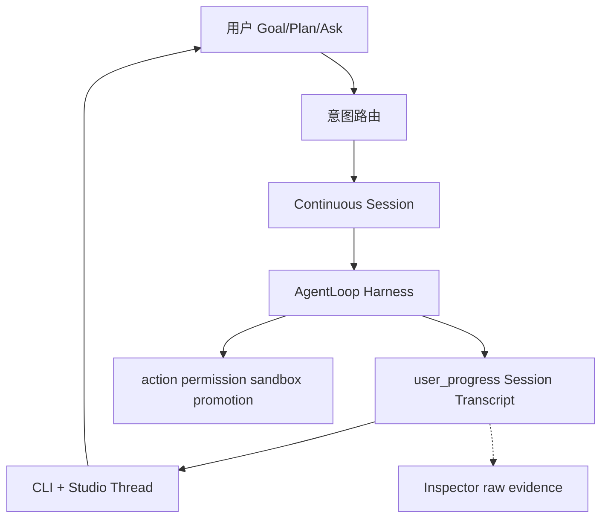

# Asteria 研发总计划

**版本**：1.2.9
**状态**：current — 长期执行入口（2026-06-10 校正）
**生效**：任何智能体（Cursor Auto、CLI agent、未来 Asteria 自研 agent）在改代码、写文档、排优先级前 **必须先读本文**。

---

## 0. 文档权威层级（冲突时按此裁决）

| 优先级 | 文档 | 作用 |
|--------|------|------|
| **1** | [`AGENTS.md`](AGENTS.md) | 仓库根约束、禁止项、ACTIVE_SLICE |
| **2** | **本文（研发总计划）** | 长期路线、Phase、Slice、闸门、Triage |
| **3** | 当前 Slice brief / 可复现 evidence | 当前完成事实与验收依据 |
| **4** | [`docs/zh/当前状态与路线.md`](docs/zh/当前状态与路线.md) | 短事实快照；只引用证据，不创造结论 |
| **4.5** | [`docs/zh/已删除与已替代登记.md`](docs/zh/已删除与已替代登记.md) | **恢复旧机制/引用旧文档前必读**：什么已删、被什么替代、什么是冻结 opt-in |
| **5** | 设计资产（§4 索引） | 怎么做：协议、交互、ADR |
| **6** | [`docs/zh/运行命令.md`](docs/zh/运行命令.md) | CLI 参考，不决定方向 |
| **7** | [`docs/zh/自动路线图.md`](docs/zh/自动路线图.md) | **generated**，机器摘要，不替代本文 |
| **8** | [`docs/zh/archive/`](docs/zh/archive/) | 历史参考，**非当前依据** |
| **9** | [`docs/zh/reports/`](docs/zh/reports/) | 验收证据，时间点快照 |

**规则**：若 archive/旧计划与本文冲突，以本文为准。若实现与本文 Implemented 表冲突，以代码、可复现测试和真实 evidence 为准并 **更新当前状态**。本机 `.asteria`、生成式摘要和状态投影不能单独关闭 Slice。

---

## 1. 产品 North Star（10 年方向）

```text
让用户把真实目标交给 Asteria，并在一条连续会话中获得可见、可验证、可继续的结果。
```

**用户价值**：给定目标 → 模型理解并按需计划 → 使用 Tool/MCP/Skill/Subagent → 展示真实过程与产物变化 → 验证 → 结果/风险/下一步 → 用户在同一 Session 续作。

**已证明或需要真实任务证明的差异化**：

- 本地优先、`.asteria/` 可审计证据链
- candidate workspace + promotion + merge gate
- 多 provider 路由与可恢复的长任务连续性
- scoped delegation 与安全 promotion 仅在真实收益成立时放量

**参考哲学（强制）**：

```text
学机制，不抄形态；学结论，不抄专有实现。
对标 OpenCode / Claude Code / Codex-rs，不闭门造轮子。
连续 Session + 模型工具循环是产品主路径；权限、sandbox、promotion 和不可逆操作
在动作边界由 Runtime 强制执行。
状态机、TaskGraph、固定 Agent 类和三层调度不是愿景，只能在真实任务证明收益后作为实现。
公开机制基线见 docs/zh/plans/S74_REFERENCE_PRODUCT_BASELINE.md。
```

**非目标（任何智能体不得突破）**：

- 无限制 agent 聊天室
- 无策略批准的破坏性 shell / 生产部署 / 远程 push
- 单一 model provider 依赖
- 跳过 schema 验证的持久化对象
- 在 harness 未稳前做复杂 dashboard / gate 主屏
- 复制外部产品专有实现

---

## 2. 已确认执行边界（2026-06-05）

| 维度 | 决策 |
|------|------|
| **MVP 证明** | **编程类 harness 优先**（Goal→Plan→Execute→Verify→续作）；文档/创意复用同 loop，**不作 MVP 硬门槛** |
| **自主程度** | **监督式自主** `reviewed_auto`：可无人值守数小时；budget hard-stop、promotion、发布、不可逆动作 **必须打断** |
| **后端 × 交互** | **后端优先 + 并行**；共享 `user_progress` / `runtime_progress` 契约；用户 **不应天天敲命令** |
| **North Star / 蜂群** | **S7 MVP 闸门通过后** 才启动 Phase 3/4 |
| **开发方法** | **Reference-First Vibe Slice**（§8）；无 brief 不 coding；无 demo 不合并 |

---

## 3. 当前诚实状态（Implemented / Gap）

### 3.1 Implemented（代码+测试真实存在）

- Bounded Agent Loop：`AgentLoopDecision` 六动作 + evidence 链
- Run/Execute/Plan/Review/Accept/Debug 主链 + 800+ tests
- candidate/promotion/merge gate、protected paths
- Fast Path / Tiered Review / Context Slimming **第一层**
- Subagent readonly fanout；L3 dynamic orchestration、live worker/provider 与 disjoint write Beta opt-in 已实现；新 workspace 默认仍关闭 parallel writes
- `user_progress` schema + 部分生产；`runtime_progress` ADR-0007
- Studio：server/Thread/Composer/Inspector 骨架；intent-router
- 运维/CI：gate、acceptance、evidence-bundle、daily/weekly/roadmap（**应隐藏，不删**）

### 3.2 In Progress（2026-06-08 快照）

**S74 Post-S73 Beta convergence** — 文档真源归一、主路径基线恢复、真实 Beta 任务证明。

| 轨道 | 状态 |
| --- | --- |
| 当前主线 | **S74**：Post-S73 Beta convergence |
| 已闭合编排带 | **S61–S73**：route、spawn、dynamic workflow、live provider、workflow monitor、verifier、Beta opt-in |
| F2 Studio | friction 输入渠道；**不开新编排 Wave、无证据新功能 Slice**。去内部词/诚实化/持久化设置/后端证据可视化属 friction 驱动的合规收敛工作，按证据独立裁决——2026-06-30 收敛重构①②③(部分) 已落地（见 §15 v1.2.4） |
| 稳态维护 | 文档契约、主路径 pytest、S73 pulse、Beta task pack |

**仍 defer**：新 workspace 默认 parallel_writes、12 Agent 新类、真 cloud VM background、无证据的新编排 Wave。

长任务目标框架：[`plans/LONG_TASK_GOAL_FRAMEWORK.md`](docs/zh/plans/LONG_TASK_GOAL_FRAMEWORK.md)

已完成并移出本表：user_progress 主路径、Goal/Plan/Ask CLI、CapabilityManifest、S8 续作、Phase 2/3 rolling 稳态 gate、North Star v1（S12）、Run Health（S13）、Beta 路径工程交付（S14 B1–B5）、S15 硬化（Studio 全路径 / wheel smoke / 内测材料）。

**本地卫生**：维护者定期运行 `python scripts/prune_local_artifacts.py --root .`（见 [`文档导航.md`](docs/zh/文档导航.md) §1）。

### 3.3 Designed-not-built / 未放量

- parallel writes 全局默认开启与更大范围 sandbox 放量（当前仅显式 Beta opt-in）
- 12 Agent 中 Architect/Product/UI/Memory/Release **独立类**
- Design Intelligence 全类型 `/research` 产品化（MVP 用 **per-slice brief** 代替）
- session↔run 多对多完整映射与真实 cloud VM background

North Star v1 实现细则见 [plans/NORTH_STAR_RFC.md](docs/zh/plans/NORTH_STAR_RFC.md)（RFC 已开，观察窗后编码）。

### 3.4 主要 Gap 根因（为何焦虑）

1. **造轮子**：gate 栈、mission control、规则回复、44 命令暴露  
2. **参考未进执行**：竞品调研在 archive，未绑 Slice  
3. **doc/code 混写**：12 Agent、80% 可用、Studio P0 与非 P0 矛盾  

---

## 4. 设计资产索引（实施依据，非可选）

任何 Slice 实现前，除本文外 **至少读对应行文档**。

| 领域 | 文档 | 约束要点 |
|------|------|----------|
| Harness | [模型主导运行时设计](docs/zh/Asteria%20模型主导运行时设计.md) | 模型主导 loop；Runtime 护栏 |
| 动态上下文 | [大模型循环与动态上下文设计](docs/zh/大模型循环与动态上下文设计.md) | Goal/Plan/Ask；动态上下文；多链路 |
| 用户面 | [用户交互模型](docs/zh/用户交互模型.md) | Goal/Plan/Ask；权限三档；Workspace Envelope |
| 进度协议 | [用户进展与证据协议](docs/zh/用户进展与证据协议.md) | transcript_kind；ui_intent；display_level |
| Studio | [Studio 会话与上下文设计准则](docs/zh/Studio%20会话与上下文设计准则.md) | 会话式非 dashboard；Inspector 分工 |
| Studio 产品 | [Asteria Studio 产品设计](docs/zh/Asteria%20Studio%20产品设计.md) | client/server；禁止规则冒充完成 |
| Studio 工程 | [Studio 交互界面工程设计](docs/zh/Studio%20交互界面工程设计.md) | 前端技术栈/数据流/构建/测试；诚实不变量 |
| 数据 | [数据模型](docs/zh/数据模型.md) | `.asteria/` JSON/JSONL |
| 质量 | [质量与评估](docs/zh/质量与评估.md) | Goal/Artifact/Outcome/Trajectory eval |
| 参考 | [设计情报吸收循环](docs/zh/设计情报吸收循环.md) | research 类型；per-slice 使用 |
| 竞品 | [archive 竞品调研](docs/zh/archive/Asteria%20Studio%20竞品调研与展示设计.md) | OpenCode/CC/Codex 机制摘要 |
| ADR | 0001–0009（见 [文档导航](docs/zh/文档导航.md)） | JSON 先于 SQLite；candidate；Active Next Step；主路径；runtime_progress；Fast Path；失败归因 |

**ADR 强制遵守摘要**：

- **0005**：不为失败尾巴堆规则；Active Next Step  
- **0006**：主路径 Plan→Tool→Verify→Repair/Ask/Stop；gate 不进主屏  
- **0007**：已被 0012 替代；`runtime_progress` 保留给 CLI/诊断，Studio 主会话不再消费其投影
- **0008**：Fast Path 是策略，不是产品边界  
- **0009**：provider vs schema vs tool 分层归因  
- **0010**：开放 Agent Loop；调用/repair 次数是 SLO，不是统一硬停止条件
- **0011**：愿景与实现分离；Reference-First 四道裁决门；确认劣质实现后果断替换或删除
- **0012**：Studio 主会话只消费 Session Transcript；禁止从 runtime progress / summary 猜测会话过程和最终结果
- **0013**：风险护栏在动作边界执行；删除全局 RuntimeReadinessGate，发布 gate、validation、diagnostics 各归其位
- **0014**：默认恢复只由当前 Session Agent Loop 控制；Run 不自动 Review/Debug/Replan，Review 只查证和反馈
- **S74 全系统裁决**：[`plans/S74_SYSTEM_AUDIT_VERDICT.md`](./plans/S74_SYSTEM_AUDIT_VERDICT.md) 是复杂度清算后续批次的唯一执行矩阵

---

## 5. 行业对标映射（Reference-First）

| 产品 | 学什么 | Asteria 映射 | 不做什么 |
|------|--------|--------------|----------|
| **OpenCode** | client/server；plan/build mode；permissions；session | Studio=localhost client；`plan`/`goal` | 重写 runtime 进 server |
| **Claude Code** | 过程节奏；compact/handoff；context 可展开；subagent context | user_progress 事件；Inspector raw | 像素级 UI；无源码处不臆造 |
| **Codex / codex-rs** | AGENTS 层级；sandbox 审批；验证后才 done | tiered review；DecisionPoint | 绑定 OpenAI 单栈 |

**每个 Vibe Slice 前**：写 [`benchmarks/reference_briefs/Sn.md`](benchmarks/reference_briefs/)（半页）：observed_pattern → asteria_file → do_not_copy。

可用（仅服务当前 Slice）：

```bash
python -m asteria_runtime research --type competitive_research --query "..." --root .
python -m asteria_runtime research --type open_source_research --query "..." --root .
```

---

## 6. 代码 Triage 锁（任何智能体不得违反）

### KEEP_CORE — 保留能力契约，不保护劣质实现

必须保留的能力：连续 Session、Agent Loop、Tool Use、真实 evidence、验证、resume、review、
accept、动作权限、candidate/merge/promotion、Studio Thread/Composer/Inspector 和核心测试。
对应文件与实现允许在 S74 裁决后替换、合并或删除，禁止用文件名或历史代码量保护重复责任。

### KEEP_PLACEHOLDER — 未经当前 Slice / DecisionPoint 禁止扩展

parallel writes 全局默认、sandbox 全面放量、MemoryAgent 等 Deferred 角色、legacy `event_logger` fallback.

### HIDE_NOT_DELETE — 从用户 help 隐藏，禁止删除

daily/weekly/roadmap, ops-signal, gate/acceptance/validation/real-model-*, evidence-bundle, capability-report, execute/replan/compact（高级入口）.

### MERGE_OR_TRIM — 仅在明确清理 Slice 中允许

| 对象 | 动作 |
|------|------|
| `runs_command.py` | DELETE |
| `validation` 命令 | 合并进 `validation-run --dry-run` |
| `new` 命令 | 合并进 `plan` 或弃用 |
| CLI legacy 别名 | 减注册，保留主名 |
| Studio 冒充完成 | 删行为 |
| `plan-output-smoke.mjs` | 合并进 chat-fallback |

### DO_NOT_TOUCH — 当前收敛期禁止宽泛重构

`execute_command.py`, `run_command.py`, orchestration gray/DecisionPoint、acceptance/real_model 栈。
禁止无依据宽泛重构；允许按 S74 全系统裁决替换已确认重复、伪成功或错误责任链。

---

## 7. 架构主路径（产品主体）



**MVP 最小代码面**：

```text
goal/plan/chat → continuous session agent loop → user_progress transcript
→ verify/result/continue → Studio Thread/Composer + Inspector
```

其余命令、schema、report 和运维壳按真实消费者与产品收益裁决。隐藏不是永久保留理由；
无真实消费者、重复责任或阻塞默认主路径的实现应合并或删除。

---

## 8. Vibe Slice 序列（唯一短期执行轨道）

**纪律**：一次一会话；Red→最小 diff→Green→5min demo→更新 ACTIVE_SLICE。

| ID | 名称 | 用户/demo | 验收 | 参考 brief |
|----|------|-----------|------|------------|
| **S0** | 执行锁 | AGENTS+本文+triage+vibe_slices | doc contracts pytest | — |
| **S1** | Plan 可见 | status 中文 plan | transcript_kind=plan | S1-plan.md |
| **S2** | Tool 可见 | 工具过程块 | tool_use | S2-tool.md |
| **S3** | Verify 可见 | 验证结论 | verification | S3-verify.md |
| **S4** | Final 可见 | Result/Next step | final + required_kinds | S4-final.md |
| **S1b** | MERGE | — | 删 runs_command 等 | — |
| **S5** | Studio 对齐 | Thread=status | run-detail-smoke | S5-studio.md |
| **S6** | 权限卡 | permission_request UI | interactive-main-path | S6-perm.md |
| **S7** | **MVP 终点** | small_code_change E2E | studio-benchmark ≥0.8 + **real provider** | S7-benchmark.md |
| **S8** | 续作 | 同 session 第二条 goal | 人工 demo | S8-resume.md |

**S9–S16 完整轨道**（签字后仍读 [`benchmarks/vibe_slices.json`](../../benchmarks/vibe_slices.json)）：

| 段 | Slice | 状态 |
| --- | --- | --- |
| 能力 / 稳态 gate | S9–S11 | ✅ 已签字 |
| North Star + Run Health | S12–S13 | ✅ 已签字 |
| Beta 路径 + 内测硬化 | S14–S15 | ✅ 已签字 |
| 稳态 Vibe 迭代 | S16–S17 | ✅ 已签字 |
| 蜂群 + Design Intel + Long Horizon | S18–S40 | ✅ 已签字 |
| **Long Task Intelligence** | **S41–S44** | **✅ 已签字** |

完整 Slice 表：[`benchmarks/vibe_slices.json`](../../benchmarks/vibe_slices.json)

**MVP 终点线（比「80% 可用」诚实）**：

> [`benchmarks/studio_user_tasks.json`](benchmarks/studio_user_tasks.json) 的 `small_code_change` 在 Studio + real provider 下 score ≥ 0.8

**Provider 策略**：S1–S4 用 fake 迭代；S4/S7 各至少 1 次 real。

---

## 9. Phase 路线图（长期）

| Phase | 名称 | 内容 | 闸门 |
|-------|------|------|------|
| **0** | 执行锁 | 本文落地；AGENTS；triage；vibe_slices；reference_briefs 模板 | doc contracts 绿 |
| **1** | 进度协议 | S1–S4 + S1b MERGE | user_progress 覆盖；CLI/Studio 一致；零冒充完成 |
| **2** | Harness+交互 MVP | S5–S7 | **S7 benchmark + real provider** |
| **3** | 续作与稳态 | S8；rolling 编程 case；CLI 用户面定型 | 3 scoped real cases 连续通过 |
| **4** | North Star v1 + **稳态迭代** | S12 North Star；S13 Run Health；S16 节奏 | **✅ 已闭合**（当前 ACTIVE 见 §16，唯一为 S74） |
| **5** | 蜂群 sandbox | disjoint write 灰度；feature flag | sandbox+promotion+merge+rollback 全可见 |
| **6** | Design Intel + Long Horizon | S35–S40；completion · queue · supervised loop · background | **✅ 已闭合** |
| **7** | Beta 用户路径 | S14–S15；安装→Studio→Accept；内测材料 | **✅ 已关闭**（维护态） |
| **8** | Long Task Intelligence | S41–S44 model judge · handoff · remote bg | **✅ 已闭合** |

**版本标签（对外）**：

| 版本 | 对应 Phase | 交付 |
|------|------------|------|
| v0.2-alpha | Phase 2 完成 | 编程 harness + Studio 会话 MVP |
| v0.3-alpha | Phase 5 | sandbox 灰度 |
| v0.4-alpha | Phase 6 | Design Intelligence |
| v0.5-beta | Phase 7 | 用户侧验证 |
| v0.6-alpha | Phase 8 | Long Task Intelligence（model judge · handoff · remote bg） |

---

## 10. 可行性闸门（kill/continue）

### Phase 1 闸门

- Execute 路径 user_progress 主会话事件覆盖 ≥90% 关键步骤  
- CLI status 与 Studio Thread 同一 run phase 一致  
- 零规则冒充完成  

### Phase 2 闸门（MVP）

- S7 studio-benchmark `small_code_change` ≥0.8  
- real provider：doc_update + single_file_bugfix + 1 multi-step 编程 case  
- `reviewed_auto` scoped 任务必须在预算内完成并可恢复；模型调用、repair、耗时作为分任务类型 SLO 和回归证据，不作为统一 Runtime 硬停止条件

### 闸门与 SLO 边界

- 硬闸门只保护权限、sandbox、不可逆操作、预算 hard-stop、context hard-stop 和可证明的无进展循环。
- model/tool calls、repair/replan 次数、耗时和 strong route 使用率用于 Eval、趋势和产品 DecisionPoint。
- 达到资源保险丝时必须保留可恢复 Session/Run，并明确停止原因；不得伪装成任务语义失败。
- 改变自主边界、默认执行路径或停止条件前，必须遵守 ADR-0010 的“调研、分类、eval、退出条件”要求。
- 所有复杂度清算与新增复杂机制必须遵守 ADR-0011；成熟机制是实现参考下限，自研愿景不能保护劣质实现。

### Phase 3+ 闸门

- Phase 2 连续 2 周稳定 → 才开 North Star RFC  
- sandbox 全链路 fake+1 readonly 灰度 → 才开写 parallel  

---

## 11. 智能体强制操作规程

**任何智能体在开始工作前必须**：

1. 读 `AGENTS.md` + 本文 + `ACTIVE_SLICE`  
2. 确认当前 Phase；**禁止**做 Deferred 项（North Star、蜂群、12 Agent 新类）除非 todo 明确  
3. 若改代码：查 §6 Triage；**禁止** DO_NOT_TOUCH 重构  
4. 若新 Slice：先写 `reference_briefs/Sn.md`  
5. 会话结束：跑相关 pytest/smoke；更新 ACTIVE_SLICE；不过闸门不开下一 Slice  

**禁止的 prompt 模式**：

- 「帮我把 Asteria 做好」  
- 「顺便重构 execute/run」  
- 「加一个 maintainer 命令」  
- 无 brief 造新抽象  

**推荐 prompt 模板**：

```text
执行：Vibe Slice S3 | Phase 1 | todo: progress-contract
Triage: KEEP_CORE only | DO_NOT_TOUCH execute/run
Reference: benchmarks/reference_briefs/S3-verify.md 已读
Red: <命令>  Green: <命令>
禁止: North Star, 新命令, gate 主屏, 冒充完成
```

---

## 12. 验证命令（常规）

```powershell
pytest tests/unit/test_documentation_contracts.py -q
python scripts/steady_iteration_check.py --root . --skip-b6
python scripts/steady_iteration_check.py --root .
pytest -q
pytest tests/integration/test_phase3_rolling_gate.py tests/integration/test_phase2_stability_gate.py tests/unit/test_phase2_stability_window.py -q
node studio/scripts/run-detail-smoke.mjs
node studio/scripts/s8-resume-continuation-smoke.mjs
python -m asteria_runtime status --json --root .
```

**real provider（maintainer 复签）**：见 [`当前状态与路线.md`](docs/zh/当前状态与路线.md) §5。

---

## 13. 文档维护规则

- **本文变更**：需更新 version；重大变更写 ADR 或 §changelog  
- **当前状态与路线**：只保留 Implemented 快照 + 指向本文；不写第二套计划  
- **自动路线图**：generated，不 hand-edit  
- **archive**：不加新过程计划；已有加「非当前依据」  
- **新功能**：先判 §6 Triage + §8 是否已有 Slice；无则先改本文再实现  

当前 ACTIVE 信息只允许出现在本文 §16、`AGENTS.md`、`当前状态与路线.md` 与
`benchmarks/vibe_slices.json`；禁止在模板或历史说明中复制另一份 ACTIVE 值。

---

## 15. Changelog

| 版本 | 日期 | 说明 |
|------|------|------|
| 1.0.0 | 2026-06-05 | 综合对话：Harness、参考优先、Triage、Vibe Slice、可行性闸门、后端+Studio 并行、编程 MVP、监督式自主 |
| 1.0.2 | 2026-06-06 | 观察窗完成；Phase 4 / S12 North Star v1 实现启动 |
| 1.0.3 | 2026-06-06 | S16 稳态节奏；Phase 4/7 路线图与 Slice 表对齐；Studio 摩擦收敛启动 |
| 1.1.0 | 2026-06-08 | S61–S73 编排带闭合；ACTIVE 切换到 S74 Post-S73 Beta convergence；修正过期 triage 与未实现清单 |
| 1.1.1 | 2026-06-09 | 明确开放 Agent Loop 与 Eval/SLO 边界；禁止把统一低调用/repair 指标写成 Runtime 硬停止条件 |
| 1.1.2 | 2026-06-09 | 建立 Reference-First Complexity Liquidation；以四道裁决门审计全系统并果断替换或删除劣质实现 |
| 1.1.3 | 2026-06-09 | 用 Session Transcript 单真源替换 Studio 多源 progress/summary narrative 重建 |
| 1.2.0 | 2026-06-09 | 以连续 Session Agent Loop 重写产品架构；状态机、TaskGraph、固定角色降为可替换实现；建立官方竞品机制基线 |
| 1.2.1 | 2026-06-10 | 删除重复项目驾驶舱投影；完成事实只由可复现 evidence 支撑；Beta matrix 默认 evidence-only，live 执行必须显式开启 |
| 1.2.2 | 2026-06-28 | Studio 前端对标三轨闭合：诚实化 #1–#8、设计系统 DS-0…DS-3（raw hex 归零）、对话流 CV-A…CV-C；CV-C（runtime 模型撰写对话式复盘，`core/run_recap.py` + `run_command` append-only）经用户裁决落地内核 |
| 1.2.3 | 2026-06-28 | 立项 Studio IDE-shell 重设计（外壳/布局/视觉 IDE 化，design-review workflow + 用户决策锁定）：全幅 IDE 工作区 + 全局头部、会话栏保持、改动文件进评审面；纯 token/CSS，待实现。方案见 `plans/Studio-IDE-shell-重设计方案.md` |
| 1.2.4 | 2026-06-30 | Studio 收敛重构（用户 friction 驱动，已上 main）：①去冗余+去内部化（双 workspace 合一；机制词换人话/挪 Inspector）②统一 **Settings 面板**（权限默认档持久化 `.asteria/studio/settings.json` + GET/POST 写回；权限词表归一 `studio/src/permissionTiers.ts`；删死字符串 `ask-for-write`）③后端可见化（MCP/Skill 主线程实名化、权限档头部常驻、**风险扣留主线程卡**——运行时 additive 补 `risky_files/risk_level` 并加 `transcript_kind=decision_request` 对齐 ADR-0012，前端按 transcript_kind 识别、channel/event 仅作 legacy fallback）。诚实暂缓 B7 强降卡 / C8 转人工原因 / D9 内建工具徽章（无落盘证据，需运行时补发）。剩余前端切片 C4/D5/D6 |
| 1.2.7 | 2026-07-02 | **全系统「文档声称 vs 代码现实」审计 + P0 安全止血落地**。审计（12 维 34 代理 1235 工具调用，[report](docs/zh/reports/S74-full-system-claims-audit-20260702.md)）确认 22 条 critical/high（0 被推翻）：后端核心比预期真，裂缝聚集在①安全强制②权限语义③前端诚实化④闭环断点/证据可见性。用户拍板 P0→P4 重排（Beta 邀请+re-tag 延后到 P0+P1 后）。**P0 已落地**（[signoff](docs/zh/reports/S74-p0-security-hardening-20260702.md)）：ShellGuard 加保护路径/secret 预扫（`cat .env` 堵）+ allow_network gate（curl/wget/nc/ssh/git-clone 堵）+ 破坏性深扫（find -delete/解释器 rmtree/引号 Remove-Item 堵）；`.asteria/` 纳入 protected_paths 防自提权；runtime_request packaged schema 补 auto_applied + `JsonlStore.rewrite_all` 校验写（修毒化）。验证：unit 863 + integration 198 子集 + doc_contracts 22 绿；红队 31/31 拦截、23/23 合法放行 0 误报。均 additive，未碰 execute_command/run_command/gate 栈 |
| 1.2.8 | 2026-07-02 | **P0 红队复核 + 第二轮 ShellGuard 加固**（承接 1.2.7，[signoff §红队复核追加](docs/zh/reports/S74-p0-security-hardening-20260702.md)）。4 代理对抗红队提 34 条候选绕过（多在真实 shell/文件系统验证生效+旧守卫放行）。按「修 correctness bug + 补廉价覆盖 + 不打地鼠」处置 8 项：cmd.exe caret 折平、目录规则大小写/尾点归一（`.Asteria/`·`.asteria./`）、path-qualified/后缀命令名还原（`/bin/rm`·`rm.exe`·`./rm`）、wrapper payload 二次扫描（`cmd /c "del x"`）、网络 LOLBin（certutil/bitsadmin/plink…）+ 深层正则（`/dev/tcp`、Net.WebClient、fs.*Sync）、破坏动词补全（unlink/clear-content/set-content/os.truncate）、重定向无空格漏洞。复核：34 中 28 拦、23/23 合法 0 误报、unit 863（security 82）绿。**诚实定性**：shell 命令 denylist 是减速带非安全边界，解释器任意代码 payload（反射/拼接/urllib/fetch）+ 无处不在覆盖命令（cp/mv）不可静态收住——**唯一彻底解是 sandbox（KEEP_PLACEHOLDER）；external Beta 放量前 shell 应收窄/关闭或跑受限容器,列为放量 DecisionPoint 前置风险** |
| 1.2.9 | 2026-07-02 | **P1 信任修复落地**（承接审计裂缝②权限承诺是标签 + ③前端诚实化，[signoff](docs/zh/reports/S74-p1-trust-repair-20260702.md)）。先派 9 代理验证每条发现的当前 file:line + 最小修复（均 present/high/无碰 DO_NOT_TOUCH），再逐条实现。7 项：**A** 删死选项 `approve_similar_for_session` + 非-approve_once 不再记假 `execution_approval_applied`；**B** MCP/Skill 的 `ask`（no-op，`requires_decision` 零消费者）**诚实降级**为 `allow`（契约把关、风险仍记录），文档同步降级、真交互式门列后续；**C** 删 chat `looksLikeTask` 关键词短路（后端已定意图）、`appendModelNotice` 由 no-op 改为对本地模板答案追加「非模型生成」披露（含流式分支，措辞避兜底禁词）；**D1** Inspector「AI Debug Agent」→「Run Diagnostics」（纯客户端关键词模板，非 AI）；**D2** 删 `TurnFinal` 无内容 final 伪造的「Done.」；**D3** `conclusion→final` 收窄到 `phase==result`（修 plan 开场步被当结论）；**D4** 离线告警补全局默认路由判据（修 `AGENT_MODEL_PROVIDER` 真+`cheap=fake` 混配的假阴性）。验证：unit **894** + ruff clean；studio tsc/vite build + smoke **5/5**。已本地提交 `b921028`（未推） |
| 1.2.10 | 2026-07-02 | **P2 核心闭环断点落地**（承接审计裂缝④ 闭环断点+能力不可见，[signoff](docs/zh/reports/S74-p2-closure-breakpoints-20260702.md)）。先派 6 代理把每项钉到当前代码（pull 到 `498d31c` + P1 `b921028` 后）复核，纠正审计两处夸大。**4 个代码修复**（均非 DO_NOT_TOUCH/非冻结）：**P2-1** skill/MCP 观察回灌——`tool_execution_gateway._run_mcp_call/_run_skill_call` 补发本地工具同款 `_record_harness_observation`（丢失在**跨轮 reload 边界**非同轮），跨轮测试锁定；**P2-4** 4 工具被过期 `_TOOL_KINDS` 硬拒——补 `find_files/diff_workspace/todo_read/todo_write→read` + planner `_allowed_tools` 放行；**P2-5** route_fallback 只在内存——`model_call_logger._base_record` 读 `metadata['route_fallback']` 落 `model_calls.jsonl` + 两份真源 schema 补可选字段；**P2-6** chat 单轮失忆——`ChatCommand` 加可选有界 history（近6轮/截800/仅 user·assistant），studio 新增 `recentChatHistoryMessages` 从 `events.jsonl` 注入，复用现有持久层、不加 UI（属既有能力闭环非冻结新功能）。**2 个撞 DO_NOT_TOUCH → 诚实降级**：**P2-2** /run 不再内联 review（自查证实 `run_command`/`run_smoke` 均不调、只读 eval_report）——`运行命令.md` 改正 + `真实模型验收.md` 通过标准标注「仅 review 已跑时适用」，真接回 review 列 **DecisionPoint**；**P2-3** `max_repair_attempts_total` 未接线（`record_repair_attempt` 零生产调用者；纠正审计：`_per_task` 经 `run_command` 派生 cycle 上限非全死）——`质量与评估.md` 诚实标注，真 gate 须解锁 `execute_command.py` DO_NOT_TOUCH 例外列 **DecisionPoint**。验证：unit **900** + ruff clean + doc_contracts 22；studio tsc/vite build + smoke **7/7**。未触碰 execute/run/gate/acceptance·real_model 栈。已本地提交 `36ac4c1` |
| 1.2.11 | 2026-07-02 | **P3 桌面赌注（诚实化/bugfix 批）落地**（承接审计裂缝④，[signoff](docs/zh/reports/S74-p3-desktop-stakes-20260702.md)）。先派 6 代理钉当前代码 + **严格分类** honesty_fix/bugfix/new_feature + 冻结张力。**冻结内 4 项直接做**（纯 studio + 1 文档、零后端代码、零 DO_NOT_TOUCH）：**P3-3** 真流式去占位（`LiveStream` 删非-chat 相位占位句遮蔽，直渲真实模型增量，数据本在手）；**P3-6** 事件 id 去重（删两处 live-tail 把命名空间 id 覆写回裸 `upe-NNNN` → 修跨 run 碰撞丢事件 + `mergeSessionAndRuntimeEvents` 改按 id 去重含 legacy 后缀兜底 → 修 tool_start/final_answer 双份）；**P3-5 parts1-2** Inspector 渲染已组装却零显示的 `mcp/skill_invocations`（闭 `inspector_raw_evidence_source` 承诺）+ 去 `files.slice(0,6)` 静默截断（显全量+计数）；**P3-2 文档** `产品设计.md` 把声称的 Sidebar Search/Projects/Workspaces 标「规划中未实现」。验证：studio tsc/vite build + doc_contracts 22 + 事件/流式 smoke 6/6。**4 个 new_feature 项经用户绿灯（「合理的常见功能都要加上」）另批实现**：P3-1 Stop/中断、P3-2 会话搜索框、P3-4 token 用量面板（后端无 USD、仅 token 维度）、P3-5 part3 capability_decisions 面板 |
| 1.2.12 | 2026-07-02 | **P3 桌面赌注（new_feature 批）落地**（用户绿灯「合理的常见功能都要加上」，[signoff §第二批](docs/zh/reports/S74-p3-desktop-stakes-20260702.md)）。4 项均实现，纯 studio、零后端 Python、零 DO_NOT_TOUCH：**P3-1 Stop/中断**——`startRuntimeJob` 存 child/pid + 会话级 `POST /sessions/:id/stop`（`stopSessionJobs` 置 cancelled + 清 follow_up 防重启，Windows `taskkill /T /F` 树杀、POSIX SIGTERM，close 对 cancelled 报诚实「Stopped by user」）+ `api.stopSession`/`useSessionEvents.stopRun` + Composer `isRunning` 时 Send→红色 Stop；**P3-2 会话搜索框**——`searchSessions` 对 title+goal_preview 大小写不敏感包含匹配 + SessionList 受控 input（数据已全量前端、无后端）；**P3-4 token 用量面板**——`RunUsagePanel` 渲染 cost_report 的 model/tool_calls + est_input/output_tokens + strong/cheap/repairs（**仅 token 维度，后端无 USD/单价，标题 Run usage 不叫 cost，无 usage 降级 unknown**）；**P3-5 part3**——server 加读 capability_decisions.jsonl（有写无读）+ Inspector Capability decisions 块。验证：studio tsc/vite build + smoke 7/7 + Stop 路由 live 冒烟。边界：Stop 硬杀 e2e 树杀需真实长 run 端到端验证（已按 taskkill/T/F 实现+风险标注）；货币 USD 费用需引入单价数据、属另立能力未做 |
| 1.2.13 | 2026-07-02 | **P4 债务/诚实化（本批）落地**（用户选「只做可直接改的债务/诚实降级」，Beta/re-tag 里程碑另拍，[signoff](docs/zh/reports/S74-p4-debt-honesty-20260702.md)）。先派 6 代理钉当前代码分类，**纠正审计多处数字**（mypy 实 83 非 129、61% 锁 real_model 栈；schema 漂移 17 非 18 且测试守门；**JsonlStore fail-open 其实已 fail-closed**、审计过时）。4 项 code_fix/honesty_doc（均非 DO_NOT_TOUCH）：**P4-a init 幂等**——`_write_json` 加 preserved 守卫（已存在+非force→保留），`--force` 从 no-op 变真生效 + cli help 对齐（+2 测试）；**P4-b 文档超卖**——fork 标未实现、compaction「只测量+建议+写快照非自动缩减 live context」+ 两 compaction 旗标标未消费、`--model-strategy local` help 降级为占位、`max_total_minutes` 标声明性未强制（5 文档+cli）；**P4-c session_id 恒 null**——logger `session_id or run_id`（session==run，消 null 不撒谎，+1 测试）；**P4-f 死 MCP 炸 run**——`from_configs` 包 try/except OSError 跳过 spawn 失败 server → 降级无工具令 架构设计.md:201 声称成真（+1 测试）。验证：unit **902** + init 集成 14 + ruff + doc_contracts 22 + cli 绿。**DecisionPoint/defer**：schema 双向漂移同步（风险大需逐 producer 核）、real_model 栈 mypy 51、真写 Studio 会话 id 全链路、P4-e memory 自断言/run_command auto-pass/review 计分（均撞 DO_NOT_TOUCH）；**纠错**：recon 报 validation_run_command:781/789 类型 bug 经复核为误报（集合子集、逻辑正确未改）。里程碑 Track A Beta 邀请 + re-tag v0.2.0a2 门槛已满足、等用户拍板 |
| v0.2.0a2 | 2026-07-02 | **re-tag 发布 capstone**（`c8d3a61`，tag `v0.2.0a2` 已推）：版本 0.2.0a1→0.2.0a2 + CHANGELOG 蒸馏 P0-P4；外部 Beta 邀请仍待用户操作（前置：shell 收窄/sandbox）。 |
| 1.2.14 | 2026-07-02 | **P5 用户友好度（post-release usability）落地**（用户「根据主流经验按建议执行」+「看下一步更好用」→ 派 6 代理接地气侦察首跑/provider/错误恢复/Studio 可发现性/CLI/验证信任，全非 DO_NOT_TOUCH，4 提交已推）。洞见：系统本就算好引导，只是没在首跑/报错/完成的时刻端到用户面前。**CLI**（`6255aa1`）：main() 顶层异常护栏(traceback→人话+下一步，ASTERIA_DEBUG=1 留栈) + init 下一步引导 + 裸/错命令走 curated help + model-check 进分组。**Studio**（`3e480da`）：修报错卡字面「???????」标题 + friendlyErrorText 扩 5 类(401/403·429·model-not-found·ECONNREFUSED) + **完成≠验证诚实提示**(runVerificationHint 主线程投影 review_status=unknown，P2-2 的 UX 层解法、不碰 run_command) + 会话搜索/权限提示放出到默认视图。**provider 可用化**（`2266aed`）：overview() 增取 doctor + Settings 显每 tier 路由就绪(缺哪个 env)消除首配鸡生蛋。**文档**（`9cd4b57`）：README 最小 provider 配方 + 零 key 试跑 + glm-5→glm-4.7 + doctor reachability 超卖修正 + studio 特性表诚实化。验证：unit **904** + ruff + doc_contracts 22 + studio tsc/build/smoke + CLI live 冒烟。诚实边界：`.env.example` 撞 `.gitignore` 的 `.env.*`(保护路径)未提交；status 空态友好化与既有空态路径纠缠已回退。未做(低优先后续)：token 面板可发现性、doctor 文本 next_actions、diff/回退主线程入口、cheap=fake 混配告警可见化 |
| 1.2.15 | 2026-07-02 | **Beta 安全前置（access profile）+ review/repair 门控诚实化**（用户「2 条都可以做，但依据调研，非主流做法可弃、文档不合理可改」→ 3 路侦察：2 内部 recon + 1 外部主流调研 Codex/Claude Code/OpenCode/Aider，[signoff](docs/zh/reports/S75-beta-safety-gate-and-verify-honesty-20260702.md)）。**① 命名受限访问档（做，主流+North Star 前置，全锁外）**：新建 `core/access_profile.py` 定义 `beta_safe`（硬关 shell+network+破坏性/安装/push/deploy/secret 读，档定义在代码为单一真源，避开已占用的 `execution_profile`/`permission_mode` 名）；`load_policy_config` 唯一装载入口解析 `active_access_profile` 覆盖 permissions → 全命令生效、**零触 run/execute/gate**；两份 schema 加可选 `active_access_profile`/`access_profiles`；`policies.default.json` 加开关（默认 null=行为不变）；`doctor` 顶部 `Access profile:` 行 + 结构化 `access_profile` 字段供 operator 核实关停态（doc_contracts 示例双份同步含 gate 内嵌 doctor stage）。红队测试证明 beta_safe 下 ShellGuard 真拒 `ls`/`python`/`curl`；CLI live 冒烟 `none(shell on)`→pin→`beta_safe(shell off,network off)`。**② repair 预算 ledger（弃，调研判定过度设计）**：主流（Codex `max turns`、Claude 连续/累计 block 计数）只用简单计数兜底，Codex 连 `on-failure` 智能策略都弃用——`record_repair_attempt`/`max_repair_attempts_total` **有意不接线**（现有派生 cycle 上限+no-progress 已是主流形态），budget.py 注释+`质量与评估.md` 措辞由「待 DecisionPoint 补」改「有意不采用过度设计」。**② run-then-review 包装命令（弃，非主流第二 run 路径）**。**② /run 内联 review（DecisionPoint，建议缓）**：`运行命令.md` 流程图删误导的内联 `-> review`、改为显式 `review`/`accept` 步 + 接 Studio `runVerificationHint`；诚实指出 Claude Code 也用 hook 而非硬编核心循环触发验证，故当前显式验证+提示已是主流形态，真内联须解锁 `run_command.py`（DO_NOT_TOUCH）列 DecisionPoint、建议缓做。验证：unit **907** + ruff clean + doc_contracts 22 + CLI live 冒烟。未触碰 execute/run/gate/acceptance·real_model 栈 |
| 1.2.6 | 2026-06-30 | **Track D 诚实化裁决落地**（用户逐项拍板，承接 S74-doc-impl-mismatch-audit §3/§4）+ Studio 收敛③ **D6** 热续作标注（修 resume 误判为 hold 卡）。D-2：ask/chat 默认权限改只读 `ask`（对齐文档 Ask=只读 + plan 默认，`cli.py`）。D-3：保留 cheap=fake 离线默认，但 `factory` 在「离线 tier 与真 provider 混用」时发运行时 `warnings.warn`，消除静默 canned 输出（+3 测试，2 个既有混配测试如实告警）。C-6：确认 `max_replans` base 默认 2 / `autonomous_long_task` profile 覆盖 3 为有意分层，真源 `policies.default.json`，zh 文档加层级标注。P0-3：real_model smoke 把瞬时失败救活的 run 记为 `recovered`（artifact 仍真实校验，非 plain pass；schema 双副本同步加 `recovered`）。P0-4：real_model gate 把仅靠 smoke model_calls reconcile 过的 model-check 标 `degraded`。均 additive，未削弱守卫/未碰 `execute_command`。验证：831 unit + ruff clean；前端 D6 narrative 真源 18/18 + tsc/vite 绿 |
| 1.2.5 | 2026-06-30 | Studio 收敛③ C4：合并时刻去内部化（`Candidate promoted`/`Promotion started`/`Merge gate evaluated` 等机制词标题经新建共享 `studio/src/titleProjection.ts` 投影成人话，并接到主线程 NarrativeStep 标题路径——纯前端，无运行时/测试改动）+ Inspector `isolate→verify→merge` 三段 lineage（buildPromotionPreview 按 `task_id` 串 export/promotion，dry-run 为 batch 级 verify 如实标注「(batch)」，无法可靠串联则回落 flat items）。剩余 D5 上下文压缩标记 / D6 热续作标注 |

---

## 16. 当前 ACTIVE_SLICE

S61–S73 编排带已签字。当前不继续新增 Wave，进入 Post-S73 Beta convergence。

```text
ACTIVE_PHASE：Post-S73 Beta convergence
ACTIVE_SLICE：S76（承接 S75；Studio 前端产品化——主内容区活起来 + 长任务健壮 + 人性化交互 + 浅色，见 1.2.16）
Brief：benchmarks/reference_briefs/S76-studio-main-content-liveness.md（路线：docs/zh/前端产品化路线.md）
Brief(前)：benchmarks/reference_briefs/S74-post-s73-beta-convergence.md
计划：docs/zh/plans/S74_POST_S73_BETA_CONVERGENCE_PLAN.md
前置：docs/zh/reports/S73-beta-opt-in-ingress-signoff-20260607.md
全系统审计：docs/zh/reports/S74-full-system-claims-audit-20260702.md（12 维、34 代理、22 条 critical/high 全确认）
顺序（2026-07-02 P0→P4 重排，用户拍板）：
  P0 安全止血【已落地 → S74-p0-security-hardening-20260702.md】
  → P1 信任修复【已落地（本地 b921028）→ S74-p1-trust-repair-20260702.md】
  → P2 核心闭环断点【已落地 → S74-p2-closure-breakpoints-20260702.md；skill/MCP 回灌·4 工具解禁·route_fallback 落盘·chat 历史 4 项真做，/run review·修复预算 2 项撞 DO_NOT_TOUCH 走诚实降级 + DecisionPoint】
  → P3 桌面赌注【已落地 → S74-p3-desktop-stakes-20260702.md；诚实批(去占位真流式·事件去重·Inspector raw evidence·文档超卖) `8e07b3a` 已推；new_feature 批(Stop/中断·会话搜索·token 用量面板·capability_decisions)经用户绿灯已实现，token 面板仅 token 无 USD】
  → P4 债务收敛【本批诚实化/债务已落地 → S74-p4-debt-honesty-20260702.md：init 幂等·文档超卖·session_id 去 null·死 MCP 降级 4 项；schema 双向漂移/real_model mypy/Studio 会话 id 全链路/memory·run_command 计分 均撞 DO_NOT_TOUCH → DecisionPoint】+ re-tag **v0.2.0a2【已落地 → tag c8d3a61 已推 origin，P0-P4 诚实 capstone，CHANGELOG 已录】** + Track A 外部 Beta 邀请（门槛已满足；属对外发送=用户本人操作）
  → **Beta 安全前置机制已交付【1.2.15：`beta_safe` access profile 一行 pin + doctor 核实关停态 + 红队测试证明 shell/network 真关，全锁外】**，operator 放量前可 pin 部署把 shell/network 硬关到 sandbox 落地前的最小攻击面；剩余仅「真实规模下对关停态再跑一轮红队 + 用户拍板发邀请」
  → **残留 DecisionPoint（建议缓）**：/run 内联 review（须解锁 `run_command.py`；现有 `review`/`accept`+`runVerificationHint` 已是主流形态）；repair 预算 ledger（调研判定过度设计，已诚实弃）
  → **S76 Studio 前端产品化【1.2.16：竞品对标(Claude Code/Cursor/Cline/Zed/Windsurf/Codex/Aider)→I1–I14 路线，5 轮 /goal 驱动落地】**：I1 主区活起来(优先自有富事件修"没一个字"+乱码·思考常驻芯片·工具卡常驻·切工作区解卡) / I2 发送错误 toast+重连 pill / I3 phase 条+plan 清单(派生真 task_plan) / I4 context 表(est. 无$) / I5 推理清洗全路径+流式 caret / I6 切会话缓存 / I7 turn 窗口化+跳最新+尊重上滚 / I9 运行中排队+Esc停 / I12 诚实错误(未知不空白+分类徽章) / I13 命令面板 Ctrl+K / I14 浅色主题跟随 OS；缺陷修复 redact 误伤 token 计数、liveJobs 卡工作区切换。全前端+server.mjs，未触 DO_NOT_TOUCH，逐迭代 tsc/build/smoke/preview 真数据核实。**跟踪(未做)**：完成 turn memo+真虚拟化、seq 游标回填、编辑重发、内联 diff accept/reject、session 备份/分支、手动主题开关。路线真源：`docs/zh/前端产品化路线.md`。
```

> 重排理由：审计确认后端核心比预期真，但四条裂缝高度聚集——① shell 安全强制被超卖（`cat .env`
> 直读、`curl` 直传）② 权限承诺是标签（ask==allow、approve_similar 假证据）③ 前端诚实化未闭环
> （罐头 chat / 假 AI Debug）④ 闭环断点+能力不可见。**安全裂缝不堵不放量**：外部 Beta 邀请必须
> 排在 P0+P1 之后,re-tag 亦然。原 D5 并入 P1（源头修 compact emit + final 误标）。

Studio 前端对标进度（2026-06-28）：诚实化 #1–#8、设计系统 DS-0…DS-3、对话流 CV-A…CV-C **三轨全部落地**，详见 [`plans/Studio-前端对标-Codex-Claude-路线图.md`](docs/zh/plans/Studio-前端对标-Codex-Claude-路线图.md) 与 [`Studio 交互界面工程设计.md`](docs/zh/Studio%20交互界面工程设计.md)。**下一层已立项待实现**：Studio IDE-shell 重设计（外壳/布局/视觉 IDE 化），方案见 [`plans/Studio-IDE-shell-重设计方案.md`](docs/zh/plans/Studio-IDE-shell-重设计方案.md)。其余 Studio 改动以真实 Beta friction 证据驱动。

事实快照：[`当前状态与路线.md`](docs/zh/当前状态与路线.md)。Slice 真源：[`benchmarks/vibe_slices.json`](../../benchmarks/vibe_slices.json)、[`AGENTS.md`](../../AGENTS.md)。
