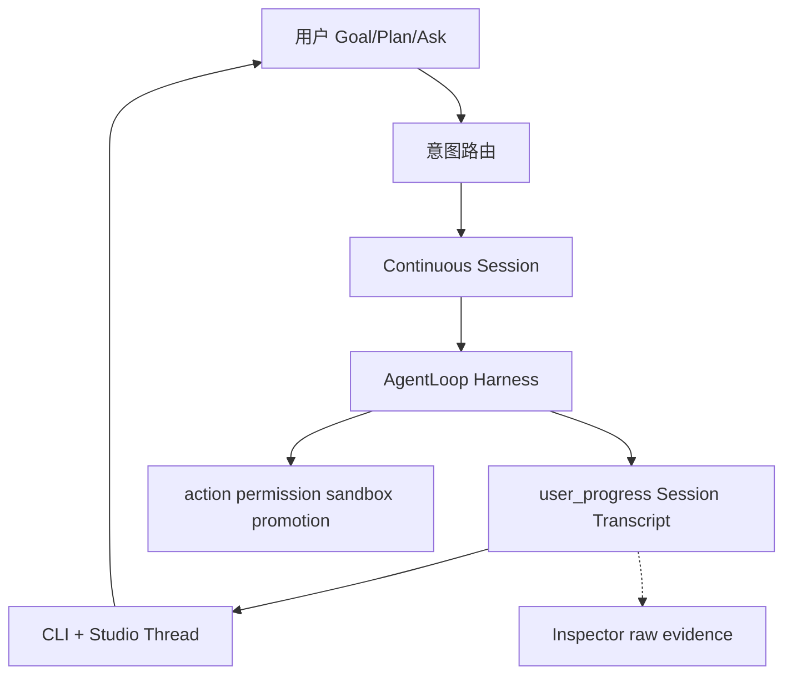

# Asteria 研发总计划

**版本**：1.2.1
**状态**：current — 长期执行入口（2026-06-10 校正）
**生效**：任何智能体（Cursor Auto、CLI agent、未来 Asteria 自研 agent）在改代码、写文档、排优先级前 **必须先读本文**。

---

## 0. 文档权威层级（冲突时按此裁决）

| 优先级 | 文档 | 作用 |
|--------|------|------|
| **1** | [`AGENTS.md`](AGENTS.md) | 仓库根约束、禁止项、ACTIVE_SLICE |
| **2** | **本文（研发总计划）** | 长期路线、Phase、Slice、闸门、Triage |
| **3** | 当前 Slice brief / 可复现 evidence | 当前完成事实与验收依据 |
| **4** | [`docs/zh/当前状态与路线.md`](docs/zh/当前状态与路线.md) | 短事实快照；只引用证据，不创造结论 |
| **5** | 设计资产（§4 索引） | 怎么做：协议、交互、ADR |
| **6** | [`docs/zh/运行命令.md`](docs/zh/运行命令.md) | CLI 参考，不决定方向 |
| **7** | [`docs/zh/自动路线图.md`](docs/zh/自动路线图.md) | **generated**，机器摘要，不替代本文 |
| **8** | [`docs/zh/archive/`](docs/zh/archive/) | 历史参考，**非当前依据** |
| **9** | [`docs/zh/reports/`](docs/zh/reports/) | 验收证据，时间点快照 |

**规则**：若 archive/旧计划与本文冲突，以本文为准。若实现与本文 Implemented 表冲突，以代码、可复现测试和真实 evidence 为准并 **更新当前状态**。本机 `.asteria`、生成式摘要和状态投影不能单独关闭 Slice。

---

## 1. 产品 North Star（10 年方向）

```text
让用户把真实目标交给 Asteria，并在一条连续会话中获得可见、可验证、可继续的结果。
```

**用户价值**：给定目标 → 模型理解并按需计划 → 使用 Tool/MCP/Skill/Subagent → 展示真实过程与产物变化 → 验证 → 结果/风险/下一步 → 用户在同一 Session 续作。

**已证明或需要真实任务证明的差异化**：

- 本地优先、`.asteria/` 可审计证据链
- candidate workspace + promotion + merge gate
- 多 provider 路由与可恢复的长任务连续性
- scoped delegation 与安全 promotion 仅在真实收益成立时放量

**参考哲学（强制）**：

```text
学机制，不抄形态；学结论，不抄专有实现。
对标 OpenCode / Claude Code / Codex-rs，不闭门造轮子。
连续 Session + 模型工具循环是产品主路径；权限、sandbox、promotion 和不可逆操作
在动作边界由 Runtime 强制执行。
状态机、TaskGraph、固定 Agent 类和三层调度不是愿景，只能在真实任务证明收益后作为实现。
公开机制基线见 docs/zh/plans/S74_REFERENCE_PRODUCT_BASELINE.md。
```

**非目标（任何智能体不得突破）**：

- 无限制 agent 聊天室
- 无策略批准的破坏性 shell / 生产部署 / 远程 push
- 单一 model provider 依赖
- 跳过 schema 验证的持久化对象
- 在 harness 未稳前做复杂 dashboard / gate 主屏
- 复制外部产品专有实现

---

## 2. 已确认执行边界（2026-06-05）

| 维度 | 决策 |
|------|------|
| **MVP 证明** | **编程类 harness 优先**（Goal→Plan→Execute→Verify→续作）；文档/创意复用同 loop，**不作 MVP 硬门槛** |
| **自主程度** | **监督式自主** `reviewed_auto`：可无人值守数小时；budget hard-stop、promotion、发布、不可逆动作 **必须打断** |
| **后端 × 交互** | **后端优先 + 并行**；共享 `user_progress` / `runtime_progress` 契约；用户 **不应天天敲命令** |
| **North Star / 蜂群** | **S7 MVP 闸门通过后** 才启动 Phase 3/4 |
| **开发方法** | **Reference-First Vibe Slice**（§8）；无 brief 不 coding；无 demo 不合并 |

---

## 3. 当前诚实状态（Implemented / Gap）

### 3.1 Implemented（代码+测试真实存在）

- Bounded Agent Loop：`AgentLoopDecision` 六动作 + evidence 链
- Run/Execute/Plan/Review/Accept/Debug 主链 + 800+ tests
- candidate/promotion/merge gate、protected paths
- Fast Path / Tiered Review / Context Slimming **第一层**
- Subagent readonly fanout；L3 dynamic orchestration、live worker/provider 与 disjoint write Beta opt-in 已实现；新 workspace 默认仍关闭 parallel writes
- `user_progress` schema + 部分生产；`runtime_progress` ADR-0007
- Studio：server/Thread/Composer/Inspector 骨架；intent-router
- 运维/CI：gate、acceptance、evidence-bundle、daily/weekly/roadmap（**应隐藏，不删**）

### 3.2 In Progress（2026-06-08 快照）

**S74 Post-S73 Beta convergence** — 文档真源归一、主路径基线恢复、真实 Beta 任务证明。

| 轨道 | 状态 |
| --- | --- |
| 当前主线 | **S74**：Post-S73 Beta convergence |
| 已闭合编排带 | **S61–S73**：route、spawn、dynamic workflow、live provider、workflow monitor、verifier、Beta opt-in |
| F2 Studio | friction 输入渠道；无 top friction 不开独立功能 Slice |
| 稳态维护 | 文档契约、主路径 pytest、S73 pulse、Beta task pack |

**仍 defer**：新 workspace 默认 parallel_writes、12 Agent 新类、真 cloud VM background、无证据的新编排 Wave。

长任务目标框架：[`plans/LONG_TASK_GOAL_FRAMEWORK.md`](docs/zh/plans/LONG_TASK_GOAL_FRAMEWORK.md)

已完成并移出本表：user_progress 主路径、Goal/Plan/Ask CLI、CapabilityManifest、S8 续作、Phase 2/3 rolling 稳态 gate、North Star v1（S12）、Run Health（S13）、Beta 路径工程交付（S14 B1–B5）、S15 硬化（Studio 全路径 / wheel smoke / 内测材料）。

**本地卫生**：维护者定期运行 `python scripts/prune_local_artifacts.py --root .`（见 [`文档导航.md`](docs/zh/文档导航.md) §1）。

### 3.3 Designed-not-built / 未放量

- parallel writes 全局默认开启与更大范围 sandbox 放量（当前仅显式 Beta opt-in）
- 12 Agent 中 Architect/Product/UI/Memory/Release **独立类**
- Design Intelligence 全类型 `/research` 产品化（MVP 用 **per-slice brief** 代替）
- session↔run 多对多完整映射与真实 cloud VM background

North Star v1 实现细则见 [plans/NORTH_STAR_RFC.md](docs/zh/plans/NORTH_STAR_RFC.md)（RFC 已开，观察窗后编码）。

### 3.4 主要 Gap 根因（为何焦虑）

1. **造轮子**：gate 栈、mission control、规则回复、44 命令暴露  
2. **参考未进执行**：竞品调研在 archive，未绑 Slice  
3. **doc/code 混写**：12 Agent、80% 可用、Studio P0 与非 P0 矛盾  

---

## 4. 设计资产索引（实施依据，非可选）

任何 Slice 实现前，除本文外 **至少读对应行文档**。

| 领域 | 文档 | 约束要点 |
|------|------|----------|
| Harness | [模型主导运行时设计](docs/zh/Asteria%20模型主导运行时设计.md) | 模型主导 loop；Runtime 护栏 |
| 动态上下文 | [大模型循环与动态上下文设计](docs/zh/大模型循环与动态上下文设计.md) | Goal/Plan/Ask；动态上下文；多链路 |
| 用户面 | [用户交互模型](docs/zh/用户交互模型.md) | Goal/Plan/Ask；权限三档；Workspace Envelope |
| 进度协议 | [用户进展与证据协议](docs/zh/用户进展与证据协议.md) | transcript_kind；ui_intent；display_level |
| Studio | [Studio 会话与上下文设计准则](docs/zh/Studio%20会话与上下文设计准则.md) | 会话式非 dashboard；Inspector 分工 |
| Studio 产品 | [Asteria Studio 产品设计](docs/zh/Asteria%20Studio%20产品设计.md) | client/server；禁止规则冒充完成 |
| 数据 | [数据模型](docs/zh/数据模型.md) | `.asteria/` JSON/JSONL |
| 质量 | [质量与评估](docs/zh/质量与评估.md) | Goal/Artifact/Outcome/Trajectory eval |
| 参考 | [设计情报吸收循环](docs/zh/设计情报吸收循环.md) | research 类型；per-slice 使用 |
| 竞品 | [archive 竞品调研](docs/zh/archive/Asteria%20Studio%20竞品调研与展示设计.md) | OpenCode/CC/Codex 机制摘要 |
| ADR | 0001–0009（见 [文档导航](docs/zh/文档导航.md)） | JSON 先于 SQLite；candidate；Active Next Step；主路径；runtime_progress；Fast Path；失败归因 |

**ADR 强制遵守摘要**：

- **0005**：不为失败尾巴堆规则；Active Next Step  
- **0006**：主路径 Plan→Tool→Verify→Repair/Ask/Stop；gate 不进主屏  
- **0007**：已被 0012 替代；`runtime_progress` 保留给 CLI/诊断，Studio 主会话不再消费其投影
- **0008**：Fast Path 是策略，不是产品边界  
- **0009**：provider vs schema vs tool 分层归因  
- **0010**：开放 Agent Loop；调用/repair 次数是 SLO，不是统一硬停止条件
- **0011**：愿景与实现分离；Reference-First 四道裁决门；确认劣质实现后果断替换或删除
- **0012**：Studio 主会话只消费 Session Transcript；禁止从 runtime progress / summary 猜测会话过程和最终结果
- **0013**：风险护栏在动作边界执行；删除全局 RuntimeReadinessGate，发布 gate、validation、diagnostics 各归其位
- **0014**：默认恢复只由当前 Session Agent Loop 控制；Run 不自动 Review/Debug/Replan，Review 只查证和反馈
- **S74 全系统裁决**：[`plans/S74_SYSTEM_AUDIT_VERDICT.md`](./plans/S74_SYSTEM_AUDIT_VERDICT.md) 是复杂度清算后续批次的唯一执行矩阵

---

## 5. 行业对标映射（Reference-First）

| 产品 | 学什么 | Asteria 映射 | 不做什么 |
|------|--------|--------------|----------|
| **OpenCode** | client/server；plan/build mode；permissions；session | Studio=localhost client；`plan`/`goal` | 重写 runtime 进 server |
| **Claude Code** | 过程节奏；compact/handoff；context 可展开；subagent context | user_progress 事件；Inspector raw | 像素级 UI；无源码处不臆造 |
| **Codex / codex-rs** | AGENTS 层级；sandbox 审批；验证后才 done | tiered review；DecisionPoint | 绑定 OpenAI 单栈 |

**每个 Vibe Slice 前**：写 [`benchmarks/reference_briefs/Sn.md`](benchmarks/reference_briefs/)（半页）：observed_pattern → asteria_file → do_not_copy。

可用（仅服务当前 Slice）：

```bash
python -m asteria_runtime research --type competitive_research --query "..." --root .
python -m asteria_runtime research --type open_source_research --query "..." --root .
```

---

## 6. 代码 Triage 锁（任何智能体不得违反）

### KEEP_CORE — 保留能力契约，不保护劣质实现

必须保留的能力：连续 Session、Agent Loop、Tool Use、真实 evidence、验证、resume、review、
accept、动作权限、candidate/merge/promotion、Studio Thread/Composer/Inspector 和核心测试。
对应文件与实现允许在 S74 裁决后替换、合并或删除，禁止用文件名或历史代码量保护重复责任。

### KEEP_PLACEHOLDER — 未经当前 Slice / DecisionPoint 禁止扩展

parallel writes 全局默认、sandbox 全面放量、MemoryAgent 等 Deferred 角色、legacy `event_logger` fallback.

### HIDE_NOT_DELETE — 从用户 help 隐藏，禁止删除

daily/weekly/roadmap, ops-signal, gate/acceptance/validation/real-model-*, evidence-bundle, capability-report, execute/replan/compact（高级入口）.

### MERGE_OR_TRIM — 仅在明确清理 Slice 中允许

| 对象 | 动作 |
|------|------|
| `runs_command.py` | DELETE |
| `validation` 命令 | 合并进 `validation-run --dry-run` |
| `new` 命令 | 合并进 `plan` 或弃用 |
| CLI legacy 别名 | 减注册，保留主名 |
| Studio 冒充完成 | 删行为 |
| `plan-output-smoke.mjs` | 合并进 chat-fallback |

### DO_NOT_TOUCH — 当前收敛期禁止宽泛重构

`execute_command.py`, `run_command.py`, orchestration gray/DecisionPoint、acceptance/real_model 栈。
禁止无依据宽泛重构；允许按 S74 全系统裁决替换已确认重复、伪成功或错误责任链。

---

## 7. 架构主路径（产品主体）



**MVP 最小代码面**：

```text
goal/plan/chat → continuous session agent loop → user_progress transcript
→ verify/result/continue → Studio Thread/Composer + Inspector
```

其余命令、schema、report 和运维壳按真实消费者与产品收益裁决。隐藏不是永久保留理由；
无真实消费者、重复责任或阻塞默认主路径的实现应合并或删除。

---

## 8. Vibe Slice 序列（唯一短期执行轨道）

**纪律**：一次一会话；Red→最小 diff→Green→5min demo→更新 ACTIVE_SLICE。

| ID | 名称 | 用户/demo | 验收 | 参考 brief |
|----|------|-----------|------|------------|
| **S0** | 执行锁 | AGENTS+本文+triage+vibe_slices | doc contracts pytest | — |
| **S1** | Plan 可见 | status 中文 plan | transcript_kind=plan | S1-plan.md |
| **S2** | Tool 可见 | 工具过程块 | tool_use | S2-tool.md |
| **S3** | Verify 可见 | 验证结论 | verification | S3-verify.md |
| **S4** | Final 可见 | Result/Next step | final + required_kinds | S4-final.md |
| **S1b** | MERGE | — | 删 runs_command 等 | — |
| **S5** | Studio 对齐 | Thread=status | run-detail-smoke | S5-studio.md |
| **S6** | 权限卡 | permission_request UI | interactive-main-path | S6-perm.md |
| **S7** | **MVP 终点** | small_code_change E2E | studio-benchmark ≥0.8 + **real provider** | S7-benchmark.md |
| **S8** | 续作 | 同 session 第二条 goal | 人工 demo | S8-resume.md |

**S9–S16 完整轨道**（签字后仍读 [`benchmarks/vibe_slices.json`](../../benchmarks/vibe_slices.json)）：

| 段 | Slice | 状态 |
| --- | --- | --- |
| 能力 / 稳态 gate | S9–S11 | ✅ 已签字 |
| North Star + Run Health | S12–S13 | ✅ 已签字 |
| Beta 路径 + 内测硬化 | S14–S15 | ✅ 已签字 |
| 稳态 Vibe 迭代 | S16–S17 | ✅ 已签字 |
| 蜂群 + Design Intel + Long Horizon | S18–S40 | ✅ 已签字 |
| **Long Task Intelligence** | **S41–S44** | **✅ 已签字** |

完整 Slice 表：[`benchmarks/vibe_slices.json`](../../benchmarks/vibe_slices.json)

**MVP 终点线（比「80% 可用」诚实）**：

> [`benchmarks/studio_user_tasks.json`](benchmarks/studio_user_tasks.json) 的 `small_code_change` 在 Studio + real provider 下 score ≥ 0.8

**Provider 策略**：S1–S4 用 fake 迭代；S4/S7 各至少 1 次 real。

---

## 9. Phase 路线图（长期）

| Phase | 名称 | 内容 | 闸门 |
|-------|------|------|------|
| **0** | 执行锁 | 本文落地；AGENTS；triage；vibe_slices；reference_briefs 模板 | doc contracts 绿 |
| **1** | 进度协议 | S1–S4 + S1b MERGE | user_progress 覆盖；CLI/Studio 一致；零冒充完成 |
| **2** | Harness+交互 MVP | S5–S7 | **S7 benchmark + real provider** |
| **3** | 续作与稳态 | S8；rolling 编程 case；CLI 用户面定型 | 3 scoped real cases 连续通过 |
| **4** | North Star v1 + **稳态迭代** | S12 North Star；S13 Run Health；**S16 节奏（ACTIVE）** | `phase4_steady_iteration_gate.json` |
| **5** | 蜂群 sandbox | disjoint write 灰度；feature flag | sandbox+promotion+merge+rollback 全可见 |
| **6** | Design Intel + Long Horizon | S35–S40；completion · queue · supervised loop · background | **✅ 已闭合** |
| **7** | Beta 用户路径 | S14–S15；安装→Studio→Accept；内测材料 | **✅ 已关闭**（维护态） |
| **8** | Long Task Intelligence | S41–S44 model judge · handoff · remote bg | **✅ 已闭合** |

**版本标签（对外）**：

| 版本 | 对应 Phase | 交付 |
|------|------------|------|
| v0.2-alpha | Phase 2 完成 | 编程 harness + Studio 会话 MVP |
| v0.3-alpha | Phase 5 | sandbox 灰度 |
| v0.4-alpha | Phase 6 | Design Intelligence |
| v0.5-beta | Phase 7 | 用户侧验证 |
| v0.6-alpha | Phase 8 | Long Task Intelligence（model judge · handoff · remote bg） |

---

## 10. 可行性闸门（kill/continue）

### Phase 1 闸门

- Execute 路径 user_progress 主会话事件覆盖 ≥90% 关键步骤  
- CLI status 与 Studio Thread 同一 run phase 一致  
- 零规则冒充完成  

### Phase 2 闸门（MVP）

- S7 studio-benchmark `small_code_change` ≥0.8  
- real provider：doc_update + single_file_bugfix + 1 multi-step 编程 case  
- `reviewed_auto` scoped 任务必须在预算内完成并可恢复；模型调用、repair、耗时作为分任务类型 SLO 和回归证据，不作为统一 Runtime 硬停止条件

### 闸门与 SLO 边界

- 硬闸门只保护权限、sandbox、不可逆操作、预算 hard-stop、context hard-stop 和可证明的无进展循环。
- model/tool calls、repair/replan 次数、耗时和 strong route 使用率用于 Eval、趋势和产品 DecisionPoint。
- 达到资源保险丝时必须保留可恢复 Session/Run，并明确停止原因；不得伪装成任务语义失败。
- 改变自主边界、默认执行路径或停止条件前，必须遵守 ADR-0010 的“调研、分类、eval、退出条件”要求。
- 所有复杂度清算与新增复杂机制必须遵守 ADR-0011；成熟机制是实现参考下限，自研愿景不能保护劣质实现。

### Phase 3+ 闸门

- Phase 2 连续 2 周稳定 → 才开 North Star RFC  
- sandbox 全链路 fake+1 readonly 灰度 → 才开写 parallel  

---

## 11. 智能体强制操作规程

**任何智能体在开始工作前必须**：

1. 读 `AGENTS.md` + 本文 + `ACTIVE_SLICE`  
2. 确认当前 Phase；**禁止**做 Deferred 项（North Star、蜂群、12 Agent 新类）除非 todo 明确  
3. 若改代码：查 §6 Triage；**禁止** DO_NOT_TOUCH 重构  
4. 若新 Slice：先写 `reference_briefs/Sn.md`  
5. 会话结束：跑相关 pytest/smoke；更新 ACTIVE_SLICE；不过闸门不开下一 Slice  

**禁止的 prompt 模式**：

- 「帮我把 Asteria 做好」  
- 「顺便重构 execute/run」  
- 「加一个 maintainer 命令」  
- 无 brief 造新抽象  

**推荐 prompt 模板**：

```text
执行：Vibe Slice S3 | Phase 1 | todo: progress-contract
Triage: KEEP_CORE only | DO_NOT_TOUCH execute/run
Reference: benchmarks/reference_briefs/S3-verify.md 已读
Red: <命令>  Green: <命令>
禁止: North Star, 新命令, gate 主屏, 冒充完成
```

---

## 12. 验证命令（常规）

```powershell
pytest tests/unit/test_documentation_contracts.py -q
python scripts/steady_iteration_check.py --root . --skip-b6
python scripts/steady_iteration_check.py --root .
pytest -q
pytest tests/integration/test_phase3_rolling_gate.py tests/integration/test_phase2_stability_gate.py tests/unit/test_phase2_stability_window.py -q
node studio/scripts/run-detail-smoke.mjs
node studio/scripts/s8-resume-continuation-smoke.mjs
python -m asteria_runtime status --json --root .
```

**real provider（maintainer 复签）**：见 [`当前状态与路线.md`](docs/zh/当前状态与路线.md) §5。

---

## 13. 文档维护规则

- **本文变更**：需更新 version；重大变更写 ADR 或 §changelog  
- **当前状态与路线**：只保留 Implemented 快照 + 指向本文；不写第二套计划  
- **自动路线图**：generated，不 hand-edit  
- **archive**：不加新过程计划；已有加「非当前依据」  
- **新功能**：先判 §6 Triage + §8 是否已有 Slice；无则先改本文再实现  

当前 ACTIVE 信息只允许出现在本文 §16、`AGENTS.md`、`当前状态与路线.md` 与
`benchmarks/vibe_slices.json`；禁止在模板或历史说明中复制另一份 ACTIVE 值。

---

## 15. Changelog

| 版本 | 日期 | 说明 |
|------|------|------|
| 1.0.0 | 2026-06-05 | 综合对话：Harness、参考优先、Triage、Vibe Slice、可行性闸门、后端+Studio 并行、编程 MVP、监督式自主 |
| 1.0.2 | 2026-06-06 | 观察窗完成；Phase 4 / S12 North Star v1 实现启动 |
| 1.0.3 | 2026-06-06 | S16 稳态节奏；Phase 4/7 路线图与 Slice 表对齐；Studio 摩擦收敛启动 |
| 1.1.0 | 2026-06-08 | S61–S73 编排带闭合；ACTIVE 切换到 S74 Post-S73 Beta convergence；修正过期 triage 与未实现清单 |
| 1.1.1 | 2026-06-09 | 明确开放 Agent Loop 与 Eval/SLO 边界；禁止把统一低调用/repair 指标写成 Runtime 硬停止条件 |
| 1.1.2 | 2026-06-09 | 建立 Reference-First Complexity Liquidation；以四道裁决门审计全系统并果断替换或删除劣质实现 |
| 1.1.3 | 2026-06-09 | 用 Session Transcript 单真源替换 Studio 多源 progress/summary narrative 重建 |
| 1.2.0 | 2026-06-09 | 以连续 Session Agent Loop 重写产品架构；状态机、TaskGraph、固定角色降为可替换实现；建立官方竞品机制基线 |
| 1.2.1 | 2026-06-10 | 删除重复项目驾驶舱投影；完成事实只由可复现 evidence 支撑；Beta matrix 默认 evidence-only，live 执行必须显式开启 |

---

## 16. 当前 ACTIVE_SLICE

S61–S73 编排带已签字。当前不继续新增 Wave，进入 Post-S73 Beta convergence。

```text
ACTIVE_PHASE：Post-S73 Beta convergence
ACTIVE_SLICE：S74
Brief：benchmarks/reference_briefs/S74-post-s73-beta-convergence.md
计划：docs/zh/plans/S74_POST_S73_BETA_CONVERGENCE_PLAN.md
前置：docs/zh/reports/S73-beta-opt-in-ingress-signoff-20260607.md
顺序：文档真源归一 → 主路径基线恢复 → 3–5 个真实 Beta 任务 → 下一阶段 DecisionPoint
```

事实快照：[`当前状态与路线.md`](docs/zh/当前状态与路线.md)。Slice 真源：[`benchmarks/vibe_slices.json`](../../benchmarks/vibe_slices.json)、[`AGENTS.md`](../../AGENTS.md)。
