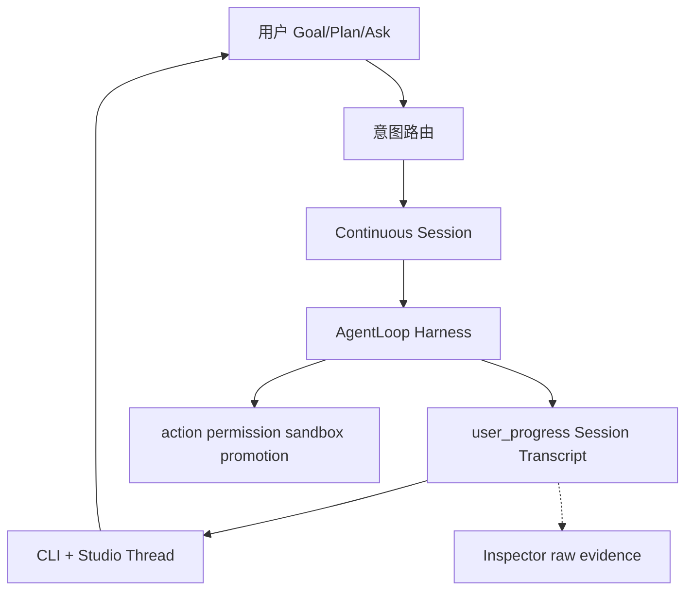

# Asteria 研发总计划

**版本**：1.2.9
**状态**：current — 长期执行入口（2026-06-10 校正）
**生效**：任何智能体（Cursor Auto、CLI agent、未来 Asteria 自研 agent）在改代码、写文档、排优先级前 **必须先读本文**。

---

## 0. 文档权威层级（冲突时按此裁决）

| 优先级 | 文档 | 作用 |
|--------|------|------|
| **1** | [`AGENTS.md`](AGENTS.md) | 仓库根约束、禁止项、ACTIVE_SLICE |
| **2** | **本文（研发总计划）** | 长期路线、Phase、Slice、闸门、Triage |
| **3** | 当前 Slice brief / 可复现 evidence | 当前完成事实与验收依据 |
| **4** | [`docs/zh/当前状态与路线.md`](docs/zh/当前状态与路线.md) | 短事实快照；只引用证据，不创造结论 |
| **4.5** | [`docs/zh/已删除与已替代登记.md`](docs/zh/已删除与已替代登记.md) | **恢复旧机制/引用旧文档前必读**：什么已删、被什么替代、什么是冻结 opt-in |
| **5** | 设计资产（§4 索引） | 怎么做：协议、交互、ADR |
| **6** | [`docs/zh/运行命令.md`](docs/zh/运行命令.md) | CLI 参考，不决定方向 |
| **7** | [`docs/zh/自动路线图.md`](docs/zh/自动路线图.md) | **generated**，机器摘要，不替代本文 |
| **8** | [`docs/zh/archive/`](docs/zh/archive/) | 历史参考，**非当前依据** |
| **9** | [`docs/zh/reports/`](docs/zh/reports/) | 验收证据，时间点快照 |

**规则**：若 archive/旧计划与本文冲突，以本文为准。若实现与本文 Implemented 表冲突，以代码、可复现测试和真实 evidence 为准并 **更新当前状态**。本机 `.asteria`、生成式摘要和状态投影不能单独关闭 Slice。

---

## 1. 产品 North Star（10 年方向）

```text
让用户把真实目标交给 Asteria，并在一条连续会话中获得可见、可验证、可继续的结果。
```

**用户价值**：给定目标 → 模型理解并按需计划 → 使用 Tool/MCP/Skill/Subagent → 展示真实过程与产物变化 → 验证 → 结果/风险/下一步 → 用户在同一 Session 续作。

**已证明或需要真实任务证明的差异化**：

- 本地优先、`.asteria/` 可审计证据链
- candidate workspace + promotion + merge gate
- 多 provider 路由与可恢复的长任务连续性
- scoped delegation 与安全 promotion 仅在真实收益成立时放量

**参考哲学（强制）**：

```text
学机制，不抄形态；学结论，不抄专有实现。
对标 OpenCode / Claude Code / Codex-rs，不闭门造轮子。
连续 Session + 模型工具循环是产品主路径；权限、sandbox、promotion 和不可逆操作
在动作边界由 Runtime 强制执行。
状态机、TaskGraph、固定 Agent 类和三层调度不是愿景，只能在真实任务证明收益后作为实现。
公开机制基线见 docs/zh/plans/S74_REFERENCE_PRODUCT_BASELINE.md。
```

**非目标（任何智能体不得突破）**：

- 无限制 agent 聊天室
- 无策略批准的破坏性 shell / 生产部署 / 远程 push
- 单一 model provider 依赖
- 跳过 schema 验证的持久化对象
- 在 harness 未稳前做复杂 dashboard / gate 主屏
- 复制外部产品专有实现

---

## 2. 已确认执行边界（2026-06-05）

| 维度 | 决策 |
|------|------|
| **MVP 证明** | **编程类 harness 优先**（Goal→Plan→Execute→Verify→续作）；文档/创意复用同 loop，**不作 MVP 硬门槛** |
| **自主程度** | **监督式自主** `reviewed_auto`：可无人值守数小时；budget hard-stop、promotion、发布、不可逆动作 **必须打断** |
| **后端 × 交互** | **后端优先 + 并行**；共享 `user_progress` / `runtime_progress` 契约；用户 **不应天天敲命令** |
| **North Star / 蜂群** | **S7 MVP 闸门通过后** 才启动 Phase 3/4 |
| **开发方法** | **Reference-First Vibe Slice**（§8）；无 brief 不 coding；无 demo 不合并 |

---

## 3. 当前诚实状态（Implemented / Gap）

### 3.1 Implemented（代码+测试真实存在）

- 模型驱动脊梁（立真身）：model→tool→observation 单循环 + evidence 链（旧 `AgentLoopDecision` 六动作 FSM 已于 RA7b 全删，见 ADR-0022）
- Run/Execute/Plan/Review/Accept 主链 + 1200+ tests（`debug_agent` 维持 KEEP_PLACEHOLDER 未接线）
- candidate/promotion/merge gate、protected paths
- Fast Path / Tiered Review / Context Slimming **第一层**
- Subagent readonly fanout；L3 dynamic orchestration、live worker/provider 与 disjoint write Beta opt-in 已实现；新 workspace 默认仍关闭 parallel writes
- `user_progress` schema + 部分生产；`runtime_progress` ADR-0007
- Studio：server/Thread/Composer/Inspector 骨架；intent-router
- 运维/CI：gate、acceptance、evidence-bundle、daily/weekly/roadmap（**应隐藏，不删**）

### 3.2 In Progress（当前快照见 §16，勿在此另存 ACTIVE）

> **单一真源**：当前 ACTIVE_PHASE / ACTIVE_SLICE 只在 §16（及镜像的 `AGENTS.md` §2、`当前状态与路线.md`、`benchmarks/vibe_slices.json`）维护。本节旧表曾自存 "ACTIVE=S74"，与 §16 冲突且违反 §13 单一真源规则——已于 2026-07-09 归一化删除，改为指针。

**当前主线（2026-07-09）**：大重塑「模型驱动专家集群」Part B（并发专家已落 flag-off，前端拉齐进行中）+ Post-S77 商业化就绪收敛（S77 审计 P0/P1 backlog）。逐项进度、验证结论、诚实边界一律见 **§16 / §16.1**——本节不复述。

**已闭合**：S61–S73 编排带；大重塑 Part A（RA1–RA7b，FSM 认知脚手架全删、立真身脊梁为唯一执行路径，见 [ADR-0022](adr/0022-model-driven-spine-landed.md)）；S77–S79 缺口收敛主体（自主环三环落地 flag-off、正确性 gate 锚定真退出码 [ADR-0018](adr/0018-release-gate-grounded-in-real-correctness.md)、假默认档 fail-loud、env 净化 [ADR-0020](adr/0020-scrub-provider-secrets-from-model-shell-env.md)）。

**仍冻结（defer）**：12 Agent 新类、真 cloud VM background、无证据的新编排 Wave、任务批 disjoint-write 调度（task_graph 冻结点）、北极星/swarm。⚠️ **本行原列的「新 workspace 默认 parallel_writes」与「翻任一 ring flag 默认开」已于 2026-07-13/14 经用户 DecisionPoint 解冻并落地**（并发专家默认开·ADR-0023·v1.2.33；自主环四环默认随权限档开·ADR-0017/0027·v1.2.31/1.2.38）——**别再当冻结项**。

长任务目标框架：[`plans/LONG_TASK_GOAL_FRAMEWORK.md`](docs/zh/plans/LONG_TASK_GOAL_FRAMEWORK.md)

已完成并移出本表：user_progress 主路径、Goal/Plan/Ask CLI、CapabilityManifest、S8 续作、Phase 2/3 rolling 稳态 gate、North Star v1（S12）、Run Health（S13）、Beta 路径工程交付（S14 B1–B5）、S15 硬化（Studio 全路径 / wheel smoke / 内测材料）。

**本地卫生**：维护者定期运行 `python scripts/prune_local_artifacts.py --root .`（见 [`文档导航.md`](docs/zh/文档导航.md) §1）。

### 3.3 Designed-not-built / 未放量

- ~~parallel writes 全局默认开启~~ **已放量（2026-07-14·ADR-0023·v1.2.33）**：并发专家 readonly-fanout + disjoint-write 隔离并发写**全局默认开**（随权限档·merge-gate 保护）。**仍未放量的只剩更大范围 sandbox**（OS 级执行沙箱=唯一剩余 P0）
- **OS 级执行沙箱**（进程隔离 / seccomp / 容器 / rlimit）——当前只有 ShellGuard denylist + 目录隔离，解释器一行仍可出网 / 触宿主 FS；schema 宣传的 `container`/`remote_worker` backend 从未产出（S77 P0①，多周项）
- ~~**`.asteria/` 审计完整性**（hash 链 / 签名 / append-only 防篡改）~~ **✅ 首刀已落地（2026-07-13·§16 v1.2.30·ADR-0026·tamper-evident 版）**：append-only hash 链（`storage/audit_chain.py`·JsonlStore 咽喉接入·policy `audit.tamper_evident` 默认关）+ `asteria audit-verify`；真 glm run 19 审计文件全链可验、篡改一条即检出。**剩（deferred）**：链头外部锚定/签名（tamper-**proof** 非重放·需外部 notary）
- 12 Agent 中 Architect/Product/UI/Memory/Release **独立类**（swarm 已删，改模型工具式委派 spawn_subagent）
- Design Intelligence 全类型 `/research` 产品化（MVP 用 **per-slice brief** 代替）
- session↔run 多对多完整映射与真实 cloud VM background（CloudSessionExecutor 仍 stub）

North Star v1 实现细则见 [plans/NORTH_STAR_RFC.md](docs/zh/plans/NORTH_STAR_RFC.md)（RFC 已开，观察窗后编码）。

### 3.4 主要 Gap 根因（为何焦虑）

1. **造轮子**：gate 栈、mission control、规则回复、44 命令暴露  
2. **参考未进执行**：竞品调研在 archive，未绑 Slice  
3. **doc/code 混写**：12 Agent、80% 可用、Studio P0 与非 P0 矛盾  

---

## 4. 设计资产索引（实施依据，非可选）

任何 Slice 实现前，除本文外 **至少读对应行文档**。

| 领域 | 文档 | 约束要点 |
|------|------|----------|
| Harness | [模型主导运行时设计](docs/zh/Asteria%20模型主导运行时设计.md) | 模型主导 loop；Runtime 护栏 |
| 动态上下文 | [大模型循环与动态上下文设计](docs/zh/大模型循环与动态上下文设计.md) | Goal/Plan/Ask；动态上下文；多链路 |
| 用户面 | [用户交互模型](docs/zh/用户交互模型.md) | Goal/Plan/Ask；权限三档；Workspace Envelope |
| 进度协议 | [用户进展与证据协议](docs/zh/用户进展与证据协议.md) | transcript_kind；ui_intent；display_level |
| Studio | [Studio 会话与上下文设计准则](docs/zh/Studio%20会话与上下文设计准则.md) | 会话式非 dashboard；Inspector 分工 |
| Studio 产品 | [Asteria Studio 产品设计](docs/zh/Asteria%20Studio%20产品设计.md) | client/server；禁止规则冒充完成 |
| Studio 工程 | [Studio 交互界面工程设计](docs/zh/Studio%20交互界面工程设计.md) | 前端技术栈/数据流/构建/测试；诚实不变量 |
| 数据 | [数据模型](docs/zh/数据模型.md) | `.asteria/` JSON/JSONL |
| 质量 | [质量与评估](docs/zh/质量与评估.md) | Goal/Artifact/Outcome/Trajectory eval |
| 参考 | [设计情报吸收循环](docs/zh/设计情报吸收循环.md) | research 类型；per-slice 使用 |
| 竞品 | [archive 竞品调研](docs/zh/archive/Asteria%20Studio%20竞品调研与展示设计.md) | OpenCode/CC/Codex 机制摘要 |
| ADR | 0001–0009（见 [文档导航](docs/zh/文档导航.md)） | JSON 先于 SQLite；candidate；Active Next Step；主路径；runtime_progress；Fast Path；失败归因 |

**ADR 强制遵守摘要**：

- **0005**：不为失败尾巴堆规则；Active Next Step  
- **0006**：主路径 Plan→Tool→Verify→Repair/Ask/Stop；gate 不进主屏  
- **0007**：已被 0012 替代；`runtime_progress` 保留给 CLI/诊断，Studio 主会话不再消费其投影
- **0008**：Fast Path 是策略，不是产品边界  
- **0009**：provider vs schema vs tool 分层归因  
- **0010**：开放 Agent Loop；调用/repair 次数是 SLO，不是统一硬停止条件
- **0011**：愿景与实现分离；Reference-First 四道裁决门；确认劣质实现后果断替换或删除
- **0012**：Studio 主会话只消费 Session Transcript；禁止从 runtime progress / summary 猜测会话过程和最终结果
- **0013**：风险护栏在动作边界执行；删除全局 RuntimeReadinessGate，发布 gate、validation、diagnostics 各归其位
- **0014**：默认恢复只由当前 Session Agent Loop 控制；Run 不自动 Review/Debug/Replan，Review 只查证和反馈
- **S74 全系统裁决**：[`plans/S74_SYSTEM_AUDIT_VERDICT.md`](./plans/S74_SYSTEM_AUDIT_VERDICT.md) 是复杂度清算后续批次的唯一执行矩阵

---

## 5. 行业对标映射（Reference-First）

| 产品 | 学什么 | Asteria 映射 | 不做什么 |
|------|--------|--------------|----------|
| **OpenCode** | client/server；plan/build mode；permissions；session | Studio=localhost client；`plan`/`goal` | 重写 runtime 进 server |
| **Claude Code** | 过程节奏；compact/handoff；context 可展开；subagent context | user_progress 事件；Inspector raw | 像素级 UI；无源码处不臆造 |
| **Codex / codex-rs** | AGENTS 层级；sandbox 审批；验证后才 done | tiered review；DecisionPoint | 绑定 OpenAI 单栈 |

**每个 Vibe Slice 前**：写 [`benchmarks/reference_briefs/Sn.md`](benchmarks/reference_briefs/)（半页）：observed_pattern → asteria_file → do_not_copy。

可用（仅服务当前 Slice）：

```bash
python -m asteria_runtime research --type competitive_research --query "..." --root .
python -m asteria_runtime research --type open_source_research --query "..." --root .
```

---

## 6. 代码 Triage 锁（任何智能体不得违反）

### KEEP_CORE — 保留能力契约，不保护劣质实现

必须保留的能力：连续 Session、Agent Loop、Tool Use、真实 evidence、验证、resume、review、
accept、动作权限、candidate/merge/promotion、Studio Thread/Composer/Inspector 和核心测试。
对应文件与实现允许在 S74 裁决后替换、合并或删除，禁止用文件名或历史代码量保护重复责任。

### KEEP_PLACEHOLDER — 未经当前 Slice / DecisionPoint 禁止扩展

parallel writes 全局默认、sandbox 全面放量、MemoryAgent 等 Deferred 角色、legacy `event_logger` fallback.

### HIDE_NOT_DELETE — 从用户 help 隐藏，禁止删除

daily/weekly/roadmap, ops-signal, gate/acceptance/validation/real-model-*, evidence-bundle, capability-report, execute/replan/compact（高级入口）.

### MERGE_OR_TRIM — 仅在明确清理 Slice 中允许

| 对象 | 动作 |
|------|------|
| `runs_command.py` | DELETE |
| `validation` 命令 | 合并进 `validation-run --dry-run` |
| `new` 命令 | 合并进 `plan` 或弃用 |
| CLI legacy 别名 | 减注册，保留主名 |
| Studio 冒充完成 | 删行为 |
| `plan-output-smoke.mjs` | 合并进 chat-fallback |

### DO_NOT_TOUCH — 当前收敛期禁止宽泛重构

`execute_command.py`, `run_command.py`, orchestration gray/DecisionPoint、acceptance/real_model 栈。
禁止无依据宽泛重构；允许按 S74 全系统裁决替换已确认重复、伪成功或错误责任链。

---

## 7. 架构主路径（产品主体）



**MVP 最小代码面**：

```text
goal/plan/chat → continuous session agent loop → user_progress transcript
→ verify/result/continue → Studio Thread/Composer + Inspector
```

其余命令、schema、report 和运维壳按真实消费者与产品收益裁决。隐藏不是永久保留理由；
无真实消费者、重复责任或阻塞默认主路径的实现应合并或删除。

---

## 8. Vibe Slice 序列（唯一短期执行轨道）

**纪律**：一次一会话；Red→最小 diff→Green→5min demo→更新 ACTIVE_SLICE。

| ID | 名称 | 用户/demo | 验收 | 参考 brief |
|----|------|-----------|------|------------|
| **S0** | 执行锁 | AGENTS+本文+triage+vibe_slices | doc contracts pytest | — |
| **S1** | Plan 可见 | status 中文 plan | transcript_kind=plan | S1-plan.md |
| **S2** | Tool 可见 | 工具过程块 | tool_use | S2-tool.md |
| **S3** | Verify 可见 | 验证结论 | verification | S3-verify.md |
| **S4** | Final 可见 | Result/Next step | final + required_kinds | S4-final.md |
| **S1b** | MERGE | — | 删 runs_command 等 | — |
| **S5** | Studio 对齐 | Thread=status | run-detail-smoke | S5-studio.md |
| **S6** | 权限卡 | permission_request UI | interactive-main-path | S6-perm.md |
| **S7** | **MVP 终点** | small_code_change E2E | studio-benchmark ≥0.8 + **real provider** | S7-benchmark.md |
| **S8** | 续作 | 同 session 第二条 goal | 人工 demo | S8-resume.md |

**S9–S16 完整轨道**（签字后仍读 [`benchmarks/vibe_slices.json`](../../benchmarks/vibe_slices.json)）：

| 段 | Slice | 状态 |
| --- | --- | --- |
| 能力 / 稳态 gate | S9–S11 | ✅ 已签字 |
| North Star + Run Health | S12–S13 | ✅ 已签字 |
| Beta 路径 + 内测硬化 | S14–S15 | ✅ 已签字 |
| 稳态 Vibe 迭代 | S16–S17 | ✅ 已签字 |
| 蜂群 + Design Intel + Long Horizon | S18–S40 | ✅ 已签字 |
| **Long Task Intelligence** | **S41–S44** | **✅ 已签字** |

完整 Slice 表：[`benchmarks/vibe_slices.json`](../../benchmarks/vibe_slices.json)

**MVP 终点线（比「80% 可用」诚实）**：

> [`benchmarks/studio_user_tasks.json`](benchmarks/studio_user_tasks.json) 的 `small_code_change` 在 Studio + real provider 下 score ≥ 0.8

**Provider 策略**：S1–S4 用 fake 迭代；S4/S7 各至少 1 次 real。

---

## 9. Phase 路线图（长期）

| Phase | 名称 | 内容 | 闸门 |
|-------|------|------|------|
| **0** | 执行锁 | 本文落地；AGENTS；triage；vibe_slices；reference_briefs 模板 | doc contracts 绿 |
| **1** | 进度协议 | S1–S4 + S1b MERGE | user_progress 覆盖；CLI/Studio 一致；零冒充完成 |
| **2** | Harness+交互 MVP | S5–S7 | **S7 benchmark + real provider** |
| **3** | 续作与稳态 | S8；rolling 编程 case；CLI 用户面定型 | 3 scoped real cases 连续通过 |
| **4** | North Star v1 + **稳态迭代** | S12 North Star；S13 Run Health；S16 节奏 | **✅ 已闭合**（当前 ACTIVE 见 §16，唯一为 S74） |
| **5** | 蜂群 sandbox | disjoint write 灰度；feature flag | sandbox+promotion+merge+rollback 全可见 |
| **6** | Design Intel + Long Horizon | S35–S40；completion · queue · supervised loop · background | **✅ 已闭合** |
| **7** | Beta 用户路径 | S14–S15；安装→Studio→Accept；内测材料 | **✅ 已关闭**（维护态） |
| **8** | Long Task Intelligence | S41–S44 model judge · handoff · remote bg | **✅ 已闭合** |

**版本标签（对外）**：

| 版本 | 对应 Phase | 交付 |
|------|------------|------|
| v0.2-alpha | Phase 2 完成 | 编程 harness + Studio 会话 MVP |
| v0.3-alpha | Phase 5 | sandbox 灰度 |
| v0.4-alpha | Phase 6 | Design Intelligence |
| v0.5-beta | Phase 7 | 用户侧验证 |
| v0.6-alpha | Phase 8 | Long Task Intelligence（model judge · handoff · remote bg） |

---

## 10. 可行性闸门（kill/continue）

### Phase 1 闸门

- Execute 路径 user_progress 主会话事件覆盖 ≥90% 关键步骤  
- CLI status 与 Studio Thread 同一 run phase 一致  
- 零规则冒充完成  

### Phase 2 闸门（MVP）

- S7 studio-benchmark `small_code_change` ≥0.8  
- real provider：doc_update + single_file_bugfix + 1 multi-step 编程 case  
- `reviewed_auto` scoped 任务必须在预算内完成并可恢复；模型调用、repair、耗时作为分任务类型 SLO 和回归证据，不作为统一 Runtime 硬停止条件

### 闸门与 SLO 边界

- 硬闸门只保护权限、sandbox、不可逆操作、预算 hard-stop、context hard-stop 和可证明的无进展循环。
- model/tool calls、repair/replan 次数、耗时和 strong route 使用率用于 Eval、趋势和产品 DecisionPoint。
- 达到资源保险丝时必须保留可恢复 Session/Run，并明确停止原因；不得伪装成任务语义失败。
- 改变自主边界、默认执行路径或停止条件前，必须遵守 ADR-0010 的“调研、分类、eval、退出条件”要求。
- 所有复杂度清算与新增复杂机制必须遵守 ADR-0011；成熟机制是实现参考下限，自研愿景不能保护劣质实现。

### Phase 3+ 闸门

- Phase 2 连续 2 周稳定 → 才开 North Star RFC  
- sandbox 全链路 fake+1 readonly 灰度 → 才开写 parallel  

---

## 11. 智能体强制操作规程

**任何智能体在开始工作前必须**：

1. 读 `AGENTS.md` + 本文 + `ACTIVE_SLICE`  
2. 确认当前 Phase；**禁止**做 Deferred 项（North Star、蜂群、12 Agent 新类）除非 todo 明确  
3. 若改代码：查 §6 Triage；**禁止** DO_NOT_TOUCH 重构  
4. 若新 Slice：先写 `reference_briefs/Sn.md`  
5. 会话结束：跑相关 pytest/smoke；更新 ACTIVE_SLICE；不过闸门不开下一 Slice  

**禁止的 prompt 模式**：

- 「帮我把 Asteria 做好」  
- 「顺便重构 execute/run」  
- 「加一个 maintainer 命令」  
- 无 brief 造新抽象  

**推荐 prompt 模板**：

```text
执行：Vibe Slice S3 | Phase 1 | todo: progress-contract
Triage: KEEP_CORE only | DO_NOT_TOUCH execute/run
Reference: benchmarks/reference_briefs/S3-verify.md 已读
Red: <命令>  Green: <命令>
禁止: North Star, 新命令, gate 主屏, 冒充完成
```

---

## 12. 验证命令（常规）

```powershell
pytest tests/unit/test_documentation_contracts.py -q
python scripts/steady_iteration_check.py --root . --skip-b6
python scripts/steady_iteration_check.py --root .
pytest -q
pytest tests/integration/test_phase3_rolling_gate.py tests/integration/test_phase2_stability_gate.py tests/unit/test_phase2_stability_window.py -q
node studio/scripts/run-detail-smoke.mjs
node studio/scripts/s8-resume-continuation-smoke.mjs
python -m asteria_runtime status --json --root .
```

**real provider（maintainer 复签）**：见 [`当前状态与路线.md`](docs/zh/当前状态与路线.md) §5。

---

## 13. 文档维护规则

- **本文变更**：需更新 version；重大变更写 ADR 或 §changelog  
- **当前状态与路线**：只保留 Implemented 快照 + 指向本文；不写第二套计划  
- **自动路线图**：generated，不 hand-edit  
- **archive**：不加新过程计划；已有加「非当前依据」  
- **新功能**：先判 §6 Triage + §8 是否已有 Slice；无则先改本文再实现  

当前 ACTIVE 信息只允许出现在本文 §16、`AGENTS.md`、`当前状态与路线.md` 与
`benchmarks/vibe_slices.json`；禁止在模板或历史说明中复制另一份 ACTIVE 值。

---

## 15. Changelog

| 版本 | 日期 | 说明 |
|------|------|------|
| 1.0.0 | 2026-06-05 | 综合对话：Harness、参考优先、Triage、Vibe Slice、可行性闸门、后端+Studio 并行、编程 MVP、监督式自主 |
| 1.0.2 | 2026-06-06 | 观察窗完成；Phase 4 / S12 North Star v1 实现启动 |
| 1.0.3 | 2026-06-06 | S16 稳态节奏；Phase 4/7 路线图与 Slice 表对齐；Studio 摩擦收敛启动 |
| 1.1.0 | 2026-06-08 | S61–S73 编排带闭合；ACTIVE 切换到 S74 Post-S73 Beta convergence；修正过期 triage 与未实现清单 |
| 1.1.1 | 2026-06-09 | 明确开放 Agent Loop 与 Eval/SLO 边界；禁止把统一低调用/repair 指标写成 Runtime 硬停止条件 |
| 1.1.2 | 2026-06-09 | 建立 Reference-First Complexity Liquidation；以四道裁决门审计全系统并果断替换或删除劣质实现 |
| 1.1.3 | 2026-06-09 | 用 Session Transcript 单真源替换 Studio 多源 progress/summary narrative 重建 |
| 1.2.0 | 2026-06-09 | 以连续 Session Agent Loop 重写产品架构；状态机、TaskGraph、固定角色降为可替换实现；建立官方竞品机制基线 |
| 1.2.1 | 2026-06-10 | 删除重复项目驾驶舱投影；完成事实只由可复现 evidence 支撑；Beta matrix 默认 evidence-only，live 执行必须显式开启 |
| 1.2.2 | 2026-06-28 | Studio 前端对标三轨闭合：诚实化 #1–#8、设计系统 DS-0…DS-3（raw hex 归零）、对话流 CV-A…CV-C；CV-C（runtime 模型撰写对话式复盘，`core/run_recap.py` + `run_command` append-only）经用户裁决落地内核 |
| 1.2.3 | 2026-06-28 | 立项 Studio IDE-shell 重设计（外壳/布局/视觉 IDE 化，design-review workflow + 用户决策锁定）：全幅 IDE 工作区 + 全局头部、会话栏保持、改动文件进评审面；纯 token/CSS，待实现。方案见 `plans/Studio-IDE-shell-重设计方案.md` |
| 1.2.4 | 2026-06-30 | Studio 收敛重构（用户 friction 驱动，已上 main）：①去冗余+去内部化（双 workspace 合一；机制词换人话/挪 Inspector）②统一 **Settings 面板**（权限默认档持久化 `.asteria/studio/settings.json` + GET/POST 写回；权限词表归一 `studio/src/permissionTiers.ts`；删死字符串 `ask-for-write`）③后端可见化（MCP/Skill 主线程实名化、权限档头部常驻、**风险扣留主线程卡**——运行时 additive 补 `risky_files/risk_level` 并加 `transcript_kind=decision_request` 对齐 ADR-0012，前端按 transcript_kind 识别、channel/event 仅作 legacy fallback）。诚实暂缓 B7 强降卡 / C8 转人工原因 / D9 内建工具徽章（无落盘证据，需运行时补发）。剩余前端切片 C4/D5/D6 |
| 1.2.7 | 2026-07-02 | **全系统「文档声称 vs 代码现实」审计 + P0 安全止血落地**。审计（12 维 34 代理 1235 工具调用，[report](docs/zh/reports/S74-full-system-claims-audit-20260702.md)）确认 22 条 critical/high（0 被推翻）：后端核心比预期真，裂缝聚集在①安全强制②权限语义③前端诚实化④闭环断点/证据可见性。用户拍板 P0→P4 重排（Beta 邀请+re-tag 延后到 P0+P1 后）。**P0 已落地**（[signoff](docs/zh/reports/S74-p0-security-hardening-20260702.md)）：ShellGuard 加保护路径/secret 预扫（`cat .env` 堵）+ allow_network gate（curl/wget/nc/ssh/git-clone 堵）+ 破坏性深扫（find -delete/解释器 rmtree/引号 Remove-Item 堵）；`.asteria/` 纳入 protected_paths 防自提权；runtime_request packaged schema 补 auto_applied + `JsonlStore.rewrite_all` 校验写（修毒化）。验证：unit 863 + integration 198 子集 + doc_contracts 22 绿；红队 31/31 拦截、23/23 合法放行 0 误报。均 additive，未碰 execute_command/run_command/gate 栈 |
| 1.2.8 | 2026-07-02 | **P0 红队复核 + 第二轮 ShellGuard 加固**（承接 1.2.7，[signoff §红队复核追加](docs/zh/reports/S74-p0-security-hardening-20260702.md)）。4 代理对抗红队提 34 条候选绕过（多在真实 shell/文件系统验证生效+旧守卫放行）。按「修 correctness bug + 补廉价覆盖 + 不打地鼠」处置 8 项：cmd.exe caret 折平、目录规则大小写/尾点归一（`.Asteria/`·`.asteria./`）、path-qualified/后缀命令名还原（`/bin/rm`·`rm.exe`·`./rm`）、wrapper payload 二次扫描（`cmd /c "del x"`）、网络 LOLBin（certutil/bitsadmin/plink…）+ 深层正则（`/dev/tcp`、Net.WebClient、fs.*Sync）、破坏动词补全（unlink/clear-content/set-content/os.truncate）、重定向无空格漏洞。复核：34 中 28 拦、23/23 合法 0 误报、unit 863（security 82）绿。**诚实定性**：shell 命令 denylist 是减速带非安全边界，解释器任意代码 payload（反射/拼接/urllib/fetch）+ 无处不在覆盖命令（cp/mv）不可静态收住——**唯一彻底解是 sandbox（KEEP_PLACEHOLDER）；external Beta 放量前 shell 应收窄/关闭或跑受限容器,列为放量 DecisionPoint 前置风险** |
| 1.2.9 | 2026-07-02 | **P1 信任修复落地**（承接审计裂缝②权限承诺是标签 + ③前端诚实化，[signoff](docs/zh/reports/S74-p1-trust-repair-20260702.md)）。先派 9 代理验证每条发现的当前 file:line + 最小修复（均 present/high/无碰 DO_NOT_TOUCH），再逐条实现。7 项：**A** 删死选项 `approve_similar_for_session` + 非-approve_once 不再记假 `execution_approval_applied`；**B** MCP/Skill 的 `ask`（no-op，`requires_decision` 零消费者）**诚实降级**为 `allow`（契约把关、风险仍记录），文档同步降级、真交互式门列后续；**C** 删 chat `looksLikeTask` 关键词短路（后端已定意图）、`appendModelNotice` 由 no-op 改为对本地模板答案追加「非模型生成」披露（含流式分支，措辞避兜底禁词）；**D1** Inspector「AI Debug Agent」→「Run Diagnostics」（纯客户端关键词模板，非 AI）；**D2** 删 `TurnFinal` 无内容 final 伪造的「Done.」；**D3** `conclusion→final` 收窄到 `phase==result`（修 plan 开场步被当结论）；**D4** 离线告警补全局默认路由判据（修 `AGENT_MODEL_PROVIDER` 真+`cheap=fake` 混配的假阴性）。验证：unit **894** + ruff clean；studio tsc/vite build + smoke **5/5**。已本地提交 `b921028`（未推） |
| 1.2.10 | 2026-07-02 | **P2 核心闭环断点落地**（承接审计裂缝④ 闭环断点+能力不可见，[signoff](docs/zh/reports/S74-p2-closure-breakpoints-20260702.md)）。先派 6 代理把每项钉到当前代码（pull 到 `498d31c` + P1 `b921028` 后）复核，纠正审计两处夸大。**4 个代码修复**（均非 DO_NOT_TOUCH/非冻结）：**P2-1** skill/MCP 观察回灌——`tool_execution_gateway._run_mcp_call/_run_skill_call` 补发本地工具同款 `_record_harness_observation`（丢失在**跨轮 reload 边界**非同轮），跨轮测试锁定；**P2-4** 4 工具被过期 `_TOOL_KINDS` 硬拒——补 `find_files/diff_workspace/todo_read/todo_write→read` + planner `_allowed_tools` 放行；**P2-5** route_fallback 只在内存——`model_call_logger._base_record` 读 `metadata['route_fallback']` 落 `model_calls.jsonl` + 两份真源 schema 补可选字段；**P2-6** chat 单轮失忆——`ChatCommand` 加可选有界 history（近6轮/截800/仅 user·assistant），studio 新增 `recentChatHistoryMessages` 从 `events.jsonl` 注入，复用现有持久层、不加 UI（属既有能力闭环非冻结新功能）。**2 个撞 DO_NOT_TOUCH → 诚实降级**：**P2-2** /run 不再内联 review（自查证实 `run_command`/`run_smoke` 均不调、只读 eval_report）——`运行命令.md` 改正 + `真实模型验收.md` 通过标准标注「仅 review 已跑时适用」，真接回 review 列 **DecisionPoint**；**P2-3** `max_repair_attempts_total` 未接线（`record_repair_attempt` 零生产调用者；纠正审计：`_per_task` 经 `run_command` 派生 cycle 上限非全死）——`质量与评估.md` 诚实标注，真 gate 须解锁 `execute_command.py` DO_NOT_TOUCH 例外列 **DecisionPoint**。验证：unit **900** + ruff clean + doc_contracts 22；studio tsc/vite build + smoke **7/7**。未触碰 execute/run/gate/acceptance·real_model 栈。已本地提交 `36ac4c1` |
| 1.2.11 | 2026-07-02 | **P3 桌面赌注（诚实化/bugfix 批）落地**（承接审计裂缝④，[signoff](docs/zh/reports/S74-p3-desktop-stakes-20260702.md)）。先派 6 代理钉当前代码 + **严格分类** honesty_fix/bugfix/new_feature + 冻结张力。**冻结内 4 项直接做**（纯 studio + 1 文档、零后端代码、零 DO_NOT_TOUCH）：**P3-3** 真流式去占位（`LiveStream` 删非-chat 相位占位句遮蔽，直渲真实模型增量，数据本在手）；**P3-6** 事件 id 去重（删两处 live-tail 把命名空间 id 覆写回裸 `upe-NNNN` → 修跨 run 碰撞丢事件 + `mergeSessionAndRuntimeEvents` 改按 id 去重含 legacy 后缀兜底 → 修 tool_start/final_answer 双份）；**P3-5 parts1-2** Inspector 渲染已组装却零显示的 `mcp/skill_invocations`（闭 `inspector_raw_evidence_source` 承诺）+ 去 `files.slice(0,6)` 静默截断（显全量+计数）；**P3-2 文档** `产品设计.md` 把声称的 Sidebar Search/Projects/Workspaces 标「规划中未实现」。验证：studio tsc/vite build + doc_contracts 22 + 事件/流式 smoke 6/6。**4 个 new_feature 项经用户绿灯（「合理的常见功能都要加上」）另批实现**：P3-1 Stop/中断、P3-2 会话搜索框、P3-4 token 用量面板（后端无 USD、仅 token 维度）、P3-5 part3 capability_decisions 面板 |
| 1.2.12 | 2026-07-02 | **P3 桌面赌注（new_feature 批）落地**（用户绿灯「合理的常见功能都要加上」，[signoff §第二批](docs/zh/reports/S74-p3-desktop-stakes-20260702.md)）。4 项均实现，纯 studio、零后端 Python、零 DO_NOT_TOUCH：**P3-1 Stop/中断**——`startRuntimeJob` 存 child/pid + 会话级 `POST /sessions/:id/stop`（`stopSessionJobs` 置 cancelled + 清 follow_up 防重启，Windows `taskkill /T /F` 树杀、POSIX SIGTERM，close 对 cancelled 报诚实「Stopped by user」）+ `api.stopSession`/`useSessionEvents.stopRun` + Composer `isRunning` 时 Send→红色 Stop；**P3-2 会话搜索框**——`searchSessions` 对 title+goal_preview 大小写不敏感包含匹配 + SessionList 受控 input（数据已全量前端、无后端）；**P3-4 token 用量面板**——`RunUsagePanel` 渲染 cost_report 的 model/tool_calls + est_input/output_tokens + strong/cheap/repairs（**仅 token 维度，后端无 USD/单价，标题 Run usage 不叫 cost，无 usage 降级 unknown**）；**P3-5 part3**——server 加读 capability_decisions.jsonl（有写无读）+ Inspector Capability decisions 块。验证：studio tsc/vite build + smoke 7/7 + Stop 路由 live 冒烟。边界：Stop 硬杀 e2e 树杀需真实长 run 端到端验证（已按 taskkill/T/F 实现+风险标注）；货币 USD 费用需引入单价数据、属另立能力未做 |
| 1.2.13 | 2026-07-02 | **P4 债务/诚实化（本批）落地**（用户选「只做可直接改的债务/诚实降级」，Beta/re-tag 里程碑另拍，[signoff](docs/zh/reports/S74-p4-debt-honesty-20260702.md)）。先派 6 代理钉当前代码分类，**纠正审计多处数字**（mypy 实 83 非 129、61% 锁 real_model 栈；schema 漂移 17 非 18 且测试守门；**JsonlStore fail-open 其实已 fail-closed**、审计过时）。4 项 code_fix/honesty_doc（均非 DO_NOT_TOUCH）：**P4-a init 幂等**——`_write_json` 加 preserved 守卫（已存在+非force→保留），`--force` 从 no-op 变真生效 + cli help 对齐（+2 测试）；**P4-b 文档超卖**——fork 标未实现、compaction「只测量+建议+写快照非自动缩减 live context」+ 两 compaction 旗标标未消费、`--model-strategy local` help 降级为占位、`max_total_minutes` 标声明性未强制（5 文档+cli）；**P4-c session_id 恒 null**——logger `session_id or run_id`（session==run，消 null 不撒谎，+1 测试）；**P4-f 死 MCP 炸 run**——`from_configs` 包 try/except OSError 跳过 spawn 失败 server → 降级无工具令 架构设计.md:201 声称成真（+1 测试）。验证：unit **902** + init 集成 14 + ruff + doc_contracts 22 + cli 绿。**DecisionPoint/defer**：schema 双向漂移同步（风险大需逐 producer 核）、real_model 栈 mypy 51、真写 Studio 会话 id 全链路、P4-e memory 自断言/run_command auto-pass/review 计分（均撞 DO_NOT_TOUCH）；**纠错**：recon 报 validation_run_command:781/789 类型 bug 经复核为误报（集合子集、逻辑正确未改）。里程碑 Track A Beta 邀请 + re-tag v0.2.0a2 门槛已满足、等用户拍板 |
| v0.2.0a2 | 2026-07-02 | **re-tag 发布 capstone**（`c8d3a61`，tag `v0.2.0a2` 已推）：版本 0.2.0a1→0.2.0a2 + CHANGELOG 蒸馏 P0-P4；外部 Beta 邀请仍待用户操作（前置：shell 收窄/sandbox）。 |
| 1.2.14 | 2026-07-02 | **P5 用户友好度（post-release usability）落地**（用户「根据主流经验按建议执行」+「看下一步更好用」→ 派 6 代理接地气侦察首跑/provider/错误恢复/Studio 可发现性/CLI/验证信任，全非 DO_NOT_TOUCH，4 提交已推）。洞见：系统本就算好引导，只是没在首跑/报错/完成的时刻端到用户面前。**CLI**（`6255aa1`）：main() 顶层异常护栏(traceback→人话+下一步，ASTERIA_DEBUG=1 留栈) + init 下一步引导 + 裸/错命令走 curated help + model-check 进分组。**Studio**（`3e480da`）：修报错卡字面「???????」标题 + friendlyErrorText 扩 5 类(401/403·429·model-not-found·ECONNREFUSED) + **完成≠验证诚实提示**(runVerificationHint 主线程投影 review_status=unknown，P2-2 的 UX 层解法、不碰 run_command) + 会话搜索/权限提示放出到默认视图。**provider 可用化**（`2266aed`）：overview() 增取 doctor + Settings 显每 tier 路由就绪(缺哪个 env)消除首配鸡生蛋。**文档**（`9cd4b57`）：README 最小 provider 配方 + 零 key 试跑 + glm-5→glm-4.7 + doctor reachability 超卖修正 + studio 特性表诚实化。验证：unit **904** + ruff + doc_contracts 22 + studio tsc/build/smoke + CLI live 冒烟。诚实边界：`.env.example` 撞 `.gitignore` 的 `.env.*`(保护路径)未提交；status 空态友好化与既有空态路径纠缠已回退。未做(低优先后续)：token 面板可发现性、doctor 文本 next_actions、diff/回退主线程入口、cheap=fake 混配告警可见化 |
| 1.2.15 | 2026-07-02 | **Beta 安全前置（access profile）+ review/repair 门控诚实化**（用户「2 条都可以做，但依据调研，非主流做法可弃、文档不合理可改」→ 3 路侦察：2 内部 recon + 1 外部主流调研 Codex/Claude Code/OpenCode/Aider，[signoff](docs/zh/reports/S75-beta-safety-gate-and-verify-honesty-20260702.md)）。**① 命名受限访问档（做，主流+North Star 前置，全锁外）**：新建 `core/access_profile.py` 定义 `beta_safe`（硬关 shell+network+破坏性/安装/push/deploy/secret 读，档定义在代码为单一真源，避开已占用的 `execution_profile`/`permission_mode` 名）；`load_policy_config` 唯一装载入口解析 `active_access_profile` 覆盖 permissions → 全命令生效、**零触 run/execute/gate**；两份 schema 加可选 `active_access_profile`/`access_profiles`；`policies.default.json` 加开关（默认 null=行为不变）；`doctor` 顶部 `Access profile:` 行 + 结构化 `access_profile` 字段供 operator 核实关停态（doc_contracts 示例双份同步含 gate 内嵌 doctor stage）。红队测试证明 beta_safe 下 ShellGuard 真拒 `ls`/`python`/`curl`；CLI live 冒烟 `none(shell on)`→pin→`beta_safe(shell off,network off)`。**② repair 预算 ledger（弃，调研判定过度设计）**：主流（Codex `max turns`、Claude 连续/累计 block 计数）只用简单计数兜底，Codex 连 `on-failure` 智能策略都弃用——`record_repair_attempt`/`max_repair_attempts_total` **有意不接线**（现有派生 cycle 上限+no-progress 已是主流形态），budget.py 注释+`质量与评估.md` 措辞由「待 DecisionPoint 补」改「有意不采用过度设计」。**② run-then-review 包装命令（弃，非主流第二 run 路径）**。**② /run 内联 review（DecisionPoint，建议缓）**：`运行命令.md` 流程图删误导的内联 `-> review`、改为显式 `review`/`accept` 步 + 接 Studio `runVerificationHint`；诚实指出 Claude Code 也用 hook 而非硬编核心循环触发验证，故当前显式验证+提示已是主流形态，真内联须解锁 `run_command.py`（DO_NOT_TOUCH）列 DecisionPoint、建议缓做。验证：unit **907** + ruff clean + doc_contracts 22 + CLI live 冒烟。未触碰 execute/run/gate/acceptance·real_model 栈 |
| 1.2.6 | 2026-06-30 | **Track D 诚实化裁决落地**（用户逐项拍板，承接 S74-doc-impl-mismatch-audit §3/§4）+ Studio 收敛③ **D6** 热续作标注（修 resume 误判为 hold 卡）。D-2：ask/chat 默认权限改只读 `ask`（对齐文档 Ask=只读 + plan 默认，`cli.py`）。D-3：保留 cheap=fake 离线默认，但 `factory` 在「离线 tier 与真 provider 混用」时发运行时 `warnings.warn`，消除静默 canned 输出（+3 测试，2 个既有混配测试如实告警）。C-6：确认 `max_replans` base 默认 2 / `autonomous_long_task` profile 覆盖 3 为有意分层，真源 `policies.default.json`，zh 文档加层级标注。P0-3：real_model smoke 把瞬时失败救活的 run 记为 `recovered`（artifact 仍真实校验，非 plain pass；schema 双副本同步加 `recovered`）。P0-4：real_model gate 把仅靠 smoke model_calls reconcile 过的 model-check 标 `degraded`。均 additive，未削弱守卫/未碰 `execute_command`。验证：831 unit + ruff clean；前端 D6 narrative 真源 18/18 + tsc/vite 绿 |
| 1.2.16 | 2026-07-08 | **ADR-0017 goal-replan 环终态漏洞修复**（真栈跑 `run-20260708-0002` 观察到已完成的 run 停在 `status="running"`/`ended_at=None`，会话列表/CLI `status`/gate 误报"运行中"）。根因：replan 用 `discarded` 状态废弃被取代的失败任务（`replan_command._supersede_task`→task_board `discarded`），而 `RunStateFinalizer.finalize` 的完成判据是 `all(task.status=="done")`——`discarded` 任务永远不等于 `done`，于是落 `else` 分支盖 `running` 且不写 `ended_at`。修复（仅 `core/run_state_finalizer.py`，**非 DO_NOT_TOUCH**，未碰 execute/run/gate 栈）：`discarded` 视为已解决不阻塞完成——当所有非-discarded 任务皆 `done` **且至少一个真 `done`**（全 discarded 不误判完成）→ `completed`+`ended_at`。真源即观察到的 `[task-0001 discarded, task-0002 done]` 现落终态；`[…discarded, task-0004 blocked]` 仍正确判 `blocked`。验证：finalizer +2 回归、run/replan/finalizer/supervised/health-gate 相关套件全绿、full unit+integration **1205 passed**（仅 3 个既有 `test_runtime_profiles` 失败与本改无关、clean HEAD 即红）+ ruff + mypy clean |
| 1.2.17 | 2026-07-09 | **Studio 交互缺陷批修（M4/M7/L8/L9·真栈会话观察，纯前端+BFF·未碰运行时/DO_NOT_TOUCH）**。**M4 权限卡刷新变死按钮**：`handlePermission` allow/deny 只追加"Approved/Canceled"旁白、从不改原 `permission_request`(仍 `waiting_user`)，而 job 已从 `pendingJobs` 删除→刷新后前端(ConversationTurn/LiveStream)据 `status==="waiting_user"` 重渲**可点但点了必失败**的 allow/deny 卡("job not found")。修：resolve 事件带 `resolved_job_id` 持久标记，`readSessionEvents`(线程 feed 唯一读点·非 Inspector 原始证据)按此过滤掉已解决的 job 权限卡——旁白已叙述结果、原事件留 events.jsonl 存档；未解决的卡原样保留可操作。**M7 决策早于任何工具→死角**：`useRunEvidence` 的 runDetail 自动打开只认 `tool_end/final_answer/error`→plan 期决策(无前置工具)时 runDetail 恒 null，RuntimeSnapshot 的可操作 DecisionCard(读 `runDetail.decision_requests`)永不渲染。**L9 陈旧 run 决策错配**：runDetail 跟到最新 tool_end 的 run，但 pending 决策可能在**另一个** run→DecisionCard 用错 `runDetail.run_id` resolve→服务端 `decision.status!=="pending"` 拒("decision is not pending")。M7+L9 同因同修：抽出纯函数 `pickRunTriggerEvent`——在 pending 决策(job-less `waiting_user` 的 `decision_request/ask`·带 run_id)与最新进度事件间**取流中更靠后者**驱动 runDetail，故 runDetail 恒指向"正等你决定"的 run；决策解决后新工具事件更靠后→自动恢复常规跟踪(不被 append-only 的旧决策事件钉死)。**L8 事件排序混轴**：`mergeEventLists` 的 `eventTimeValue(a)-eventTimeValue(b)` 对无 `created_at` 的事件回退到 `sequence` 小整数(~5)、与 ms-epoch(~1.7e12)**同轴相减**→无时间戳事件瞬移到线程最前；且时间比对与 index 兜底混用**非传递**(无戳事件 index 夹在两个时序相反的有戳事件间→排序环·连有戳事件都错序)。修：预先给每事件算数值 time-key(有戳用戳·无戳**carry-forward** 继承上一个戳·永不落 epoch 原点)，按 `(key, 插入序)` 排序=一致全序。验证(全部打真源)：`mergeEventLists` L8 有序/传递/幂等 tsx 测；`pickRunTriggerEvent` M7/L9 6 例(决策独驱/最新工具胜/决策胜陈旧 run/解决后恢复/job 权限非决策/无触发)；M4 真起 server 直写 events.jsonl 后 GET /events 证已解决卡被滤、pending 卡留存；chat-lifecycle smoke 回归绿；tsc `--noEmit` 净。**诚实边界**：`session-main-path-contract` 有 1 条既有红(断言 `RuntimeSnapshot` 含英文 `"Review changes"`·实际早本地化为"查看改动"·该文件本改未触·clean HEAD 即红)与本批无关 |
| 1.2.18 | 2026-07-09 | **ADR-0024 #1 快照按 task 刷新（B）+ 自主环 A 真栈验证（发现 goal-replan 收敛 bug）**。**B（已提交 `a00185c`）**：`ContextLoader.workspace_files()` 抽公开独立重扫，`ExecuteCommand._execute_task` 每 task 起手用 `context.root` 重扫覆盖 `runtime_context["workspace_files"]`（该 dict 已 per-task 不污染共享 context·best-effort `except OSError`）→ 多 task run 后续 task 看得见前一 task 刚写的文件，不再盲重建（用户观察"重复写"根因最后一块）。+1 单测·context/execute/run/replan 64 绿·mypy/ruff 净。**A（真栈验证·throwaway workspace·三 flag `auto_repair`/`auto_replan`/`auto_replan_goal` 全 armed·glm-5+minimax）**：① `ring_val_a` happy-path——模型首过写对，独立 pytest **4 passed**，armed 三环不破坏真栈 happy-path（比首次点火多的数据点：点火时三环 OFF）；② `ring_val_b` 强制首验失败——预置确定性 buggy 基线（空串返 0 而非 raise），**goal-level replan 环（ADR-0017）真触发**：task-0001 blocked→自动取代 0002→0003→0004，前三 discarded（正是 1.2.16 finalizer 修的 discarded 终态路径）。**⚠️ A 抓到真收敛 bug（fixture 测漏）。⚠️ 初判已更正**：lineage **是**正确追踪的（`task["replan"].source_task_id` 链 0002←0001←…·count=3；初判查错字段 `metadata`），"lineage 不累积"作废。真根因=**完成契约把已正确的活误判 blocked**→无谓 replan：(a) repair 任务 `_expected_changed_files` 继承原任务 contract_check 的 `expected_changed_files`（含 `test_duration.py` 测试规格文件）→契约要求改测试文件，而模型正确地不改→pytest **已 passed** 仍 blocked（task-0002：`Command passed(0)` 却 violation `expected changed files were not modified: test_duration.py,duration.py`）；(b) task-0003 `contract_ok=True`·violations `[]`·verifs 全 passed 却仍 blocked（应 done）→再触发 replan（spine blocked-vs-done 判定待代码级追）。lineage cap 会兜底，真问题在上游：代码已对时根本不该 replan；且可能过早 kill run。**结论=完成契约在真栈把绿测的活误判 blocked→无谓 goal-replan（偏离主流"tests pass→done"）→翻默认前必修**。修复方向（未做·**先做主流对齐调研再动手**·用户显式 gate）：真实验证通过=最强完成证据，不应被 expected_changed_files 文件级代理否决；repair 任务 expected_changed_files 绝不含测试/规格文件；追 contract_ok=True 却 blocked 的 spine bug。触 run_command/ReplanCommand/execute_command 完成判定（解冻内·RA7b-4 正确性 gate 外科手术不整删）。详见记忆 `ring-realstack-validation-A` |
| 1.2.19 | 2026-07-09 | **自主环收敛 bug 修复（承 1.2.18 的 A 发现·先主流对齐调研再动手·用户 gate）**。**主流调研（36 源·Claude Code/Codex-rs/Aider/OpenCode/Cursor+ReAct/LangGraph/Vercel/OpenAI-Agents·读源码/文档·高可信）**：主流 **done=模型停止发 tool_call（自然 end_turn）**，harness 从不用 test 结果算 done（tests-pass 是模型读的证据，非 harness 停机条件）；循环兜底=**单个扁平计数**，撞顶=**交还人类**，不自动升级；**无一家用 replan-lineage 树/per-chain cap**——我们的血脉树比所有主流都更精细（是"长时无人值守可审计"差异化，保留，但别让它盖过"验证过=done"）。**真根因（经 task-0003 evidence 定位·更正 1.2.18 初判）**：`_run_model_driven_task` 完成判定里 **`budget_exhausted` 分支排在 `contract.ok` 之前**——任务在撞迭代保险丝的同一轮已满足契约（`contract_ok=True`·verif 2/2·changed=[duration.py]），却被 `max_rounds` 盖成 `blocked`→喂 goal-replan 空转。**修（execute_command·解冻内·不整删 RA7b-4 gate）**：① **`contract.ok→done` 判定移到 `budget_exhausted` 之前**——已验证完成的活撞保险丝也判 `done`（主流：模型干完就是 done，扁平计数只兜底不丢活）；② repair 任务（带 `replan` 血脉链）接 `allow_verified_noop=True`（该机制早有且有单测·只是从没接线到 spine）——真实验证通过时不被 `changed_files` 假阴性（检测漏抓真实编辑）否决，fresh 任务仍严格 gate 防空跑假完成。**真栈复验（ring_val_c·同一 buggy 基线·三 flag armed·glm-5+minimax）**：**task-0001 一轮 `done`·0 discarded·run `completed`·独立 pytest 4/4**（修前 0001→0002→0003→0004 空转）。+1 回归测（never-done fake 撞保险丝仍 `done`）·全量 **1206 passed**（仅 3 既有 `runtime_profiles` 无关红）·mypy/ruff 净。详见记忆 `ring-realstack-validation-A` |
| 1.2.20 | 2026-07-09 | **反测试篡改（窄 planner 修·用户选定）+ 撤 allow_verified_noop 假完成洞（连带真栈发现）**。**背景**：真栈跑不可满足测试（ring_val_e），模型**删测试断言作弊**使验证过、"done"骗人——根因 planner 把被验证的 `test_X.py` 放进实现任务的 `write_scope`/`expected_changed_files`（从 goal 文本天真带入）。**主流调研**：Claude Code/Cursor 等**不硬 guard 测试篡改**，靠 write-scope+人审+模型对齐——故取窄修不过度工程。**修①反篡改（`PlanCommand._protect_verification_specs`）**：实现任务从 `write_scope`+`expected_changed_files` 剥掉 **plan 时已存在**的测试文件（`_looks_like_test_path`：`test_*.py`/`*_test.py`/`conftest.py`/`tests|test/` 目录）——已存在=规格→只读；尚不存在=待写→保留（合法新建测试不受影响·ADR-0016 §2 确定性边界）。repair 任务经继承已归一 `expected_changed_files` 自动受益。**修②撤 allow_verified_noop**：窄修上线后 ring_val_f 仍 false-complete——1.2.19 给 repair 任务接的 `allow_verified_noop=True` 让它跑"别的能过的命令"（verif 3/3 非真验收）+`changed=[]`→判 done 而真 pytest 仍 fail。撤掉（保留 `budget_exhausted` 重排即够收敛）；阻断 no-op 完成安全且主流对齐（主流从不在 no-op 验证上判完成）。**真栈复验**：ring_val_f/h `write_scope=['mystery.py']`·测试断言恒 3 改不动·`_ContradictoryInt` 花招被 `type(r) is int` 挡→pytest 真 fail·**不再 false-complete**；ring_val_g（合法 buggy 基线）仍收敛 `done`+独立 pytest 4/4。+3 单测（`_looks_like_test_path`/`_protect_verification_specs`/never-done fake）·全量 **1209 passed**·mypy/ruff 净。**教训入记忆**：每个"放宽完成判定"的便利改必须用不可满足任务真栈验假完成口子。详见记忆 `model-games-tests-write-scope-gap` |
| 1.2.21 | 2026-07-09 | **收口 changed_files 检测假阴性（1.2.20 撤 allow_verified_noop 的底层根因）+ 补齐删除能力**。**背景**：撤掉 `allow_verified_noop` 后，若"真实改动没被可靠检测"这条底层假阴性还在，合法编辑仍会被误判 blocked——这正是当初 verified_noop 诱人的原因。真栈复验（ring_val_i·delete-only 任务·三 flag armed·glm-5+minimax）**双发现**：①`_artifact_refs`（`agent_harness.py`）只读 `write_file→path` 与 `data.changed_files`，**漏掉 `apply_patch` 的 `deleted_files`**——删文件类任务 `changed=[]`→契约「required changed artifact was not produced」→**假 blocked**（一个删除也是改动）；②模型**根本没删**：model-facing 工具面（`agent_tool_surface.py`）**无 delete 原语**，删除只能靠 `apply_patch` 的 `+++ /dev/null` diff，而 `edit_file` 契约从没告诉模型这点→模型只探查不动手（主流 Cursor 有 `delete_file`·Claude Code/Codex 用 shell `rm`）。**修①检测源头**（`_artifact_refs` 把 `deleted_files` 也计入 artifact_refs；契约纯逻辑无 fs 存在性校验，删除路径合法满足 changed/expected）；**修②不造新轮子**（enrich `edit_file` 契约+safety_notes：告知可用 `+++ /dev/null` patch 删除·有备份可逆·无需 shell rm）。**真栈复验（ring_val_j·同 fixture）**：模型据 enriched 契约成功删除·`task-0001 status=done·contract_ok=True·changed=['legacy_helper.py']·expected=['legacy_helper.py']·violations=[]`·独立 pytest 1 passed（修前 ring_val_i 模型只探查·文件仍在·假 blocked）。**无新假完成口子**：删除仍须是 expected 的正确改动+验证过（表型任务 0002 因真 no-op 仍如实 blocked）。+2 单测（apply_patch 删除/改+删混合 →artifact_refs）·全量 **1211 passed**（仅 3 既有 `runtime_profiles` 无关红）·mypy/ruff 净。**连带真栈发现（记为后续 slice·非本收口）**：planner 把「删一个文件」**过度分解成 5 任务**（0001 做真活·0002-0005 空 write_scope 幻影任务）→幻影任务如实 blocked→goal-replan→如实升级人审 DecisionPoint（收敛环 1.2.19 行为正确·未空转）；属 planner 粒度质量问题非检测问题。详见记忆 `ring-realstack-validation-A` |
| 1.2.22 | 2026-07-09 | **S77 P0③「假默认档 fail-loud」定向诚实化落地（升告警可见度·无争议第一批的收尾项）**。**背景（承 S77 审计 §16.1 P0③ + 审计报告 line 125）**：LICENSE/wheel/S69-docs 已于无争议第一批完成；「假默认档」经核实真实零配置默认是 minimax（真）+ 既有 `_warn_if_tier_silently_offline`（D-3 决策：留 fake 默认但告警），硬 fail 会砸 3 个离线测试并反转 D-3，故降为定向项「升告警可见度 + 校正 default_routes 显示表」。**核实现状**：`default_routes` 显示表**已诚实**（`cheap` 默认 `model_name=fake-offline`·`base_url="offline canned placeholder (fabricated output — not a real model)"`）·`route_diagnostics.RouteDiagnostic.returns_canned_output` 已有·`doctor` 已如实渲染「returns CANNED placeholder output」。**唯一真缺口**：交互式 `run`/`resume` 路径**无醒目用户面告警**——零配置 operator 跑 `asteria run` 混配（真 provider + 某 tier fake）时只有 `factory.py` 的 `warnings.warn`（Python 警告易被过滤/去重/淹没在 run 输出里），静默拿伪造输出。**修（不碰 DO_NOT_TOUCH `run_command.py`，落在 `cli.py` 用户面入口）**：① `route_diagnostics.silently_canned_tiers()` 单一诚实源（镜像 gate-status `silently_offline`/factory 语义：`0<canned<全部` 才是混配 footgun·全离线=有意气隙→静默·全真→静默）；② `cli.py._warn_if_model_tiers_canned()` 在 run/goal/resume 分发前打**ASCII-only 醒目 stderr 横幅**（`!! MODEL CONFIG WARNING`·列出 canned tier·给修法·走 stderr 不脏 `--json` stdout）。**Windows 硬坑现修**：横幅原用 `⚠`(U+26A0)+box-drawing→GBK 控制台重定向时 `sys.stderr` errors='strict' 会 `UnicodeEncodeError` **崩掉它本要警告的那次 run**→改纯 ASCII + `try/except (UnicodeEncodeError,OSError)` 兜底。**真栈 e2e 证**：混配 `AGENT_MODEL_PROVIDER=minimax`+`AGENT_MODEL_CHEAP_PROVIDER=fake` 跑真 `asteria run`→横幅在**最顶端**先于旧低可见 `warnings.warn` 打出；全真配置静默。既有 `warnings.warn` + 3 耦合测试**零改动**（纯加可见性·向后兼容）。+4 单测（`silently_canned_tiers` 混配/全局默认混配/全离线/全真）·全量绿·mypy/ruff 净 |
| 1.2.5 | 2026-06-30 | Studio 收敛③ C4：合并时刻去内部化（`Candidate promoted`/`Promotion started`/`Merge gate evaluated` 等机制词标题经新建共享 `studio/src/titleProjection.ts` 投影成人话，并接到主线程 NarrativeStep 标题路径——纯前端，无运行时/测试改动）+ Inspector `isolate→verify→merge` 三段 lineage（buildPromotionPreview 按 `task_id` 串 export/promotion，dry-run 为 batch 级 verify 如实标注「(batch)」，无法可靠串联则回落 flat items）。剩余 D5 上下文压缩标记 / D6 热续作标注 |
| 1.2.23 | 2026-07-09 | **文档台账归一化（全系统实现度复核后收口）**：§3.2 删除自存的过时 "ACTIVE=S74"（2026-06-08 快照）改为指针到 §16 单一真源；§3.1 更正 `AgentLoopDecision` 六动作→模型驱动脊梁（RA7b 已全删）；§3.3 补 designed-not-built 两大真缺口（OS 级执行沙箱 / `.asteria` 审计完整性）。ACTIVE_SLICE 四源归一到**强制真源 S77**（`benchmarks/vibe_slices.json` + `当前状态与路线.md` + `AGENTS.md` 本已 S77）：改 §16 outlier "S79" 与 §3.2 stale "S74" 对齐 S77，S78/S79 保留为已落地子切片（消除 S74/S77/S79 三值分歧·满足 §13 单一真源·`test_active_slice_sources_agree` 绿）。[ADR-0016](adr/0016-model-driven-cognition-conformance.md) 漂移表加合规状态更新（三处漂移经 ADR-0022 全消解·表转历史记录）；[ADR-0017](adr/0017-goal-level-replan-ring-within-goal.md) 状态注明 Proposed-但代码已落地 flag-off。触发=全系统实现度全量复核（8 子系统对抗式核实 + Studio 前端工程质量专审）。纯文档，无代码/测试改动。 |
| 1.2.24 | 2026-07-13 | **大重塑 Part B — B2 护栏诚实化 + 上下文压缩（诚实重定范围 + 立真身默认路径真栈复验）**。**测绘先行结论**：计划 Part B 的 B2 字面目标写于 RA7b 收官前、**已大部过时**——① `execution_action_preparer._ensure_planned_verification`（伪 DoD 自动注入）随整个模块在 RA7b task6a（`30259d6`）**已删**，无残留；② `context_slimming` 的硬编码 `classify_fast_path` 有两处，**死的一处**（`slim_execution_context`/`execution_context_policy`/`_execution_target_files`+私有 helper·RA7b slice3f 删 FSM `for round_index` 循环后成遗孤·全仓零调用者）与**活的一处**（`slim_review_context`·review 证据裁剪·`classify_fast_path` 是跨 plan/execute/review 单一真源风险策略·§16 slice3a）。**本切片（按代码真实状态诚实执行）**：**①诚实边界已就位·无需改码**——模型自验证由三处共同保证：脊梁 JSON 契约（`model_driven_turn.py` L49「complete AND verified 才 done」）+ `_methodology_turn_start_decision`（对弱模型 iter1 注入「verify your work (run_tests/run_command) before finishing」·density by tier）+ `_methodology_stop_guardrail_decision`(pre_final) 与 RA7b-4 正确性 gate（`check_completion_contract`·缺产物/缺验证→blocked）。**②删死代码**——移除 `slim_execution_context` 及其独占 helper（`_slim_top_level_lists`/`_slim_context_package`/`_slim_context_item`/`_slim_prompt_envelope`/`_capability_names`/`execution_context_policy`/`_execution_target_files`/`SLIM_EXECUTION_KEYS`）+ 2 条死测；**保留 `slim_review_context`**（活·诚实·单一真源）。**context_pressure 驱动的动态压缩=暂缓（honest defer）**：脊梁于 load 时已由 ContextLoader 有界投影（ADR-0024），无上下文溢出 friction 证据，新增动态 compaction 属「加功能」违反收敛纪律，待真实 friction 证据再做。**③真栈复验（真 glm+minimax 双腿）**：`model_driven_turn_smoke.py` strong(glm) 3 轮 / medium(minimax) 2 轮均 **SMOKE PASS**——模型**自发** write_file→run_command 验证→done（无 harness 注入，坐实删伪注入后模型自验证仍 work）；`@spine_default` **63 测全绿**锁定 RA7b-4 正确性 gate（验证失败/缺验证/越权写无工件/verification_calls 上报→blocked）。全量除 6 条既有失败（3 `runtime_profiles`+`test_documentation_contracts`/`test_friction_contract`/`test_harness_repeatability_pulse`·经 stash 在 clean HEAD 22d2017 复现确认预存·与本切片无关）外 **1210 passed**·ruff/mypy 净。brief=`benchmarks/reference_briefs/B2-guardrail-honesty-context-slimming.md`。ADR-0016/0022 对齐（未删任何真实诚实边界·删的是 FSM 遗孤死代码）。 |
| 1.2.25 | 2026-07-13 | **大重塑 Part B — B1 并发专家真栈复验（readonly-fanout + disjoint-write · 真 glm+minimax）**。**背景**：ADR-0023 的 B1-a 并发只读扇出 / B1-b 并发隔离写此前**只由 `Barrier(2)` 确定性 fake 证过**（证 ThreadPool 真并发），从未在真弱模型栈跑通；计划验证矩阵（§115-116）明确要求真 glm+minimax spawn_subagent(fanout+disjoint)。**本刀=纯验证（零 src 改动）**：新增 `scripts/concurrent_experts_smoke.py` 忠实驱动**完整 `ExecuteCommand` 生产路径**（经 `_SubagentAwareToolRunner`+并发批 `_spawn_batch`+`CandidateExecutionGateway.preview_and_promote_batch`+`MergeGateDryRunner`，不绕网关）；planning 用确定性桩、**execution 用真 `create_model_client`**，覆盖 task_plan 播种明确指示并行委派的 lead 任务；真栈无 Barrier→并发信号=两 dispatch 卡都先于两 result 卡（`card_order=[dispatch,dispatch,result,...]`=ThreadPool 并发批）。**结果全绿**：readonly 扇出 **glm(strong) PASS + minimax(medium) PASS**（2 dispatch+2 result·concurrent_batch=True·role=reviewer·2 distinct child·event_id 无撞·合并摘要已写）；disjoint 写 **glm PASS**（concurrent_batch=True·role=coder·**merge_gate_runs=1**·**alpha.py+beta.py 均并入共享工作区**=disjoint 全晋升·event_id 无撞）。**真弱模型（含 minimax）会自发在一批发 ≥2 个 spawn_subagent 并发扇出**——重塑头号新能力在真栈成立。**诚实发现（记为张力观察·未改代码）**：FSM 时代 `worker_recorder.delegation_gate`（`execute_command:568`）仍在进脊梁前跑，对"写类任务 brief 缺 `allowed_writes`"整任务 blocked——disjoint 首跑因 lead 天真 `write_scope=[]`（写委派给 coder 子专家）被误挡在进脊梁前；lead 声明委派写并集即通过。判定=合法 brief-quality 边界非脊梁 bug，但对模型驱动委派模式偏严，暂不改（收敛·合法证据边界），待真实 friction 再定。B1 集成测 4 绿·ruff 净。brief=`benchmarks/reference_briefs/B1-realstack-concurrent-experts-validation.md`；ADR-0023 三档从"Barrier fake 证"升级为"真栈复验通过"。 |
| 1.2.26 | 2026-07-13 | **修 delegation-brief 质量 gate 对模型驱动委派模式的误挡（承 1.2.25 真栈发现）+ 揭 worktree editable-install 陷阱**。**修**：`worker_recorder.delegation_brief` 新增诚实标记 `delegates_writes`（`spawn_subagent`∈allowed_tools 且自身无 write_scope/expected_changed_files）→ `brief_quality` 对委派型 lead 不再要求 `allowed_writes`（其写委派给子专家、各自 spawn 时声明 write_scope）。**边界不减配**：这是 brief-**质量/文档完整度**门非安全门——真写边界仍是 `ToolExecutionGateway` 逐路径 scope + 隔离写 merge_gate；直接写(无 spawn_subagent)且无 scope 的任务 `delegates_writes=False` **仍被挡**（新增 guardrail 测锁死）。**未碰 DO_NOT_TOUCH**（只改 core/`worker_recorder.py`·`execute_command:568` 调用点不动）。schema 无需改（delegation_brief `additionalProperties` 未设=默认允许额外字段·双份均是）。+2 单测（委派型空 write_scope→pass·直接写无 scope→仍 blocked）·全量 1212 passed（仅 6 条既有失败·clean HEAD 同红·无关）·ruff/mypy 净。**真栈端到端证修复**：disjoint smoke 恢复自然委派形态（lead `write_scope=[]`）——修前 blocked 在进脊梁前(1.2.25)、修后 glm 过 gate→进脊梁→并发扇出 2 coder→merge_gate 晋升 alpha+beta 进共享工作区（PASS）。**⚠️ 运维陷阱（记入 [[handoff-continue-iteration]]）**：editable 安装（`pip -e`）指向**主工作副本** `H:\mult_agent_code\src`，故 worktree 里裸 `python scripts/*smoke.py` 的 `import asteria_runtime` 解析到**主副本代码非当前 worktree**——真栈 smoke 会静默测错代码（pytest 经 rootdir pythonpath 用 worktree src 故单测正确，smoke 不然）。**在 worktree 跑真栈 smoke 必须 `PYTHONPATH=<worktree>/src`**，否则改动没被 smoke 验到（1.2.25 的 disjoint「PASS」实为主副本已有的 B1 代码·1.2.26 修复须 PYTHONPATH 才验到）。 |
| 1.2.27 | 2026-07-13 | **自主环默认绑定权限档(set-and-forget 第一刀·用户授权翻默认)**。**背景**:低负担缺口地图(`docs/zh/notes/低负担-set-and-forget-缺口地图.md`·两只只读代理实测后端打断+Studio 负担·以 CC/Codex/OpenCode 为基准)定位**头号产能杠杆=自主三环默认关**:`auto_repair`/`auto_replan`/`auto_replan_goal`(S78/S79/ADR-0017)后端全闭合但默认全关 → 任一任务 blocked 就停在"可 resume 边界"等人敲 `resume`(`run_command.py:1336`);即"权限设置已达 CC 水准,但选了档它却不真自动"。用户拍板 DecisionPoint「绑定预设」。**修**:新增 `permission_policy.autonomy_rings_default_on(mode)`——`auto`/`reviewed_auto`→三环默认 ON、`ask_everything`→OFF、缺失/未知→视作 reviewed_auto→ON;三处判定(`execute_command._auto_repair_enabled`/`_auto_replan_enabled` 读 `policy["permission_mode"]`·由 `apply_run_config` 从 run_config 盖入;`run_command._auto_goal_replan_enabled` 读 `self.permission_level`)默认改随档解析,**显式 `agent_loop.<ring>` flag 仍覆盖**(逐字节可回退);删两份 `policies.default.json` 的 `auto_repair:false`。**边界不减配(ADR-0016)**:环只管**失败恢复**不碰权限——高危 shell/deploy/push 仍由常开硬门暂停、预算保险丝/recovery-cycle 上限/lineage cap/DecisionPoint 升级原样兜底;`ask_everything` 完整保留逐步监督;`asteria plan`(默认 ask)仍 plan-first、`asteria run`(默认 balanced)现自动开发。**改 DO_NOT_TOUCH execute/run**——经 [[freeze-lifted-autonomous-loop]] 解冻授权(自主环工作)。**爆炸半径小**(execute 套件经 PlanCommand 默认 ask→不变):仅 3 条 run opt-out 测(pin `ask_everything` 保原意)+ 改写 flag 测为随档语义 + 1 条 acceptance 断言接受 `discarded`(环自取代 blocked 是合法新终态)。**新测**:`autonomy_rings_default_on` 单测(3)+ `test_run_command_auto_replans_blocked_task_by_default_under_reviewed_auto`(默认 reviewed_auto 下 blocked 任务自动 replan 不停·final_report 含 `replan: completed`)。全量 **1216 passed**(仅 6 条既有失败·clean HEAD 同红·无关)·ruff 净·mypy 零新增。真栈:环在真栈可用已由 [[ring-realstack-validation-A]] 证(武装态),本刀=把武装态设为默认,默认下 fire 由确定性集成测坐实。brief=`benchmarks/reference_briefs/B-autonomy-rings-bind-permission-mode.md`。**这是"释放产能"最大一刀——消掉每次失败的强制 resume,权限档终于真代表自主度。剩 #2 auto-accept 收尾 / #3 命令审批 allowlist 为后续。** |
| 1.2.28 | 2026-07-13 | **正确性门自动收尾(set-and-forget #2·知情推翻 2026-07-02 DecisionPoint)**。**背景**:缺口地图 #2=accept 收尾仪式(改动已直接落盘·CC/Codex 根本没 accept 步)。**测绘踩坑两版(诚实过程)**:第一版走完整 `AcceptCommand`(含 model review)→ 砸 4 条 run 测 + 违反 `test_run_command_does_not_invoke_review_when_model_client_is_shared` 不变量 → 回退;深查发现"`run` 停 `ready_for_review`·不 auto-accept·即使 auto 档"是 **2026-07-02(§16 v1.2.15)基于 Codex/CC/OpenCode/Aider 调研刻意延后、`test_user_workflow_loop.py` 命名测锁定的 DecisionPoint**(当年真顾虑=别把**模型 review** 硬编进 run 循环·CC 用 hook)→ **回退并把证据+理由摆给用户知情决定** → 用户拍板「推翻·上正确性门版」。**修(改 DO_NOT_TOUCH `run_command.py`·解冻授权)**:新增 `_maybe_auto_finalize`(主完成路径写 final report 前调)+ `_auto_accept_enabled`(随权限档:auto/reviewed_auto→on·ask_everything→off·显式 `agent_loop.auto_accept` 覆盖)+ `_pending_candidate_promotions`。逻辑:run 干净 `completed` + `CorrectnessEvalCommand.score_signal.status=="pass"`(**已跑的真测试退出码·ADR-0018·非模型 review**)+ 无 pending 风险 promotion → 翻 `current_phase=ACCEPTED`。**当年顾虑守住**:**不调 ReviewCommand**(run/review 分离 + "run 零 review 模型调用"不变量保留),只自动化 accept-finalize bookkeeping。**边界(留给人的真抉择点)**:blocked/paused、**未验证**(正确性未证)、验证失败、pending 风险 promotion 均不 finalize;ask_everything 完整保留显式 run→review→accept。**爆炸半径**:`test_user_workflow_loop.py` 9 条(用 verified 完成 run 测 surfacing/routing/status/chat/session)——7 条 collateral pin `ask_everything`(保 pre-accept fixture·主题 mode 无关)+ 2 条 mode-命名不变量按新行为重写(auto→auto-finalize 且**证无 review 模型调用**·显式路径改测 ask_everything)+ 1 条 run 集成 pin。**新测**:`test_run_command_auto_finalizes_verified_run_under_reviewed_auto`(→ACCEPTED·无 eval_report/review_report·model_calls 无 review)+ `test_run_command_does_not_auto_finalize_unverified_run`(无验证→不 finalize)+ workflow 层 auto/ask_everything 双测。全量 **1218 passed**(仅 6 条既有失败·无关)·ruff 净·mypy 零新增。brief=`benchmarks/reference_briefs/B-correctness-gated-auto-finalize.md`。**教训**:碰到命名测锁定的刻意 DecisionPoint,先回退+把理由摆给用户知情决定,别因抽象授权就碾过。剩 #3 命令审批 allowlist(需核实 `lib/permission-level.mjs`)/ #5 前端注意力税(前端会话地盘)。 |
| 1.2.29 | 2026-07-13 | **B1-b conflict-write 真栈补验(合并门挡下冲突 · 真 glm)+ #3 命令审批核实=非负担**。**conflict-write(零 src 改动·纯验证)**:`scripts/concurrent_experts_smoke.py` 加 `--mode conflict`——真 glm lead 扇出两个 coder **都写同一路径 src/shared.py**·concurrent_batch=True·**`merge_gate` 挡下(ok=False·batch_violations)**·**共享工作区无 src/shared.py(零污染)**·冲突隔离写留 candidate 未晋升·event_id 无撞 → **PASS**。此前 conflict 分支只 Barrier fake 证过,现真栈坐实"永不半并入冲突写";至此 B1-b 真栈矩阵补齐(disjoint 全晋升 + conflict 全挡下)。ADR-0023 真栈复验注 + B1 brief 更新。**#3 命令审批核实(§16 缺口地图 #3·仅记录)**:逐命令暂停是 **denylist 驱动、与权限档无关**(`runtime_policy.create_policy_decision_if_needed:105` 只在 `shell_denial` 命中时暂停·普通命令任何档都直接跑·真栈 smoke 实证);后端**已是 CC 模型**(denylist deny 危险·allow 其余·ADR-0025 已修管道误挡);BFF 只 `ask_everything` 前置弹(`legacyPermission`:reviewed_auto/auto→"allow"→`server.mjs:487` 不弹)。**结论=非负担缺口**,唯 `permissionTiers.ts` reviewed_auto 文案 overclaim"命令…仍会暂停"(实只危险命令暂停)是一行前端诚实化(前端会话地盘·勿撞·已列入 `docs/zh/notes/前端会话-低负担收敛清单.md`);不加后端命令 allowlist(无 friction·危险命令本就该暂停·加=违收敛)。**至此低负担 set-and-forget 后端侧收官:#1 环默认✅ / #2 auto-accept✅ / #3 非负担·已核实 / #5 交前端会话。** |
| 1.2.30 | 2026-07-13 | **`.asteria` 审计完整性首刀(tamper-evident hash 链·S77 P1 硬缺口·ADR-0026)**。**背景**:运行时审计 JSONL 纯追加无完整性保护、可事后重写而无人能辨(S77 护城河洞·战略分叉 C 用户拍板做)。**修**:新增 `storage/audit_chain.py`——append-only hash 链(`chain_i=sha256(chain_{i-1}+sha256(record_i))`)接在**单一 append 咽喉 `JsonlStore`**(`append` 逐记录链·`rewrite_all` 合法改写整体重链·各 3 行);gating=policy `audit.tamper_evident`(双份模板·**默认关**·`configure_from_policy` 在 run/execute 起手设进程级开关·关时逐字节不变零成本);maintainer 命令 `asteria audit-verify`(SUPPRESS)走 `verify_run` 报完整/篡改。**边界诚实(ADR-0026)**:做到 tamper-**evident**(事后改动可检出);**没做到 tamper-proof**(链 sidecar 同盘·攻击者编辑+重放链可绕过·彻底非重放需外部锚定链头·deferred)。**验证**:7 单测(默认关无 sidecar/开时验证/篡改-编辑 break_seq/篡改-删除 length mismatch/rewrite 重链/verify_run 聚合/config-resolver)+ **真 glm 端到端**(reviewed_auto·flag on 真 run 产 **19 个链式审计文件全部 verify OK**·events 37/user_progress 342/tool_calls/capability_decisions/runtime_hooks…·篡改 user_progress 一条即检出 record-hash-diverged@seq2)。全量 **1225 passed**(仅 6 条既有失败·无关)·ruff/mypy 净。用 worktree PYTHONPATH 避 editable 陷阱。brief=`benchmarks/reference_briefs/B-audit-log-tamper-evidence.md`。§3.3 缺口划掉标"首刀已落地"。**S77 三硬缺口进度:自主环默认✅(v1.2.27)/ 审计完整性 tamper-evident✅ / OS 沙箱仍缺(P0·多周)。** |
| 1.2.31 | 2026-07-14 | **软保险丝续跑环(自主环第四环·set-and-forget·用户授权「全自动越过 max-iterations 自动续跑」·[ADR-0027](adr/0027-soft-fuse-auto-continue-ring.md))**。**背景**:真栈观察到 `--permission-level auto` 下 agent loop 撞单任务软轮次预算 `max_rounds`(`model_driven_turn` 有界 `for` 循环)即停——`budget_exhausted`→`exit_reason="max_rounds"`+`status="blocked"`→`run_command` 在 resumable boundary 弹 `continue` 门,**每迭代都要人确认**,与低负担产能观冲突。**关键判据**:研发总计划 §16(line70/325)「必须打断」硬门只含权限/sandbox/不可逆/**预算 hard-stop(model_calls×0.9)**/context hard-stop/可证明无进展循环——`max_rounds` 是**软成本保险丝不在此列**;撞它的任务通常有进展、只需再给一批轮次,非失败(replan 它是错的恢复)。**修(改 DO_NOT_TOUCH `run_command.py`·解冻授权·镜像 ADR-0017 replan 环)**:新增 `_auto_continue_soft_fuse_enabled`(随权限档:auto/reviewed_auto→on·ask_everything→off·显式 `agent_loop.auto_continue` 覆盖·复用 `autonomy_rings_default_on`)+ `_auto_continue_soft_fuse`——在 block 边界(provider 检查后、**replan 环前**)读 `agent_loop_run_summary.json` 的 `exit_reason`,仅当 `=="max_rounds"` 且预算未撞 hard-stop 且未达每任务续跑上限(`max_soft_fuse_continues_per_task`·默认 6)→ `TaskBoard.update_status(blocked→ready)` 重置任务 + `continue` 重入 inner 循环重驱动;否则 `"stop"` 落 replan 环/今日 boundary。**三重硬顶**:预算 hard-stop(显式检查·撞顶 fall-through 交人)/ 每任务续跑上限(内存 dict·**不落 task_plan** 避 schema 双份陷阱)/ `max_inner_cycles` 恢复计数(既有)。**爆炸半径最小**:`supervised_goal_loop` break-on-blocked 不改(max_rounds 在 run 层就拦下·只有触顶/真失败才冒泡成 slice-blocked·那时该 break);Studio 侧 `continue` 的 `requiresPermission:true` 不改(真 boundary 该确认)。**正交于 replan**:显式只认 `max_rounds`·tool_failed/policy/permission/provider 一律 fall-through。**新测 4 条**(开关随档绑定 / max_rounds→重置续跑 / tool_failed→不碰保持正交 / 每任务上限→升边界)·`test_run_command.py` **34 全绿** + 广回归(run/autonomy/goal-loop/execute/budget)**78 passed**·ruff 净·mypy 新代码零错(仅 2 条既有 line229/842 无关)。brief 待补(ADR-0027 即设计真源)。**低负担 set-and-forget 收官补第四环:#1 环默认✅/#2 auto-accept✅/#3 非负担✅/#4 软保险丝续跑✅·剩 #5 前端会话地盘。** |
| 1.2.32 | 2026-07-14 | **S69/DebugAgent 空气诚实化收敛(S77 审计 P1⑥·顶层计划本已诚实·修三处 out-of-sync 文物说谎点)**。**背景**:全系统复核证 S69 对抗验证器的 manifest step-kind(`verifier_fanout`/`adversarial_review`/`merge_checkpoint`/`verifier_gate_ok`)**src 零源码**(仅剩过时 `.pyc`)、`debug_agent.py` 已于 `86e16fe`(RA7b task7·2026-07-08)删除;研发总计划 §479-480 + S77 审计顶层**本已诚实标注**,但三处下游文物未同步、仍声称这些能力存在。**修(纯收敛·非加功能·未碰冻结编排 runtime 行为)**:①**ADR-0019** §2b 称 `agents/debug_agent.py` "KEEP_PLACEHOLDER 保留不删除",实被删除 3 天后作废——加更新注(决定实质"不新建独立 DebugAgent"仍成立·只是占位文件也删了·残留仅字符串角色标签映射 deadline profile 不 import 类)+ 关联行删除线标注;②**S69 brief** 加 designed-not-built 横幅(step-kind 零源码·green_checks 指向的 `test_orchestration_verifier_steps.py` 源码已删仅剩 .pyc·保留为原始设计意图记录非已有行为);③**`runtime_orchestration_catalog.py`** L3 `run_dynamic_orchestration` 能力 description/title/unavailable_reason 由"maintainer-only until product signoff"(暗示已造只是门控)改为诚实"designed-not-built·runner+verifier/merge-checkpoint steps 无源码·frozen band",且明确不误伤真实已发货的 B1 并发只读扇出/disjoint 写(那是 AgentLoop subagent 决策·非此 L3 manifest 带)。**边界**:能力本就 `available=_run_dynamic_orchestration_available`=maintainer gray 门控(默认不可路由)·无测试断言这些描述串·未碰 router system prompt(门控休眠·改系统提示风险高)。过时孤儿 .pyc 经查全 gitignore 未跟踪(repo 层已诚实·Python3 不 import 无源 __pycache__ .pyc·无害)故不动。验证:capability_catalog/orchestration_router/route_recorder/spawn_policy/doc_contracts **35 全绿** + ruff 净 + 新改零 mypy 错(既有 line439-441 union-attr 无关)。纯文档+目录描述诚实化·零运行时行为变更。 |
| 1.2.33 | 2026-07-14 | **B1-a/B1-b 并发专家全局默认翻开(用户 DecisionPoint 解冻·ADR-0023 文末更新)**。**背景**:用户拍板解冻"parallel_writes 全局默认开"(原列 AGENTS.md §2 冻结)。**关键澄清(先摸清再动·避免翻错东西)**:混用的"parallel_writes"其实三样——①`RunCommand.parallel_writes`/CLI `--parallel-disjoint-writes` 的**任务批**并行,被 `task_graph.py:52-55` 冻结成 readonly-only(写任务永不并行·既无裸并发也无真并行写·**解冻它才危险**·需重建 disjoint 冲突检测);②本次目标 **B1-b 子专家隔离写**(`isolated_parallel_write_production_path`·merge-gate 保护);③`parallel_writes_beta_opt_in`(死字段·无 reader)。用户原话"B1-b 隔离写+合并门·merge_gate 兜底"精确对应②,故翻 B1-a/B1-b 默认·**不碰**危险的任务批冻结①·删死字段③。**改(改 DO_NOT_TOUCH execute·解冻授权)**:`_concurrent_subagents_enabled`/`_isolated_parallel_writes_enabled` 由 `.get(...) or False` 改 `agent_loop.get(<flag>, autonomy_rings_default_on(policy.get("permission_mode")))`(与 auto_repair/auto_replan 自主环同模式·auto/reviewed_auto→开·ask_everything→串行保留逐步监督·显式 flag 覆盖);两份 `policies.default.json` 移除 `isolated_parallel_write_production_path:false`(让绑定驱动)+删死字段。**安全不依赖默认(ADR-0016 §2 边界始终在)**:每写 child 独立 candidate 工作区·整批一次跨任务 merge gate 汇合(disjoint 全晋升/任一冲突全不晋升·永不半并入·`candidate_execution_gateway.py:109-110`)·candidate 创建 git worktree 不可用自动回退纯拷贝(`candidate_workspace.py:207-220`·非 git 健壮)。**爆炸半径小**:只在模型一批发 ≥2 spawn_subagent 含写专家触发·单写任务恒串行。**验证**:+1 绑定测试(随档+显式覆盖);全量 **1241 passed**(6 既有失败经 stash 在 clean HEAD 复现确证零新增回归·非我引入);真 policy 加载路径确认 fresh 模板 reviewed_auto/auto→both on·ask_everything→both off;**真栈 smoke**(minimax·disjoint)复跑 PASS(并发扇出 2 coder·merge_gate ok·alpha+beta 均晋升·证默认改动未破坏 B1-b 机器)·ruff 净·execute 零新 mypy 错。AGENTS.md 冻结清单更新(移出 parallel_writes 全局默认·标注任务批 disjoint 调度解冻仍冻结)。**低负担 set-and-forget 再进一步:并发专家集群成默认能力(merge-gate 兜底),模型可在判断有益时并发委派写专家。** |
| 1.2.34 | 2026-07-14 | **release gate 独立重跑=信任但核验(S77 审计 P1⑤·用户选定 Option A + flaky 重试一次·[ADR-0028](adr/0028-release-gate-independent-rerun.md))**。**背景**:ADR-0018 已让 gate 用 acceptance 真校验证据打分,但调的是 `CorrectnessEvalCommand.score_signal`(**只读**·信记录的退出码);更强的 `rerun=True` 独立信号(把记录过的校验命令在当前 workspace 重跑一遍·检测 **DIVERGENCE=记录 PASS 重跑却 FAIL**)早已存在,却只在手敲 `correctness-eval --rerun` CLI·**release 路径永不自动触发**=gate 信任但从不核验。**范围诚实**:重跑抓过时/坏/flaky/伪造退出码,**抓不到**"模型删断言把测试改弱"的作弊(弱化测试重跑照样过·属另一把刀·记忆 `model-games-tests-write-scope-gap`),标注为反过时/反伪造·不吹反作弊。**修(Option A:acceptance 生产·gate 只读消费)**:①`correctness_eval` 加 `_run_verification_once`(抽出单次执行)+ `_rerun_signal` 失败**重试一次**仍 fail 才判 DIVERGENCE(flaky 护栏·飞轮可信度优先)+ `independent_signal(run_dir)`(gate 侧读持久化 rerun_eval·**re-executes nothing**)+ `persist_independent(run_dir)`(acceptance 侧重跑并合并进 scenario 的 `correctness_eval.json`);②`AcceptanceCommand._persist_independent_correctness` 建报告后对每 scenario best-effort 生产独立信号落盘(异常吞掉不让 acceptance 失败);③`GateStatusCommand._acceptance_correctness` 改 `independent_signal(run_dir) or score_signal(run_dir)`——**优先独立信号·没有才退回只读**,DIVERGENCE→status 非 pass→复用既有 `acceptance_correctness_failed` stage→gate blocked。**为何 A 非 B(gate 自执行)**:B 把 gate 变副作用执行器(更慢·flaky 掀翻·打 gate 时可能已漂移的 workspace);A 让重跑落在 acceptance 产出 run_dir 的紧邻窗口·gate 纯读·DO_NOT_TOUCH 语义最小扰动(承 ADR-0018 在 gate 加 `_acceptance_correctness` 先例·加法非重构)。**改 DO_NOT_TOUCH gate_status/acceptance stack**——经用户 P1⑤ DecisionPoint 选定 A 授权(加法式)。**新测**:correctness 侧 4 条(重试一次仍 fail 才 divergence / 重试后通过不算 divergence / persist+independent 往返 / 只读 eval 时 independent 返 None 退回) + gate 侧 1 条(读只读=pass 但持久化独立 DIVERGENCE→gate blocked·证优先独立信号)。correctness/gate/acceptance 三套件 **93 passed**·ruff 净·三改文件零新 mypy 错。**S77 P1⑤(质量 gate 真正确性)深化一层:release gate 从"信 acceptance 记录的绿"升为"信任但核验"。剩 P1 自主环真 benchmark 证明 / OS 沙箱(P0 多周·冻结待 DecisionPoint)。** |
| 1.2.35 | 2026-07-14 | **自主环真栈 ring-recovery benchmark + 抓修一个真收敛 bug(S77 P1「真 benchmark 证明」·用户「接自主环真 benchmark 证明」·brief=`benchmarks/reference_briefs/B-ring-recovery-realstack-benchmark.md`)**。**背景**:自主环已在真 glm/minimax 多次验证会 fire-and-recover,但全是**一次性 throwaway 手动 smoke**([[ring-realstack-validation-A]]),**无可复跑签入的 ring-recovery benchmark**=审计 P1「真 provider 真 benchmark 证明」空白。现有 `failing_tests_project` 三差:fake 栈/显式 DebugCommand 非环自 fire/不证真 provider。**架构校正**:model-driven(ADR-0016)下 `budget.record_repair_attempt` **intentionally unwired**(`budget.repair_attempts` 恒 0·别拿它断言)——"环 fire"=运行时无人门下允许模型在有界 loop 内自主「跑失败校验→见红→改→重跑→见绿→done」。**建 `scripts/ring_recovery_smoke.py`**(自包含·复用 `concurrent_experts_smoke` 真栈骨架 + 已签入 `failing_tests_project/fixtures` 损坏基线):seed 损坏基线→显式开 auto_repair/auto_replan 环→真 glm 执行层自主修复→证据契约裁决(基线独立 pytest 红→run 后独立 pytest 绿→transcript 红转绿→真 provider 非罐头→loop status/exit completed)·诚实三态 PASS/NO-RECOVER/NO-REAL-PROVIDER·`--tier`/`--allow-fake`/`--summary-json`。**首跑即抓真收敛 bug**:glm tool 时序 pytest(fail)→修 `add` 为 a+b→pytest(**pass**)·代码修对·独立 pytest 绿,**却** `status=blocked/exit_reason=tool_failed/viol=['verification did not pass']`。根因(`task_contract.py:293` `verification_passed!=verification_total`)=**修复场景必然的初始失败测试**(total=2/passed=1)被计成永久失败→真修好的活误判 blocked→**击穿 repair 环**(与 [[ring-realstack-validation-A]] 的"绿测活误判 blocked"同族·不同根因)。**修(改 DO_NOT_TOUCH execute·解冻授权·加法非重构)**:`execute_command._latest_verification_per_command`——完成契约按**校验命令去重取最新结果**判定(同命令 red→green 算过·`verification_results` 构建处套一层去重·不动 `check_completion_contract` 签名),换命令蒙混则该命令最新仍红(保 ring_val_f 反作弊)。**修后真栈复验 PASS**:`baseline_red/final_green/loop completed/exit completed/red_then_green True/real_provider=zai/rounds=6`——损坏基线→glm 无人门自主修复→独立 pytest 绿→契约判 done。**新测 11**(去重 5:同命令红转绿/绿转红/换命令不蒙混/无命令穿透/端到端契约满足 + 断言逻辑 6:PASS/NO-RECOVER×2/NO-REAL-PROVIDER/allow-fake 豁免)·execute+benchmark+harness+correctness 4 套件 **57 passed**·ruff 净·execute 零新 mypy 错·`--allow-fake` 管道自测通过。**benchmark 兑现价值:建证明工具→抓真 bug→修→闭环复验。自主环价值主张(损坏基线无人门自主修绿)在真国产栈端到端坐实。剩 P1:全 RunCommand 端到端串联(goal-replan+auto-accept+soft-fuse 各已有覆盖)/真 benchmark 进 CI 常态化。** |
| 1.2.36 | 2026-07-14 | **全 RunCommand 端到端 ring-recovery 串联 + score_signal 同族修(承 1.2.35·用户「全 RunCommand 端到端串联」)**。**背景**:1.2.35 的 ring_recovery 用 ExecuteCommand-direct 只证执行层 repair 环;用户要全链。**做**:`ring_recovery_smoke.py` 加 `--driver run`——驱动**整条自主环**(research 关→plan 真模型→execute repair 环→goal-replan 环→**auto-accept**),`permission_level="reviewed_auto"` 经 RunCommand **真实 arm 全部环的默认绑定**(execution 层 auto_repair/replan + goal 层 auto_replan_goal/auto_continue/auto_accept·**不设显式 flag**·证默认绑定本身),PASS 额外要求 `final_phase=="ACCEPTED"`(auto-accept 正确性门下自动收尾)。`evaluate_ring_recovery` 加 `final_phase`/`require_accepted`。**又抓一个同族隐患**:`_maybe_auto_finalize`(auto-accept)用 `score_signal`,而 `correctness_eval._signals` **也**按全部校验调用算 pass_rate——repair 若**先测(红)后修**则 rate=0.5→"partial"→**auto-accept 不 finalize→无监督修复永远不自动收尾**(与执行层 `verification did not pass` 同族·不同函数·且让全链 benchmark 因模型路径 flaky)。**修**:`_signals` 同样**按 (tool_name,input_summary) 去重取最新**(与 `_latest_verification_per_command`/`_rerun_signal` 一致·换命令蒙混则该命令最新仍红·保反作弊);`_make_run` 测试夹具 input_summary 改 `cmd-{index}`(distinct·保 test_score_is_graded 的 2/3 语义不被去重折叠)。**真栈复验**:`--driver run` 两跑 **PASS**·`final_phase=ACCEPTED`·loop completed·final_green·`real_providers=[minimax, zai]`(全端到端两 tier 真用上)——损坏基线→glm+minimax 全自主 plan→修复→环→auto-accept→ACCEPTED·零人干预。**新测 2**(score_signal 同命令红转绿→pass / 换命令不蒙混→partial)+ 更新 1 夹具。correctness+gate **78 passed** + auto-accept 3 + 全量回归·ruff/mypy 净。**自主环价值主张升级:不只"执行层修绿",而是"损坏基线→全自主 research/plan/修复/环/正确性门 auto-accept→ACCEPTED"整条链在真国产栈坐实,且 auto-accept 对 repair 场景稳(不再靠模型碰巧先修后测)。剩 P1:真 benchmark 进 CI 常态化。** |
| 1.2.37 | 2026-07-14 | **ring-recovery benchmark 进 CI 常态化(S77 P1 收官·用户「benchmark 进 CI 常态化」)**。**两档·别混**:①**plumbing 档**(`scripts/verify.sh` → 每 push/PR·既有 CI 门):跑 `ring_recovery_smoke.py --allow-fake`——确定性、无需 provider key。**只证 harness 未随运行时 API 漂移腐坏**(罐头 provider 修不好 bug·恢复无从证起·单测覆盖不到脚本的端到端接线)。为此改退出码语义:`--allow-fake` 按新增的 `harness_ran`(端到端跑通且产出 loop summary + tool_calls)判 exit 0/1——**产不出证据即 exit 1,不静默放行坏掉的 benchmark**;verdict 仍如实印 NO-RECOVER(不假装恢复)。②**真栈档**(新 `.github/workflows/ring-recovery-nightly.yml` → 每日 02:00 CST + `workflow_dispatch`):跑 `--driver run --tier strong` 全端到端**真恢复证明**(损坏基线→全自主 plan/修复/环/auto-accept→ACCEPTED + 独立 pytest 红转绿),产 `ring_recovery_run.json` 上传 artifact。**secrets 门控**:需 `AGENT_MODEL_STRONG_API_KEY`(glm)+ `AGENT_MODEL_API_KEY`(minimax),**缺任一整 job 优雅 SKIP**(::notice·不误报红·避免未配 key 的 fork 天天红);真模型非确定性→**失败即如实报红,不重试掩盖**。**为何真栈不进 PR 门**:要花钱、要几分钟、非确定——不该卡每个 PR。**新测 2**(harness_ran:有证据→True 判 exit 0 / 空 run_dir→False 判 exit 1=腐坏检测)·ring_recovery 单测 **7 passed**·两 workflow YAML 解析通过·`verify.sh` bash -n 通过·`--allow-fake` 实跑 **PLUMBING OK exit 0**·ruff 净。本切片零 `src/` 改动(只 scripts/tests/CI)。**S77 P1「自主环真 benchmark 证明」收官:证据工具建成(1.2.35)→抓修三处同族收敛 bug(1.2.35/1.2.36)→全链真栈坐实(1.2.36)→CI 常态化防腐(本条)。剩 S77:P0 OS 沙箱(多周·冻结待 DecisionPoint)。** |
| 1.2.38 | 2026-07-14 | **自主环默认的最后一个洞:`resume` 把用户选的权限档丢了(承 1.2.27/1.2.31 默认绑定·真 bug·live)**。**背景**:用户「从自主环默认开始」→ 复核发现默认绑定(auto/reviewed_auto→环开·ask_everything→环关)**早已落地**(1.2.27),我按 S77 审计的旧结论把它当待办是**没核代码**(已纠正)。但顺链查出**一个真在咬人的洞**:run 层三个环(`_auto_continue_soft_fuse_enabled`/`_auto_goal_replan_enabled`/`_auto_accept_enabled`)读的是**构造参数** `self.permission_level`,而 execute 层四个环读的是 **per-run 持久化的 `run_config.json`**(经 `effective_policy_for_run` 注入 `permission_mode`)——**同一个 run 的两半各读一份真源**。`ResumeCommand` 建 `RunCommand(...)` 时**根本不传 permission_level**(`resume` 也没有 `--permission-level`)→ 吃签名默认 `"balanced"` → **一个 `ask_everything` 的 run 只要被 resume,run 层三个环(含 auto-accept)就全开**:违背用户明确选择的**自主性升级**,且 run 的两半对"我能有多自主"看法不一致。**修(最小·不新增参数)**:`RunCommand._permission_mode(run_id)` 回读该 run 自己的 `run_config.json`(**与 execute 层同一份真源**),取不到才回退构造参数(全新 run 尚未写 config——构造参数本就是**写** config 的那个值);三个环改按 run_id 取档。`ResumeCommand` 零改动即被治好,分裂脑消失。**顺手改正一处反向判据(诚实:不咬人·非 bug 修复)**:`execute_command._shell_allowed` 的集合漏了 `auto`,使最宽松的档成为唯一被标 `deny` 的档(另三个值 allow/allow_all/trusted 是 `normalize_permission_mode` 永不产出的死值)。**但真机差分证明它今天是死的**:auto 与 ask_everything 两个真 run 的 `available_tools` **完全相同**(都含 shell/run_tests)——该 `permission` 字段不进模型 payload(payload 只发工具名)、执行把关在 `ToolExecutionGateway`。改它只为反向不会在该字段某天被启用时开始咬人,**不吹成 bug 修复**。**验证**:新测 2(resume 式构造 RunCommand 面对持久化 `ask_everything` run→三环全关+持久档压过构造档 / auto 不比 balanced 更严) + 既有 2 条绑定测改为按 run 取档;**真机差分**(真 CLI 各建一个 `auto` / `ask_everything` run:auto→三环全开且 `Auto-accepted`·ask_everything→三环全关且停在 `completed` 不自动收尾)。全量 **1273 passed**·ruff 净·mypy 棘轮零新增。**自主环默认至此真的到位:选一个档,run 和 resume 都按它跑,不会因为你按了 resume 就偷偷变得更自主。** |
| 1.2.39 | 2026-07-14 | **大重塑 Part B 前端拉齐第一刀 = 专家集群可见性(B4·brief `benchmarks/reference_briefs/B4-expert-cluster-visibility.md`)**。**开工前测绘推翻两个想当然(诚实更正)**:①主线程**不是**看不见子专家——dispatch/result/merge-gate 三卡后端本来就带人话 title 且 `display_level="main"`,`runtimeNarrative.ts:264` 的"后台执行中"只是 **title 为空的兜底**、实际不命中;②B2 上下文压缩**没有"压缩前后 token"字段**(1.2.24 honest defer),任何此类 UI 都是编造 → 不碰。**真缺口是后端不是前端**:`concurrent_batch` 全仓不存在,是 `scripts/concurrent_experts_smoke.py:200-203` **靠卡片顺序猜的**(前两张是否连着两个 dispatch)——运行时从未记录"这 N 个专家是一个并发批",而并发正是重塑头号能力且已翻全局默认。**改**(Triage Lock 合规:`execute_command.py` 锁的原文是 "append user_progress only",本刀只往 `_record_progress` 的 `data` 追加字段,不重构、不改控制流):新增确定性批号(照抄既有 `subagent_counter`+lock 约定 → `{task_id}-batch-01`,**不用 uuid**),dispatch/result 卡盖 `batch_id/batch_size/batch_index/batch_mode/concurrent`,result 卡再补**专家真正做了什么**(`changed_files`/`backend`/`model_tier`/`read_only`——executor 早就返回、此前只给主脑模型),merge-gate 卡绑回 `batch_id`。**串行不带 batch(卡片逐字节不变)**。**smoke 判据从启发式升级为读字段**(并发不再靠卡序猜)。**前端**:一位专家仍是一张卡(**不合卡**——合卡会压掉每位的产出明细,且 Claude Code 并行 Task 也是各自一张;缺的从来是"并行"这个信号本身),同批打"并行 · N 位专家"chip(复用既有 `capabilityChip` 族);SubagentPanel 每行补 changed_files/tier/并行标记。**顺带删死字段** `promotedFiles`(解析了从不渲染,数量在 summary 文本里已有)。**核实推翻测绘的第三条**:merge banner "只显示计数"是错的——它本来就渲染 `summary` 全文,阻止时那句话已带冲突文件名 → 取消原计划的 risky_files 改动(避免为冗余信息再加一笔 prop-drilling)。**验证**:pytest 全量 **1275 passed**;新增 3 个后端契约测试(只读扇出/隔离写/**串行不得声称并行**)+ **5 个 vitest 前端单测**(vitest 本就存在,记忆"零前端测试"需更正);studio lint 0 error·build 绿·33 smoke 28 绿 5 红(全部预存失败,逐一在 HEAD 复验)。**诚实推迟(各要新 reader + 新面,另刀)**:模型自组织 todo(`model_todos.json` 前端零引用)、护栏 hook 干预(`runtime_hooks.jsonl` server 不读)、上下文预算快照(`context_budget_snapshots.jsonl`)、专家成本进汇总(child 不过 `worker_recorder`)。 |
| 1.2.40 | 2026-07-14 | **大重塑 Part B 前端拉齐② = 护栏 hook 干预可见(B5·承 B4 推迟清单第①条·brief `benchmarks/reference_briefs/B5-guardrail-visibility.md`)**。**症状**:用户看到"模型莫名又多跑了几轮"。**根因**:`pre_final` 续跑守门(`_methodology_stop_guardrail_decision`)在模型想收尾时做确定性证据检查——期望交付物没落盘就 `continue_turn=True` **把要关的循环拉回去**;它只写 `runtime_hooks.jsonl`+`events.jsonl`,**不写 user_progress** → 主线程零解释。**范围判断(两 hook 只推一个)**:`pre_final` 守门**真改变了运行**→上主线程;`turn_start` 方法论提醒只是给弱模型注提示词=**脚手架**→留 Inspector(主线程不叙述循环如何自我提示,守 [[mainthread-scaffolding-cut]] 原则)。**后端**:`RuntimeHookDecision` 加结构化 `facts`(守门交出**事实**=缺哪些文件,人话由展示层拼——`additional_context` 是**写给模型的英文提示词**,直接甩主线程就是把提示词当人话);`_hook` 咽喉处**仅当 continue_turn** 落 `display_level="main"` 卡(`data.held_open/hook_name/missing_artifacts/iteration`)。Triage Lock 合规("append user_progress only")。**前端必须新开一等 kind `guardrail`(两个"自然"编码实测都不成立)**:`verification` 不在 `ConversationTurn.DETAIL_KINDS` 里→**被折叠**进更多细节、用户仍看不见;`repair`+非 failed→`narrative.ts` 明确当"循环自言自语的记账"**过滤掉**,而标 `failed` 是**撒谎**(运行没失败)。故按**稳定结构标记** `data.held_open` 识别(不靠标题文本),进 DETAIL_KINDS+LiveStream 常驻卡且 **defaultOpen**(要点一下才看到的解释等于没解释)。**Inspector**:`run-detail-reader` 补读 `runtime_hooks.jsonl`(此前 have-write-no-read)+EvidenceExplorer 新增「运行时 Hook」块(完整轨迹含 turn_start 留证据面)。**实测发现**:守门对 **prose 占位符不生效是正确行为**——fixture 规划器给的 `expected_artifacts` 是 `"implementation artifact"` 非路径,`_looks_like_path` 拒绝它(否则永远等一个不可能存在的文件);集成测试须让规划器给真实路径才触发。**同时暴露真实局限:规划器不给具体路径时守门是哑的**(记入 backlog)。**验证**:pytest **1277 passed**;新增 2 后端测(facts 结构 + **真跑"模型不产出就宣称完成"→主线程真出现 held_open 卡并点名缺失文件、且 copy 不是模型提示词**)+ **3 vitest**(不被脚手架过滤器吞/成 guardrail 步骤且默认展开/**普通 verification 行不得被误判成 guardrail**);studio lint 0 error·build 绿·smoke 27 绿 6 红(全预存失败)。 |
| 1.2.41 | 2026-07-14 | **大重塑 Part B 前端拉齐③ = 模型自组织的计划可见(B6·承 B4 推迟清单第②条·brief `benchmarks/reference_briefs/B6-model-todo-visibility.md`)**。**开工先证伪"是不是空气"**:`model_todos.json` 在磁盘 4 个真实 run 里一个都没有 → 先真跑 `todo_write`(fake 模型走真 ExecuteCommand)。**首次实验落盘失败,查出是我自己的 fake 键名写错**(契约是 `tool_name` 非 `tool`,`model_driven_turn.py:44`)——**别拿自己的实验错误当产品缺陷**;修正后 `model_todos.json` 真落盘、`allowed_tools` 确有 `todo_write`。**能力是真的,缺口在可见性。****真缺口**:模型更新计划在主线程显示成一条 **"使用 todo write"** 泛化工具行(计划以工具黑话出现);`transcript_kind="todo_update"` 枚举**存在但全仓无人 emit**;server **不读** `model_todos.json`(have-write-no-read);`PlanChecklist` 只画 `task_plan.tasks`(规划器一开始定的**静态**清单),`runtime_progress.todo`/`todo_view` 在 `studio/src/` **零引用** → **模型按自己的清单干活,用户看的却是另一张清单**。**改**:①`TodoWriteTool` 返回 data 补 `update_reason`(此前只有 path/item_count/items,"为什么改计划"传不出来);②`_record_model_driven_event` 工具观察分支:`todo_write` 成功 → 除 Inspector 证据行外**另发主线程 `todo_update` 卡**(items+模型自己的 reason);**子专家 todo 是它自己的便签非主脑计划** → 仍留 Inspector;③server 补读 `model_todos.json`;④`derivePlan` 双源、**模型清单优先**(`model_todos`→回退 `task_plan`)——**非 UI 自创的第二意见**:后端 `todo_read` 本来就是这个优先级,前端照抄同一真源;⑤`PlanChecklist` 显 `updateReason`(静态计划永远没有:它不会改主意);⑥**raw "使用 todo write" 工具行挡出主线程**(按结构标记 `data.tool_name`,不靠标题文本;同一件事不显示两次、其中一次还是黑话),调用仍留 Inspector。**⚠️顺手修一处假绿**:**B5 里一条 vitest 断言是空过的**——它调 `toNarrativeEvents` 验"不被脚手架过滤器吞掉",而过滤器 `isInternalLoopScaffolding` 挂在 **`buildRunNarrative`** 上 → 断言恒真、什么都没验;已改。**空过的测试比没有测试更坏。****验证**:pytest **1278 passed** + mypy 棘轮零新增债(78 冻结基线,CI 跑 `mypy_ratchet.py` 非裸 mypy);新增 1 后端集成测(真跑 todo_write → model_todos 落盘 + 主线程卡带 items/reason)+ **6 vitest**(模型清单优先/无 todo 回退/空清单也回退/无计划不画假壳/raw 工具行被挡/todo_update 卡不被误挡);studio lint 0 error·build 绿·smoke 27 绿 6 红(全预存失败)。 |
| 1.2.42 | 2026-07-14 | **大重塑 Part B 前端拉齐④ = 成本归属:谁花的钱(B7·承 B4 推迟清单第③条·brief `benchmarks/reference_briefs/B7-cost-attribution.md`)**。**开工先证伪,我自己的说法错了**:原报"并发专家开销不计入任何成本统计、数字会骗人"——真跑一遍**不成立**,`cost_report.model_calls=5` **专家那两次是算进去的**、token 也算了,**全局总数没骗人**。**真缺口是归属不是总数,且比以为的严重**:**worker 树 `total_model_calls` = 0**(跑了 5 次却报 0)——**连主脑都漏,不只是专家**;`model_calls.jsonl` **根本没有 `task_id` 字段**(5 条调用长得一模一样);`workers.jsonl` 里只有主脑。**根因(实测非推测)**:`worker_runner._model_calls_for_runtime_profile` 按 **`runtime_profile_id` 匹配**数调用,而 `model_call_logger` 字段**全取自 `request.metadata`**——脊梁 `model_driven_turn.py:197` 的 metadata 只有 `task_id/iteration/loop`、**没有 `runtime_profile_id`** → 匹配不到 → 计 0。FSM 时代填了,脊梁接管时没接上;**归属在源头就丢了,不是汇总层 bug**。`runtime_context` 里本来就有该字段(`runtime_profile_builder.py:153`),脊梁手上有值只是没传。**改**:①`model_call` schema 加 `task_id`/`subagent_role`/`worker_invocation_id`(**两份 schema 都改**·顺带发现**两份本来就不同步 30 vs 28 属性**→backlog);②`model_call_logger` 持久化这三个字段;③`run_model_driven_turn` 加 `call_attribution` 参数并入 metadata;④execute 两个调用点传归属——**子专家计到派它的那个任务的同一 worker profile**(委派出去的调用**仍是该任务的开销**,worker 树才不被拆碎;靠 `subagent_role`+child task_id 做逐专家归属·**不重复计数**);⑤`SubagentRequest` 带 `call_attribution`(放 request 上而非另传参·**云后端 stub 也照同样方式计费**);⑥专家结果卡带 `cost`,SubagentPanel 行显 token(**不做冗余**:`iterations` 已等于调用次数,真正新增的是 **token**——专家可能只跑两轮却烧掉大上下文)。**验证(数字必须对得上)**:worker 树 `total_model_calls` **0→4**;`cost_report`=5(多的 1 次是 plan 的 goal_spec·不属任何 worker)→**一致无重复计数**;每条 execute 调用可归属、专家的带 `subagent_role=coder` 主脑的不带;专家卡 `cost={model_calls:2,input:200,output:400}`。pytest **1279 passed** + mypy 棘轮零新增债;studio lint 0 error·build 绿·31 vitest·smoke 27 绿 6 红(全预存失败)。**后续**:上下文预算快照;守门哑区;**两份 schema 已漂需对齐+防漂测试**;专家仍不进 `workers.jsonl`(树里无专家**节点**——本刀让专家**开销**并入派它的任务,树形下钻另说,非数字正确性问题)。 |
| 1.2.43 | 2026-07-14 | **两份 schema 对齐 + 防漂闸(B8·承 B7 backlog·brief `benchmarks/reference_briefs/B8-schema-drift.md`)**。**为什么是"只坑真用户"的 bug**:`SchemaValidator` 优先用传入目录(开发/测试=仓库根 `schemas/`),**目录不存在才回落包内副本(即装成 wheel 后)** → 两份漂移=**同一运行时对象开发合法、装完 wheel 被拒**,**只在真实用户那里炸**。**实测漂移**:87 个同名 schema **17 个字节不同**,且**双向漂**(根多 15 属性/包多 18,**谁都不是超集**→拷一份覆盖会**删活字段**)。**7 个差异会真改变校验结果**:`agent_run_graph` **包内 required 多要** `worker_kind`/`parallel_safety`/`child_plan_refs`(开发写得下的记录**装 wheel 后被拒**);`validation_run` **根 required 多要** `control_surface`(反向);`model_call`/`model_route_check` enum 只有根有、`goal_spec`/`task` enum 只有包有;`task` 包内有 `allowed_mcp`/`allowed_skills`(**MCP/Skills 是已接线真功能** → 根 schema 对真功能是瞎的)。**做法**:①**union 合并**(属性/enum/required 取并集——双向漂时并集是唯一不丢东西的方向);②**证明零丢失**——断言合并结果是**两边旧版严格超集**(逐属性/required/enum 比对 `lost=0`;**看 diff 行数是猜,这个断言才是证明**);③union required 会让校验**更严**→真跑证明没拒掉合法记录(**全量 1279 passed**);④新增 `scripts/sync_schemas.py`(+`--check`)——**红了要有一条命令能修**。**防漂闸其实早就存在**:`tests/unit/test_schema_packaging.py` 本来就有 `KNOWN_SCHEMA_CONTENT_DRIFT` 白名单(17 项)+ **"白名单不许过期"守卫**——我修完漂移**那个守卫立刻红了**(尽职地发现"该清白名单了")。漂移归零后白名单与看管它的测试成**死机制**→删,内容一致性检查改**无条件硬闸**;另补反向断言(**只在包内、根里没有的 schema** 同样非法)。**守卫必须证明真会咬**:注入假漂移→测试红+`--check` 报出→恢复转绿(不验这下,防漂测试很可能又是空过断言,见 B6)。**⚠️教训(第二次踩同一坑)**:**改 JSON 别用 `json.dumps` 往返**——首版合并脚本重排**全部 87×2 文件**(174 文件/15038 行**假 diff**),含本就一致的 70 个;改成**只重写真需合并的 17 个、其余按字节对齐**(根文件一字不动)。B7 已踩过一次(298 行假 diff),这次是放大版。**JSON 的"最小改动"要靠文本插入或条件重写,不能靠序列化器。** |
| 1.2.49 | 2026-07-15 | **其它类诚实性 bug 扫荡(承 1.2.47·换 4 类新缺陷·4 并行只读代理 + 嵌套子代理分面)**。扫的是与"说谎审计"不同的四类:①**静默吞失败**(broad except / `.catch(()=>null)` 把真失败吞成空/成功)②**假证据冒充测量**(硬编码 pass/score 当测得)③**乐观默认掩盖缺失**(缺失键默认成正向/成功)④**空洞测试**(不能失败的测试给假信心)。**代理核实全仓对本类防护其实很强**(大量 near-miss 被追踪后排除:acceptance/gate 栈普遍 `get("ok",False)` 保守、review 常量被 blocker 前置门控、chat-answer 本地回退有 disclaimer、前端证据面基本诚实读真数据),**真缺口都在边缘/潜在路径**。**修 6 处**:①**`run-detail-reader.mainActionForRun`**:证据文件读失败被 `readJson` 吞成 `{}` → `nextCommand` 空 → 把**进行中/blocked 的 run 显示成 "Done/idle"**,且从不回看 `run.status`。改=空 nextCommand 时先查 `payload.run.status`,running/blocked/paused 一律不报 Done(改显 In progress/Needs attention)。②**`orchestration-workflow-monitor.verifierStatusFromRecord`**:verifier_fanout 步骤只要 `status==="completed"` 就回 `"passed"`——"跑完"≠"校验通过"(裁决在 `variables.verifier_passed`),缺裁决时**凭完成度伪造绿色"校验通过"**;兄弟函数 merge 分支同位置回退中性 `pending`。改=无裁决→`pending`,只有显式失败才 failed。③**`EvidenceExplorer.progressToStudioEvent`**:`item.status ?? "completed"` → 缺 status 的进度行渲染成绿色完成徽标;改中性 `running`。④**`skill_adapter` `ok = payload.get("ok", True)`**:唯一违反全仓 `get("ok",False)` 保守约定的点——skill 处理器缺 `ok` 被判成功(内建处理器硬写 ok,只对未来真执行型 skill 收紧)。⑤**`compact_command._read_optional_json`**:`except SchemaValidationError: return {}` 把**损坏的 task_plan.json 吞成空**→压缩快照声称 `active_tasks=[]`→续跑 agent 以为没活了;兄弟 `_read_optional_jsonl` 本就 fail-closed,对齐(绝对文件仍 tolerate 缺失,只不再吞损坏)。⑥**`test_studio_command.py` 零断言测试**(双早退守卫 + `_ensure_node_modules()` 无 assert·改一行安装逻辑都不会红)→ 换成真覆盖两条(node_modules 在→断言不发 npm install;缺→断言发一次)。**诚实推迟(评估后判低优先/高风险·记 backlog)**:`agent_harness.observation_next_action_plan` 的 `get("ok",True)`(失败检测器·失败观察本就带 ok=False 故默认不可达·翻默认反有误报风险);`gate_status._with_acceptance_repair_closure` 的 `rerun_ok:True` 硬编码(ADR-0028 release gate·PLAUSIBLE·每个闭合场景有真实通过证据+repair_closure 元数据标注·动 release 逻辑高风险);`test_mcp_official_smoke` env 门控空跑(诚实 skip 非谎报·缺的是 CI nightly 作业);~8 个白盒 grep smoke 的断言措辞夸大(有意的防改名 canary·仅需降级命名)。**代理还纠正 2 条旧笔记误判**:`test_phase8a...:55` 实为有效断言(排除了 `skipped`)、`test_phase6e` band 非空洞(编排层真跑·仅命名夸大)。**验证**:full pytest **1287 passed**(+1 真覆盖测)+ mypy 棘轮零新增债·vitest·hermetic smoke 33/33 keyless·studio tsc/eslint/prettier 净。 |
| 1.2.48 | 2026-07-15 | **收掉 1.2.47 推迟项:暂停路径 tool_calls/verification_calls 硬编码 0（子型 c）**。两条模型驱动暂停收尾（`_user_paused_model_driven_task` 用户暂停 / `_pause_model_driven_task` 人审边界）都返回 `tool_calls=0/verification_calls=0`,而暂停发生在**回合边界**——此前若干轮已真跑过工具(turn 结果 `result.observations` 非空,`model_driven_turn.py:176/264` 均带 pre-pause 观察)。硬编码 0 把 worker 树的活动/成本计数(`worker_runner.record_execution(tool_calls=tool_calls+verification_calls)`)和 review 协作摘要对一个已干了活的任务清零。**改**:新增 `_paused_activity_counts(result, goal_spec, task)`——用**与完成路径同一套探测器**(`classify_fast_path`→`allow_readback`→`_is_verification_observation`→`_latest_verification_per_command`)从 `result.observations` 数真实 (tool_calls, verification_calls);暂停不是完成判定,故只数活动、**不跑** `check_completion_contract`。两条暂停收尾 + `_blocked_task_summary`(加可选计数参数·**其余真·pre-work 阻塞调用方仍默认 0**·如策略拒批/运行时请求)透传真计数。**非减配·恢复真相不伪造**:before-any-work 暂停仍诚实报 0(新测锁死 with-work→(3,1) / no-work→(0,0))。验证:full pytest **1286 passed**(+1 回归测)+ mypy 棘轮零新增债。至此 1.2.47 扫荡的推迟项清零。 |
| 1.2.47 | 2026-07-15 | **同类"说谎审计/被覆盖决策"bug 全仓扫荡(承 1.2.46·4 个并行只读代理分面追踪 studio/lib + server.mjs + 前端 + python 路由/决策/完成路径)**。**bug class 精确定义**:一个本应忠实描述决策/结果的记录(审计事件 / route·mode / reason / status / verdict),因 ①**陈旧快照**(记录在被描述对象被 override 之前算好)②**静默覆盖**(base 决策被下游改写但发出的记录仍反映另一个)③**硬编码理由错配**(固定 reason/label 贴到行为与之矛盾的分支)而与代码**实际所做**分歧。**修 5 处**:①**server.mjs 退出码 0→"completed" 掩盖 blocked/paused/unverified**(子进程没崩≠目标达成·`run` CLI 对 blocked/paused 也返回 0)——jobs 徽章 + tool_end 恒标"Processing completed"、无 conclusion 时 else 分支还在主线程贴"Result prepared"。改=**信运行时 conclusion 事件的真状态**(`run_command.py:412` `status=run_status`),blocked/paused/unverified 不再被贴成完成;无 conclusion 时改中性"Finished/见 Inspector"不断言完成。②**chat-routes `confidence` 陈旧**(1.2.46 修复的收尾漏网)——audit 已按最终 route 重算,但 `confidence` 仍是被 override 丢弃的 base mode 的置信度;override 时一并改。③**orchestration_router 显式模式在当前工作区不可用被谎报成"Strong orchestration router unavailable"**(如无 in-progress run 却点 resume)——`_explicit_mode_route` 复用了 model-router 不可用的 `_conservative_fallback` 理由,把读者引向查 model/provider 健康而非工作区状态;改=归因真因(capability.unavailable_reason)+ 专属 source `explicit_unavailable_fallback`。④**前端 resumed-turn "未验证"提示被运行级 pass 压掉**(与绿徽章的本轮级诚实门不对称)——`runVerificationHint` 只吃 runDetail(运行级),resumed turn 自身没验证却继承前轮 pass→既无绿徽章也无未验证提示=读作"已完成已验证"零证据;改=同绿徽章一样吃**本轮 steps**、用 `turnCorrectnessVerdict` 判。⑤**execute_command budget_exhausted note 丢弃契约违规**(与 1.2.19 修的姊妹 bug 同形残留)——撞保险丝时 note 只说"可 resume 尚未收尾",把 `contract.violations`(如验证仍失败)整段丢掉→用户以为再跑几轮就好、实则卡在失败的检查;改=note 追加违规(`exit_reason` 仍留 `max_rounds` 故软保险丝 resume 行为不变,只让理由诚实)。**诚实推迟(评估后判低优先·非漏)**:暂停路径硬编码 `tool_calls=0/verification_calls=0`(worker 树成本记账·暂停会 resume 重跑·CONFIRMED 但低影响)——记入 backlog 未改。**代理另排除若干近似项**(chat-answer fallback 归属有 disclaimer 诚实、VerificationMatrix `completed→pass` 上游不可达、review 常量被前置 blocker 门控等·非本类)。**验证**:full pytest **1285 passed** + mypy 棘轮零新增债·vitest 31·hermetic smoke 33/33 keyless·两真模型 smoke `--with-model` 绿·studio tsc/eslint(0 error)/prettier 净(server.mjs 仅本地 CRLF·CI-on-Linux LF 绿)。 |
| 1.2.46 | 2026-07-15 | **接 plan-output / intent-routing 真模型 gate → 挖出真 bug:守门判 chat、执行却跑 plan job、审计还撒谎(坐实整体复核 flag 的 `chat-routes.mjs` 说谎审计事件)**。**方法=带真 key(glm+minimax)真跑,先看真相不猜**:探针发现 `Plan a 3-day Qingdao travel itinerary`(explicit plan 模式)→ `routeUserIntent` 护栏正确判 `mode:chat`(旅游行程是内容规划非编码·intent_router.mjs:103),**但执行真的起了 `python -m asteria_runtime plan` job**(还因 workspace 没 init 崩在缺 `.asteria/policies.json`),而 `intent_audit` 仍写 `selected_mode:chat`+reason"answered in chat instead of starting the development runtime"——**审计说 chat、实跑 plan、两者矛盾**。**根因**:`chat-routes.mjs` 里 `resolveStudioOrchestrationRoute` 对 explicit 非 chat 模式短路返回 `{mode:plan, source:"explicit_mode"}`(honor 用户显式选择·本为防"开发计算器被降级成 plan"),调用方把它当"有信号"**覆盖掉护栏的 chat 决定**;更坏的是 `audit` 在覆盖**之前**就算好了(pre-override)→ 审计永远反映不出真实 dispatch。**修(两处·控制流最小改)**:①覆盖判据加 `guardrailKeptInChat` 例外——护栏已把 explicit-plan-of-content 判 chat 时,orchestration **仅仅回显原始请求模式(explicit_mode)不算新信号**,不得翻案(真编码任务 `routeUserIntent` 返回 mode=plan 非 chat·不受影响·仍正常跑 plan);②`audit` 挪到覆盖**之后**用**最终 route** 算——审计是"实际发生了什么"的诚实记录,必须反映 dispatcher 真用的 route。**验证(真 key 真跑)**:探针复跑→`intent_route.mode=chat`、真出 `final_answer phase=chat`(模型真答旅游行程·英文小标题 `## Goal understanding/## Recommended plan` 是 `outcome_oriented_answer_contract` 对英文输入的真实产出·**非过时文案**)、无 plan job/无崩溃/无业务文件;`plan-output-smoke` 与 `intent-routing-smoke` **两个真模型 smoke 现在真绿(无需改断言——断言一直是对的,是在抓这个 bug)**。**结论纠正上一刀的诚实边界**:上条 1.2.45 说"其断言可能也含过时英文/路由期望"——真跑证伪,**断言全对,红是因为真 bug 不是文案腐蚀**。vitest 31 绿·hermetic smoke 33/33 keyless 绿·两真模型 smoke `--with-model` 绿·chat-routes lint/prettier 净·无测试编码旧(bug)行为。两 smoke 维持 REQUIRES_MODEL(真需模型答复·keyless CI 仍跳过·`npm run test:smokes:all` 带 key 跑)。 |
| 1.2.45 | 2026-07-15 | **~40 个 Studio smoke 一个都不进 CI → 接进 CI + 修过时断言(承整体复核结构性发现·记忆 [[studio-smokes-not-in-ci]])**。**先测真相非信复核的"6 红"**:38 个 node smoke 真跑一遍 = 30 绿 8 红(不是 6);再把**所有 provider key 剥掉重跑一遍**(正是 keyless CI 的条件)证伪"红 = 坏功能"——8 红精确分两类:**(a) 三条过时断言·hermetic**:`decision-guidance`/`side-chat` 断言英文 UI 文案(产品早中文化=i18n 腐蚀·假警报)、`studio-warm-continuation-route` 断言**已被删的 bug 行为**(`--continue-session` 短链把新目标劫持进旧任务·chat-routes.mjs 已改成"完成态工作区收到新消息=新目标冷跑");**(b) 五条真需模型/是手动工具**:`b6-restricted-user-sim`(model-check strong)/`intent-routing`/`plan-output`(等真模型答复)/`orchestration-route-worker`(hybrid router 调 MiniMax 分类)/`orchestration-route-benchmark`(手动基准·且 `--router-mode` flag 已过时)。**修**:三条 hermetic 断言从"断文案/断旧 bug"改**断结构**——decision-guidance 断决策路由标识(kind/option_id/exit_reason·locale 无关)、side-chat 断 `sideChatDock` class、warm-continuation **翻转成守新 fix**(新目标必起 fresh run 且**不得**带 `--continue-session`·从守 bug 变守 fix);顺带松掉 `orchestration-route-worker` 那条脆弱墙钟预算 `firstMs<5000`(冷启 Python 5–9s 是环境噪音)保留真不变式(cache 命中远快于冷路由)。**接 CI = 新 `studio/scripts/run-smokes.mjs` 清单式跑手 + `test:smokes` npm script + verify.yml 一步**:清单分 HERMETIC(33·CI 跑)/ REQUIRES_MODEL(4·keyless CI 跳过并打印原因·`--with-model` 才跑)。**关键防幻觉设计**:跑手**发现盘上每个 `*-{smoke,unit,contract,sim}.mjs`**并**断言全被分类**——新增 smoke 未归类就红,再不能像这 40 个一样悄悄逃出覆盖(自证时真抓到 `b6-*-sim.mjs` 后缀漏发现→补 `sim`);held-out 的永远打印名字+原因(诚实台账·非静默截断)。**验证**:剥 key 全绿 33/33 hermetic(~40s)·`--list` 自校验清单同步(33+4=37)·studio lint 0 error/prettier/tsc/vitest 31 全绿。**诚实边界**:`plan-output`/`intent-routing` 除需真模型外**其断言可能也含过时英文/路由期望**,留真模型 gate 由维护者带 key 跑时刷新(不声称修了没法验的东西)。**局部反常已查清非我引入**:`server.mjs` 本地 `format:check` 红 = Windows CRLF 工作树 artifact(`.gitattributes` 未钉 `.mjs`·git 无 diff→blob 是 LF→CI-on-Linux 绿)·不碰。**首推 CI 真抓到我本地验证的盲区(诚实记录·`ca7fb02`→`2462dbd`)**:剥 key 只测到"缺 provider key",没测到"缺 dev 附加"——`orchestration-route-smoke`/`studio-warm-continuation-route` 的 python 建场 `import tests.integration.test_plan_command.FakePlanClient`(复用测试夹具)间接 import pytest,而 studio-frontend job 只 `pip install -e .` → CI 里 `ModuleNotFoundError: pytest`;本地有 pytest 故 keyless 也绿。修=job 改装 `-e ".[dev]"`。**教训:hermetic 要对着真 CID 环境验(keyless + 无 dev 附加),不能只对着自己齐装的开发机。** 二推 CI **全绿**(test 3.11/3.13 + studio-frontend + Studio smokes step 均 ✓)。 |
| 1.2.44 | 2026-07-15 | **守门哑区 → 挖出真 bug:换个措辞就把干完的活判成失败(B9·brief `benchmarks/reference_briefs/B9-guardrail-prose-placeholder.md`)**。**先证伪:哑区本身是被兜住的**——pre_final 续跑守门在 `expected_artifacts` 只剩 prose 占位符时确实**哑**(`expected` 为空→`return None`),但 RA7b-4 的 `check_completion_contract`(`requires_changed_artifact`)在下游拦住"零产出宣告完成" → **哑区不是产物层的正确性洞,不该修已被兜住的问题**。**真 bug 在完成闸**:两处对"是不是真文件路径"的判断**不一致**——守门用**结构判据** `_looks_like_path`(无空格+有分隔符或扩展名·`src/` 目录 scope 不算),而 `_expected_changed_files` 用**写死的 4 项字符串黑名单** `{implementation artifact, planning artifact, src/, tests/}`。于是规划器只要吐出黑名单**之外**的措辞,完成闸就当它是"必须被修改的文件"→永远匹配不上:`implementation artifacts`(**仅复数**)/`the new notes module`/`更新后的文档` → **模型真写了 `src/notes.py`、验证也过了,却被判 "expected changed files were not modified"**。**这是把写死字符串黑名单当类型判断用**——正是 ADR-0016 反对的"harness 假装懂认知";规划器用自由文本写这些条目,**没有固定词表能穷举**,判据必须结构化。**改**:`looks_like_file_path()` 提到 `core/task_contract.py` 作**单一真源**(定义在真正执行它的契约旁),守门 import 同一判据 → **两处不可能再各自漂**;`_expected_changed_files` 改用结构判据、**删掉 4 项黑名单**(结构判据是其严格超集)。**不减配·三条同时成立(各有测试锁死)**:①措辞不再影响判定;②**真文件路径依然被严格要求**(named `src/notes.py` 而模型写了别的文件→仍判失败,**闸没削弱**);③**零产出依然不许宣告完成**(prose 不能变成绕过闸的后门)。**验证**:全量 **1283 passed** + mypy 棘轮零新增债。 |

---

## 16. 当前 ACTIVE_SLICE

> **最新 ACTIVE（2026-07-07）= 大重塑:模型驱动专家集群大脑。** 用户令"彻底重塑体系·用 LLM 能力驱动·参考成熟产品·打破冻结·先骨架再血肉"。已批准五层架构(立真身脊梁 + 方法论层〔可选技能+todo+建议+reminder〕 + 专家集群〔spawn_subagent role=MoE〕 + 护栏〔含控制型 Hook 续跑守门〕 + 证据持久),计划文件见会话 scratch/`.claude/plans/`。**支配原则:可选=放进模型决策空间,连续=hook 证据边界续跑守门,harness 只焊边界(ADR-0016/待立 ADR-0022)。** **用户 DecisionPoint:多代理走模型工具式委派(不恢复已删 swarm);全授权分阶段删 FSM 核心+~78 测试(显式覆盖 Triage Lock/冻结·仅本重塑)。** 进度:Part A 骨架 **RA1-RA4 已推**(origin `29bfb2b`;立真身多文件覆盖·方法论层6技能+控制型Hook·spawn_subagent专家委派·worker后端可插拔本机实/云stub),全 flag-off 默认 FSM 保绿。**RA7 拆两半原子切换。RA7a=翻默认已落地并全量绿(未推)**:`agent_loop.model_driven_turn` 生产默认 `False→True`(`execute_command._model_driven_turn_enabled`)——**立真身现在是每个真实编码任务的默认大脑**;FSM 路径降为**一键 opt-out**(显式 `model_driven_turn=False` 或新增 rollout override 环境变量 `ASTERIA_MODEL_DRIVEN_TURN=0/1`,后者对子进程经 `os.environ.copy()` 传播·供 staged rollout 强制指定),逐字节可回退。**诚实边界(非假绿)**:翻默认使 91 个既有 FSM-路径测试红(其 fake 说 FSM `ExecutionAction` JSON·断言 FSM 专属产物 `agent_loop_decisions/observations/execution_results`、next_action 派发、auto-repair/replan 轮、probe 脚手架)——**不是脊梁回归**(经查:FSM fake 不吐 `done:true`→脊梁空转撞保险丝);处理=`tests/conftest.py` 新增 autouse **RA7 bridge fixture** 把这批遗留 FSM 测试 pin 回**旧默认(False)**(FSM 路径仍存在、仍经 flag 可达→pin 到真实可达行为非假绿),`@pytest.mark.spine_default` 标记退出以验真实翻转默认;真实翻转由**不打桩**的锁定测试锁死(`test_execute_command_default_routes_through_model_driven_spine` 默认无 flag→走脊梁产工件、`test_model_driven_turn_default_is_on_after_ra7_flip` 直调真方法)。离线 fake 前进(非 throwaway):`models/fake.FakeModelClient` 加 spine-aware `_model_driven_turn`(认 `loop=model_driven_turn` metadata·首步 write+verify·见 observation 后 `done`),使**离线 acceptance/e2e 校验的是脊梁路径**;唯 runtime-OS acceptance 场景(FSM 运行时管理机制·`RuntimeAcceptanceClient`·子进程跑)用 rollout override 显式 pin FSM,待 RA7b 迁移/退役。全量 **1269 passed**(唯 3 `runtime_profiles` 既有 provider 配置失败·clean HEAD 亦红·与本切片无关)、ruff/mypy 净、tag `pre-fsm-delete` 立于翻默认前作干净回退点。**RA7b 分片推进中= 大刀阔斧删 FSM 认知脚手架**。**RA7b-1 已落地(`13a3916`·-745 行·全量绿)**:删 execute 级 FSM 验证探针注入器(`_validation_probe_runtime_action`+4子探针+evidence·~435 行·仅测试用确定性 FSM-动作注入短路 seam)+ 6 个探针用例;核实 test_planner/test_validation_run 全绿(validation-run 不依赖此 seam·经真 plan+fake 模型自发 runtime-managed 决策)。**RA7b-2 已落地(`296348f`·-1400 行·全量绿)= slice 1 subagent-child 循环**:删 `next_action_kind=="subagent"` 分支 + FSM 递归子执行集群(~18 方法·519-1457)+ 孤儿 import/helper + 7 测;保留 spine 的 spawn_subagent(RA3/RA4·模型驱动委派走它)。**RA7b-3 已落地(`db414d0`·-628 行·全量绿)= slice 2 repair/replan 环**:删 execute 级 FSM 自动 repair/replan 环分支+处理器+6 用例;能力由脊梁涌现式保留,goal-level replan(run 层)原样保留。**RA7b 剩余**:slice 3 round 循环本体+退休 flag/bridge fixture/override(spine 转唯一路径)、slice 4 `agent_loop_decision.py`/`execution_action.py`/`agent_loop_executor` 动作表·`coder_agent` next_action(+重构非 FSM 读侧 gate_status(DO_NOT_TOUCH)/sessions/real_model_acceptance/runtime_validation_evidence)、plan/run/validation_run 探针 plumbing。**slice 3 真门槛(已实测)= 测试迁移**:neuter bridge fixture 后 67 pin 测试红(29 execute+18 run+9 review+3 replan+其余),因 fake execute client 说 FSM ExecutionAction JSON(无 done)→脊梁空转;需删 FSM-internal + 把 run/review/replan 高层测迁到 spine-aware fake(run_command 单文件 21 fake)+回填 spine scope/verify 覆盖,是大机械迁移需专注整段预算,删循环码前必先绿掉这 67 测。**RA7b-4 已落地(`6ffc267`·全量绿·已推)= 立真身正确性 gate(那 67 测背后的真门槛)**:实测发现"迁移测试"不是纯 fake 换血——`_run_model_driven_task` 之前 `completed→done` 无条件收口、`verification_calls` 硬编码 0,**FSM 的确定性 done-gate(验证失败/缺验证/无改动工件/越权写无产物)从未被脊梁保留**,这才是那批 `blocks_*` 契约测无法迁的根因,也正是研发总计划 P1 的"正确性 gate"。修:脊梁完成判定处复用 `task_contract.check_completion_contract`(与 FSM 同一套·不重造)复核——改动工件取自成功观察 `artifact_refs`、验证取自 `run_command` 观察;契约不满足即 `blocked`(证据边界确定性否决"完成"·像预算保险丝那样覆盖上报状态·不替模型做认知·ADR-0016),`verification_calls` 如实上报、blocked 带 contract 违约 note。委派产物上溯:`LocalExecutor` 把子代理改动文件塞进 `outcome.data.changed_files`,经 spawn_subagent 观察 `artifact_refs` 让 lead 完成契约认账(共享工作区骨架)。测试:4 条 `@spine_default` 锁死(验证失败/缺验证/越权写无工件/verification_calls 上报)+ 既有 model-driven fakes 补真实 verify(实现任务必须验证)。**语义不减配**:FSM 四道 done-gate 原样进脊梁(唯直写模型下 blocked 时产物仍在盘上·不做候选丢弃)。**slice 3 现在更清晰**:那 67 测里 `blocks_*` 契约测是 FSM 候选/contract-check 路径测(断言 experiments/contract_check/task_failures·脊梁不产)→随删循环删+已由新 spine gate 测替身;run/review/replan 高层测仍需 spine-aware fake 迁移。**RA7b slice3a/3b/3c 已落地(`dd85369`/`938e841`/`f693322`·全量绿·已推)= 编排测试迁脊梁 65/67**:①脊梁作一等证据生产者(落 task_execution_evidence + validation_results + artifacts.jsonl,让 review 确定性快评/恢复判定、replan expected_changed_files、worker_result refs、最终报告读到脊梁执行证据)②验证口径与 review 单一真源(复用 classify_fast_path:仅 bug_fix/single_file_bugfix 要求命令验证,余含 doc_update 读回即验证)③续跑守门 `_looks_like_path` 跳目录 scope(尾斜杠 src/ 是写作用域非交付文件,否则质量 gate 补的默认与实际写路径不符撞保险丝)④共享 `tests/helpers/spine.py`(spine_response:iter1 干活/iter≥2 收尾)⑤迁 review(9)/replan(3)/debug(2)/phase2·3 gate(3)/context(1)/new_and_runs(1)/run(27,10 执行 fake)⑥断言按脊梁真形态订正:task_execution 每任务两调用、直写 blocked 产物留盘(assert exists)、无候选晋升队列改断言 artifacts.jsonl、单条 task_execution_evidence(0001 非 0002)、无候选工作区。**round 循环删除 gated on 2 项暂缓特性(各是独立脊梁特性)**:**(A) 执行策略人审暂停——已落地(`b912d5a`·RA7b slice3d)**:脊梁在跑一批工具前先过注入的 `approval_gate`(复用 `create_policy_decision_if_needed`·与 FSM 同一套执行策略)——命中 shell denylist 且无 `approve_once` 决策就**整批停手**(不半跑·workspace 无残留写入·下方 `assert not exists` 即证)、留 pending DecisionPoint,run 层据 `pending_decisions` 报 paused;人批后 resume 重跑本任务,网关既有 `context_with_approval` 按决议自动放行整批。人审=显式边界(ADR-0016),循环不做认知只在执行边界拦。`model_driven_turn` 加 `approval_gate` 参数 + `paused` 状态/`pending_decision`/`paused` 事件;`_run_model_driven_task` 注入 gate + 新增 `_pause_model_driven_task`(复用 `block_for_policy_decision`/证据/进度)。原钉 FSM 的 `test_run_command_pauses_for_execution_policy_approval_and_resumes` 解除 `ASTERIA_MODEL_DRIVEN_TURN=0`、现跑脊梁默认(paused→decide→resume→completed 全绿)+`test_model_driven_turn` 补 2 单测(整批 halt/无残留、gate=None 放行)。全套 1256 绿、ruff/mypy 净。**(B) benchmark runner 迁脊梁 ✅ 已落地(`662697e`·RA7b slice3e·全套 1256 绿)**：整个 benchmark 跑手迁到立真身默认。`failing_tests_project` 的 FSM 候选丢弃语义(experiments.jsonl discard·verification_pass_rate<1)换成脊梁原生恢复证据——正确性 gate 拒绝失败基线(blocked task_execution_evidence·contract not ok)+ 修复后 done 记录(需求不减配·机制换血);manifest 去 experiments.jsonl 加 task_execution_evidence.jsonl。FailingProjectExecute/RepairClient 加脊梁分支;FileRenamer/MarkdownKbClient 经新 `_spine_from_execution_action` 复用既有 `_execution_action` 零重复迁到脊梁契约;`_task_id_for` 优先读 `request.metadata`(修脊梁上 `json.loads(messages[-1])` 散文炸轮的坑·同 slice3a 关坑);markdown_kb goal_spec acceptance 指向 fixture 真实路径 `notes/asteria_runtime.md`(否则规划器把被检索输入文件误当交付物→脊梁续跑守门等永不产出的根级文件撞保险丝)。test_benchmark_runner 标 spine_default,5 benchmark 全绿且 completed。**至此 (A)人审边界 + (B)benchmark 恢复证据 两项 gate 均已清 → round 循环删除已解锁**：下一步可退休 flag/bridge fixture/rollout override 并删 `for round_index` 循环本体(独立大机械切片·~91 pin 测多为 gateway/spine 已独立覆盖可删非迁移)+ slice 4(agent_loop_decision/execution_action/executor 动作表 + 非 FSM 读侧 gate_status(DO_NOT_TOUCH)/sessions/real_model_acceptance/runtime_validation_evidence 重构)。**slice 4(验收子系统迁脊梁)✅ 已落地(`5a5c64d`·全套 1255 绿·已推)= 删循环的解 BLOCKER**：runtime-OS 验收子系统迁到立真身默认——发布 gate 现在验证脊梁(生产真身)而非已删 FSM。RuntimeAcceptanceClient/RuntimeEvidenceRecoveryClient 加脊梁分支;**13→8 能力**:6 个脊梁上原样通过,2 个迁脊梁原生证据(worker_failure→failure_blocked+task_execution_evidence 直写不接受;context_package_slice→context_mounts.jsonl),5 个 FSM-机制能力退休(scope-expansion×2/delegation-brief/runtime_request-feedback/FSM-worker-recovery·非减配)。gate/catalog 单源自适应。**slice3f(删循环)✅ 已落地并合入 main(`7b25257`·全套 1223 绿·已推·净 -2016 行)**：立真身成 `_execute_task` 唯一路径——删 `for round_index` 循环体 + 7 死 FSM 方法 + 退休 bridge fixture(spine_default→no-op 标记)+ 删 30 FSM 测。**inventory 实测远小于估的 ~91:只 28 execute + 1 acceptance 依赖 FSM**。scope-expansion 决策定案:FSM per-tool 人审 scope 扩展退休(脊梁 deny-and-block=test 4007 终态·§11 人审归 goal-level replan·非减配)。**RA7b 收尾(删 FSM 数据结构)✅ 已全部落地并推**：**task6a(`30259d6`)**——去 execute 死 action_preparer;删 2 孤儿模块 execution_action_preparer/agent_loop_runner;gate_status(DO_NOT_TOUCH)/sessions 去 latest_agent_loop_* 读(优雅降级·走 KEEP 的 agent_loop_run_summary)。**task7(`86e16fe`+`a559a33`·全套 1170 绿)**——CoderAgent gut 到 model_client 壳(propose_action 零非测调用者);删 debug_agent(生产零构造)+ execution_action + agent_loop_observation(fixture 改直写);删最后 2 核心 agent_loop_decision + agent_loop_executor;validation 矩阵 swarm 合成证据 writer 退休(record_runtime_validation_matrix_evidence 仍写 skill/mcp/dispatch/progress·matrix 8 例不依赖 swarm);real_model 超时兜底 FSM 决策(仅展示无消费者)换脊梁原生 user_progress validation_event;mcp e2e 测改走脊梁 extract_tool_calls。schema 文件留(JsonlStore 按 schema 名读·非模块)。**⭐ 至此 RA7b 完成:FSM 认知脚手架(探针/子循环/repair-replan 环/round 循环本体/flag-bridge fixture/验收子系统/execution_action·agent_loop_decision·executor·observation·runner·preparer 数据结构)全部删除·立真身脊梁是唯一执行路径·发布 gate 验证脊梁生产真身。** tag `pre-fsm-delete` 干净回退点。RA5/RA6 折叠(薄骨架)。下文 Post-S73/S77-S79 为重塑前基线,自主环三环仍是重塑要保留并搬进模型驱动形态的能力。**RA7b 治理收口 ✅ 已落地(2026-07-08·Part A 收官)**:新增 **[ADR-0022](adr/0022-model-driven-spine-landed.md)(Accepted)**——立真身脊梁落地 landing ADR,记录 shipped 的五层架构(脊梁/方法论层/专家集群/护栏/证据) + FSM 全删,执行 ADR-0016 判据(点名的三处漂移全消解:agent_loop_decision 弹射命令/auto_repair 环/review._overall 算分 gate);`已删除与已替代登记.md` §3.2 收录被删 FSM 认知脚手架逐项(循环本体/探针/子循环/repair-replan 环/6 数据结构/验收子系统 + commit);conformance 审计 §2.5 收官更新(FSM 残渣 29%→0·§4 纠偏顺序 1–3 + §7 蓝图全达成)。doc_contracts 23 绿。**Part B(真并发专家 disjoint-write/CloudSessionExecutor 实现/高级 scheduler/北极星 flesh + 前端侧栏)接口已在 RA4/RA5 焊死留 stub,但放量是并发策略/自主性 DecisionPoint·仍冻结待用户单独解锁**(AGENTS.md §2 + S77 审计不变)。**Part B4 前端拉齐(用户 2026-07-08 选定"Studio 前端拉齐"·不撞冻结·延续 ADR-0021)第一刀 ✅ 已落地= 专家委派可见性**:派只读代理测绘证实——narration/正确性徽章/文件卡 ADR-0021 已 work、死 FSM 读基本已清(唯 `server.mjs:3551` `recommended_command` 无害兜底残留),**唯一大缺口=重塑头号新能力 `spawn_subagent` 专家委派在主线程完全不可见**:子专家 narration 冒充 lead 的"模型叙述"、返回摘要只到 Inspector,前端已焊好的 `subagent_summary`→"子 agent" 卡因后端从不 emit 而死。修:`_spawn_subagent` 委派时发 dispatch 卡(`委派 <role> 专家`)、返回时发 result 卡(`[<role>] 摘要`)两条 `transcript_kind=subagent_summary` 主线程事件点亮既有卡;子专家自身 narration 经 `_record_model_driven_event(subagent_role=)` 降级 Inspector(证据非 lead 之声·符合"只回摘要"契约);前端 `narrative.ts` shouldGroup 按 `child_task_id` 分组(同一委派 dispatch+result 并一张卡·不同专家各自成卡不塌陷)。验证:脊梁委派集成测扩断言(6 绿)+ 真起 Studio 对生成的委派 run 核实 BFF 交付正确形态事件 + esbuild 跑真 `buildRunNarrative` 证一委派→一卡显 result/双专家→两卡;tsc/vite build 绿。诚实边界:浏览器视觉截图受 Studio session-vs-run linkage 阻(卡仅在经 composer 跑的 session 渲染·需真委派模型),故用真投影函数确定性验证替代。**Part B4 剩余(后续)**:清死 `recommended_command` 兜底 + 陈旧 FSM smoke fixtures;专家 lineage/深度指示;北极星侧栏(仍冻结)。**清死读已落(`67680e9`)**:server.mjs/EvidenceExplorer 去 3 处恒空 `recommended_command` 读 + run-detail smoke fixture 剥 FSM 字段;resume 路径核实无恙。**Part B1 并发专家已解冻并开工(用户 2026-07-08"可以启动并发专家那块的研发了·该解冻解冻")= [ADR-0023](adr/0023-concurrent-expert-fanout.md)(Accepted)**:调研证并发底盘全真只是未接 subagent 层(`ExecutionCoordinator._execute_parallel_batch` 真 ThreadPool·`CandidateExecutionGateway`/`MergeGateDryRunner` 真但休眠·`UserProgressLogger`/`JsonlStore` append 均已 RLock 线程安全)。**B1-a 并发只读扇出已落地**:`agent_loop.concurrent_subagents`(默认关·可逆)开时,lead 一批发 ≥2 个 `spawn_subagent` 且全命中只读专家(reviewer/researcher)→ ThreadPool 并发跑(只读无写冲突·无需隔离·证据 append 走既有锁);混批非 spawn 工具仍串行经冻结 gateway,结果按原序重组。两处并发正确性修:`UserProgressLogger` event_id/sequence 计数器改**模块级 per-path 单调**(锁内分配·防并发子线程撞 `upe-NNNN`)+ `subagent_counter` 加锁(防 `child_task_id` 撞)。deterministic 并发证明测试用 `Barrier(2)` 迫两 reviewer 必须并发到达否则超时。**边界(已记 [[freeze-lifted-autonomous-loop]])**:解冻=并发专家能力研发(flag opt-in),**不翻 `parallel_writes` 全局默认开**(那仍是独立自主性/安全 DecisionPoint)。全量绿·ruff/mypy 净。**B1 剩余**:B1-b 并发隔离写(candidate context per 写专家 + merge_gate·`isolated_parallel_write_production_path` flag) + 子 agent 状态面板(右侧·状态分组·下钻·学 Claude Code)。**子 agent 状态面板已落地(用户 2026-07-08"学 claude code 右侧状态监控·下钻到子 agent 内容")**:调研 CC agents 面板形态(状态分组 Working/Needs-input/Done/Failed·色点+role+模型状态线+时间·peek→attach→drill·主线程只留 summary 子 context 隔离)。落码 `studio/src/features/inspector/SubagentPanel.tsx`——Inspector 新增「子 agent」tab(第 4 位),`buildExpertRows` 纯函数从 events 按 `child_task_id` 聚合专家(dispatch/result 卡定状态·子 transcript 按 `data.task_id==child_task_id` 归集)→ 状态分组行(色点+role+状态线+步数)→ 点行下钻该专家过程;数据源 live session events 优先、否则 fallback 选中 run 的 runDetail;空态友好引导。验证:tsc/vite build 绿 + esbuild 跑真 `buildExpertRows`(真并发 run 50 事件→2 reviewer/done/各 3 步 transcript 正确归集)+ react-dom/server 全组件 SSR 真事件渲染出「2 个子 agent·2 已完成」+2 reviewer 行+isDone 点+步数徽章(collapsed 默认)。诚实边界:浏览器带数据视觉受 session-vs-run linkage 阻(空态已在真浏览器渲染·带数据用 SSR 确定性验证替代)。**B1-b 并发隔离写已落地(2026-07-08·用户"本地提交并推送·随后启动B1-b";B1-a 面板 5 提交已推 `f5acebf..1f3ee5d`)**:lead 一批发的专家含写专家且 `agent_loop.isolated_parallel_write_production_path`(现存孤儿 flag·默认关·逐字节回退)开时,每个写 child 在独立 candidate 工作区并发跑(混批只读 child 仍共享 context 不写),join 后经新网关 `CandidateExecutionGateway.preview_and_promote_batch` 汇合:导出每 candidate→**一次跨任务** `MergeGateDryRunner`(pre-flight 声明 write_scope disjoint + per-task scope/verification + post-exec 跨任务文件冲突)→**全过则全晋升、任一冲突则全不晋升**(永不半并入冲突写),`candidate.promote` 在 `_PROMOTION_APPLY_LOCK` 下并回共享根。**调研先行的三处关键发现**:①并发底盘全真只未接 subagent 层(`_cross_task_file_conflicts` post-exec 冲突检测早已实装并 gate·`_disjoint_write_gate_result` 才是唯一 stub);②flag `isolated_parallel_write_production_path` 早在 policies 却因 RA7b 删 `orchestration_parallel_gray` 模块成孤儿(无 reader)→复用不新建;③写线程实际写进 candidate 根靠 `ToolExecutionGateway` 对传入 `context.root` 解析每条路径→传隔离 candidate context 即重定向 child 的写。**两处线程安全边界**:候选创建串行(`_candidate_id()` 时间戳 + `git worktree add` 改共享库均非线程安全→主线程先建好所有 candidate·只让模型驱动 child 运行并发·晋升 join 后串行);`_disjoint_write_gate_result` 从硬跳过重启用为真声明-scope 预检(单任务永不自冲突·只读不声明 scope→空→ok·兼容既有 27 测)。合并门阻止时 child 隔离写留 candidate、共享工作区零污染、写 child 标 failure 上报 lead(模型自行决定下一步·认知归模型 ADR-0016)。重构:`_spawn_subagent` 拆 `_prepare_child`/`_run_child`/`_result_from_outcome`(串行路径逐字节不变)。测试:Barrier(2) 证并发 + disjoint 双写晋升进共享工作区(result.completed==1·merge_gate ok 卡) + 同路径冲突被合并门阻止(shared.py 不存在·merge_gate ok=False 卡·result.completed==0) + flag-off 串行回退(无 merge_gate_dry_runs.jsonl·无 merge 卡)。全量 **1174 绿**(唯 3 `runtime_profiles` 既有 provider 失败·clean HEAD 亦红·无关)·ruff/mypy 净(顺带修 `_cross_task_file_conflicts` 一处既有 mypy union-attr nit)。ADR-0023 更新 B1-a/B1-b/前端面板三档全 Accepted。**边界守住:未翻 `parallel_writes` 全局默认(仍独立 DecisionPoint)**。**B1-b 前端拉齐已落地(承"后端增量即拉前端"纪律·本地未推)**:并发写的 `merge_gate` 汇合卡是**批级无 child_task_id**→`buildExpertRows` 跳过→之前不可见;新增 `buildReconciliation` 抽出该卡渲成面板顶部横幅(绿"晋升 N 文件到工作区"/红"被合并门阻止"),诚实呈现并发写到底并回几个文件还是被冲突挡下(写 child 各自 done/failed 已由行呈现);tsc/vite build 绿 + SSR 确定性验证真组件(ok/blocked/无卡三态·9 检全过);诚实边界同前(带数据浏览器视觉受 session-vs-run linkage 阻·用 SSR 替代)。**B1 剩余**:CloudSessionExecutor 真远程 / 高级 scheduler(角色依赖·成本延迟·跨机) / 北极星 flesh(B3·仍冻结须另 DecisionPoint)。**上下文自觉·doer 读回自己记忆已落地(2026-07-08·用户观察运行中 agent"重复写同一文件·似乎没用过去的记忆·根本没读当前目录记忆"·对标 Claude Code 差距·[ADR-0024](adr/0024-doer-reads-its-own-durable-memory.md) Accepted)**:全链路 grep 审计证——运行时**写**了结构化长任务记忆 `ActiveGoalMemory`(`.asteria/memory/active_goal.md/json`·completed_work/artifact_refs/next_task),但**所有读点只服务 status/chat/orchestration/handoff**,`execute_command._model_driven_prompts` 组装执行 prompt 时**一处不读**→干活的模型看不到自己上一段 run 的记忆,resume/续目标/多 task 冷启动是失忆重开→表征即"重复写、重做已完成的活"。修:`ContextLoader.load()`(执行 prompt 的 runtime_context 唯一来源·直通 payload)新增 `active_goal` 键,`_active_goal()` 从 `read_structured()` 投影有界 prompt 安全视图(current_goal/current_result/overall_plan[:12]/completed_work[:8]/artifacts_already_produced[:10]/next_task[:5]/current_blockers[:5])·记忆缺失/损坏→`{}` 绝不阻塞。单点接入·同一 runtime_context 天然惠及 planner/worker。ADR-0016 合规(§3 证据型:喂客观持久事实进模型决策空间·不替判断该不该重写)。测试:记忆存在→active_goal 浮现·缺失→`{}`;context_loader 6 绿 + execute 集成 25 绿·ruff/mypy 净。**同主题续刀(ADR-0024 §5)**:**#1 写文件 observation 显式化已落地(`f08da87`)**——`WriteFileTool` 写前已知 exists→summary 改 `Created new file/Overwrote existing file:X(N bytes)—it now exists`+data 带 operation/existed_before,弱模型能辨新建 vs 覆盖、明知已存在不再盲重发(同路径重写硬失败于 overwrite=False);+1 测·85 测绿。**#3 项目指引 AGENTS.md 有意接入已落地**——`ContextLoader.load` 加 `root_guidance` 键(读 root/AGENTS.md·4000 字符预算 >> workspace 的 1200)+从 workspace_files 排除 AGENTS.md 去重腾槽;执行 prompt 现有意读项目指引非偶然截断泄漏;+2 测·53 测绿。**#1 快照按 task 刷新 ✅ 已落地(2026-07-09)**:`ContextLoader.workspace_files()` 抽为公开独立重扫,`ExecuteCommand._execute_task` 每 task 起手用 `context.root` 重扫覆盖 `runtime_context["workspace_files"]`——该 dict 已是 per-task `{**mounted_context,…}` 故不污染共享 run 级 context,best-effort `except OSError` 不阻断任务。多 task run 后续 task 现在看得见前一 task 刚写的文件,不再盲重建。+1 单测(重扫见 run 启动后新写文件)·context/execute/run/replan 64 测绿·mypy/ruff 净。

S61–S73 编排带已签字。当前不继续新增 Wave，进入 Post-S73 Beta convergence。

```text
ACTIVE_PHASE：大重塑 Part B（前端拉齐 + 诚实化收敛）
ACTIVE_SLICE：B10（Part B 前端拉齐剩余：上下文预算快照 / 专家进 worker 树）。已落地 B4–B9：专家集群可见(1.2.39) / 护栏 hook 干预可见(1.2.40) / 模型自组织 todo(1.2.41) / 成本归属(1.2.42) / schema 双份对齐+防漂闸(1.2.43) / 完成闸 prose 判据(1.2.44)。旁支收敛：~40 个 Studio smoke 接进 CI + 修过时断言(1.2.45);真模型 gate 挖出 chat-routes 说谎审计/守门被覆盖真 bug 并修(1.2.46);同类"说谎审计/被覆盖决策"全仓扫荡修 5 处(1.2.47);收掉其推迟项=暂停路径计数硬编码 0(1.2.48);其它四类诚实性 bug 扫荡修 6 处(静默吞失败/假证据/乐观默认/空洞测试·1.2.49)。
（↓以下为 2026-07-04~07 的 S77 历史快照，保留供追溯；**与上面两行冲突时以上面为准**——其中「三 flag 默认关」「仍须用户单独解锁：翻任一 ring flag 默认开」「debug_agent 维持 KEEP_PLACEHOLDER」均已过期：四环已默认随权限档开(1.2.31/1.2.38)、debug_agent 已删(RA7b)。）
ACTIVE_PHASE：Post-S76 商业化就绪收敛（Commercial-Readiness convergence·解冻后核心 R&D 见定位修正 2026-07-04）+ 大重塑「模型驱动专家集群」Part B 并行
ACTIVE_SLICE：S77（商业化就绪审计 → P0/P1 backlog：沙箱 / 审计完整性 / 自主环翻默认 DecisionPoint）· 已落地子切片 S78 repair 环 / S79 全栈缺口收敛（三代理审计 → 排优先级 backlog → 逐项实施；backlog=docs/zh/plans/S79-全栈缺口收敛-backlog.md；S79 Tier A 全绿收官 A1–A9）。**核心：解冻后闭合自主环三环（定位修正 §16.1 line 467 的内部第一优先级），后端全闭合 + 前端显性化 + 组合验证**：① repair 环（S78，`agent_loop.auto_repair`）② task-level replan 环（S79，`agent_loop.auto_replan`）③ goal-level replan 环（ADR-0017，`agent_loop.auto_replan_goal`，亲验 `ReplanCommand` goal_spec 不可变/lineage cap 达即升 DecisionPoint，故在其既有 §2 边界内自动化非 scope 扩张）；三 flag 默认关·逐字节可回退。组合测试 `2a850be` 走真 `run()` 全循环证明跨层接缝（task 级 block→run 级 goal-replan→continue→重执行）真闭合、自动重规划对用户可见非静默。诚实线：skill 执行亲验为 `SkillBodyHandler`（live 载完整过程正文·非伪造桩，审计"Skills 是桩"标的已解决）。**gate ⑤ 已完成（2026-07-05 用户解锁 DO_NOT_TOUCH，ADR-0018 `013acf1`）**：发布 gate 判据锚定**真代码正确性**取代纯结构场景计数——`gate_status_command` 复用既有后置降级 guard，出 ready 终态时用 `_acceptance_correctness` 扫 acceptance 场景 run_dir 经 `CorrectnessEvalCommand.score_signal` 分级(真实 run_tests/run_command 退出码),非绿即降级 `acceptance_correctness_failed`(blocked)、`None` 透出不伪造;§3 反伪造合规,既有 79 gate 测试零影响,正向测试证明"结构过但真验证挂→降级";无 flag·无 schema 迁移·移除 guard 即回退。**#3 工具/MCP/skill 生态·内置默认 skills 已落地(用户 2026-07-05 授权"内置一些优秀的"，`f09b192`)**：`skills/bundled` 此前仅 `verify`，按同质量标杆补 3 个高杠杆通用过程 skill——`investigate`(改前先搜后读定位·证据为据)/`debug`(先复现再假设·确认根因才最小修复)/`minimal-change`(最小正确 diff·配风格·不越范围·测试覆盖)；锚定真实内置工具、诚实优先；`_wire_skill_adapter` 既有机制自动进模型工具面(handler=body 载完整过程)，测试锁定 4 个 bundled skill 均被发现+body 可载。**#3 生态·精选 MCP 目录(opt-in)已落地(用户 2026-07-05 steer"调研主流·选择性带贴合场景"，ADR-0019/S80)**：核实 MCP 底盘早为真实现(真 subprocess stdio/JSON-RPC·与 skill 同构接工具面·同套 gate+日志+真冒烟)，唯缺"默认带哪些+启用口"；调研证 Claude Code/Cursor/Aider 自身亦零默认捆绑、全显式添加。故内置 `templates/mcp_catalog.json`(双份)6 参考 server×诚实标注(联网/运行时/与原生重叠/ADR-0016 冲突警示)+ `asteria mcp {list,enable,disable}` 命令(镜像 plugins·只改 `policies.json` mcp.servers·live 路径本就读)；**出厂 `servers:[]` 不变→离线/安全零回归**，联网项(fetch)list 即告警。**纠偏**:未 cargo-cult 主流清单——`sequential-thinking` 违 ADR-0016 标"不推荐"默认关、`memory`/`filesystem`/`git` 与原生/持久化重叠亦默认关。**DebugAgent 决定(据主流自定)**:主流(CC/OpenCode/Cursor/Aider)无一有自主 DebugAgent，debug=模型跟过程用工具；我们 ADR-0014(无自动 Gate→Repair)+ADR-0016+已落地(debug skill+自主 repair 环)三者同形→`agents/debug_agent.py` 维持 KEEP_PLACEHOLDER 不扩不删(其 docstring 已诚实标注"deferred/NOT wired"·无超卖)，不新建独立 agent；S69 对抗验证器不在此复活(仍冻结·需另 ADR)。**apply_patch 建/删文件**:核实 `patch_tools.py` 早支持 create(`--- /dev/null`)/delete(`+++ /dev/null`)→审计"不能建删"为**过时误报**。**仍须用户单独解锁**：翻任一 ring flag 默认开 = 自主性策略 DecisionPoint。Tier C 战略分叉未拍板。**里程碑·发动机首次真点火(2026-07-05 用户"直接跑")**：闭合自主 loop 在真国产栈(glm-5+minimax-M2.7·doctor 证)端到端跑通 MVP 小编码任务——research→plan→execute(0 阻塞)→DONE，产出真 `greet_cli.py`(argparse `--version`)+ 测试，**独立复跑 pytest=1 passed**、正确性 gate ⑤ `score_signal={status:pass,score:1.0}`，**AGENTS.md §5 MVP 端点(small_code_change≥0.8)达成于满分**，env 清洗(ADR-0020)在其 run_tests 生效。诚实边界：happy-path 首过成功、三环武装未触发(repair 真触发由组合测试 `2a850be` 证)，详见 [[flywheel-first-ignition-proven]]。**点火后按"用户从 UX 用"复核 Studio 接缝(`e52f780`)**：摸底发现后端有真证据但用户在 Studio 看不到最要紧的"代码对没对"——/run 不产生正确性判决、thread 只显 completed、hint 一律唠叨"未验证"。修法:后端 `run_command._emit_correctness_verification`(守"仅追加 user_progress"许可)收尾调 `score_signal` 发 verification 事件(pass/fail/未运行·诚实不伪造),Studio tail user_progress 即显;前端 `runVerificationHint` 认判决(pass 不再唠叨/fail 显式),消自相矛盾。拿真实点火 run(1.0)直验。**按建议做浏览器实证(`6c176bf`)**：真起 Studio(workspace=点火区)在真浏览器里从用户座位走查,**活体测试抓到真 bug**——run 收尾的正确性判决事件(带 `telemetry.correctness_status`)后面还跟通用 review 步(`Validation conclusion`,同 `transcript_kind="verification"` 但无 correctness),`latestCorrectnessVerdict` 从末尾按 kind 扫到它就 `return "unrun"`,真判决被遮蔽→通过的 run 仍被假唠叨。修:前端只认带 `telemetry.correctness_status` 的事件(跳过通用 review 步);后端 unrun 分支补同键使 pass/fail/unrun 三态判别统一(仍属"仅追加 user_progress"许可);通过时显式渲染绿色"✓ Verification passed"徽章收口"completed≠verified"(此前只抑唠叨无正向信号)。**浏览器实测**:重建 bundle 后 `.turnVerifiedNote` 绿徽章显示、假 `.turnUnverifiedNote` 消失、无 console 报错;契约锁死判别键防回归。此即"发动机在真 UI 里从用户座位可读判决"闭环。**主区产物中心化(`d288d99`,用户反馈"主区只有思考过程无产物·暴露太多技术细节·跟主流差异大")**:三处前端投影收敛——① compact/focus 补渲 `FileChangeChips`,真实产物文件(`greet_cli.py`/测试)具名可点开 diff,不再只有 "N files" 计数(文件即交付物,主区读起来像成果非过程);② 主线移除 `ContextMeter` token 遥测("7% context·14k/200k·37k in·5.4k out",主流对话区从不显示);③ 兜底结论去黑话:`Run run-XXX 已完成，状态：completed。共N个执行步骤` → "已完成本次任务。"(真实 recap 原样透传;成果已由文件卡+验证徽章承载)。浏览器实证四点全绿。**发现**:repair 进度其实已有 `repairProgressChip`(Thread plan bar,"Auto-repairing·attempt N/budget"),故"repair 步醒目渲染"已部分落地。**recap 空值根治(`8206a06`,活体诊断)**:查明 recap 在**生产路径从未工作过**——CLI/Studio 构造 RunCommand 不注入任何 model client(执行层自建 run 作用域 client),`_closing_recap_text` 里 `self.model_client or self.execute_model_client` 恒 None → `author_run_recap` 立即返回 "" → 每个真 run 都落机器状态串。修:①`factory.py`(非锁定)新增 `create_recap_client`/`real_route_for_tier`——同工厂为 recap 单独铸 client·不碰执行链·fake/offline tier 返 None 保离线兜底;②`run_command.py` recap client 第三兜底(仅补 recap 选择·执行零改·best-effort);③活体又暴露 minimax(medium)是推理模型把思维链内联 `<think>` 且 `max_output_tokens=320` 太小→`run_recap._clean` 剥 `<think>`(未闭合截断→""不泄漏)+ token 320→2048。真 Studio run 前后对比:`<think>...`(601 截断)→"I created and updated greet_cli.py... all 8 pytest checks passed..."(244·第一人称)。主区结论从机器串变真 agent 口语,单测 +5、回归 140 绿。**未做**:server.mjs `readRunDetail` 纳入结构化 eval_report(Inspector 面·独立后续)、/run 是否自动接 /review(产品决策)。**主线程=真实证据流,不是 harness 自述过关(ADR-0021·2026-07-06 用户"为什么把自己的过关输出出来·其他软件没这么干·站整体视角大刀阔斧")**：审计证真 per-action 证据(shell 命令+stdout/exit、tool 参数+结果、文件 diff、文档关联)都在 sidecar(validation_results/tool_calls/tool_observations/context_mounts)但**没进主转录**,主线程于是被 harness 自述旁白("理解目标/执行迭代/运行完成/task-X completed with verified evidence")占满、且假过关**盖掉模型诚实复盘**(multiply 案例模型自陈"无法确认"被确定性摘要顶替)。定架构:enrich-at-emission(转录自包含,对齐 ADR-0012,**不**做跨文件 federate)。**第一刀已落(`5fd8509`)**:根因=`_transcript_kind` 里 `channel="evidence"+phase="result"` 掉进 `phase==result→final`→证据事件冒充模型回答;修 `user_progress_logger._transcript_kind` 令 `channel="evidence"→"diagnostic"`(证据永不作结论,真 final 仍是 conclusion 通道模型复盘)+ 前端 `narrative` `diagnostic→observation`(安静过程步)+ `TurnFinal` 回答只取模型 `content_delta`、去掉 `step.summary/title` 的 harness 自证回退(空则中性留白·绝不假过关)。验证:单元 951 通过(3 `runtime_profiles` 失败为既有 provider 配置问题·stash 验证与本次无关)、recap+execute 59 绿、前端 tsc+build 绿。**第二刀已落·验证带真命令+输出(`94a9c28`)**:验证事件 `content_delta`=`✓/✗ $ <command>`+首行输出(取自 `verification`/`ToolResult`),`NarrativeStep` 渲染;square.py 端到端显示 `✓ $ python -m pytest … / Test command passed`。**第三刀已落·工具卡=真实动作+内部脚手架下主线程(2026-07-06,slice 2b)**:①`tool_execution_gateway._tool_action_label` 给 coder 工具事件带真目标、且 call/result **一致**的标题(`写入 <path>`/`$ <command>`),前端按标题合并成**一张有实义的卡**(此前 tool_call/tool_output 分裂成两张泛化卡);②harness 生命周期 `turn_start/tool_observation/turn_end`(`正在使用…`/`工具结果`,每工具 3 张)从 `main` **降级 `inspector`**——真实体已由 coder 卡承载;③前端 `narrative.ts` 用**稳定结构标记**(`runtime_event_type`/`tool_call_id`/`command`)区分真工具与内部标记,`执行迭代 N`/`任务执行进展`/`Worker action…` 及**已记录的**能力/权限决策(非 waiting)不再冒充显性工具卡·折叠进明细;④默认视图 `focus→normal`(过程默认可见且干净)。**端到端亲验(studio 起 run·isodd.py)**:`normal` 显性卡恰为 `写入 isodd.py`/`写入 test_isodd.py`/`$ python -m pytest …`/`$ python -c …` 四真动作,权限决策/生命周期全折叠,终答=模型真中文话,零英文,console 无错;单测 951 通过(3 `runtime_profiles` 既有 provider 失败无关)、前端 tsc+build 绿、`test_tool_execution_gateway` 按新契约更新。**第四刀已落·文档/上下文关联成主线程可见卡(`0e9232c`,slice 3)**:per-task 挂载的上下文(项目指南/目标简报/任务简报/既往证据)此前只落 `context_mounts.jsonl`、用户看不见;现在 `runtime_profile_builder._record_profiles` 写 context_mounts 后发 user_progress 事件(`transcript_kind=context_status`·复用既有枚举无 schema 迁移·best-effort),前端新增 narrative kind `context`(icon=Paperclip)在工具卡上方**显性渲染**"上下文关联"卡。E2E(studio 起 run·clamp.py):卡显示"为本任务关联了：项目指南、目标简报、任务简报",置于 写入/pytest 卡之上,console 无错。**切片 4(阶段旁白降级)暂缓·非显性问题**:`理解目标/执行迭代/运行完成/开始验证` 经切片 2b 已不再冒充显性卡、仅存在于**默认折叠**详情(opt-in 明细);进一步移出折叠需可靠稳定判据(试过的前端 fold 去噪对 runtime 事件行为不一致·仅删部分)或在源头降 `display_level`(会触碰 DO_NOT_TOUCH `run_command.py`),留作后续专项不草率降级。**至此 ADR-0021 主线程=模型真话+真实动作过程(shell/tool/文档关联/验证各有显性过程卡)已落地并逐刀端到端验证。** **第五刀·模型每步用中文说话(narration·核心)**:用户复核指出"面板除 recap 那句外全是 harness 写进去的·看不到大模型输出"。真实数据证:模型每回合产出=`<think>`英文推理+结构化 JSON(被渲染成卡),自然语言只有收尾 recap,delta 全 inspector、"思考过程"按钮展开是空的。用户拍板"改模型契约让它产出中文过程叙述"。做法(不破坏结构化 tool-call):`execution_action` schema(双份)加可选 `narration`;CoderAgent 提示+output_schema 要求模型用用户语言口语说这一步做什么/为什么(tool_use 从 assistant 正文兜底);`task_attempt_runner` 跑工具前把 narration 作为 `channel=model/transcript_kind=assistant_message/display_level=main` 发主线程;前端新增 kind `narration`,ConversationTurn 在工具卡之上渲染为模型口语散文。**E2E(真 glm-5.2·studio 起 run)面板真出现模型中文话**:"clamp 部分已经完成并通过测试了,现在我来做后续的阶乘任务:写一个 fact.py 里的 factorial 函数,负数会抛 ValueError,然后把 pytest 测试补齐。"(甚至诚实说明 scope 限制)。单测 951 通过、tsc+build 绿、console 无错。主线程终于有了模型自己的声音。**贪吃蛇 session 缺陷批修已落地(2026-07-08·用户看真实运行报的6条·真实 run-20260708-0001 数据定根因·ADR-0021 主线程诚实化)**：①"已记录能力决策"刷屏——`capability_decision_recorder` 对每次工具调用发 `display_level=main` 决策审计(22条·15条字节相同 `tool:run_command: ask`)→降 `inspector`(审计仍落 capability_decisions.jsonl+Inspector);②重复打开——同一 `tool_call_id` 的 tool_use+tool_result 因 `event.type` 不以 `tool_` 开头未合并→`shouldGroup(tool)` 加 tool_call_id 键;③task-000N 暴露——`titleProjection` 把带 raw id 的三种措辞改不吐 id+兜底 `task-\d+→任务` scrub;④"问题"卡——error kind 落默认"问题"标签且点开空白→给"遇到问题"标签+默认 fallback 改中性"步骤"+error 卡始终显示 detail;⑤提交后不往下走——真身是 run 合法 paused 等 `run_command` 审批(模型验证命令带管道符 `|` 被 ShellGuard 拦→升审批 approve_once/skip),但线程正文里 pending 决策(`event_type=decision` 无 job_id)只落成不可点的死工具卡(可点的在底部 RuntimeSnapshot)→新增 narrative kind `decision`,渲成醒目"需要你的决定"in-context 卡(accent 色·诚实说明已暂停等你决定·下方操作栏继续),job-based permission_request 仍走 tool(PermissionCard)、非等待记录仍 observation(安静)。验证:后端 19 测绿+真实 181 条 main 事件跑 buildRunNarrative(task泄漏0·"问题"0·能力决策行 22→0·重复卡 0·步 152→128)+esbuild/SSR 断言(重复合并/id 脱敏/error 标签/decision 卡分类)+tsc/vite build 净。诚实边界:paused-but-resolved 属该 session 特定"决了没 resume"状态非通用 bug;浏览器带数据视觉受 session-vs-run linkage 阻,用真实数据+SSR 确定性验证替代。剩 #6 视觉细节待用户指点。
前置签字：S77（全系统商业化就绪审计 → 针对性 R&D 重排；见下 §16.1 + 签字报告）
S78 Brief：benchmarks/reference_briefs/S78-autonomous-repair-loop-closure.md（flag `agent_loop.auto_repair` 默认关·可逆·三条确定性终止）
S79 Brief：benchmarks/reference_briefs/S79-autonomous-replan-loop-closure.md（task-level replan 环）+ ADR：docs/zh/adr/0017-goal-level-replan-ring-within-goal.md（goal-level replan 环 · Proposed · flag 默认关=回退）
审计签字：docs/zh/reports/S77-commercial-readiness-audit-20260704.md（15 子系统 · 36 代理 · 对抗式验证；实现≈71%、市场化裸分 37→利基调后 43-45、今天不可商业推广）
Brief(前)：benchmarks/reference_briefs/S76-studio-main-content-liveness.md（S76 前端产品化已交付；路线：docs/zh/前端产品化路线.md）
Brief(更前)：benchmarks/reference_briefs/S74-post-s73-beta-convergence.md
计划：docs/zh/plans/S74_POST_S73_BETA_CONVERGENCE_PLAN.md
前置：docs/zh/reports/S73-beta-opt-in-ingress-signoff-20260607.md
全系统审计：docs/zh/reports/S74-full-system-claims-audit-20260702.md（12 维、34 代理、22 条 critical/high 全确认）
顺序（2026-07-02 P0→P4 重排，用户拍板）：
  P0 安全止血【已落地 → S74-p0-security-hardening-20260702.md】
  → P1 信任修复【已落地（本地 b921028）→ S74-p1-trust-repair-20260702.md】
  → P2 核心闭环断点【已落地 → S74-p2-closure-breakpoints-20260702.md；skill/MCP 回灌·4 工具解禁·route_fallback 落盘·chat 历史 4 项真做，/run review·修复预算 2 项撞 DO_NOT_TOUCH 走诚实降级 + DecisionPoint】
  → P3 桌面赌注【已落地 → S74-p3-desktop-stakes-20260702.md；诚实批(去占位真流式·事件去重·Inspector raw evidence·文档超卖) `8e07b3a` 已推；new_feature 批(Stop/中断·会话搜索·token 用量面板·capability_decisions)经用户绿灯已实现，token 面板仅 token 无 USD】
  → P4 债务收敛【本批诚实化/债务已落地 → S74-p4-debt-honesty-20260702.md：init 幂等·文档超卖·session_id 去 null·死 MCP 降级 4 项；schema 双向漂移/real_model mypy/Studio 会话 id 全链路/memory·run_command 计分 均撞 DO_NOT_TOUCH → DecisionPoint】+ re-tag **v0.2.0a2【已落地 → tag c8d3a61 已推 origin，P0-P4 诚实 capstone，CHANGELOG 已录】** + Track A 外部 Beta 邀请（门槛已满足；属对外发送=用户本人操作）
  → **Beta 安全前置机制已交付【1.2.15：`beta_safe` access profile 一行 pin + doctor 核实关停态 + 红队测试证明 shell/network 真关，全锁外】**，operator 放量前可 pin 部署把 shell/network 硬关到 sandbox 落地前的最小攻击面；剩余仅「真实规模下对关停态再跑一轮红队 + 用户拍板发邀请」
  → **残留 DecisionPoint（建议缓）**：/run 内联 review（须解锁 `run_command.py`；现有 `review`/`accept`+`runVerificationHint` 已是主流形态）；repair 预算 ledger（调研判定过度设计，已诚实弃）
  → **S76 Studio 前端产品化【1.2.16：竞品对标(Claude Code/Cursor/Cline/Zed/Windsurf/Codex/Aider)→I1–I14 路线，5 轮 /goal 驱动落地】**：I1 主区活起来(优先自有富事件修"没一个字"+乱码·思考常驻芯片·工具卡常驻·切工作区解卡) / I2 发送错误 toast+重连 pill / I3 phase 条+plan 清单(派生真 task_plan) / I4 context 表(est. 无$) / I5 推理清洗全路径+流式 caret / I6 切会话缓存 / I7 turn 窗口化+跳最新+尊重上滚 / I9 运行中排队+Esc停 / I12 诚实错误(未知不空白+分类徽章) / I13 命令面板 Ctrl+K / I14 浅色主题跟随 OS；缺陷修复 redact 误伤 token 计数、liveJobs 卡工作区切换。全前端+server.mjs，未触 DO_NOT_TOUCH，逐迭代 tsc/build/smoke/preview 真数据核实。**跟踪(未做)**：完成 turn memo+真虚拟化、seq 游标回填、编辑重发、内联 diff accept/reject、session 备份/分支、手动主题开关。路线真源：`docs/zh/前端产品化路线.md`。
```

### 16.1 S77 商业化就绪审计结论 → 针对性 R&D 重排（2026-07-04）

签字：[`reports/S77-commercial-readiness-audit-20260704.md`](reports/S77-commercial-readiness-audit-20260704.md)（15 子系统 · 36 代理 · 对抗式验证每条「已实现」声明；read-only，未改代码）。

- **打分**：实现广度≈**71%**，但权重压在管道层（Studio后端87/CLI85/持久化82/工具80/前端80 高；Agent循环内核67·验证64·评估gate55 低）。市场化裸分 **37/100**，按真实利基（单人本地/自托管/合规）调后 **43–45**。**今天不可商业推广**；定位=诚实度罕见的晚期 alpha 利基赌注，落后所有在位者于唯一要紧的轴（自主且正确完成长任务）。差距是**能力差距**（沙箱、自主闭环），非打磨差距。
- **P0（硬门）**：① 无 OS 沙箱（allow_shell 默认开·subprocess 继承全环境·解释器一行绕出网/破坏扫描）——仅对多租户/不可信输入为否决级，单人本地利基与在位者平齐可缓，~6-12 周；② 无 LICENSE 文件 + pyproject 无 license 字段——法务硬门 <1 天；③ 默认廉价档静默返回假输出 + 无一方前沿 provider——真难点只「假默认档改 fail-loud」（小时级）+ 补原生 Anthropic/OpenAI ~2-4 周。
> ⚠️ **以下 P0/P1 结论是 2026-07-04 的快照,其中 ④/⑥ 已过期(2026-07-15 整体复核修正)**:**④ 自主环已闭合**——repair/replan/replan_goal/软保险丝续跑四环全部落地,且**默认随权限档开**(auto/reviewed_auto→ON;ADR-0017/0027·changelog 1.2.31/1.2.33/1.2.38),不再是「拦截+推荐命令」标记;**⑥ DebugAgent 占位已不存在**——`agents/debug_agent.py` 已随 RA7b 删除(ADR-0022)。**仍然成立的是**:P0① OS 级执行沙箱(唯一剩余 P0)、P1⑤ 质量 gate 深度。读下文务必对照 changelog。

- **P1**：④ 自主 repair/replan/resume 环未闭合（repair/replan 是「拦截+推荐命令」标记·loop-guard 从不停·repair 预算未接线）= 价值主张本身，~4-8 周，**撞冻结须先 DecisionPoint**；⑤ 质量 gate 量 UX 协议结构非代码正确性、唯一自动断言跑静态 fixture、release gate 排除真 provider；⑥ S69 对抗验证器源码不存在（仅过时 .pyc）+ DebugAgent 占位。
- **P2**：生态休眠（零默认 MCP·1 个不执行代码的 skill·apply_patch 不能建/删）+ 发布卫生（已提交 wheel 落后 0.2.0a1·package-check 不构建·docs 引用不存在的 S69）。**[2026-07-05 更新]** 生态三项经核实/落地基本澄清：skill 非桩(live `SkillBodyHandler` 载完整过程·已内置 4 优秀默认 skill)；MCP 非"零"(底盘早真·已内置 opt-in 精选目录 + `asteria mcp` 启用口·ADR-0019)；apply_patch "不能建删" 为**过时误报**(`patch_tools.py` 早支持 /dev/null create/delete)。S69 对抗验证器/独立 DebugAgent 明确**据主流决定不复活**(维持 deferred·ADR-0019)——docs 若仍有"S69 已实现"式超卖须诚实化(独立诚实项)。
- **战略分叉（DecisionPoint · 须用户拍板 · 勿独断）**：A 商业模式/OSS——本地优先=开源·开放核心，与免费 OpenCode/Aider 同轴，选 license 即选商业模式；B 目标市场 vs provider 区域矛盾——栈偏中国区（glm/minimax），而「合规审计」叙事指向西方企业；C「可审计」深度——`.asteria/` 仅追加 JSONL 无完整性保护，规控买家的「可审计」通常=防篡改（密码学链式）；D 单作者 bus-factor + 中文为主文档。
- **近期第一批（小时~天级，无战略依赖，建议先做）**：加 LICENSE + pyproject `[project.license]` 元数据（先决 A）；假默认档改 fail-loud（静默罐头→显式报错/拒绝）；版本/wheel/ACTIVE_SLICE 对齐 + package-check 真构建 + docs 去掉不存在的 S69 引用。**【进度 2026-07-09】** LICENSE + pyproject license ✓、wheel 版本对齐 0.2.0a2 ✓、docs 如实标注 S69 缺席 ✓（无争议第一批，审计报告 line 125）；**假默认档 → 定向诚实化已落地（1.2.22）**：非硬 fail（会砸离线测试/反转 D-3），而是 `default_routes` 显示表已诚实 + `cli.py` run/resume 路径新增醒目 ASCII stderr 横幅（`silently_canned_tiers` 单一源，混配才响，全离线/全真静默），零配置 operator 不再静默拿伪造输出。剩 package-check 真构建 / ACTIVE_SLICE 逐字对齐未逐项复核。
- **路径**：~6-8 周诚实自托管社区 alpha（免费档）；~4-7 月（2-3 资深）安全可辩护的利基付费 Beta（沙箱 + 闭合自主环 + 真正确性 gate + 原生前沿 provider + 英文上手）。与在位者通用自主编码正面平齐是更大的多季度工程，不建议近期目标——护城河只赢在本地优先/可审计/自托管/合规 wedge。**冻结不变**：新编排 Wave、parallel_writes 全局默认、无真实 friction 证据的 Studio 新功能；北极星/swarm/12-Agent 继续冻结。

> **定位修正（2026-07-04 用户拍板 · 覆盖上文"商用就绪"框架）**：本项目定位为**团队内部 AI 编程发动机 / 国产化基础设施**（促进 AI 飞轮迭代 + 积累自有智能体经验 + 迎接未来风口），**非面向市场的商用竞品**；目标 **中国/APAC**，现有栈（glm/minimax）已适配，**不重接 Anthropic/OpenAI**（国产化）；`LICENSE` 为内测期**专有/内部使用**约束（避免代码放开/技术外泄），非 OSS 亦非商业 license 选型。因此上文「商用就绪」market score（37 / 利基 43-45）**不再是操作目标**，据此重映射优先级：① 无 OS 沙箱 → 对内部可信团队/单人本地与在位者（Claude Code/Cursor 均不沙箱本地 shell）平齐，**降为加固项**（仅修 `beta_safe` 默认关的 footgun）——**头号 footgun 已修（2026-07-05 用户选定"先硬化 shell 边界"，ADR-0020）**：模型 shell 子环境此前继承全量父环境（含 harness provider 凭据 `AGENT_MODEL_API_KEY` 等），denylist 拦不住解释器 payload 出网外传；新增 `env_sanitizer.sanitize_subprocess_env` 按名剥离凭据（marker+provider 前缀）、保留普通变量，`command_tools._env()` 接入·fail-closed·不影响真模型调用·真端到端测试证 `KEY=<absent>`（denylist 守命令·env 清洗守 payload 的纵深防御）；余下任意出网/写本地/多租户仍归 ShellGuard+未来 OS 沙箱；**ShellGuard 精化·分解复合命令(对齐 Claude Code)已落地(2026-07-08·用户"参考 Claude Code 安全做法"·ADR-0025)**：贪吃蛇 run 反复 paused 根因=模型验证命令带管道符 `|`(如 `cat X | grep`)被**一刀切拒绝所有控制符**→升审批。调研 Claude Code 权限文档证其模型=**分解复合命令逐子命令核对**(分隔符 `&& || ; | |& &`),管道不一刀切;命令替换 `$(...)` 是其承认的 gap(靠 deny 工具+hook 兜)。据此:①去掉一刀切拒管道/`&&`/`;`——依赖既有逐段扫描(危险命令在任何段仍被 destructive/network/secret 专项抓);②比 CC 更严:`_substitution_scripts` 抽 `$(...)`/反引号/`<(...)` 内层命令喂同套денylist(关掉替换 gap·`echo $(curl evil)` 抓 curl·benign 反引号放行);③`_pad_separators` 引号感知补空格修 `ls;wget`(无空格 `;` 被当一 token→段不切)旧洞;保留输出重定向校验·`allow_shell_operators` 仍作已批准全放行态。**安全不减配**:20 条对抗测试(管道/链/替换里藏 curl/nc/rm/wget/secret 逐条仍拦)+7 正向(只读管道放行)+3 benign 替换放行;既有 83 安全测试全绿(危险复合本就靠专项денylist 非一刀切抓)。删死常量 3 个。**摩擦大降**:只读管道/链不再逼审批(pytest|tail 等 CLAUDE.md 推荐写法直接跑),审批只留真实危险。② 无一方前沿 provider → **非 blocker**（国产化即用 glm/minimax）；③ **真正的内部优先级** = 闭合自主 repair/replan/resume 环（飞轮 / 经验积累的核心，撞冻结须 DecisionPoint）、真代码正确性 eval gate（取代 UX 结构指标）、工具/MCP/skill 生态、诚实化。
>
> **无争议第一批落地（2026-07-04）**：`LICENSE`（专有）+ pyproject `[project.license]` 元数据 ✓；wheel 版本对齐 0.2.0a2 ✓；docs 已如实标注 S69 验证器源码缺席 ✓。**「假默认档 fail-loud」经核实降级为定向项而非本批**：`factory.py` 的真实零配置默认其实是 **minimax（真的）**、混用 fake+真 provider 已有 `_warn_if_tier_silently_offline` 告警（既有 D-3「保留 fake 默认但告警」决策），且 3 个测试（`test_factory_offline_warning` 等）耦合该行为——硬 fail 会砸离线测试基础并反转已录决策，故留作后续定向诚实化（升告警可见度 + 校正 `default_routes` 显示表），不在"无争议"批内强改。**定向诚实化已落地（2026-07-05，ADR-0016 §3 证据线）**：不硬 fail（不反转 D-3、不砸离线测试），而是让罐头输出**在任何显示面都无法被误认成真实模型**——① `RouteDiagnostic` / `ModelRouteResolution` 增机器可读 `returns_canned_output` 标记进 `to_dict()`（doctor/gate-status/status/Studio 路由表消费）；② `doctor` 对落到 fake/offline 的档渲染 `severity="warning"` + 显式「returns CANNED placeholder output (not a real model)」文案，但 `ok=True` 不翻红（离线仍是合法意图，`result.ok` 只被 `severity==error` 拉红）；③ `default_routes`/`model_failure` 的 fake `base_url` 由中性「local offline provider」改为「offline canned placeholder (fabricated output — not a real model)」。构造期既有 `_warn_if_tier_silently_offline` 告警保留。+2 单测（route 诊断标记 / doctor 离线档 warning），全量 922 单测绿·mypy/ruff 净。
>
> **R&D 增量已落地并全量验证（2026-07-04，均不撞 DO_NOT_TOUCH / 冻结；证据先派只读代理验证审计声明再动手）**：① **`apply_patch` 支持标准 git `/dev/null` 建/删**（`tools/patch_tools.py`：审计"不能建删"半准——同名新建本已能,真缺口是 `/dev/null` 形式;+4 单测,删经 `restore_backup` 可回滚,保护路径删仍被拒）;② **新增 `correctness-eval` 命令**（`commands/correctness_eval_command.py` + `cli.py` 挂载,`help=SUPPRESS` 隐藏;brief `benchmarks/reference_briefs/S77-correctness-eval-command.md`）——读已落盘真实退出码,**按真实验证通过率 graded 打分取代 0.9 状态分桶常量**,无 executable 验证→fail/unproven（诚实）,输出 `correctness_eval.json`（合 eval_report schema）;+5 单测。**全量 916 单测绿、mypy 净、CLI 端到端过。** 这是"真代码正确性 eval"第一步(只读打分);后续可扩展重跑验证 + 接主 review/gate。**深化·独立重跑验证已落地(2026-07-08·用户"根据你的建议继续推进";ADR-0018 §7)**：`CorrectnessEvalCommand(rerun=True)`(CLI `correctness-eval --rerun`·**opt-in 默认关·只读逐字节不变**)把只读信号深化为**独立信号**——从 `tool_observations.jsonl` 结构化 `observation.data.requested_command` 取每条已记录验证命令(去重),经**同一套 guarded `RunCommandTool`**(ShellGuard+ADR-0020 env 清洗·非裸 subprocess)对当前工作区**重新执行**,按新鲜退出码打分。核心产出 `divergence`:**记录说 PASS 但重跑 FAIL**(产物陈旧/破损/flaky)——只读打分抓不到、重跑抓得到,`overall` 据新鲜结果翻 fail。无 policies.json 时回退默认策略(仍带标准 denylist·绝不裸跑或崩溃)。`rerun_eval` 报告段走 `eval_report` schema `additionalProperties` 开放·无 schema 迁移。3 单测(重跑确认 pass / 抓陈旧记录 pass 实为 fail 的 divergence / 无验证命令返回 None)+ 三场景 in-process 亲验(init-pass/init-stale-divergence/bare-fallback)。全量 1177 绿·ruff/mypy 净。顺带修 `to_text` `⚠` emoji 在 Windows GBK 控制台会 UnicodeEncodeError → 改 ASCII `[!]`。**接主 review 已落地(2026-07-08·同"根据你的建议继续推进·避免方向走偏")**:`review` 早已消费 `score_signal`(把 0.9/0.6/0.2 常量换真实 pass-rate),`score_signal` 现认 `self.rerun` → `review --rerun`(opt-in 默认关)评审吃独立重跑信号,记录说过、现在跑挂的产物评审时即抓(reason 带 DIVERGENCE);默认关只读逐字节不变。`ReviewCommand` 加 keyword-only `rerun` + CLI `--rerun` 透传。测试:`score_signal(rerun=True)` 抓陈旧记录 pass 实为 fail(review-facing seam)。43 测绿(correctness+review+cli)·ruff/mypy 净·review 套件全绿证签名向后兼容。**接主 release gate 自动重跑仍为后续**(gate 因此执行命令更重·成本/设计权衡·且 DO_NOT_TOUCH 栈·本轮不自动化以避免方向走偏)。
>
> **S78 · 自主 repair 闭环（第一环）已落地并全量验证（2026-07-04，解冻授权见记忆 `freeze-lifted-autonomous-loop`；brief `benchmarks/reference_briefs/S78-autonomous-repair-loop-closure.md`）**：闭合 Goal→Plan→Execute→Verify→**repair→(自动)resume** 一环——验证失败后在**有界预算**内自动 repair 重试,而非每次失败即 block 交还人类。**flag 门控、默认关、可一键回退**（`agent_loop.auto_repair`,默认 `false` → 行为与今日逐字节相同）。核心：`ExecuteCommand._handle_auto_repair_round`（`execute_command.py`）拦截模型 `repair` 决策——预算内且 loop-guard 未 warn → 记一次 repair（激活休眠的 `budget.record_repair_attempt` 保险丝）+ 写 `next_recommended_action="tool"` 的 `repair_result(pending)` 观察 + `continue` 让 CoderAgent 带失败观察重提（repair 本身无需新 agent）；耗尽/无进展才诚实 block。**三条确定性终止**（先触发者胜,budget 先于 guard）：成功→`exit_reason="completed"`;repair 预算耗尽（`max_repair_attempts_per_task`）→`repair_budget_exhausted`+荐 `debug`;loop-guard 重复失败→`loop_no_progress`+荐 `debug`;全局 hard-stop 仍保。loop-guard 作为**终止条件的新消费者**（guard 本身不改,仅过滤 `tool_result` 观察评估以免 pending 打断失败串）。auto_repair 开时 round 上限扩为 `base + 2*max_repair`（关时不变）。边界：**只闭 repair 环**,`replan` 仍人类门控（涉新任务合成/DecisionPoint,单独一环）;`AgentLoopRunner`/`DebugAgent` 占位不动。+3 集成测试（auto-repair-then-succeed / budget-exhausted / no-progress-guard-trip,确定性无真模型）+ 现行 opt-out 测试逐字不变通过（可逆性）。**全量 1182 单测绿、mypy 净（唯一残留 line 211 SkillAdapter 为既有无关错误）、ruff 净。**
>
> **S78 前端拉齐已落地（2026-07-04，紧接后端增量把能力显性化，未提交/未推）**：让 Studio 诚实呈现自动 repair 的**轮次/预算/终止原因**（对齐"后端就绪即拉前端"）。后端 additive：`_agent_loop_summary_pressure` 的 `budget` 快照补 `repair_attempts_limit`（每任务 cap）+ `auto_repair_enabled`，使前端能显示有界的「已用/上限」而非无界计数（schema 顶层无 `additionalProperties:false`，无需改 schema）。前端三处（纯函数/证据面板，非新 UX）：① `RuntimeSnapshot.userFacingStateLabel` + `decisionGuidance.runtimeNextStepSummary` 为两个新终止原因加**显式诚实文案**（`repair_budget_exhausted`="我自动重试几次仍失败"、`loop_no_progress`="同一失败反复无进展"），且**排在泛化 `repair` catch 之前**（否则被吞成"要我继续试吗"——语义相反）；② Inspector `RunUsagePanel` 的 Repairs 指标改「N/M(auto)」（cap 用尽标红），Loop exit/rounds 已由 `V02ReadinessPanel` 原样呈现。**全量 1182 绿、studio `tsc --noEmit` 净、ruff/mypy 无新增错误。** 至此 S78（后端闭环 + 前端显性化）完整交付；剩余 replan 环仍人类门控（单独一环）、per-attempt 叙事细节为 P2。
>
> **S79 · 自主 replan 闭环（第二环）已落地并全量验证（2026-07-05，用户"授权解锁推进"；brief `benchmarks/reference_briefs/S79-autonomous-replan-loop-closure.md`）**：承 S78 闭合**任务级 replan 环**——模型在任务循环内出 `replan`（"本任务方法根本错，重新构思"）时，有界预算内自动让 CoderAgent 换方法重试，不再每次 block 交还人类。**flag 门控 `agent_loop.auto_replan` 默认关、可逐字节回退**。**关键边界（§2 防 scope 扩张）**：只闭 **task-level**（同 goal 同任务内重新构思）；**goal-level `ReplanCommand`（合成新任务 + lineage）= scope 扩张越 DecisionPoint，人类门控不动**；auto-replan 耗尽荐人类走 goal-level replan。核心 `_handle_auto_replan_round`/`_block_auto_replan`（镜像 S78 repair 孪生，**no-progress guard 先判**复用 `_auto_repair_loop_guard_warns`）+ `_execute_task` 分派 + `max_rounds` 开时 `+2*replan_cap`。**有界保险丝=局部 `replan_attempts_used`(cap=`max_replans_per_task` 默认 2)+ no-progress guard，不新增 budget 计数器/不改 cost_report schema（budget 无 `max_replans_total`，不伪造）**。三条确定性终止：成功→`completed`；局部计数≥cap→`replan_budget_exhausted`(荐 `replan`)；重复无进展→`loop_no_progress`。**schema-double-trap 踩坑已修**：新 exit_reason `replan_budget_exhausted` 需同步四处（两份 `agent_loop_run_summary.schema.json` enum + `core/agent_loop_run_summary.py` 的 `EXIT_REASONS` 集合 + recovery-chain 集合；Python `clean_reason=...else "no_action"` 会静默降级未登记值）。+4 集成测试（then-succeed/budget-exhausted/no-progress/opt-out 回退）+ repair/probe 逐字回归，53 绿·mypy·ruff 净。repair 环与 replan 环独立预算/exit_reason，一个任务循环内可先后触发。
>
> **S79 · 自主环第三环 = goal-level replan 已落地并全量验证（2026-07-05，ADR-0017 Proposed；用户"授权你解锁推进·继续吧"）**：**关键发现（亲验 `ReplanCommand`）推翻"goal-level replan=scope 扩张"假设**——`ReplanCommand` 从不读写 `goal_spec.json`（目标不可变）、只碰 `blocked` 任务、lineage 达 `max_replans_per_task` 或 policy/permission/exception 失败即**自动建 DecisionPoint 交人审**、安全情形才 supersede blocked→**同目标内修复任务**。**§2 人审边界早已编码在 ReplanCommand 内部**，故闭环 = run 级 block 边界**自动调 ReplanCommand（在其既有边界内）**替代"停下让人敲 `replan`"，风险远低于预期。落码：`run_command._execute_until_no_ready` blocked 分支（provider 后）加 flag `agent_loop.auto_replan_goal`（**默认关·逐字节可回退**）；`_auto_goal_replan` → 建修复任务续跑(`"continue"`，受 recovery-cycle + lineage cap 双保险丝)/建 DecisionPoint 暂停(`"paused"`)/无证据今日停(`"stop"`)。lineage cap 用 profile-aware `resolve_budget_limits` 且 **honor 显式 0**（不被 `or 2` 误吞，踩坑已修）。边界不变：goal_spec 不可变、DecisionPoint 升级路径一字不改、provider 停机先于 replan。+3 集成测试 + `test_run_command_stops_blocked_without_invoking_debug`（默认关 opt-out 端到端）；run/replan/execute 78 绿·ruff 净·mypy 零新增（220/764 两处既有错误 stash 版同在）。**至此自主环三环（repair S78 + task-level replan S79 + goal-level replan ADR-0017）后端全闭合；剩 goal_spec 改写/新增目标仍冻结（须另立 ADR+DecisionPoint）。**

> 重排理由：审计确认后端核心比预期真，但四条裂缝高度聚集——① shell 安全强制被超卖（`cat .env`
> 直读、`curl` 直传）② 权限承诺是标签（ask==allow、approve_similar 假证据）③ 前端诚实化未闭环
> （罐头 chat / 假 AI Debug）④ 闭环断点+能力不可见。**安全裂缝不堵不放量**：外部 Beta 邀请必须
> 排在 P0+P1 之后,re-tag 亦然。原 D5 并入 P1（源头修 compact emit + final 误标）。

Studio 前端对标进度：早期三轨（诚实化 #1–#8、设计系统 DS-0…DS-3、对话流 CV-A…CV-C）已闭合，后续对标演进统一收敛到 **[`前端产品化路线.md`](前端产品化路线.md)（S76 I1–I14 + PR1–PR4，对标 Claude Code/Cursor/Cline/Zed/Windsurf）**；工程细节见 [`Studio 交互界面工程设计.md`](Studio%20交互界面工程设计.md)。（原 `plans/Studio-前端对标-Codex-Claude-路线图.md` 三轨完成后已删除并入前端产品化路线，见 `已删除与已替代登记.md`。）Studio IDE-shell 重设计方案见 [`plans/Studio-IDE-shell-重设计方案.md`](plans/Studio-IDE-shell-重设计方案.md)（待实现）。其余 Studio 改动以真实 Beta friction 证据驱动。

事实快照：[`当前状态与路线.md`](docs/zh/当前状态与路线.md)。Slice 真源：[`benchmarks/vibe_slices.json`](../../benchmarks/vibe_slices.json)、[`AGENTS.md`](../../AGENTS.md)。
